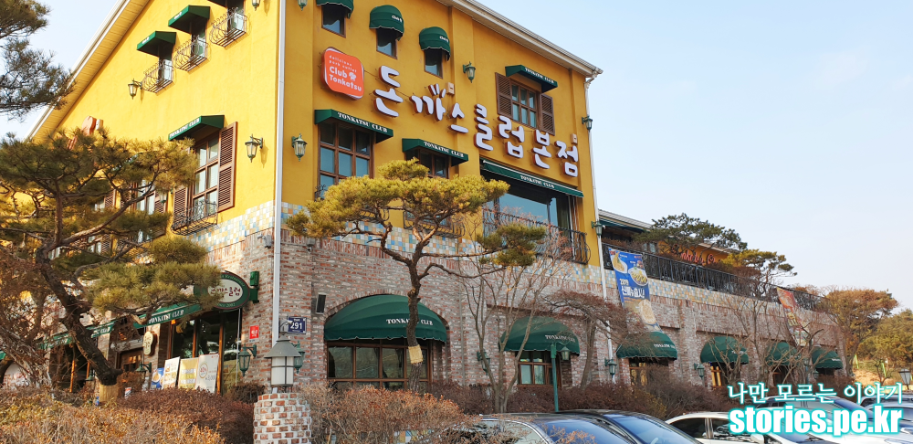
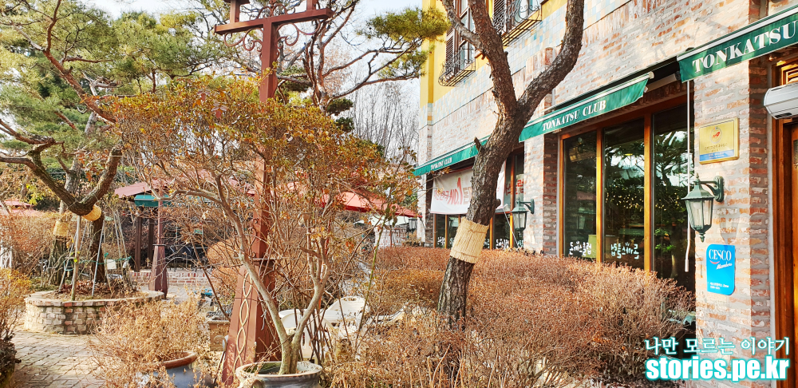
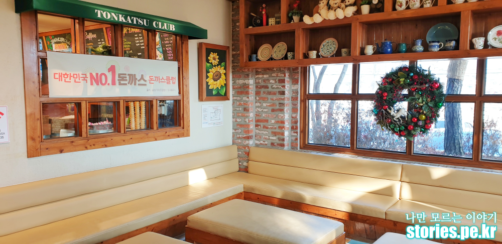
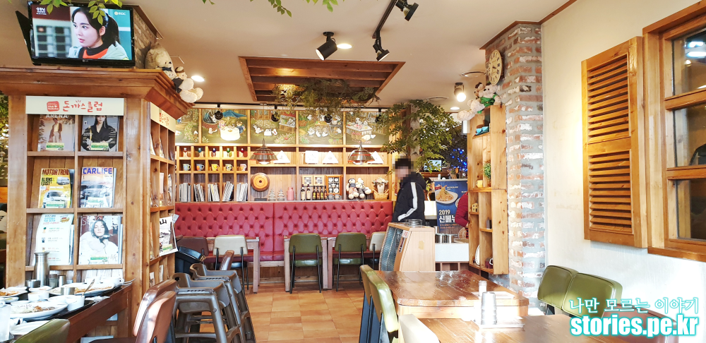
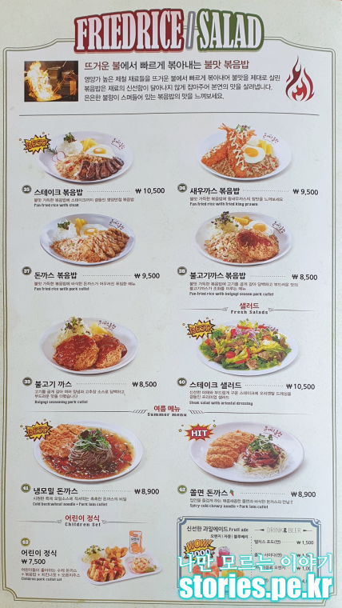
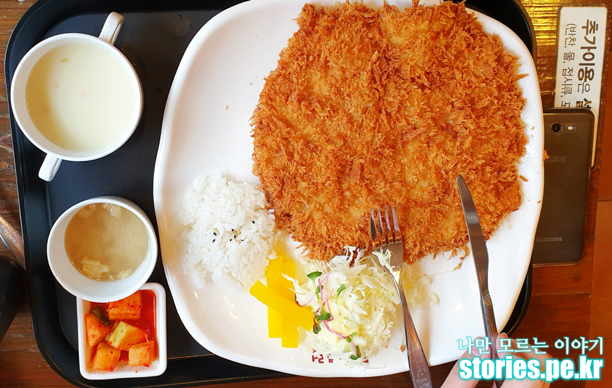
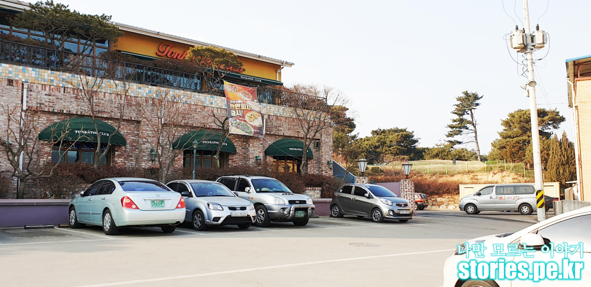

오랜만에 양주에 있는 돈까스클럽 본점을 다녀왔습니다.  
어떻게 여기에 이런게 있을까 싶은 장소에 돈까스클럽 본점이 있습니다.  
튀김이라 매일 먹지는 못하겠지만 가끔가다 생각날 경우 찾아서 먹을 만한 음식입니다.  

  
## 방문시기
2019년 2월달에 다녀왔습니다.  
   
아직은 추운 겨울이라 그런지 건물 주위에 있는 정원은 을씨년 스러운 풍경이지만 내부로 들어가면 따뜻한 느낌의 인테리어를 하고 있습니다.  

  
입구 바로 앞에는 대기석이 있습니다.  대기석이 실내에 있어서 추운 겨울이나 더운 여름에도 다소 쾌적하게 기다릴 수 있지 않을까 합니다.  
하지만 저희가 갔을때는 대기자까지는 없었네요. 저희는 토요일 2시쯤 방문했었습니다.   

  
실내는 상당히 넓습니다. 사진에는 전체 내부 중 일부분만 찍은 것입니다.   

## 대표 메뉴와 가격(가성비)  
  
  
메뉴판을 첨부 했습니다. 보시면**Best**와 **New**가 표시되어 있습니다.  
그래도 돈까스클럽을 이렇게까지 키운 시그니처메뉴라고 한다면 아무래도 **왕돈까스**가 아닐까 합니다. 

## 먹어본 음식  
이번에 먹어본 음식은 3명이서 왕돈까스 2개와 반반피자 1개를 먹고 왔습니다.  
일단 주문에 좀 실패한 느낌이였습니다.  
왕돈까스를 굳이 2개를 시켜야 했을까 하는 후회가 물밀듯이 밀려왔습니다.  
**정말 커요..**  
많이 먹지 않는 일반인이라면 1개로 2명이 먹으면 배부르지는 않겠지만 적당히 먹은 느낌이 들 정도로 큽니다. 

   

왕돈까스에 나오는 소스는 옛날돈까스에 나오는 일반 돈까스소스 맛 이겠지만 제 입맛에는 그다지 매력적으로 와 닫지는 않았습니다.   
하지만 돈까스는 금방 튀겨서 그런지 바삭바삭 잘 튀겨져서 나옵니다.  
왕돈까스가 9,900원이면 적당한 수준의 가격이지 않을까 합니다.  
집에와서 보니 사진에는 돈까스 소스를 뺴먹고 찍었네요. 

## 청결도  
청결도는 좋은 편입니다.  
분위기는 패밀리레스토랑 수준입니다.  
실제로도 가족단위로 많이 찾아 오시는 것 같습니다.  

**청결도 : ** ★★★★☆ 

## 식당운영시스템과 친절도  
프렌차이즈를 하기때문에 식당운영 시스템도 좋은 편입니다.  
웨이팅 시간이 길지 않습니다.  
또한 직원의 친절도도 나쁘지 않습니다.  

**친절도 : ** ★★★★☆ 

## 식당과 주차 정보
- 주소 : 경기도 양주시 만송동 406-1  
- 연락처 : 031-843-1235 
- 영업시간(휴무일) : 오전 11:30 ~ 오후10:00 (매주 월요일 휴무)
- 주차 : 100대 정도 주차가능

   
[지도] https://goo.gl/maps/F5XacfKMig22  

