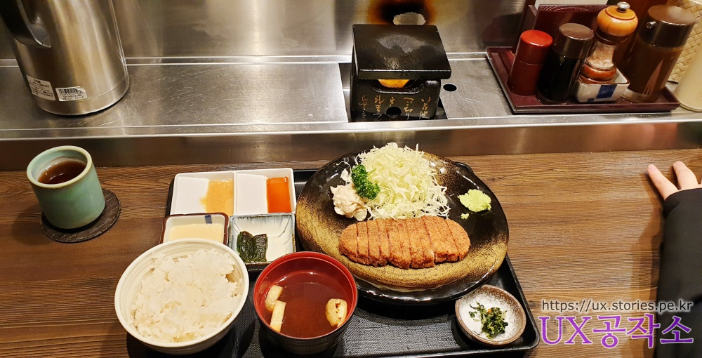
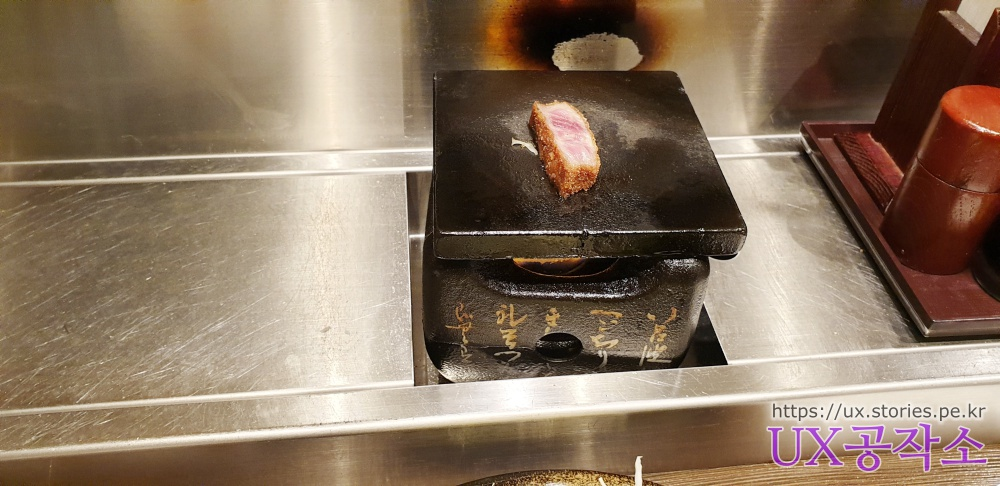
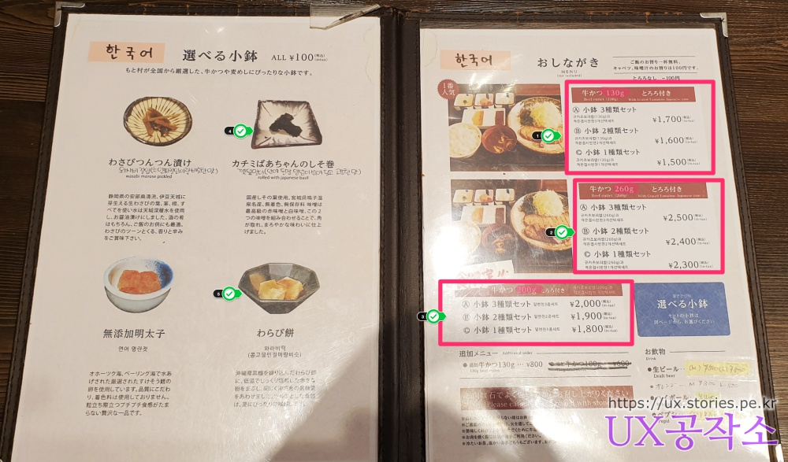
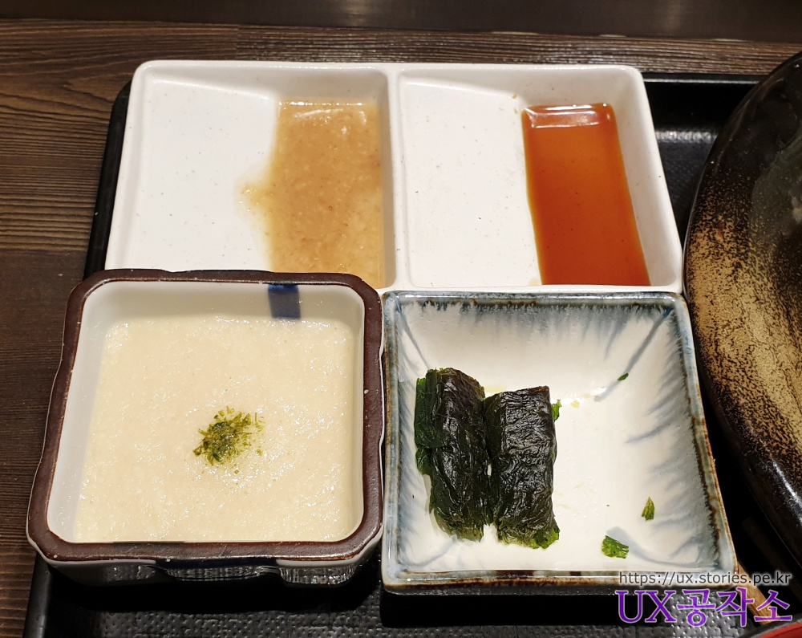
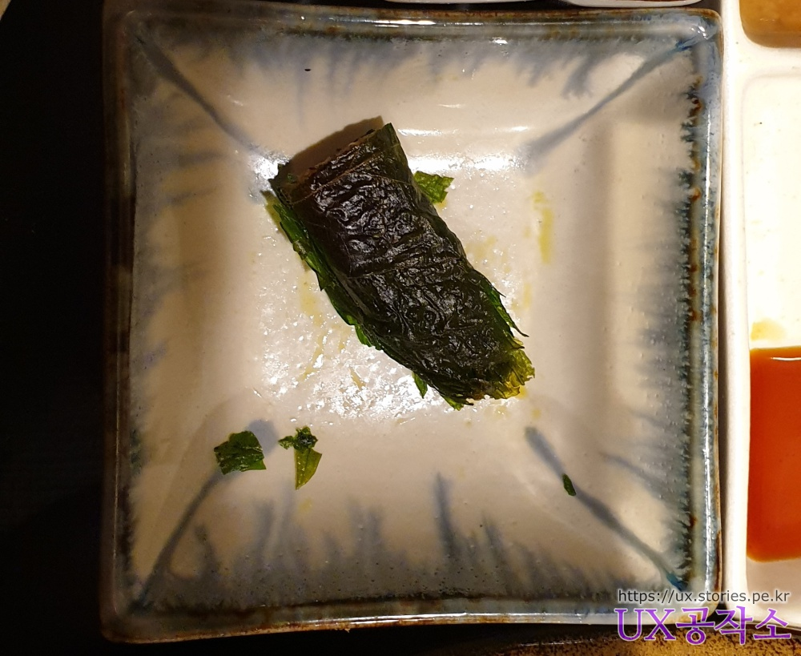
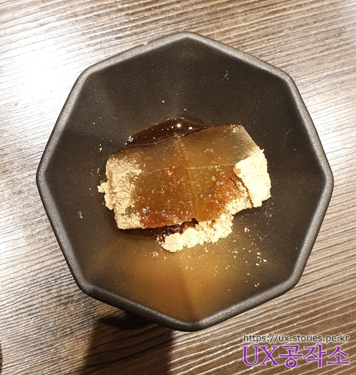
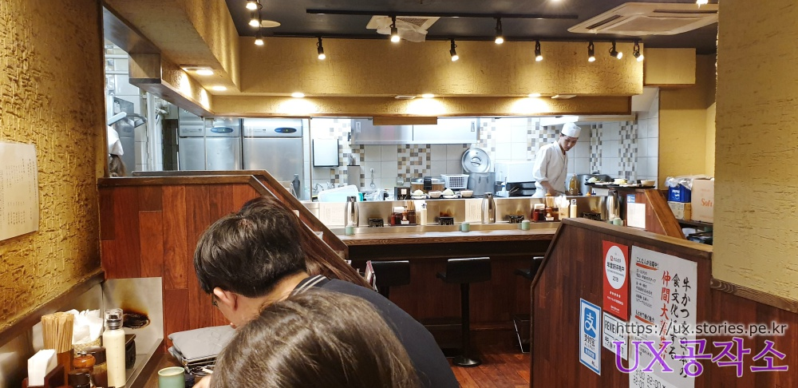
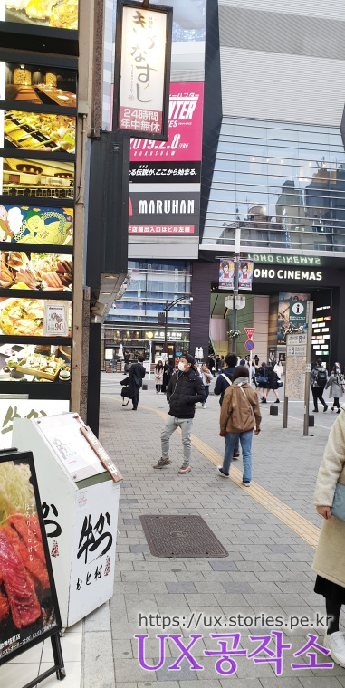
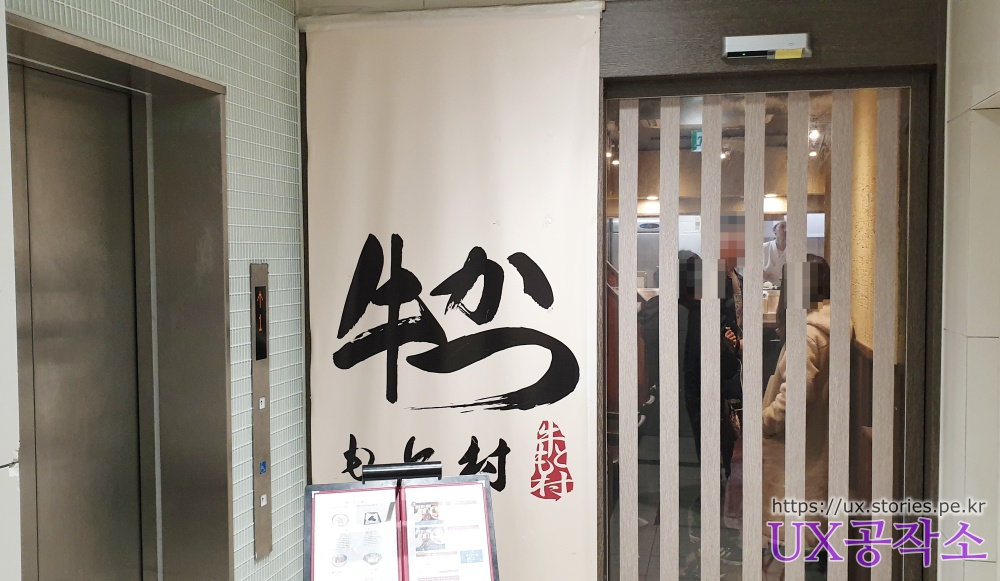

## 방문시기  
2019년 2월달에 도쿄 신주쿠에 도착하자 마자 숙소에 짐풀고 첫끼인 늦은 점심으로 모토무라 규카츠를 먹었습니다.   
돈까스는 질리게 먹어봤지만, 규카츠는 난생처음이라 약간의 기대감을 가질 수 밖에 없었습니다.   

## 대표 메뉴와 가격(가성비)   
대표메뉴는 일단 규카츠 하나밖어 없으며 양과 반찬에 따라 메뉴가 구성되어 있습니다.  
모토무라 규카츠를 주문하면 기본 소스 3가지와 반찬 하나가 나옵니다. 여기에 메뉴에 따라 반찬을 1개~3개정도가 추가됩니다.  
  
모토무라 규카츠는 반쯤 익힌 소고기에 빵가루를 뭍혀서 돈카츠와 비스한 형태로 나오고 양배추와 와사비, 으깬 감자와 같이 나오는데,  
재미있는 것은 규카츠를 하나 먹을 때마다 아주 작은 개인 화로의 돌판에 구워서 먹게되어 있습니다. 말하자면 맛도 맛이지만 먹는 재미를 더했다고 할 수 있습니다.   
  

> 규카츠란?  
> 돈카츠가 돼지고기에 빵가루를 묻혀서 식용유에 튀긴 음식이라면,  
> 규카츠는 소고기에 빵가루를 묻혀서 식용유에 튀긴 음식이라고 할 수 있습니다. 

   
메뉴는 크게 규카츠 양에 따라 3개로 나눠져 있습니다.  
`130g`은 규카츠 한개, `260g`은 규카츠가 2개, 그리고 그 중간 인 `200g`으로 구성되어 있습니다. 
그리고 각각의 메뉴마다 반찬 갯수에 따라 또 3개로 나누어져 있습니다.  
첫번째는 반찬 3개, 두번째는 반찬 2개, 세번째는 반찬 1개를 고를 수 있습니다.  
각각의 반찬은 왼쪽 메뉴판에 4개가 있습니다. 

   
오른쪽 위에 있는 소스는 그냥 간장소스이고,  
왼쪽 위에 있는 소스는 모토무라 큐카츠의 특제소스입니다.  
왼쪽 아래에 있는 것은 마를 갈아놓은 것이고  
오른쪽 아래 있는것은 추가로 시킨 반찬으로 깻잎말이 입니다. 

큐카츠를 구워서 위의 소스와 곁들여 먹으면 됩니다.  

우리는 4명이서 가서 추가 1개 반찬인 메뉴를 인원수 대로 시켰는데 그 중에 추가 반찬은 깻잎말이 1개와 와라비떡 3개를 먹어 봤습니다. 
   
깻잎말이는 깻잎같지 않고 꼭 김말이 같습니다. 아직도 저는 김말이인줄 알고 있었어요 ^^
말이 안에는 짬쪼름하고 약간 단 젤리같은 된장이 들어 있는데 그냥 저냥 먹을 만했지만 그다지 제 입맛에는 맞지 않았습니다. 

    
와라비떡은 마치 좀더 말랑말랑한 인절미를 먹는 느낌이였습니다. 반찬이라고 하기 보다는 에피타이저 같은 느낌입니다.  

## 청결도   
청결도는 전형적인 그냥 자그마한 일본 식당의 형태이고 불을 사용해서 그런지 그흘린자국 같은 것이 보였습니다. 
깨끗하다고 하기도 그렇고 그렇다고 더럽지도 않았습니다.  
  
안쪽 좌석은 보지 못했지만 대부분 1인석으로 벽쪽을 향해 자리가 놓여있었습니다.  
혼자 와서 먹기에도 어색하지는 않을 것 같습니다.  

## 식당운영시스템과 친절도  
우리가 같을 때는 대략 오후 3시~4시 사이 인지라 사람이 거의 없었습니다.  
그래서 주문도 바로 바로 할 수 있었고 음식도 바로 나왔습니다.   

직원 분 중에 한국인이 계시고 메뉴판도 한국어 버전이 있어서 그냥 한국 식당에서 음식을 시켜먹는 기분이 들었습니다.  
주문이 어렵지 않습니다.   

## 식당과 주차 정보  
- 명칭 : **규카츠 모토무라 가부키초점**  
- 주소 : 일본 〒160-0021 Tokyo, 新宿区歌舞伎町１丁目１９ ガタビル地下１階  
- 연락처 : +81 3-3208-7450  
- 영업시간(휴무일) : 오전 11:00 ~ 오후 10:00
- 주차 : 없어요.
[지도] : https://goo.gl/maps/cT6A1e9V9zG2 

식당이 지하에 있어서 일본어를 모르면 찾기가 쉽지 않습니다.   
  
주위에 극장 건물인 `도호시네마스(TOHO CINEMAS)`을 먼저 찾으시는 것이 빠릅니다.  
그 앞에 지하로 내려가는 조그만 계단을 찾으시면 됩니다.  

   
입구는 계단을 통해 내려오는 길과 엘레베이터를 타고 내려오는 2가지 길이 있습니다.  
지하에는 딱 이 식당 하나뿐이 없습니다.  

## 기타 사항  
규카츠가 뭔가해서 먹어봤습니다.  
우리 가족들 입맛에는 다들 맞는 것 같습니다. 다들 맛있다고 하네요.  
저는 좀 그냥 그랬습니다. 점심 한끼로 먹기에는 가격도 좀 쎈 편인 것 같구요.  
김치찌게와 부대찌게에 길들여진 입맛으로 달고 느끼한 일본 음식이 대체로 맞지 않는 저에게는 그냥 좀 비싸고 그냥 그런 맛 이였습니다.   
한국에서 먹던 삼겹살이 너무 그리웠습니다.  

