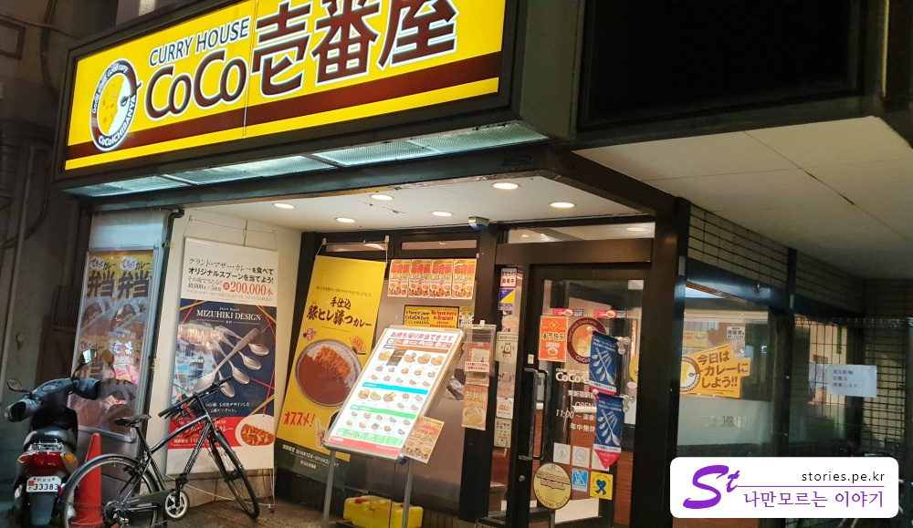
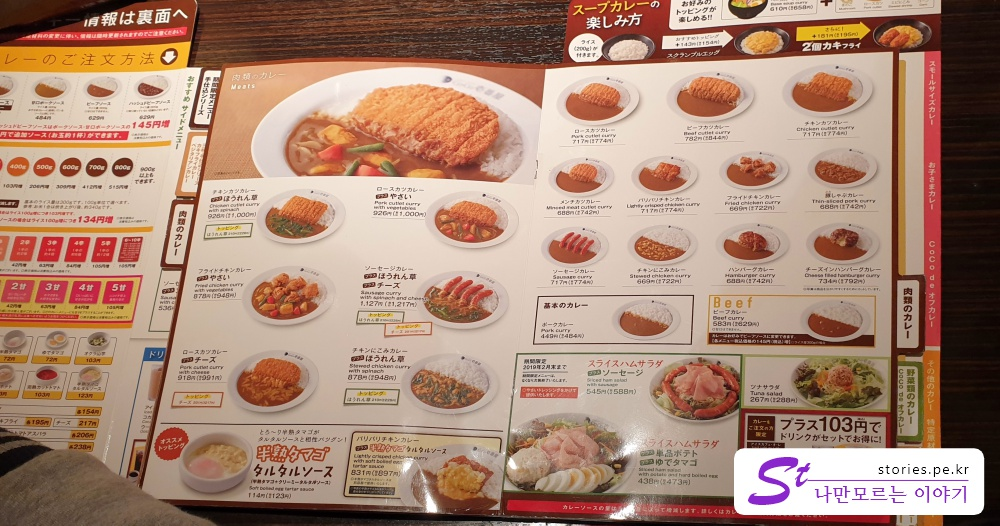
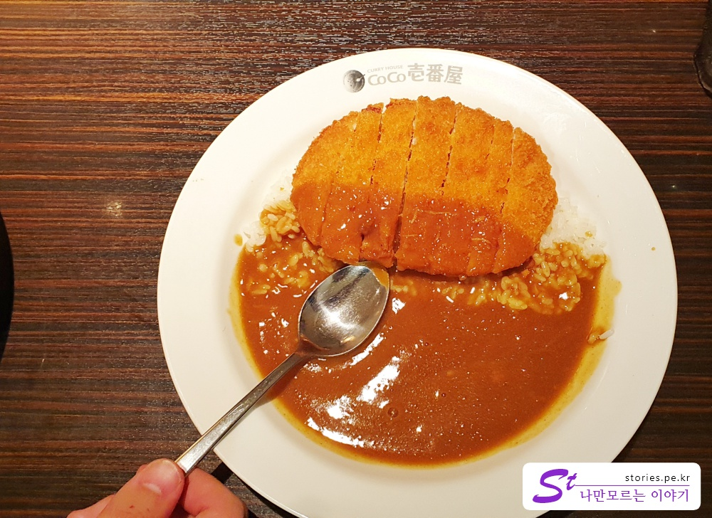
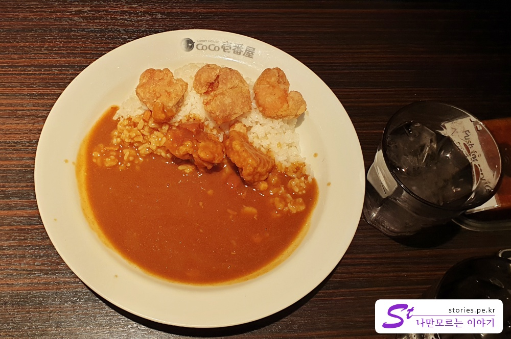
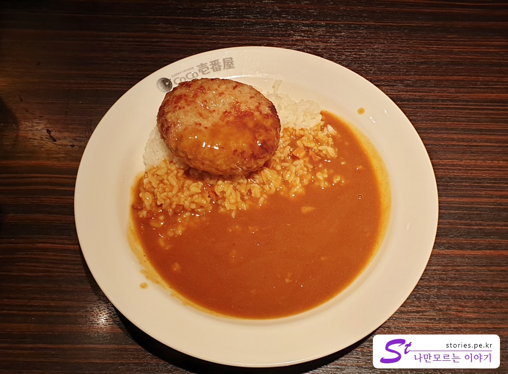

처음 **코코이찌방야**(CoCo壱番屋)는 한국의 분당에서 한번 접해 본 적이 있습니다.  
그떄는 상당히 고급스러운 일본 카레집이구나 라고 생각을 했었구요.  
하지만 일본에서 검색을 해보니 흔하디 흔한 그냥 카레집인것 같더라구요.   
이동하고자 하는 동선 곳곳에 코코이찌방야가 즐비해 있습니다. 가격도 그렇게 비싸지도 않구요.  
접근하기 쉬운 메뉴라고 보시면 됩니다.  

일본 음식이 달고 느끼한 것이 대부분이라 저도 그렇지만 하루 이틀 정도 지나고 나면 그렇게 한국음식이 그리워지기 시작합니다.   
일본에서 메뉴를 선택하기가 두려워 질때가 있죠.   
> "아~ 또 느끼한건 선택하는건 아닌가???"  
그럴 때 평타를 칠 수 있는 선택메뉴가 카레가 아닐까 합니다. 저희도 그랬으닌깐요. 보통은 합니다.   

**코코이찌방야**가 프렌차이즈 음식이다 보닌까 맛도 어느정도 있습니다.    

   
저희가 찾아간 곳은 숙소와 가까이 있는 **히가시 신주쿠역** 근처에 있는 가게입니다.  
일정을 마치고 숙소로 돌아가는 길에 저녁을 먹기 위해 들렀습니다.   
 
## 대표 메뉴와 가격(가성비)  

  
어짜피 카레에 토핑에 따른 메뉴 분류라 특별히 대표라 할 만한 품목은 없지만  
그래도 돈카츠카레가 메뉴판에 떡~ 하니 크게 자리를 잡고 있는것을 보면 이것이 대표메뉴라 할 수 있을것 같습니다. 

가격은 한국의 코코이찌방야보다는 저럼하지만 그렇다고 아주 싼 가격은 아닙니다. 그냥 적당한 가격정도 됩니다.  
메뉴판이 한국어는 따로 없고 영문 표기가 같이 되어 있고 그림이 있어서 주문하는데는 어렵지 않습니다.  

> **딸래미가 알려 준 일본에서 음식 주문 팁!!**  
> 메뉴판에서 음식을 하나, 하나 손가락으로 가르키며... "**코레 히토츠**", "**코레 히토츠**" 라고 하면 됩니다. 
> "**코레 히토츠**"는 **이거 하나~** 라는 말입니다. ^^

일본은 가격표기 시 부가세 전 금액으로 표시하는 곳이 많습니다.  
여기도 세금 전 금액을 표시하고 괄호로 세금이 포함된 금액을 표시해 놓았습니다.  
그래서 **우리가 지불해야 하는 금액은 괄호안에 있는 금액**이라고 보시면 됩니다.  
우리나라는 부가세가 10%인데, 일본은 부가세가 8%입니다.  
싸서 좋기는 한데 계산하기는 까다롭습니다. 암산이 바로 안되요. ㅎㅎ

## 먹어본 음식   
우리는 총 3가지 종류의 음식을 먹어봤습니다.  
카레맛은 당연히 똑같구요.  
토핑만 달랐기 떄문에 맛은 토핑 종류에 따라 달라졌습니다.  

  
가장 기본적인 조합의 카레입니다.  
제가 주문해서 먹었고 맛있습니다. **돈카츠 카레**는 가장 무난한? 선택입니다. 

  
치킨을 좋아하는 딸레미가 시킨 **치킨카레**입니다.  
이것도 맛있었다고 하네요.  

   
와이프가 시킨 햄버거 카레 입니다. 우리나라에서는 함박스테이크라고 하지요.
약간 느끼했다고 합니다.  

## 청결도  
청결정도는 그냥 보통정도 됩니다.  

**청결도 : ** ★★★☆☆ 

## 식당운영시스템과 친절도  
일본은 친절의 나라 답게 친절합니다.  
우리가 방문했을 때는 사람이 많지 않고 해서 별 불편함 없이 주문과 식사를 할 수 있었습니다.  

**친절도 : ** ★★★★☆ 

## 식당과 주차 정보  
- 주소 : 일본 〒169-0072 Tōkyō-to, Shinjuku-ku, Ōkubo, 1 Chome−1−2 富士一ビル  
- 연락처 : +81 3-5287-5518
- 영업시간(휴무일) : 오전 11:00 ~ 오전 1:00

[지도] : https://goo.gl/maps/G4zZ4nMfiB62  

