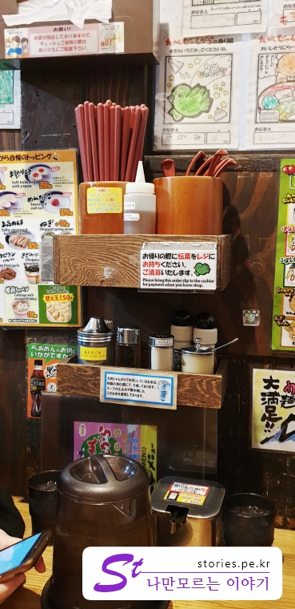
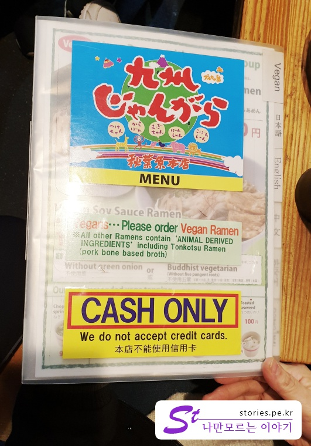

덕후들의 성지라 하는 아키하바라에서 하루 종일 쇼핑 전쟁을 앞두고, 먼저 결전의 의지를 다지기 위해 식사를 먼저 했습니다.  
아침 늦으막히 숙소를 나와 아키하바라에 도착을 하니 대략 11시쯤 되었습니다.  
인터넷에서 미리 찾아 놓은 **라멘 맛집**인 **장가라 라멘**을 찾아갔습니다.  

메인스트리트에서 아주 살짝 외곽에 조그맣게 자리를 잡고 있고 실내도 상당히 작아서 우리 4식구가 한거번에 같이 식사를 하기 위해 
2인용 테이블을 붙혀서 앉을 수 밖에 없었습니다.  
우리가 식사를 하는 도중에 11시 30분을 넘어가니 손님들이 오기 시작하더군요.  
많은 손님이 온것은 아닌데 워낙 실내 테이블이 적다 보니 기본적으로 기다리는 손님이 생기기 시작했습니다. 
    
그리고 자리도 한사람씩 바에 앉을 수 있는 것이 대부분이고 나머지는 모두 2인용자리라고 보시면 됩니다.  
우리같은 4명 단체 손님이 온 경우에는 상황에 따라서  2인용 테이블 2개에 철재 다리로 서로 연결한 후에 간이 테이블 나무 판대기를 올려서 마치 6인용 자리같은 4인용 테이블을 만들어 주십니다.  그렇다고 그자리에 6명은 도저히 앉을 수는 없습니다.  
사진을 찍었어야 했는데 찍지를 못했습니다.  너무 좁아서 찍을 수 가 없었어요 ㅠㅠ

   
실내 테이블이 좁아서 벽을 선반으로 활용하고 있습니다. 

   
젓가락과 수저 그리고 각종 양념을 올려놨습니다.  
나름 좁은 공간을 활용하려고 애쓴 흔적이 보입니다.  

어찌되었든 여기서 라멘을 한번 먹어보겠다 생각하시면 **조금 일찍 가시던지 아니면 식사시간을 피해서 가시는 것이 좋지 않을까** 합니다.  

## 대표 메뉴와 가격(가성비)  
대표메뉴는 **기본 큐슈 장가라 돈코츠라멘** 입니다.   
돈코츠는 일본어로 돼지뼈를 의미한다고 합니다. 
국물맛이 우리나라 사골 설렁탕과 비슷한 느낌이지만 돈코츠의 국물은 좀더 찐하고 느끼하다고 할 수 있습니다.   
**돼지고기**, **명란**, **완숙계란**, **반숙계란**의 총 4개의 토핑을 선택해서 넣을 수 가 있습니다.   
    
메뉴는 크게, **큐슈 장가라 라멘**, **봉샹 라멘**, **고봉샹 라멘**, **카라본 라멘**, **큐슈 장가라 미소 라멘** 으로 구성되어 있습니다.   
- **큐슈 장가라 라멘** : 대표 메뉴이며 시원하고 담백한 돈코츠 라멘입니다.   
- **봉샹 라멘** : 깊고 구수한 맛을 내며 느끼한 맛을 내는 라멘입니다.  
- **고봉샹 라멘** : 튀긴 마늘 기름을 넣은 마늘 맛 돈코츠 라멘입니다. 
-  **카라본 라멘** : 한국의 육개장 처럼 빨간색을 띈 약간 매운맛의 라멘입니다.  
- **큐슈 장가라 미소 라멘** : 일본 된장인 미소로 맛 간을 낸 된장라멘입니다.  

차림표가 한국어 버전이 있어서 "**코레 히토츠**(이거 하나~)"만 하시면 됩니다. 

   
세금이 포함되어 있고 현금결제만 가능합니다.   

## 먹어본 음식  
우리가 먹어본 음식은  **큐슈 장가라레멘**, **고봉샹 라멘**, **카라본 라멘** 이고, 돼지고기인 **챠슈**와 **계란**을 올려 먹었습니다.   
 
### 큐슈 장가라 레멘  
   
기본 라멘인 큐슈 장가라 라멘입니다.  
맛있었다고 합니다. 4개의 메뉴 중 단백한 편에 속한 라멘이지만 그래도 약간 느끼한 편입니다.  

### 큐슈 장가라라멘 + 챠슈  
   
챠슈를 토핑한 장가라 라멘입니다.  
챠슈가 마치 장조림 고기처럼 맛이 있습니다. 반찬은 아니지만 반찬처럼 조금씩 잘라먹는 맛이 좋습니다.  

### 봉샹 라멘 + 챠슈 + 반숙계란  
   
느끼함을 즐기는 사람이 시켰습니다.  
맛있었다고 합니다. 저도 조금 먹어봤는데, 저는 입맛에 맞지 않더군요.  

### 카라본 라멘 + 챠슈 + 완숙계란   
   
제가 먹은 육개장 같은 라멘입니다.  
육개장은 육개장인데 많이 느끼한 육개장맛입니다. 저는 다 먹긴했지만 마지막에 느끼해서 겨우 먹었습니다.   
김치찌게나 부대찌게가 정말 먹고 싶었습니다.   

  
추가 금액없이 테이블에 기본세팅되어 있는 반찬입니다.  
하나는 생강초절임(베니쇼우가)이고 하나는 우거지처럼 생겼는데 정확히 뭔지는 모르겠습니다.  
무료지만 누구 하나도 손대지 않았습니다. 우리입맛에 맞지 않았어요.   

## 청결도  
내부가 좁고 이것저것 복잡하게 많이 붙혀놨지만 청결도는 나쁘지 않았습니다.  
반찬그릇도 깨끗하고 테이블도 나쁘지 않았습니다. 

**청결도 : ** ★★★☆☆ 

## 식당운영시스템과 친절도  
식당이 좁아서 대기자가 생깁니다.  
하지만 음식은 주문 후 대기 시간이 길지 않게 나왔습니다. 
또한 우리가 갔을 떄 비가 오는 날이였으나 각 테이블 마다 우산걸이가 있어서 우산을 보관하는데도 어려움이 없었습니다.  

좁은 실내의 어쩔 수 없는 환경이지만 그 와중에 잘 활용해 보고자하는 노력이 엿보이는 식당입니다.  
그래도 어쩔 수 없이 별 3개밖에는 줄수가 없네요.  

**친절도 : ** ★★★☆☆ 

## 식당과 주차 정보   
  
보시는 바와 같이 가게가 작습니다.  
우리가 식사를 하고 나오면서 찍은 모습이라 대기손님이 이제 슬슬 생기기 시작했습니다.  

- 주소 : 3 Chome-11-6 Sotokanda, Chiyoda-ku, Tōkyō-to 101-0021 일본  
- 연락처 : +81 3-3251-4059  
- 영업시간(휴무일) : 오전 10:30 ~ 오후 11:30
- 지도 : https://goo.gl/maps/xCzzrrZ3tnu  
