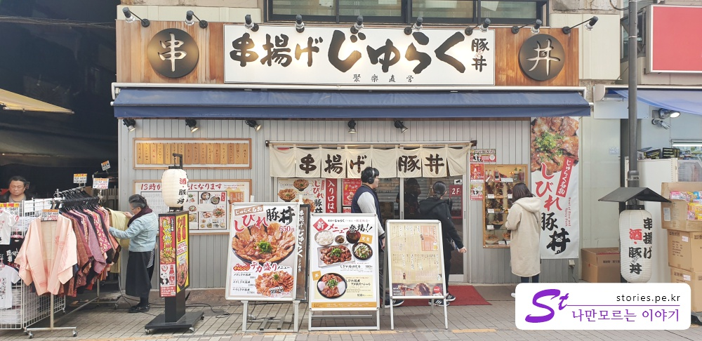
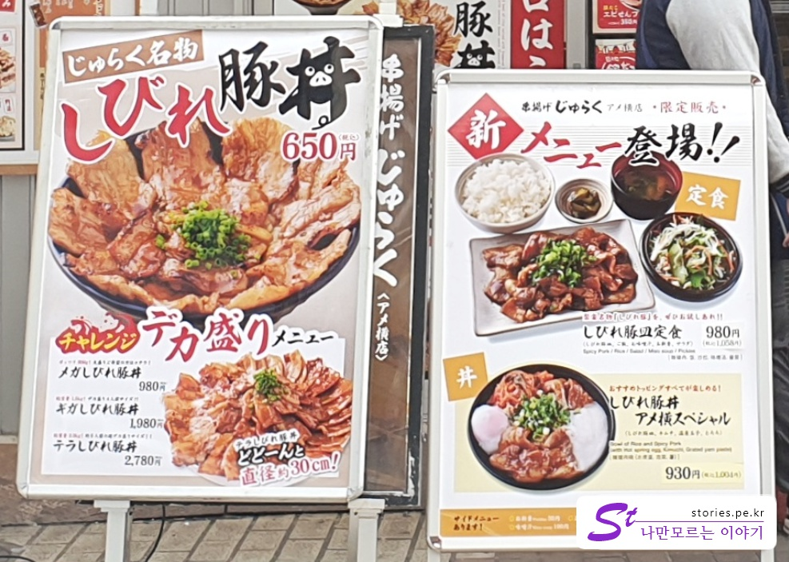
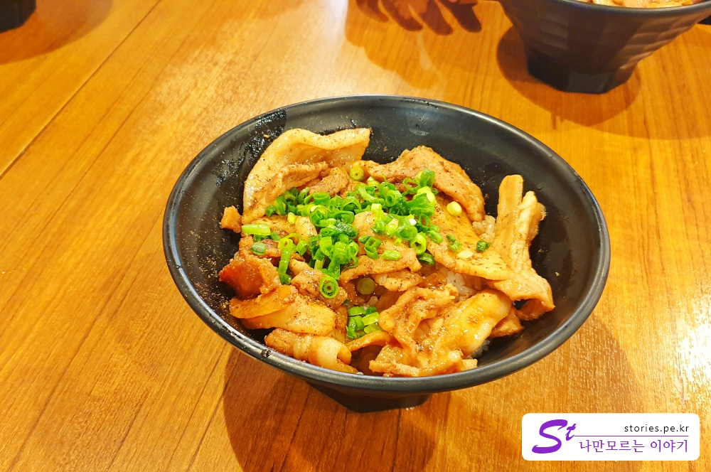
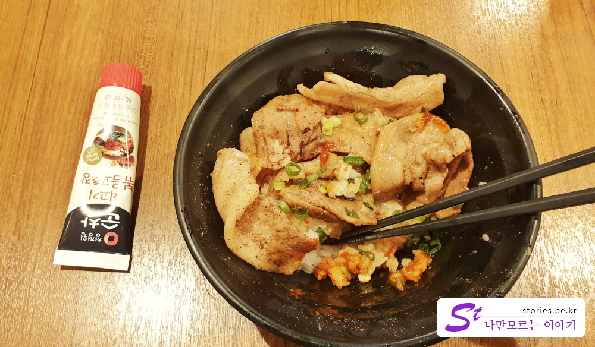

우에노공원을 가기 전에 먼저 아메요코시장을 둘러봤습니다.  

우리는 아침 늦으막히 숙소를 나와서 아침겸 점심을 먹을 곳을 찾았거든요.
아메요코시장에 주전부리가 많았지만 우리는 꾹~ 참고 두 끼에 대한 보상 심리로 정식 식사할 곳을 찾았습니다.  

블로그 검색을 해서 찾아 본 Kushiage Juraku (쿠시아게 주라쿠) Ameyoko를 찾아봤습니다.  
**쿠시카츠**와 **부타동**이 맛있다고 몇몇 블로그에서 봤거든요.  

  

**쿠시카츠**는 한마디로 **꼬치튀김**이라고 할 수 있고,  
**부타동**은 **돼지고기 덥밥**이라고 할 수 있습니다.  

아침부터 쿠시카츠 먹기는 좀 뭐해서 부타동을 시켜서 먹어봤습니다.   

바로 돼지고기 덥밥이죠. 4명 모두 부타동을 시켰습니다.  
잘못된 선택이였죠~ 
두사람정도는... 아니 한사람만이라도 쿠시카츠를 시킬껄~ 하는 후회가....

## 대표 메뉴와 가격(가성비)  

쿠시아게 주라쿠의 대표메뉴는 **쿠시카츠**와 **부타동**입니다.  
이 2가지 메뉴로 구성을 달리하여 가격을 정하는 것 같습니다.   

차림표를 찍었어야 했는데 미쳐 찍지를 못했습니다.  
대신에 간판에 써있는 가격표를 올려봅니다.   

   

650엔에서 세트메뉴 같은 것은 1000엔정도의 가격대를 형성하고 있었습니다.  
가성비가 나쁘지는 않았습니다. 

## 먹어본 음식  
우리는 모두 **부타동**을 먹었습니다. 돼지고기덮밥이죠.  
그런데 돼지고기에서 특유의 돼지냄새가 났습니다. 우리나라의 전문가들이 흔히 말하는 돼지 냄새를 잡지 못한 것 처럼요. 이게 원래 돼지냄새가 나는 것을 맛있다고 하는 것인지 모르겠는데, 저는 좀 싫었습니다.  

하지만 느낀한 것을 좋아하는 우리 아들은 맛있다고 자기 것하고 엄마가 먹다가 남긴 것 까지 다 먹어 버렸습니다.  

**이걸 맛있다고 먹어???**   

이해는 되지 않았지만 모두 내 입 맛 같지는 않다는 것을 새삼 깨달았습니다.  
내 아들 입맛도 이해를 못하고 있으니......  

  
**부타동**입니다. 굉장히 심플합니다.  
밥에 돼지고기만 올라가 있습니다. 반찬두 없구요. 수저도 없습니다.  
일본의 반찬은 정말 없어요. 있어도 맛이 없어요.  

먹다가 어쩔수 없이 고추장 찬스를 썼습니다.  
고추장이 이렇게 맛있을 수가...

  
가능하면 일본식대로 먹고 싶었습니다. 여행을 갔으닌까요.  
하지만 참지 못하고 어쩔 수 없이 고추장을 사용할 수 밖에는 없었어요.  
일본여행 갈 떄 입맛이 걱정이 된다면 꼭 하나씩 주머니에 넣고 다니세요.   
 
## 청결도   
청결도는 그렇게 나쁘지 않아요. 일본의 음식점 청결도는 그래도 기본은 하는 것 같습니다.  

**청결도 : ** ★★★☆☆ 

## 식당운영시스템과 친절도  
불친절하지는 않지만 그렇다고 막~ 친절하지도 않습니다.  
좋은 점수를 주기는 좀 뭤합니다.  

**친절도 : ** ★★★☆☆ 

## 식당과 주차 정보  
- 주소 : 6-11-5 Ueno, Taitō, Tokyo 110-0005 일본  
- 연락처 : +81 3-6777-1194  
- 영업시간 : 오전 11:00~오후 11:00  
- 지도 : https://goo.gl/maps/tz5CYhrkcQ92  
 
## 기타사항  
꼭 들러 보라고 하고 싶지는 않습니다.  
새로운 음식에 자신있는 사람이나 주머니에 고추장이 있는 사람만 가세요.   

