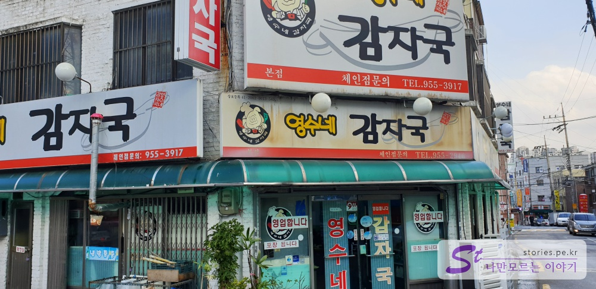
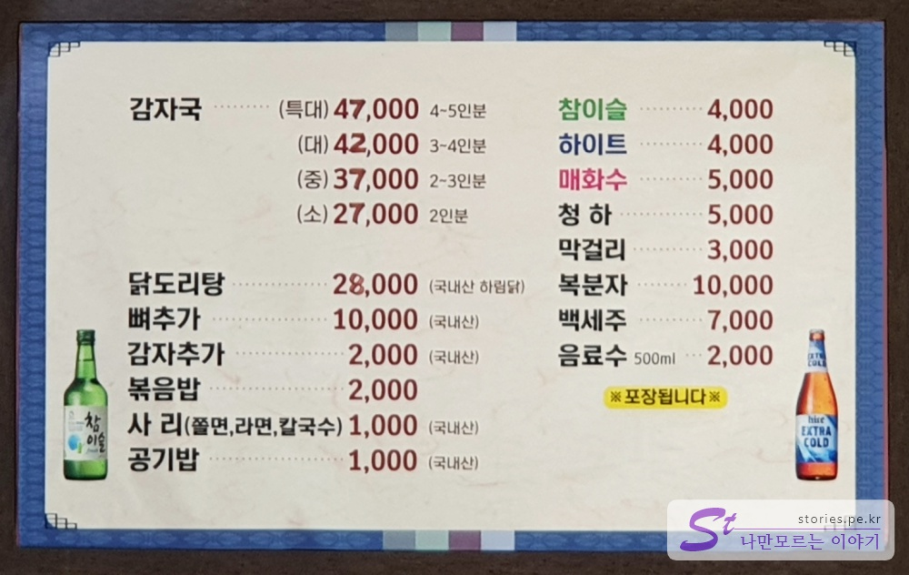
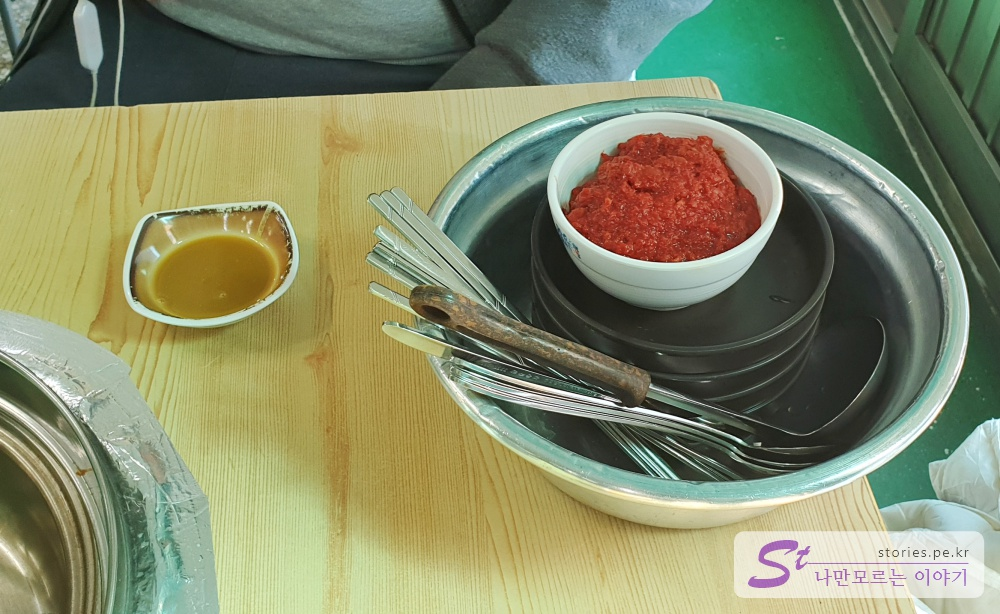
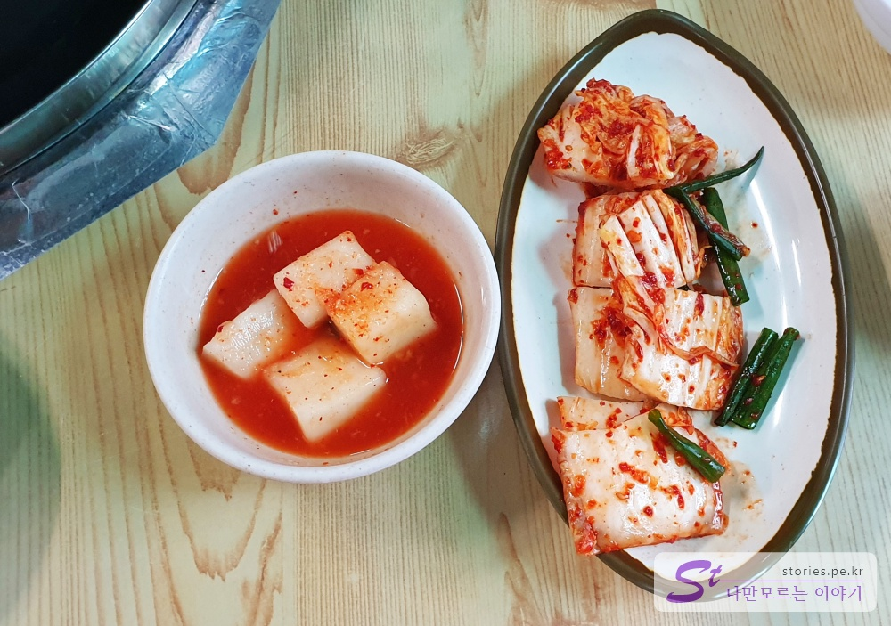
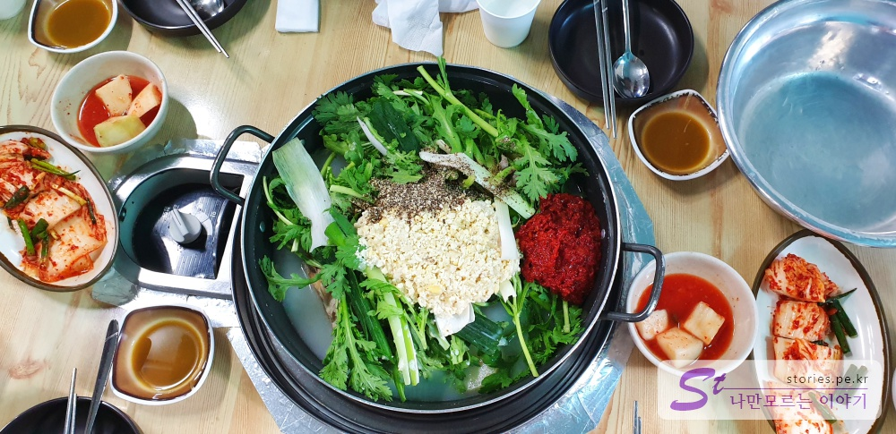
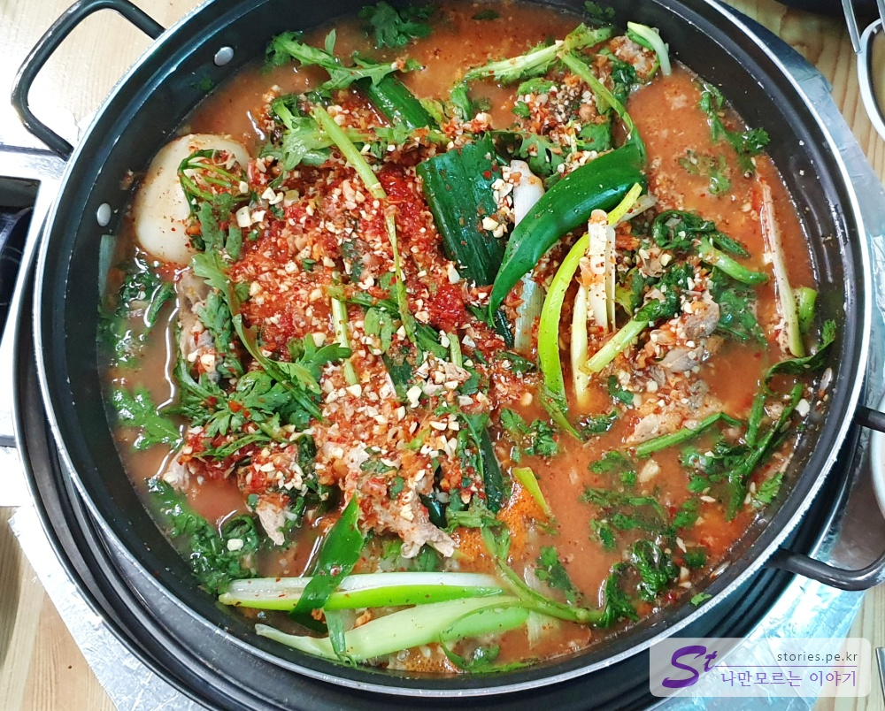
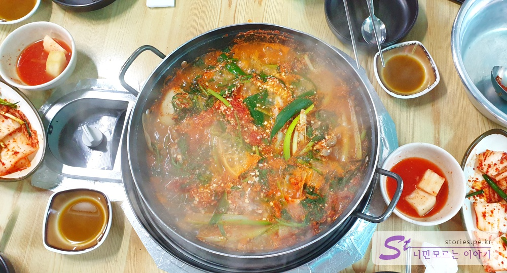
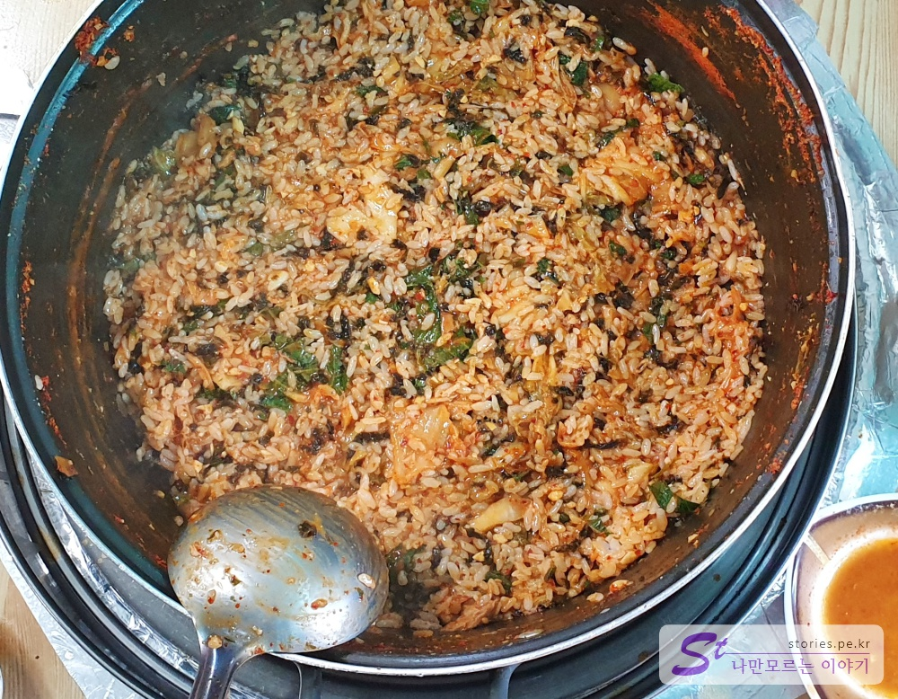
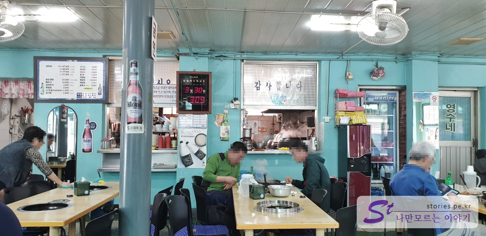
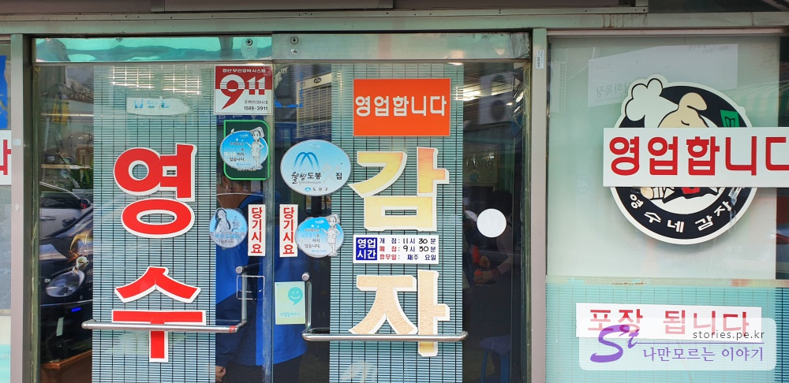

보통 등산을 하고 하산을 하면서 맛집을 찾아 식사를 하고 집으로 가는 것이 어느정도 정해져 있는 코스인데요.
도봉산에도 이런 등산러들에 의해 생긴 감자탕 맛집이 하나 있습니다.  
정확한 날짜는 모르겠지만 제가 10~15년 전에도 방문한 기억이 있는것으로 보아 최소 그정도의 오래된 전통이 있는 맛집입니다.

## 방문시기

**2019년 4월**에 애들이 갑자기 영수네감자국이 먹고싶다고 하여 다녀왔습니다.  
토요일 4시쯤인 점심과 저녁 애매한 중간 시간에 방문해서 그런지 테이블이 꽉차 있지는 않았습니다. 그렇게 막 붐비고 그렇지는 않습니다.

## 대표 메뉴와 가격(가성비)

주 메뉴는 닭도리탕과 감자탕입니다.
대표메뉴는 식당 이름에서 알수 있듯이 감자탕입니다.
특이하게 여기서는 감자탕이 아니라 **감자국**이라고 부르네요.

## 먹어본 음식

우리는 대식가 2명을 포함한 4명이서 **감자국 대자(42000원)**을 주문해서 먹었습니다.  
나중에 볶음밥도 먹었는데 배 터지게는 아니고 적당히 먹을 수 있는 양이였습니다.

  
주문을 하게 되면 이렇게 인원 수에 맞게 막 담은 듯한 그릇과 수저, 그리고 양념장을 줍니다. 엉성한 듯 하지만 나름대로 그릇이 따뜻한 것을 보니 살균에도 신경을 쓴 듯한 모습니다.

  
김치와 깍두기도 반찬으로 나옵니다. 김치는 그자리에서 가위로 썰어 줍니다. 재활용 김치는 아니라는 것이지요. 깍두기도 시원하니 맛이 아주 좋습니다. 깍두기는 재활용이 가능한 모습이나 식당의 운영 상태를 전반적으로 봤을 때 재활용은 하지 않을 듯 합니다.

  
드디어 감자국이 나왔습니다. 뼈는 익혀서 나오겠지만 감자국 자체는 끓여서 나오지는 않고 그 자리에서 끓여서 먹어야 합니다.  
숙갓에 터프하게 간 콩, 그리고 약간의 들깨 가루가 보입니다. 그리고 마성의 빨간양념장으로 간을 마추어서 끓입니다.

  
어느정도 끓기 시작하면 쉐킷쉐킷 섞습니다. 이제 조금만 더 끓이면 맛있는 감자국이 완성되겠지요.

  
이정도로 끓기 시작하면 먹을 수 있습니다. 뼈는 일단 다 익혀서 나온 것이기 때문에 어느정도 긇기 시작하면 먹어도 된다고 합니다. 아이들이 너무 맛있게 잘 먹네요.

저는 다만 아쉬운 것은 돼지 잡내가 조금 났습니다. 완전하게 돼지 잡내를 잡지는 못한 것 같은데, 초딩 입맛 인 저는 조금 거슬렸으나 아이들은 연신 정말 맛있다며 잘 먹었습니다. 돼지 잡내를 의외로 좋아하는 것인지, 그 정도 잡내는 당연히 감수하고 먹는 것인지... 어찌되었든 아이들이라도 맛있게 먹었으니 다행입니다.

  
감자국을 다 먹고 마지막으로 볶음밥을 해 먹을 수 있습니다. 이 볶음밥은 정말 맛있습니다. 돼지잡내도 나지 않구요. 아주 맛있게 먹었습니다. 꼭 먹어보기를 추천합니다.

## 청결도

아무래도 전통이 있는 집이다 보니 내부가 깔끔해 보이지는 않습니다.
다만 식기나 수저도 살균해서 내오는 것 같고 김치나 깍두기도 재활용하지 않는 등 청결에 신경을 쓰는 모습은 보입니다.

**청결도 : ** ★★★★☆ 

## 식당운영 시스템과 친절도

우리가 방문했을 때 사람이 그렇게 많지 않아서 인지 모르겠지만 식당운영이 꽤 매끄럽고 자연스럽게 진행되었고 직원분들도 웃으면서 친절하게 잘 응대를 해 주셨습니다. 주문을 하면 상당히 빠르게 처리를 해주셨구요. 추가 반찬의 요청에도 빠르게 응대를 해 주셨습니다.  
전통이 있는 식당이다보니 자연스럽게 시스템이 잘 갖춰져 있는것 같습니다.

**친절도 : ** ★★★★☆ 

## 식당과 주차 정보

- 주소 : 서울 도봉구 도봉로181길 86
- 연락처 : 02-955-3917
- 영업시간(휴무일) : 연중무휴
- 주차 : 별도의 주차장은 없는것 같습니다.

  
오전 11시 30분에 오픈하여 저녁 9시 30분에 종료합니다.
