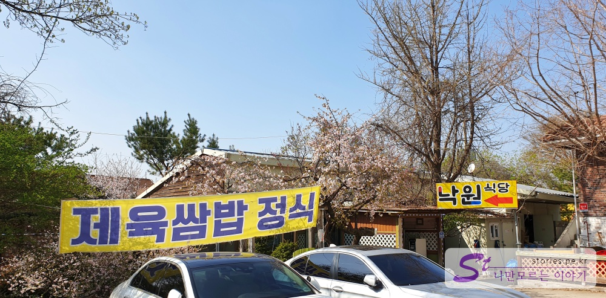
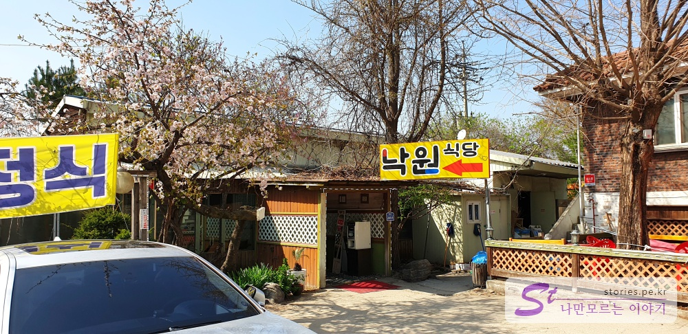
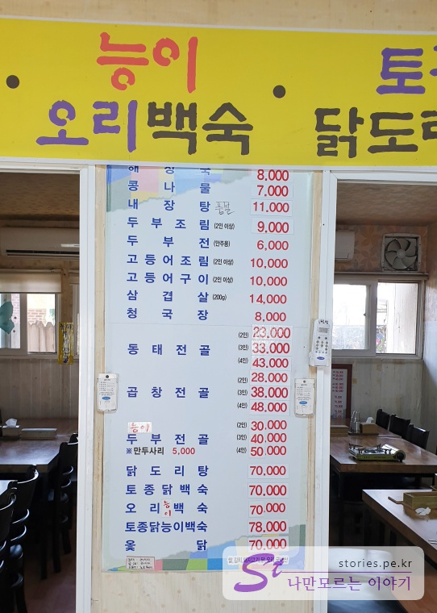
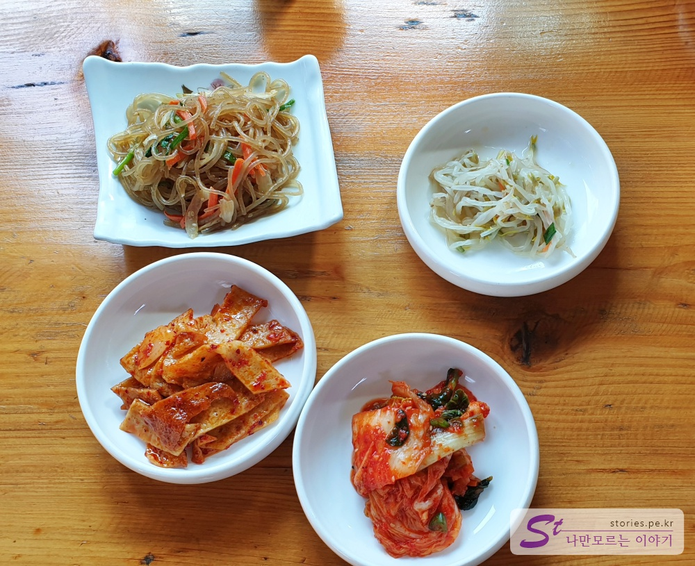
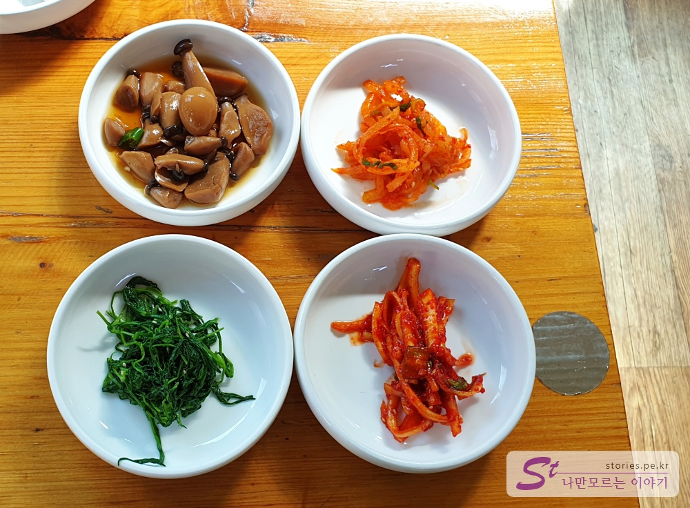
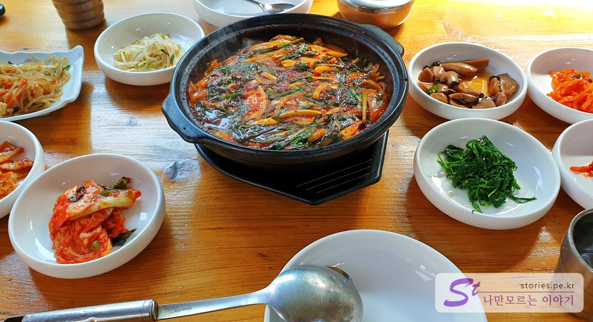
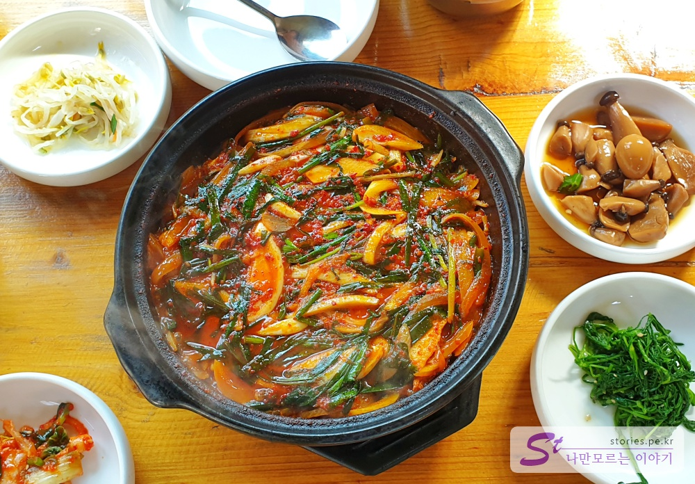
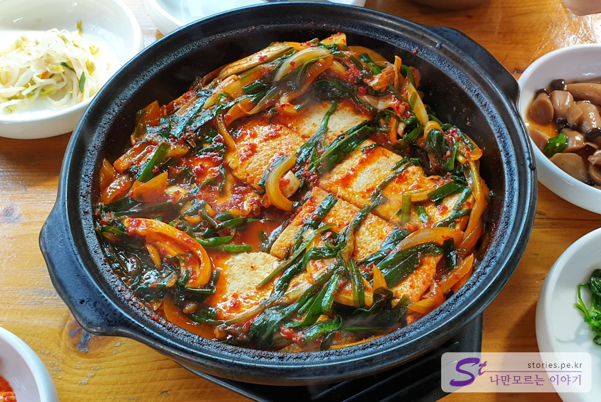

꽃피는 봄날 늦은 점심을 먹기위해 맛집을 찾아보던 중 지역주민의 추천으로 양주맛집인 낙원식당을 다녀왔습니다. 인근에 **레이크우드 골프장**이 있는데 이 곳에 방문하시는 사람들이 많이들 찾아 온다고 합니다.  
사람들이 많으면 어쩌나 했지만 평일이라 그런지 다행히 그렇게 많지는 않았습니다. 이곳에서 식사를 하고 식당 뒷편에 있는 **카페 구름**에서 커피한잔을 하면 딱 적당한 코스가 아닐까 합니다.

  
두부조림으로 유명한 줄 알았는데 현수막에는 제육 쌈밥이 걸려 있더라구요. 신메뉴인지 자신있는 메뉴인지는 모르겠습니다. ^^

  
식당입구는 좀 허름한 시골식당느낌입니다. 화살표표시가 있는 곳이 입구입니다.

## 대표 메뉴와 가격(가성비)

듣기로 두부조림, 두부전골 등 **두부요리**로 유명하다고 해서 두부를 사랑하는 1인 으로써 홀깃한 마음에 다녀오게 되었습니다. 하지만 메뉴는 매우 다양합니다. 고등어조림, 고등어구이, 제육쌈밥정식, 닭도리탕 등등...

## 먹어본 음식

저희는 두부조림을 먹으러 왔기 떄문에 흔들리지 않고 두부조림을 시켰습니다.

  
반찬은 총 8가지가 나옵니다. 반찬은 그때 그떄 다르게 나오는 것 같고 하나같이 깔끔하니 맛이 좋았습니다. 반찬맛집이라고 해도 될것 같습니다.  
반찬하면 [간판없는 식당으로 유명한 광릉불고기 본점](https://stories.pe.kr/275)이 생각나는데 여기는 그 다음으로 잘 나오는 것 같습니다.

  
버섯간장조림, 도라지무침, 짠지무침 등 하나같이 맛이 좋습니다.

> [간판없는 식당으로 유명한 광릉불고기 본점 포스팅 바로가기](https://stories.pe.kr/275)

  
드디어 두부조림이 나왔네요. 두부조림은 다 끓여서 나옵니다. 뚝배기에 나오기 때문에 눈앞에서 잠깐 보글되는 것을 볼 수 있습니다.

  
두부조림 아래에는 콩나물이 깔려있고 그위에 두부, 그리고 그위에 부추와 양파, 양념장이 올려져 있습니다.  
양념은 매콤하고 얼큰하니 맛이 좋습니다. 매우 맛이 좋다라고 하기는 좀 그렇지만 보통이상은 합니다.

  
양념장을 살짝 걷어봤습니다. 2인분 짜리에 두부는 6개가 나옵니다. 1인당 3개라는 뜻이겠지요? 1인분에 9,000원인데, 이렇게 되면 아무래도 가격이 너무 비싸 보입니다.  
손으로 만든 두부를 보통 시장에서 사면 1모에 3,000원정도 합니다. 1모면 이정도 크기로 잘랐을 경우 10개~15개 정도 나올텐데... 두부만 보면 원가가 500원 ~ 1,000원밖에는 안될것 같습니다. 조금 가격을 낮추어도 좋지 않을까 하는데, 9000원이 얼마 전에 올린 금액인 것 같네요.

한가지 아쉬운 것은 밥인데... 밥을 공기어 너무 꽉꽉 눌러담아 줘서 쌀알이 꼭꼭 뭉쳐 있었습니다. 양은 많이 주어서 고맙지만 밥은 약간 떡밥 느낌이였습니다. 밥집에 밥이 상당히 중요한데 밥 짓는 것에 대한 연구도 좀 필요하지 않을까 하네요.

## 청결도

시골에 있는 식당이라 어쩔 수 없겠지만 식당 내부는 매우 낡은 느낌이었고 지저분하다는 느낌이 들었습니다. 다만 반찬이나 그릇들은 깔끔하고 깨끗해 보였고 화장실도 시골 화장실 치고는 신경을 쓴 듯한 느낌이 들었습니다.  
깨끗한 식당 분위기에 민감하시다면 추천드리고 싶지는 않습니다.

**청결도 : ** ★★☆☆☆  

## 식당운영시스템과 친절도

사람이 많지 않은 시간에 방문해서 그런지는 모르겠지만 식당운영은 괜찮았습니다. 사장님도 직원분도 친절하게 응대해 주셔서 좋았습니다. 추가 반찬도 잘 갖다 주시구요. 만족했습니다.

**친절도 : ** ★★★★☆ 

## 식당과 주차 정보

- 주소 : 경기 양주시 만송로 201
- 연락처 : 031-840-1544
- 영업시간(휴무일) : 연중무류
- 주차 : 10대정도 주차가능

---

## 총평

두부조림의 맛은 괜찮았습니다. 레이크우드 방문 등 인근에 일이 있어 겸사겸사 방문하는 것은 추천 하지만 일부러 먼길 찾아 가기는 좀 아쉬은 식당 입니다. 저희도 다시 갈지 모르겠네요.
