가족 모임 장소를 찾다가 지인으로 부터 의정부에서 소문난 맛집이라는 소개를 받고 **치즐리**를 다녀왔습니다. 가보니 가족 모임 뿐만 아니라 데이트 코스로도 괜찮을 것 같아 소개합니다.

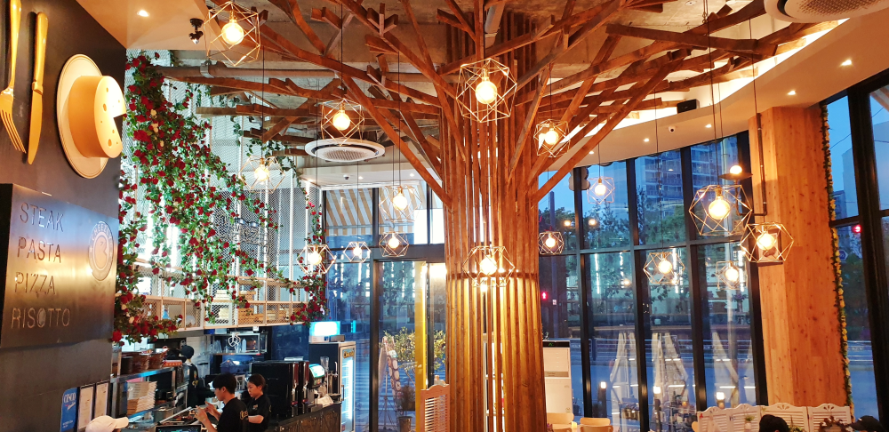  
치즐리의 내부는 층고가 높아서 상당히 개방적인 모습을 하고 있었고 레스토랑의 중심에 있는 나무모양의 인테리어는 이 곳의 시크니쳐처럼 독창적이고 아름다웠습니다. 역시 소문대로 더군요.

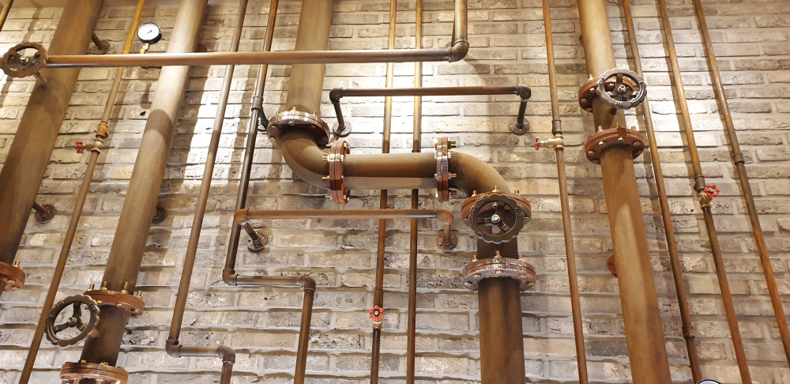  
그리고 또 하나의 시그니처는 바로 이 파이프 모양의 인테리어였습니다.  
약간 부식된 형태의 파이프가 오히려 깨끗한 식당과 잘 어울렸습니다.

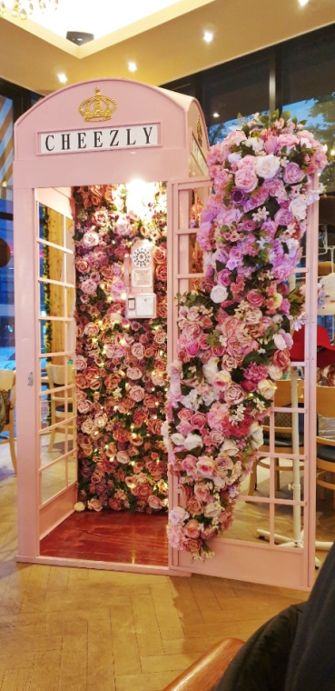  
레스토랑의 안쪽에 분홍분홍한 전화박스가 꽃으로 장식되어 있었습니다.  
마치.. **여기서 사진 찍어라**하는 모습을 하고 있습니다.

내부 인테리어를 보면 연인들이 와서 식사하기에 딱 좋겠다는 생각이 들었습니다.

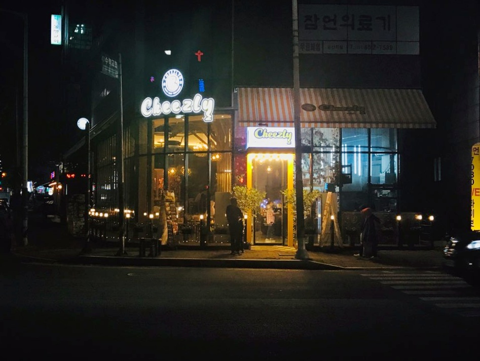  
외부의 입구도 찍어야 할 것 같아서 먹고 나가면서 어둑어둑해 졌을 때 찍었습니다.
외부의 모습보다는 내부의 인테리어가 몇 배는 더 멋졌던 것 같습니다.

## 대표 메뉴와 가격(가성비)

주 메뉴는 **스테이크**, **파스타**, **볶음밥**, **리조또**, **햄버거**, **피자**, **셀러드**가 주요 메뉴이고 각 메뉴마다 다양한 종류를 가지고 있습니다.

평소에 먹기에는 다소 비싼 느낌은 있으나 모임이나 데이트 때에 먹기에는 적당한 가격이지 않을까 합니다. 저희가 8명이 모였었는데 모두 배부르게 먹고 약 20만원정도 나왔습니다.
음식을 여러 개 시켜서 다같이 나눠 먹는 식으로 주문했습니다.

#### 새우볶음밥

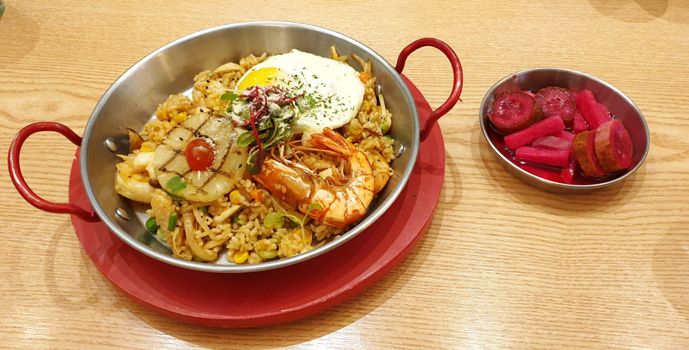  
첫번쨰는 새우볶음밥입니다. 일행 중에 이게 제일 맛있다고 하는 사람이 있을 정도로 좋은 평가를 받은 음식입니다. 맵지는 않지만 매콤함이 있습니다. 새우도 인심좋게 커다란 새우를 하나 올려줍니다. 추천 메뉴중 하나입니다.

#### 새우 로제파스타

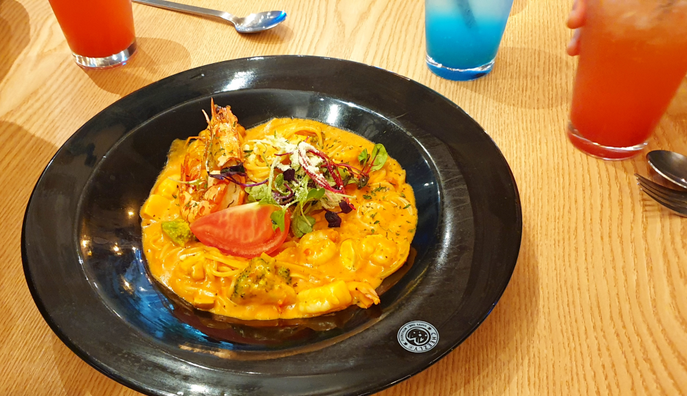  
두번째 음식은 새우 로제파스타 입니다. 로제파스타는 제 앞에 없어서 많이 먹지는 못했지만 기본 이상으로 맛이 있었습니다. 흡잡을 게 없었습니다.

#### 채끝 스테이크

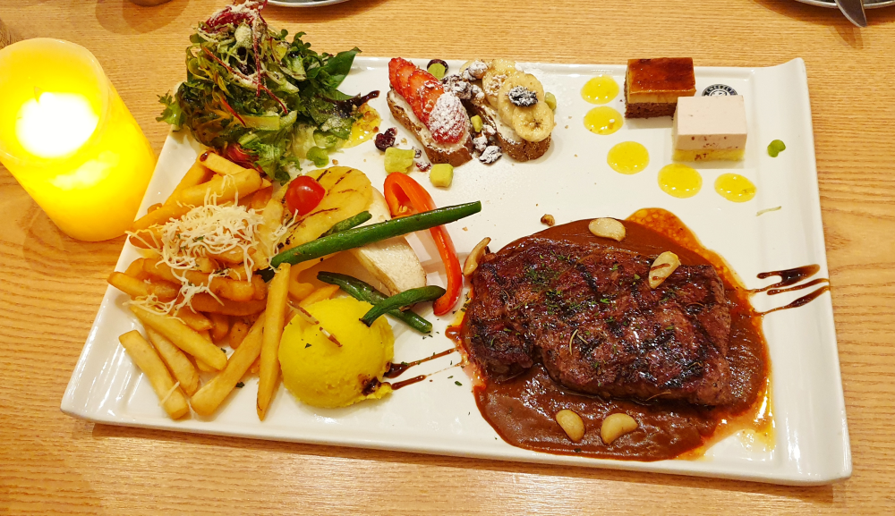  
채끝 스테이크입니다.  
나오는 스끼다시(사이드메뉴라고 해야하나^^;)는 다양해서 좋았으나 플레이팅이 좀 산만한 느낌이였습니다.  
저희는 어르신들도 있고 해서 굽기는 **미디엄웰**로 통일했습니다.

#### 티본 스테이크

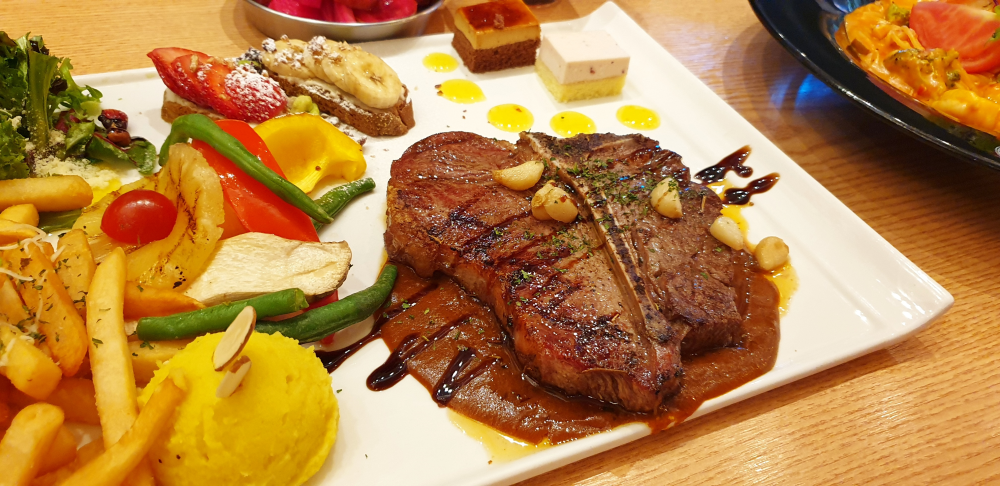  
이것은 티본 스테이크입니다.  
플레이팅은 채끝 스테이크랑 똑같고 고기만 다르게 나옵니다. 가운데 뼈가 하나 있습니다.  
소스도 어떻게 만들었는지 모르겠지만 스테이크랑 너무 잘 어울렸습니다. 따로 구매를 하고 싶긴했지만 차마 물어보지는 못했네요 ㅎ

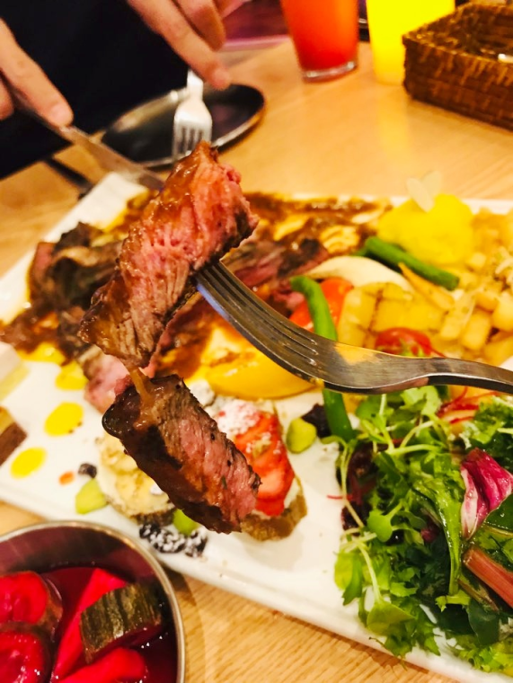  
남들이 하는 것처럼 썰어서 단면을 찍어봤습니다. **미디엄웰던**의 굽기 입니다.

> 치즐리에서 굽기는 **레어**(거의 핏덩어리), **미디엄 레어**, **미디엄**, **미디엄웰**(던), **웰던** 5단계로 구워줍니다.  
> 보통은 미디엄 또는 미디엄웰던을 선택하시면 됩니다.

#### 토마호크 스테이크

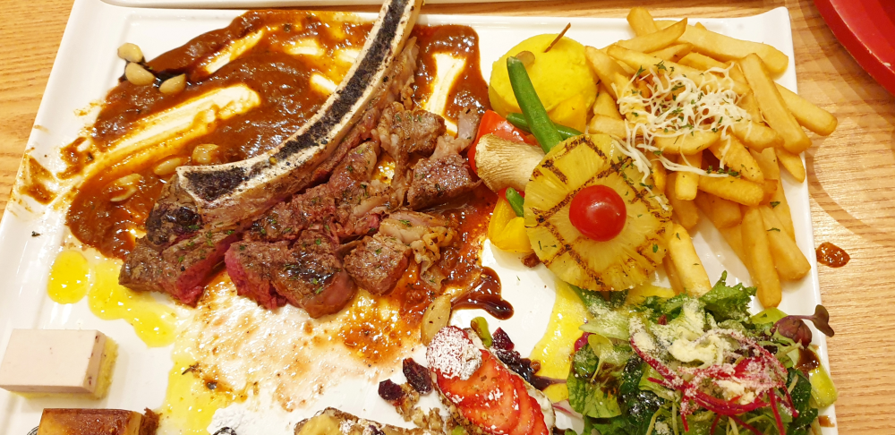  
토마호크 스테이크입니다.
정말 정말 먹는데 정신이 팔려가지고...ㅠㅠ
사진을 찍지 못했습니다. 한참을 고기를 썰고 있는데 갑자기 생각이 나서, 있는 살점 모아서 겨우 한장 찍었습니다.

토마호크 스테이크가 가장 크기가 컸습니다. 뼈에 붙어 있는 연골같은 접착살을 좋아하는 사람은 상당히 좋아할 스테이크일 것 같습니다.  
저는 아이 입맛인지라 저렴하고 비계가 없이 살점만 있는 채끝 스테이크가 가장 좋았습니다.  
토마호크 스테이크가 아웃백에도 있지만 치즐리의 토마호크 스테이크가 훨씬 저렴하고 양도 많았습니다. 이정도 크기의 토마호크스테이크라면 아웃백에서는 거의 10만원 이상일텐데, 여기서는 4만7천원에 먹을 수 있습니다.

#### 고르곤졸라 피자

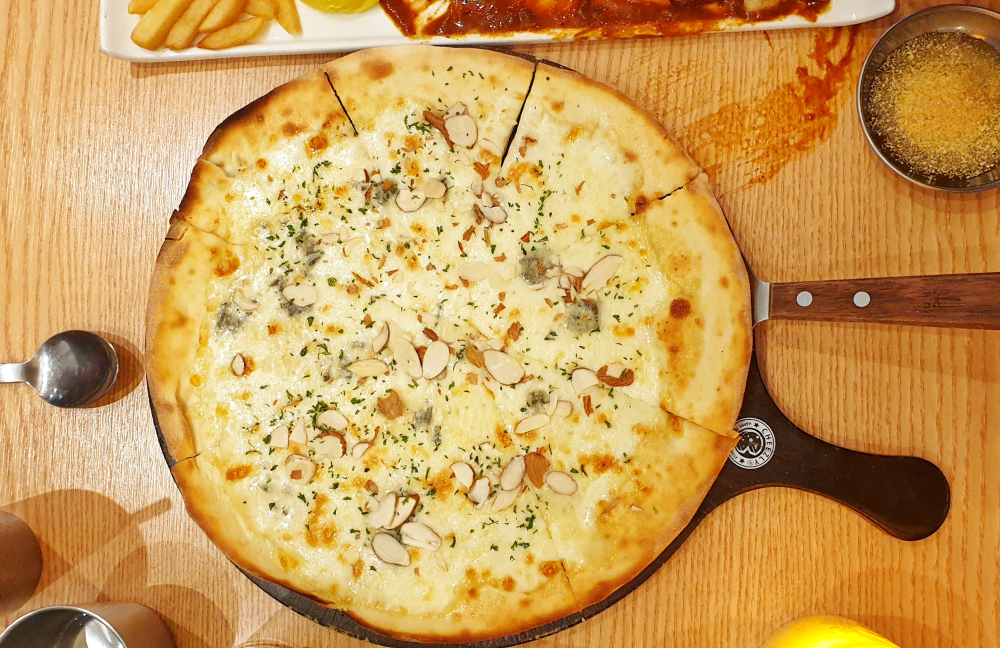  
고르곤졸라 피자입니다. 피자도 보통은 하는 것 같습니다. 꿀소스도 깨가 들어간것인지 뭔가 양념이 되어 있었습니다. 치즈의 품질이 너무 좋았습니다.

#### 마르게리따 피자

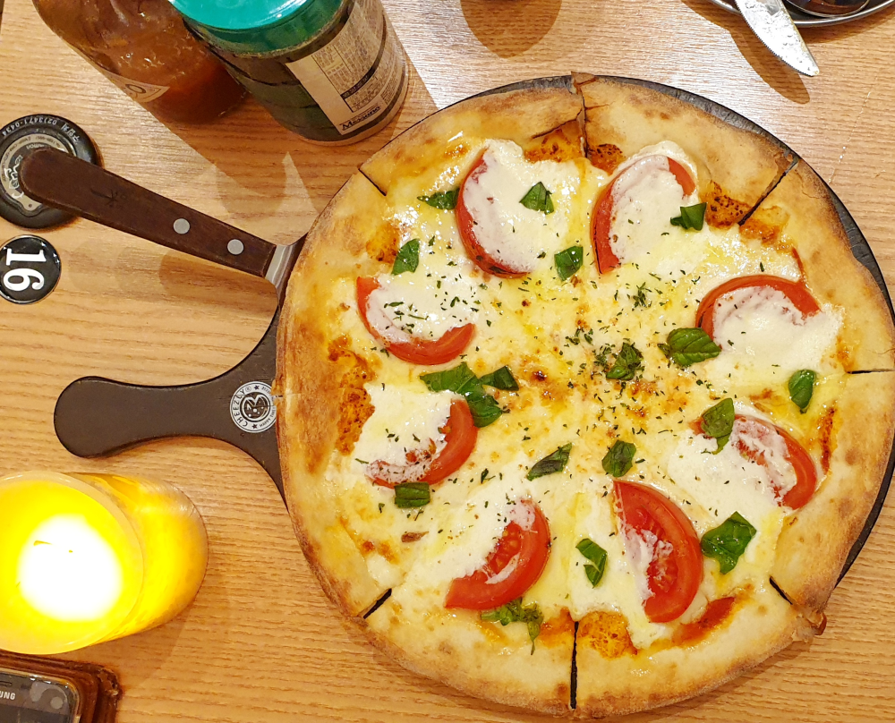  
마르게리따 피자는 저도 처음 먹어봅니다. 레스토랑 이름처럼 치즈가 정말 많이 들어 있고 쭉쭉~~ 늘어나면서 쫄깃하니 식감도 너무 좋았습니다.

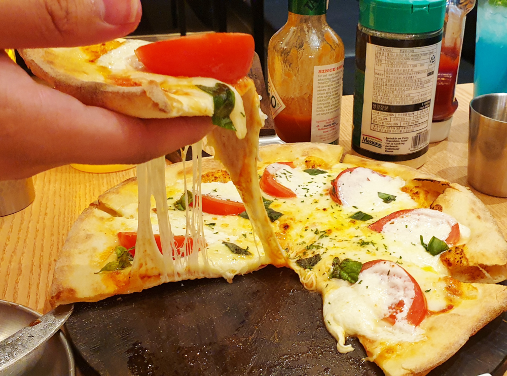  
한번 찍어 봤습니다. 치즈늘어나는 표현!!!! ㅎㅎ

#### ?? 셀러드

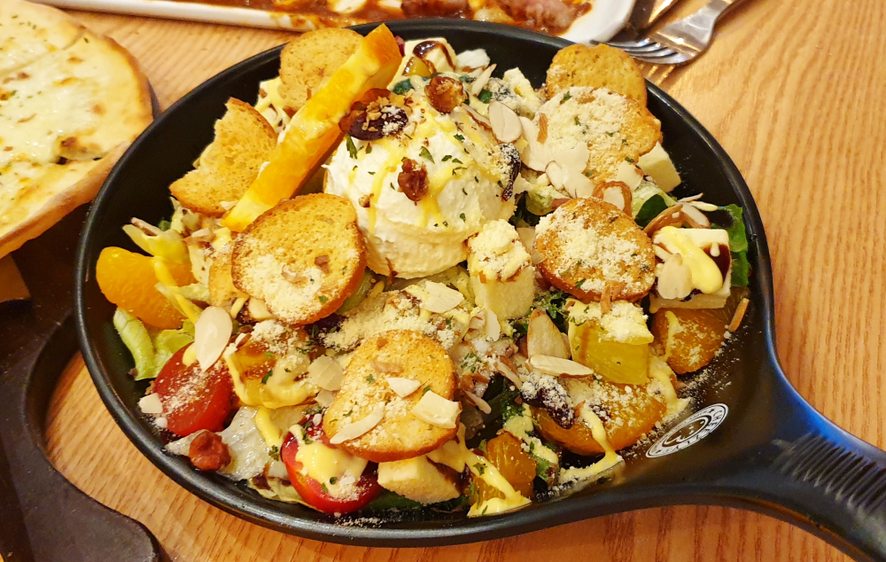  
누가 주문했는지 모르겠지만 셀러드입니다. 과일셀러드인가??

#### 치즐리 비프버거

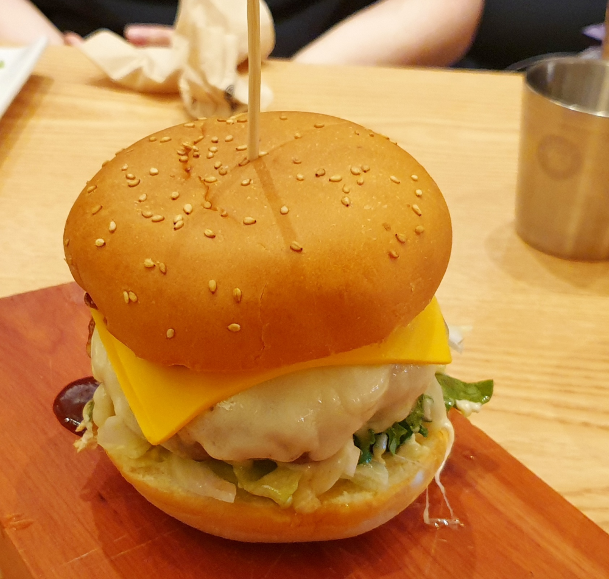  
아이들이 먹고싶다고 해서 마지막으로 치즐리 비프버거를 추가해서 먹었습니다.
역시 모짜렐라 치즈가 충분이 많이 들어 있어서 풍미가 좋았습니다. 고급 수제 햄버거 같았습니다.  
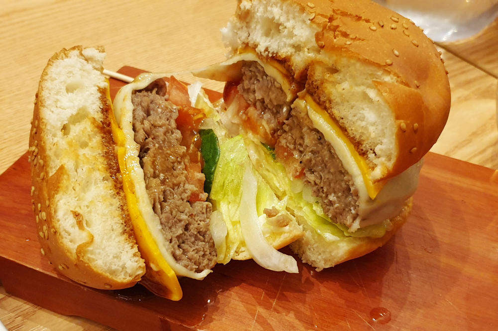  
반으로 커팅을 해봤습니다.

#### 초코블라썸 눈꽃빙수

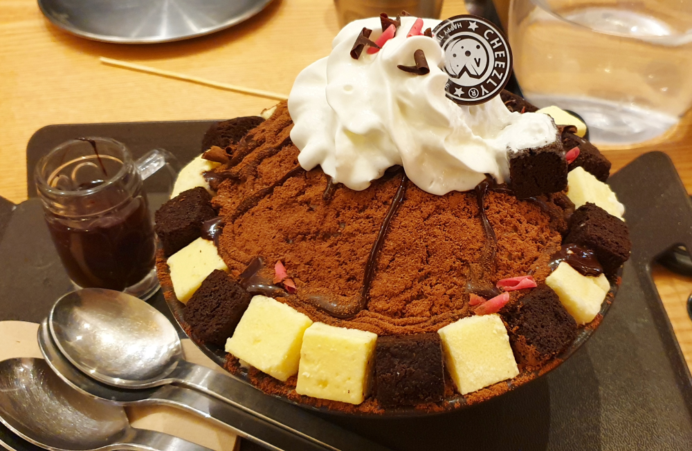  
초코블라썸 눈꽃빙수 입니다. 설빙에서 먹는것 처럼 부드러운 빙수입니다.
아이들에게 인기가 좋았습니다.

#### 망고빙수

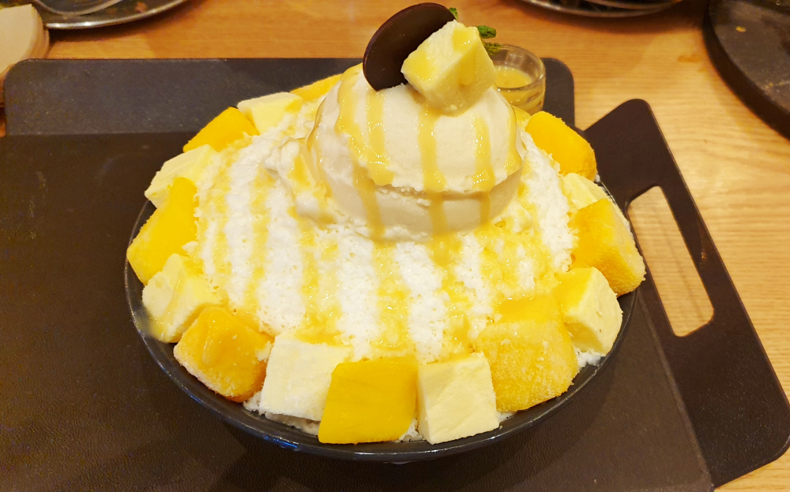  
망고빙수 입니다. 눈꽃 빙수이구요. 모든 음식의 마무리로 먹었습니다.

## 청결도

청결도는 상당히 좋았습니다. 인테리어와 서비스에 많은 신경을 쓴것 같았습니다.

**청결도 : ** ★★★★☆ 

## 식당운영시스템과 친절도

패밀리 레스토랑처럼 체계적으로 운영을 하고 있다보니 시스템과 친절도는 최상위라고 할 수 있습니다. 웬만한 패밀리레스토랑보다 좋은 것 같습니다.

**친절도 : ** ★★★★★ 

## 식당과 주차 정보

- 주소 : 경기 의정부시 용민로 104 예찬빌딩 1층
- 연락처 : 031-851-6076
- 영업시간(휴무일) : 11:00 - 22:00 (주일 휴무)
- 주차 : 발렛파킹 해 줍니다.

## 기타 사항

모임장소, 데이트장소로 적합한듯 합니다.
일요일에는 식당을 하지 않으니 평일이나 토요일에 방문해야 합니다.
