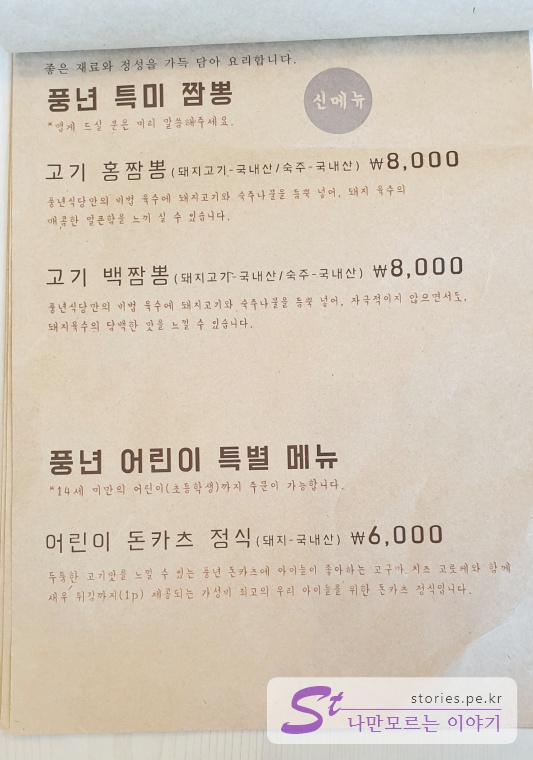

노포만 맛집이 있는 건 아닙니다. 생긴지 얼마되지 않았지만 기본기를 충분히 갖추고 있다면 맛집이 될 수 있습니다.  
이번에 우연찮게 포항에 갈 일이 있었는데 점심을 먹기 위해 반신반의 하며 인터넷으로 찾게 된 돈까스 맛집인 **포항식당**을 방문하게 되었습니다.

  
금요일 점심시간이 거의 다되서 방문을 했는데 예상과는 달리 테이블이 모두 차있지는 않았습니다. 우리가 먹는동안 테이블이 차기는 했지만 보통 유명한 맛집처럼 줄을 서가면서 먹지는 않아서 좋았습니다.

  
테이블은 대략 8 ~ 10개 정도로 식당이 크지는 않았지만 인테리어를 새로했는지 깨끗한 모습을 하고 있습니다.

  
**정성을 담아내고 있다고..** 써 있네요. 이 식당의 슬로건인가 봅니다.

## 대표 메뉴와 가격(가성비)

풍년식당의 시그니쳐 메뉴는 누가뭐래도 뼈 손잡이가 달려있는 **등갈비 돈까스** 일 것입니다. 돈까스 뿐만 아니라 꼬막비빔밥과 제육볶음 정식도 괜찮았습니다.

## 먹어본 음식

우리는 총 5명이 방문하여 4가지 종류의 음식을 먹어봤습니다.

  
첫번째는 제가 먹은 **제육볶음 정식**입니다. 맵지는 않으나 매콤한 불맛이 일품이고 약간의 상추와 맛있는 된장찌개를 한상에 담아 줍니다. 음식은 전체적으로 정갈하고 깔끔합니다. 기본 이상의 맛이라고 할 수 있습니다.

  
두번째는 꼬막비빔밥입니다. 저는 보통 픽의 실패가 두려워서 처음 방문하는 식당에서는 해산물이 들어간 음식을 선택하진 않습니다. 비릴까봐...
하지만 제가 먹어보지는 못했지만 먹어본 사람이 꼬막의 비린맛도 없고 깔끔하고 맛있다는 평을 들었습니다. 벌교의 꼬막을 사용한다고 합니다.

  
세번쨰는 치즈돈까스 입니다. 모짜렐라치즈가 길게 늘어지는 돈까스로 한덩이 밥과 소금, 생 와사비를 플레이팅하여 줍니다. 하나 먹어봤는데 인상적이지는 않지만 그래도 기본 이상의 맛을 가지고 있습니다.

  
네번쨰는 대망의 **등갈비 돈까스** 입니다. 가격은 10,000원이지만 가격이 전혀 아깝지 않은 크기와 맛을 자랑합니다. 2명이 **등갈비 돈까스**를 주문했는데 돈까스가 나오자 모두 **우와~~** 했습니다. 압도적인 크기와 손잡이처럼 생긴 뼈가 상당히 인상이 깊었습니다.  
식감이 일반 돈까스에 비해 더 쫄깃한 느낌이였고 고기맛도 상당히 좋았습니다. 완전 추천합니다.

  
먼저 돈까스를 어느정도 먹고 나머지는 손을 잡고 뜯어 먹을 수 있습니다. 맛에 이어 재미까지 더했습니다. 누가뭐래도 **풍년식당의 시그니쳐 메뉴**라 할 수 있습니다.

## 차림표

특이하게 차림표가 메뉴 하나당 한장을 차지하고 있어서 부특이 이미지가 많습니다.

  
짬뽕은 먹어보지 못해서 평가는 못하겠습니다.

  
12,000원이였는데 10,000원으로 내린것 같네요.

  
돈까스 이름이 **풍년 돈까스**라서 이것이 시그니처 같지만.. 아무래도 등갈비돈카츠가 시그니처가 될 것 같습니다. 참고로 저희는 풍년돈까스는 먹어보지 않았습니다.

## 청결도

식당이 새로 생긴 것인지 인테리어를 새로 한 것인지는 모르겠지만 실내는 상당히 깔끔한 모습입니다. 음식도 1인상으로 내오기 때문에 청결도에서는 많은 점수를 주고 싶습니다.

<b>청결도</b> : ★★★★☆ 

## 식당운영시스템과 친절도

우리가 갔을 때는 사람이 그렇게 많지 않아서 정확한 평을 하기는 좀 그렇지만 중간 이상은 하는 것 같습니다. 순서를 놓치지 않았고 주문 후 음식도 상당히 빠르고 정확히 나왔습니다.

<b>친절도</b> : ★★★★☆ 

## 식당과 주차 정보

- 주소 : 경북 포항시 남구 효성로 20 (우)37836
- 연락처 : 070-4795-2161
- 영업시간(휴무일)
  - 매일 **11:30 - 22:00**
  - 브레이크타임 **15:00~17:00**
  - 마지막 주문 **21:00**
- 주차 : 가게 앞에 **약 3대 정도** 주차할 공간이 있습니다.

## 기타 사항

다음에 포항을 가게 된다면 다시한번 들려볼 만한 식당입니다.  
가시면 꼭 등갈비돈카츠를 드셔보세요.
