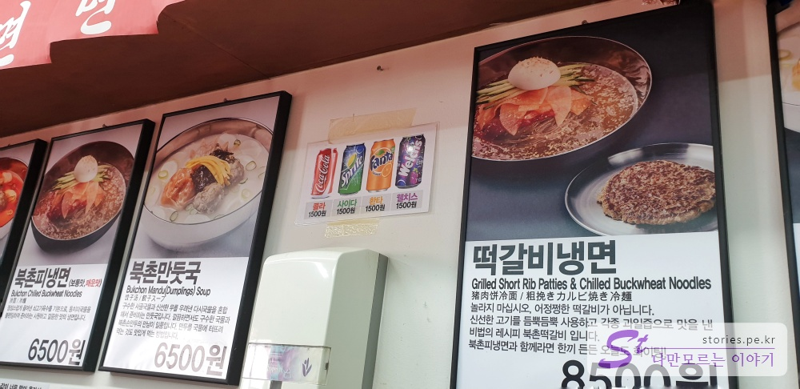
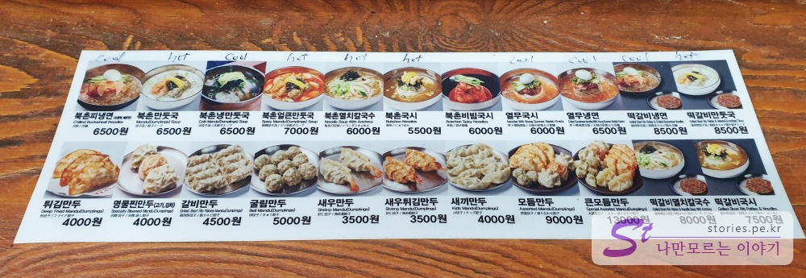
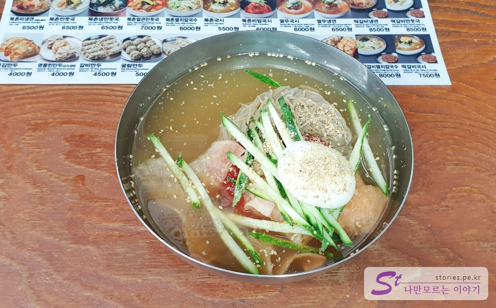
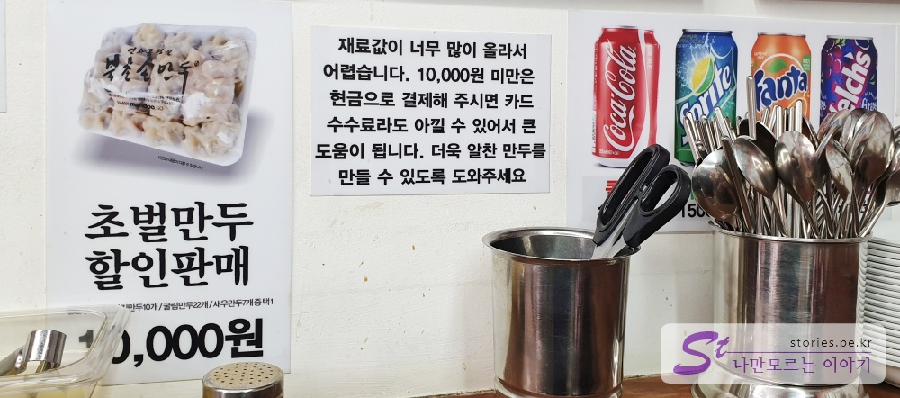
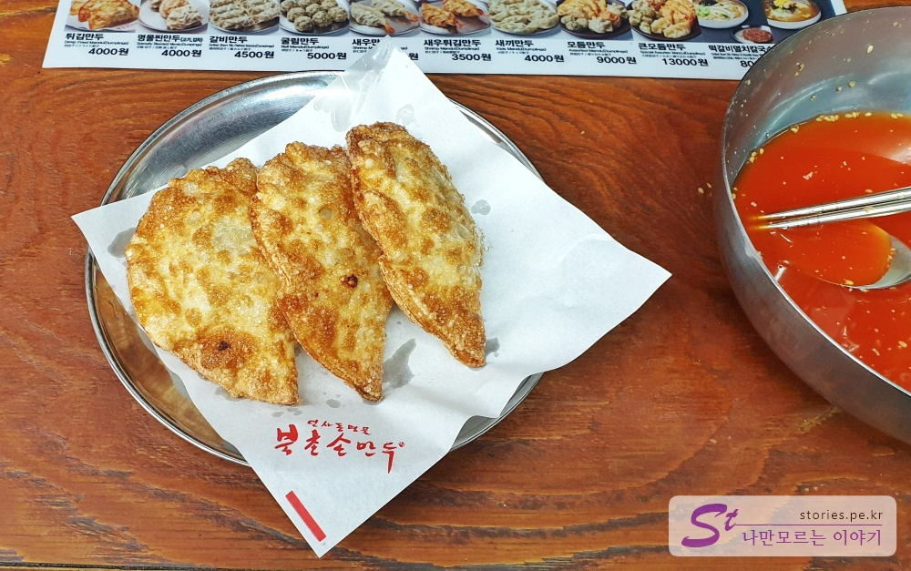
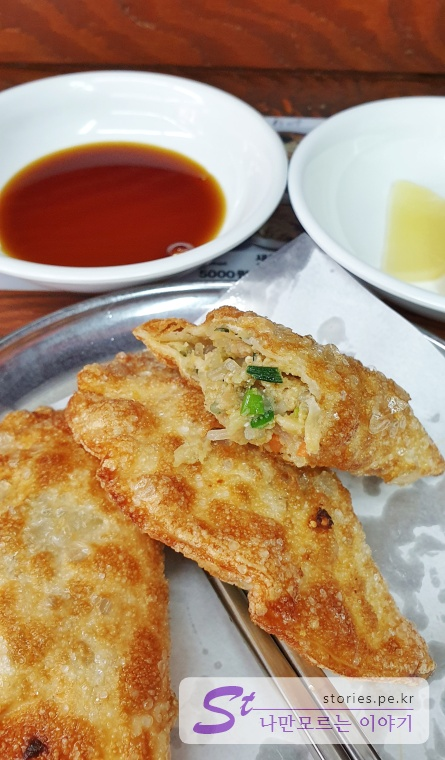

봄에서 여름으로 넘어가는 평일 점심시간에 인사동에 있는 북촌손만두집에 다녀왔습니다. 인사동이 북촌 바로 아래에 있기 때문에 그런지 인사동에만 북촌손만두집이 3개나 있습니다. 가장 윗쪽에 **인사본점**이 있고 가운데 **인사별관**, 종로2가 쪽에 가까이 있는 **인사본점신관**이 있습니다.

  
저는 가장 위에 있는 인사본점을 다녀왔습니다.

## 대표 메뉴와 가격(가성비)

가게의 이름에서 알 수 있듯이 대표메뉴는 만두입니다.  

## 먹어본 음식

  
날씨도 덥고 해서 저는 6,500원에 냉면을 시켜서 먹었습니다. 가격에 비하면 냉면과 냉면육수는 적당히 맛있습니다.
한그릇 뚝닥하고 현금을 내고 나오려고 하는데...
  
떡하니 10,0000원미만은 현금으로 결제해 달라는 문구를 보게 되었습니다.  
그래서 튀김만두를 하나 더 시켜 먹었습니다.

  
튀김만두는 4000원에 3개를 줍니다. 옆에 다먹은 냉면은 제가 먹은것입니다. ㅎ

  
만두속은 잡채와 고기로 되어 있는것 같습니다. 튀김만두는 독특하지는 않고 그냥 적당히 맛있습니다.

## 식당과 주차 정보

- 주소 : 서울 종로구 인사동길 42-5
- 연락처 : 02-732-1238
- 영업시간(휴무일) : 매일 11:00 ~ 20:30(연중무휴)
- 주차 : 인사동내에 있어서 주차장은 별도로 없습니다.
