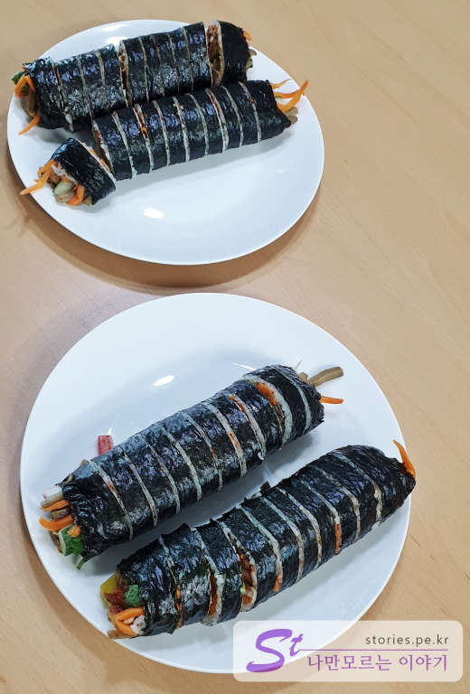

생활의 달인에 소개된 의정부의 김밥 맛집입니다.
일반 김밥천국 같은 곳에서 만드는 김밥과는 확연히 다른 김밥입니다.
달걀지단만 보더라도 그냥 허투루 만들지는 안았구나 하는 것을 느낄 수 있습니다.

## 방문시기

몇번 방문했다가 문닫은 모습만 보다가 이번에 드디어 김밥을 살 수 있었습니다.  
2019년 7월달 토요일 오전 10시쯤 방문하니 제 앞쪽에 대기 인원이 4팀정도 있었습니다.  
김밥은 미리 주문하지는 않고 자기 차례가 되었을 때 주문을 하면 그때 만들어서 줍니다.

## 대표 메뉴와 가격(가성비)

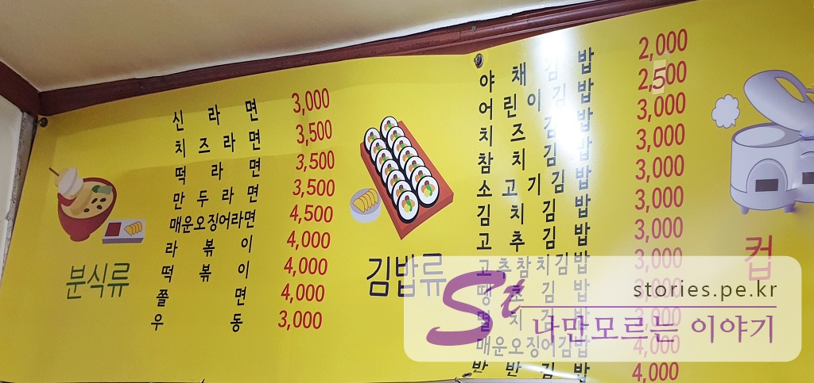  
여러가지 메뉴를 판매하고 있으나 대표메뉴는 **매운오징어김밥**, **멸치김밥**, **달래김밥**이라고 할 수 있습니다.  
라면도 있고 일반 김밥도 있으나 방송에 나온 이후로는 아마도 거의 이 3가지 메뉴가 판매의 90%가 되지 않을까 합니다.

## 먹어본 음식

우리는 소고기김밥 1개, 멸치김밥 1개, 매운오징어김밥 2개를 구매했습니다.  
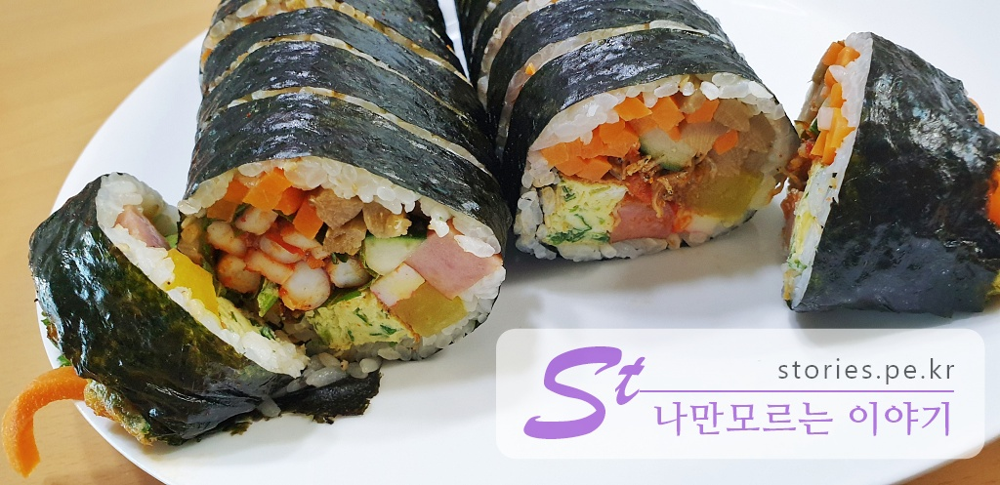  
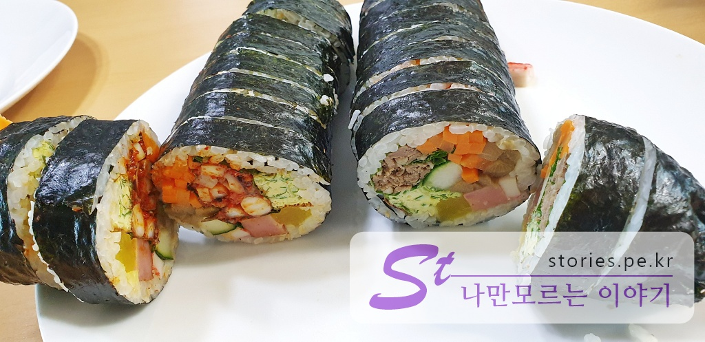

### 매운오징어 김밥

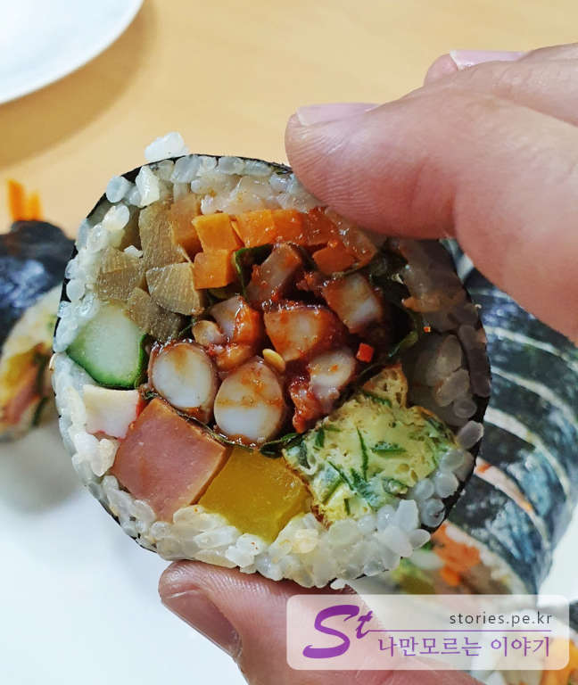  
매운오징어김밥은 **매운맛**, **덜매운맛**, **안매운맛** 이렇게 3가지가 있고 우리는 덜매운맛으로 2개를 구매했었는데 덜매운맛도 상당히 맵습니다.

### 소고기 김밥

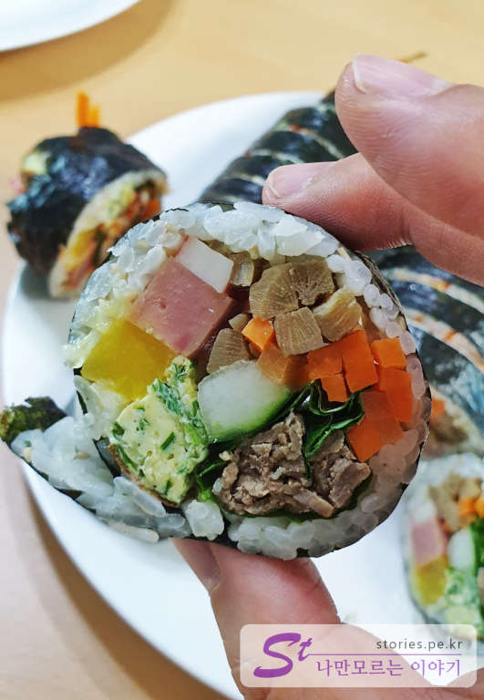  
소고기김밥도 내용물이 상당히 충실 합니다. 계란 지단만 봐도 김밥천국의 그것과 비교하면 정말 훌륭할 정도 입니다.

### 멸치 김밥

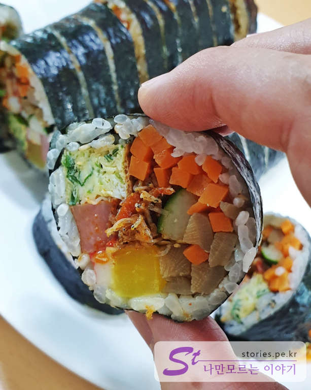  
멸치김밥의 멸치는 아주 작은 멸치를 매콤하게 조리한 멸치를 넣었습니다. 맛있습니다. 밥보다 속재료가 더 많이 들어가 있네요.

## 청결도

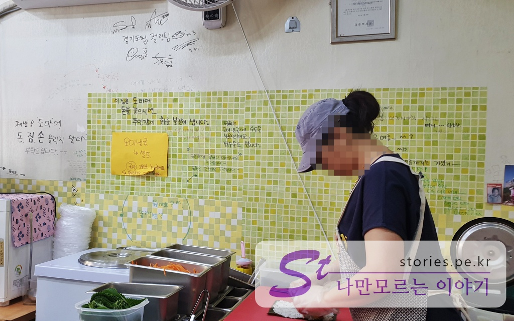  
가게 자체는 오래된 건물이라 깨끗하지는 않습니다. 그래도 도마에 돈, 짐, 손을 올려놓지 말라고하는 것을 보면 그래도 나름 깨끗하게 유지하려고 노력은 하는 것 같습니다.

김밥은 미리 만들어 놓는 것이 아니라 주문을 하면 바로 만드는 시스템이라 음식이 상할 일은 없어보입니다.

**청결도 : ** ★★★☆☆ 

## 식당운영시스템과 친절도

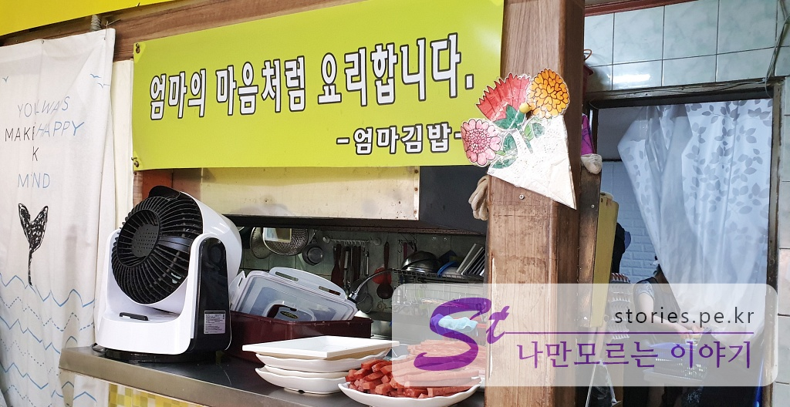  
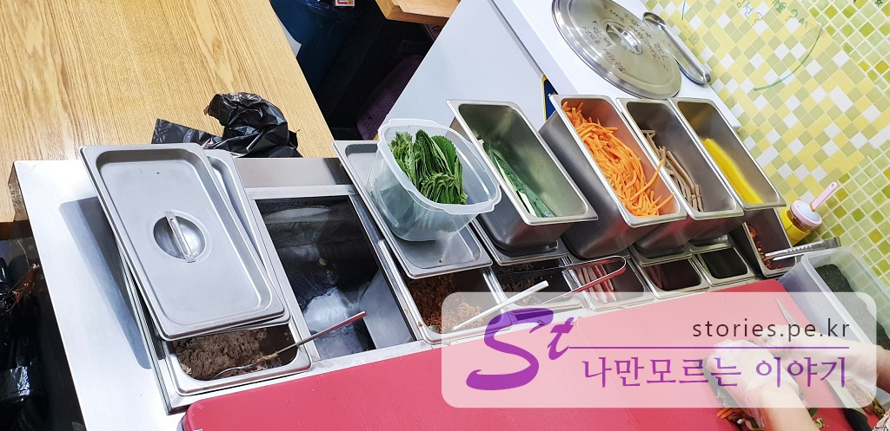
방송 초기에는 아무래도 준비가 덜되어 있어서 인지 오전에 주문을 마치고 문을 닫았습니다. 그래서 헛걸음을 몇번했었는데, 지금은 저녁 8시까지 운영을 합니다.  
부부 2분이 김밥을 말고 발고 계시고 안에서는 속재료를 준비하고 계십니다. 주인이라 친절하십니다. 하지만 가게가 작다보니 약간은 기달려야 하는 수고가 필요합니다.

**친절도 : ** ★★★★☆ 

## 식당과 주차 정보

- 주소 : 경기 의정부시 시민로246번길 11
- 연락처 : 031-845-2526
- 영업시간(휴무일) : 매일 06:30 ~ 20:00 (2주,4주 일요일은 13시까지영업)
- 주차 : 주차장 없음. 주변 골목길 적당하게 주차해야함

## 기타 사항

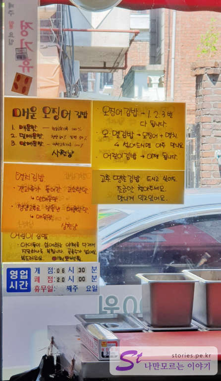
