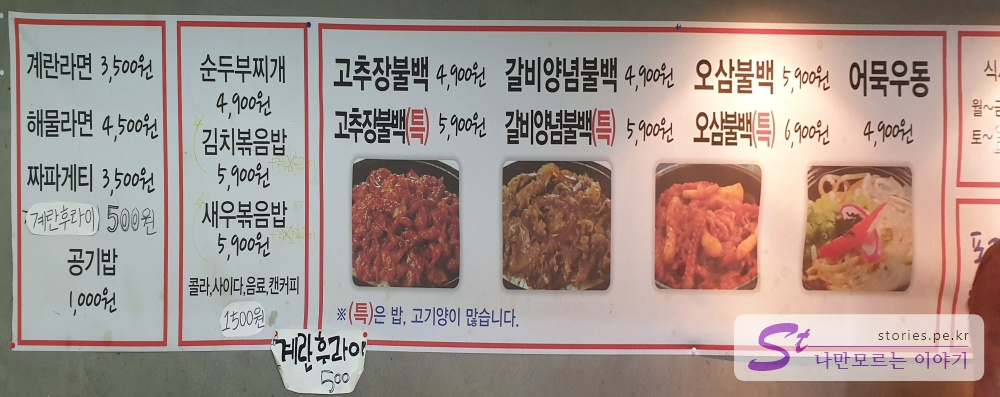
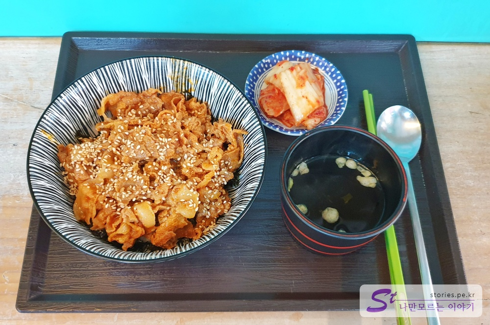
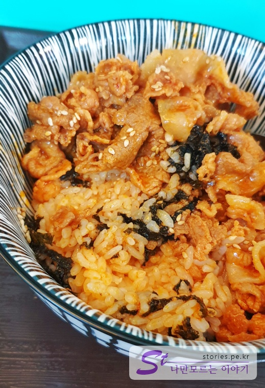
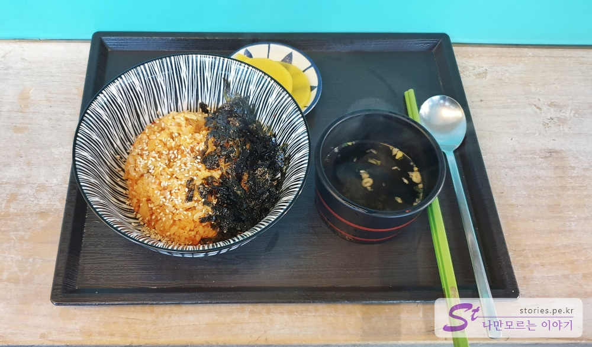
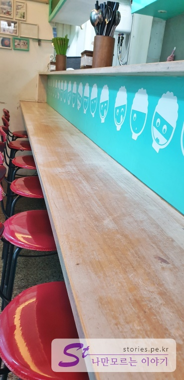
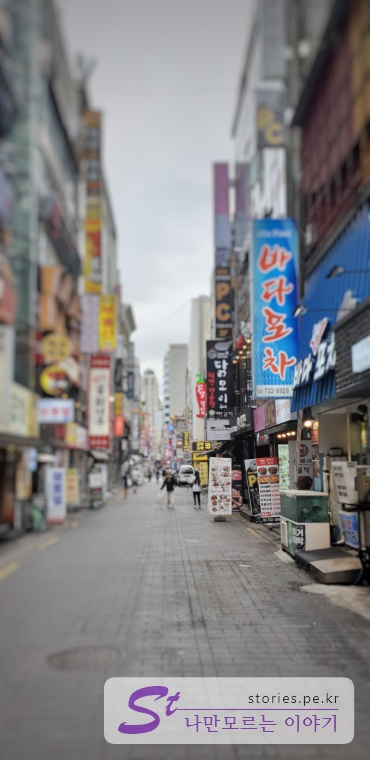
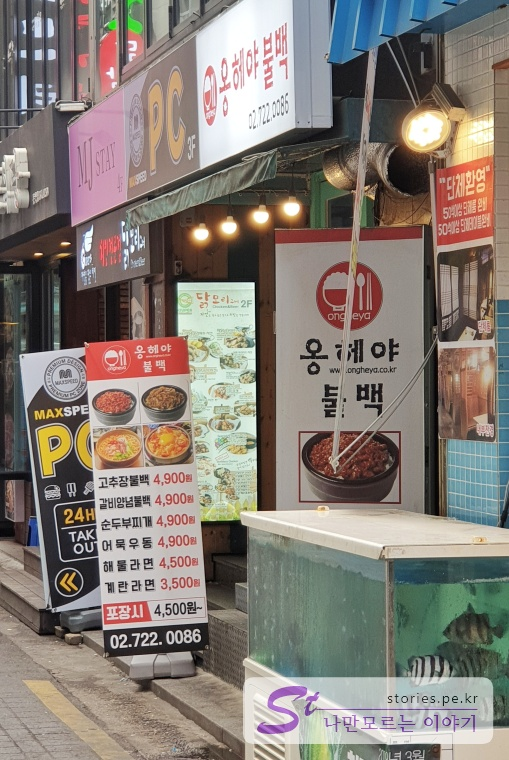
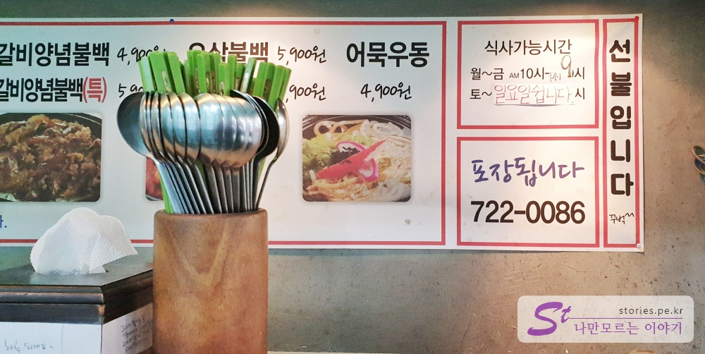

가끔 종로에서 근무를 하는 경우가 있습니다. 가능하면 여럿이서 먹지만 때로는 여유있게 혼자 먹고 싶을 때가 있습니다. 그리고 학원가 이다 보니 직장인 뿐만 아니고 학원생들도 혼자 식사하는 경우가 많은데 그 때 부담없이 식사를 할 수 있는곳이 있습니다.  
가격도 저렴하고 맛도 있는 옹헤야불백을 소개 합니다.

## 대표 메뉴와 가격(가성비)

메뉴는 1인식으로 여러가지 메뉴가 있습니다.  

대부분 보통이상으로 맛이 있습니다. 그중에서도 대표메뉴는 **고추장불백**, **갈비양념불백**, **오삼불백**이라고 할 수 있습니다.  
모든 음식에서는 계란토핑을 500원에 추가 선택할 수 있습니다.

## 먹어본 음식

### 고추장 불백

  
첫번째 음식은 고추장 불백입니다. 충분히 많은 양의 돼지고기가 올라가 있습니다.
가격은 **4,900원**이고 (특)인 곱배기는 1000원이 비싼 **5,900원**입니다.

  
비벼봤습니다. 돼지냄새도 별로 나지 않고 씹히는 식감도 좋습니다.  
가격대비 퀄리티가 좋습니다.

### 김치볶음밥

  
김치볶음밥도 먹어봤습니다. 고기가 없어서 그런지 조금 섭섭한 느낌인데 가격은 **5,900원**입니다.  
여기서 파는 다른 음식에 비해서 다소 가성비는 떨어지는 느낌입니다.  
그래도 맛은 있습니다.

## 청결도

  
실내모습은 깨끗한 편입니다. 식탁은 모두 1인석의 바형태로 되어 있습니다. 혼자 식사하기에 최적의 형태로 되어 있습니다.  
음식은 1인용 쟁반에 나오고 물과 수저와 젓가락은 셀프서비스 입니다.  
젊은 사장님이 운영을 해서 그런지 청결에 신경을 많이 쓰고 있는 모습입니다.

**청결도 : ** ★★★★☆ 

## 식당운영시스템과 친절도

식당은 선불결제로 주문합니다. 주문하기는 어렵지 않습니다. 주문을 하면 토핑을 추가로 시킬지 곱배기로 할지 선택사항을 물어봅니다.  
처음 방문시는 당연히 물어보는게 좋긴한데 여러번 방문하는 사람에게는 본의 아닌 부담감이 쪼~~끔 느껴집니다. (제가 소심해서 그럴수도 있어요 ㅠㅠ;)

**친절도 : ** ★★★★☆ 

## 식당과 주차 정보

  
종로의 매인스트리트에서 한블럭 안쪽의 골목길에 있습니다.  
옹헤야불백은 찾기 쉬울것 같지만 이상하게도 쉽게 찾아지지 않습니다. 뻔히 간판도 있고 입간판도 있지만 찾기가 어렵습니다. 저도 한 2~3번 이 골목을 지나고 난 다음에야 찾을 수 있었습니다.  
차라리 **바다포차**를 찾아 들어가는 것이 쉬울 것입니다.

  
옹헤야불백의 입구입니다. 입구가 작습니다.

- 주소 : 서울 종로구 우정국로2길 34 1층
- 연락처 : 02-722-0086
- 영업시간(휴무일) : 월~금 10:00 ~ 21:00 (토,일 휴무)
- 주차 : 주차장은 없어요, 가게도 작은데...
  
