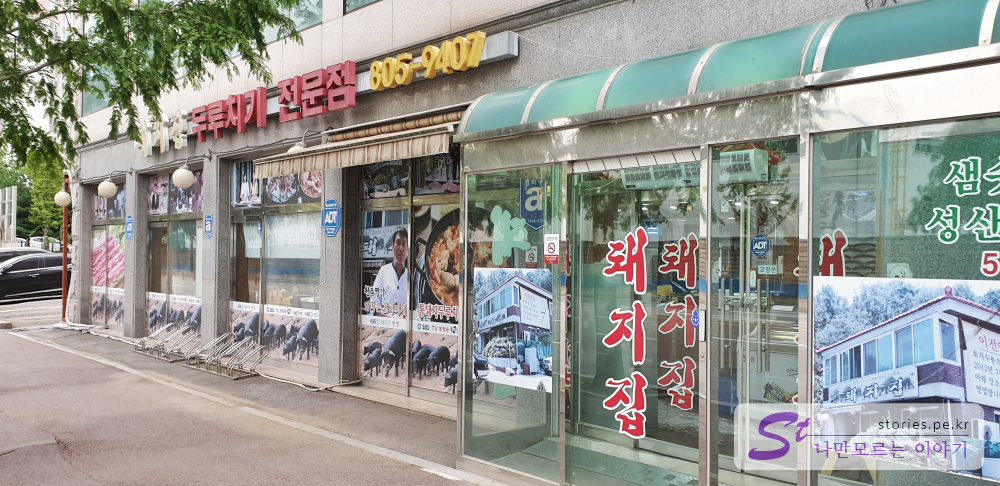
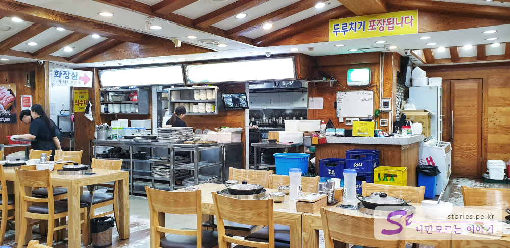
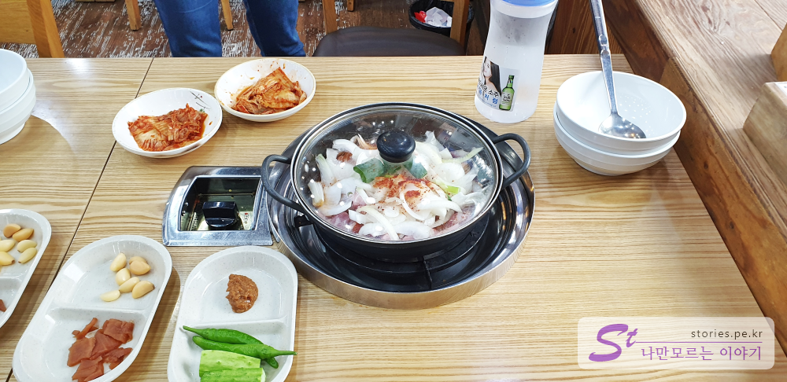
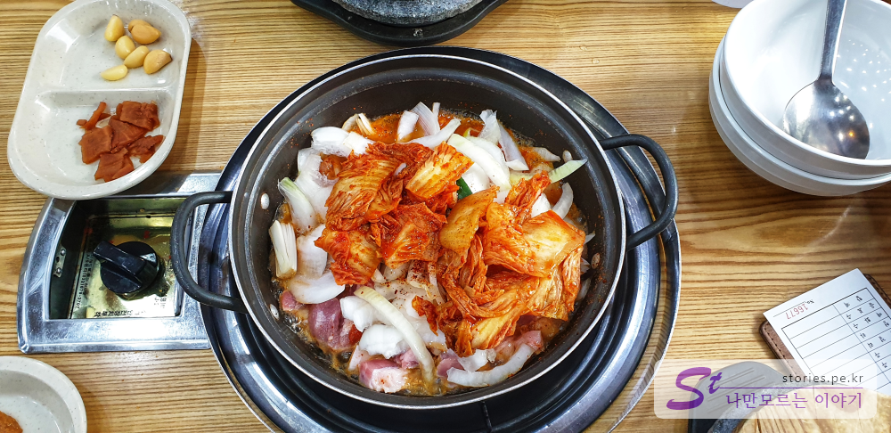
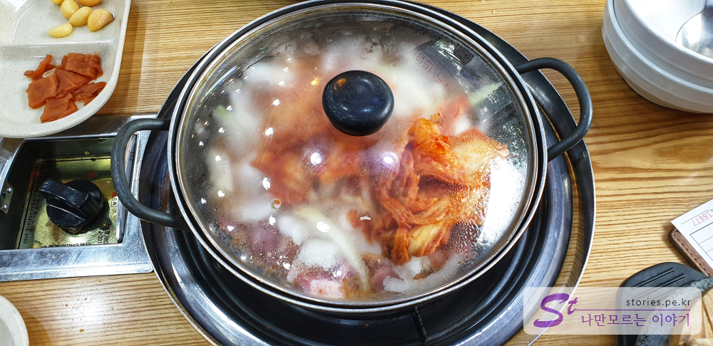
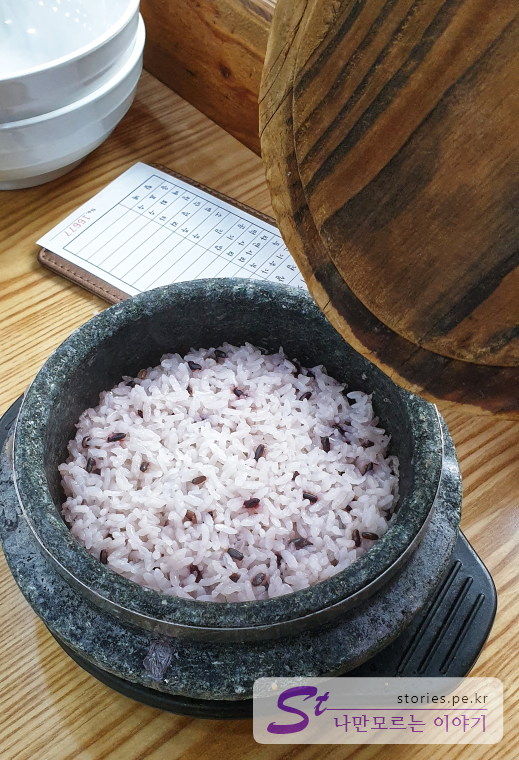
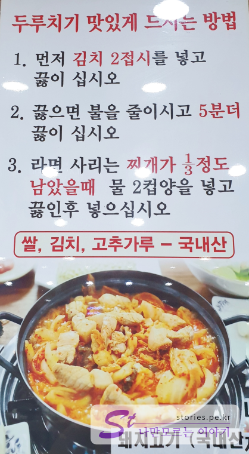
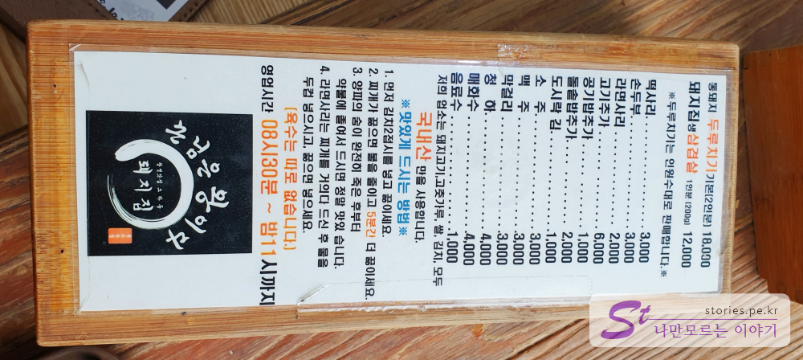
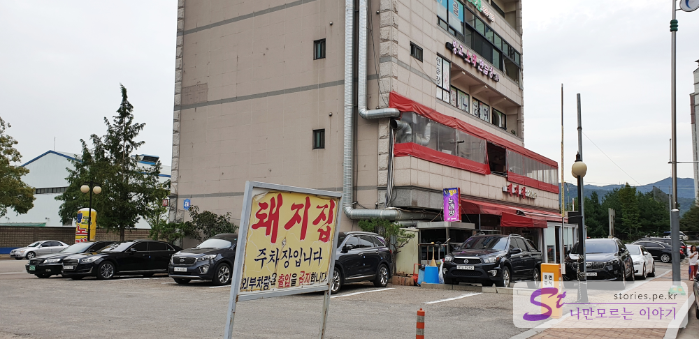

## 광명 두루치기 맛집 돼지집

광명이 돼지 두루치기로 유명하다고 해서 **광명동굴**을 방문하고나서 저녁식사를 하기위해 **돼지집**을 방문하였습니다.

인터넷으로 핫하다고 하는 곳입니다. 위치상으로 광명동굴과 이케아, 광명역에서 가까워서 방문한 목적도 있습니다.

  
겉모습은 여타 식당과 크게 다를바가 없습니다. 하지만 1층과 2층, 별관까지 운영하는 것으로 봐서 두루치기로 많은 돈을 모은 듯 합니다.

  
오후 5시쯤 방문이라 아직 저녁시간이 되지 않아서 그런지 사람들이 많지는 않았습니다. 하지만 모든 식탁에 두루치기가 미리 준비가 되어 있었습니다. 곧 손님들이 들이 닥칠거라는 것을 알고 있는 것 같았습니다.

  
2명이면 2명이 앉는 자리로, 4명이면 4명이 앉는 자리로 안내해 줍니다. 뭐 생각이고 뭐고 할 필요없습니다.
준비물은 단촐합니다. 양파와 돼지고기가 들어가 있는 두루치기와 김치 두접시 오이, 고추 쌈장, 마늘 짠지가 다 입니다.

먼저 자리에 앉으면 옆에 있는 김치 2접시를 넣고 바로 끓입니다.

  
뚜껑을 덮고 끓여줍니다.

  
언제 만들었는지 모르게 돌솥밥이 나옵니다. 제가 예약도 하지 않았는데 예약한것 처럼 아주 빨라요

  
조리방법은 따로 벽에 붙어 있습니다.  
돼지는 국내산이라고 합니다. 먹어보면 국내산이라는 것을 바로 알수 있습니다. 잡내도 없고 맛이 아주 좋습니다. 삼겸살이라기보다는 오겹살이 맞지 않나 싶습니다.

  
매인 메뉴는 딱 2개입니다. 하나는 생살겹살이고 하나는 두루치기 입니다.
대부분은 두루치기에 라면사리를 많이 먹는 것 같습니다.

  
두루치기가 이렇게 끓기 시작하면 2~3분 정도 기다렸다가가 먹으면 됩니다.

> 일단 전체적으로 맛이 좋습니다. 칼칼한 김치의 맛도 좋고 무엇보다도 돼지고기가 맛이 좋습니다.
> 하지만 호불호가 있겠지만 양파에 의한 단맛이 조금 많이 느껴 집니다.
> 돌솥밥에 이정도 맛이 1인분에 9,000원이면 가격도 적당한것 같습니다.

## 청결도

청결도는 그렇게 깨끗한 편이 아닙니다. 음식도 미리 식탁에 올려놔서 파리가 먼저 입을 델 수도 있을 것 같네요.

<b>청결도 :</b> ★★☆☆☆ 

## 식당운영시스템과 친절도

식당운영은 내공이 느껴질 정도로 굉장히 단순화 되어 있고 효율적으로 되어 있습니다.
자리에 미리 세팅이 되어 있고 앉자마자 바로 돌솥밥을 줍니다. 하지만 친절함을 그렇게 친절하다고 느끼지는 못했습니다. 그냥 사무적이고 보통의 친절도 라고 보시면 됩니다.

<b>친절도 :</b> ★★★☆☆ 

## 식당과 주차 정보

- 주소 : 경기 광명시 기아로 56
- 연락처 : 02-805-9407
- 영업시간(휴무일) : 매일 09:00 ~ 24:00
- 주차 : 식당 바로 옆에 주차장 있어요.
- 
