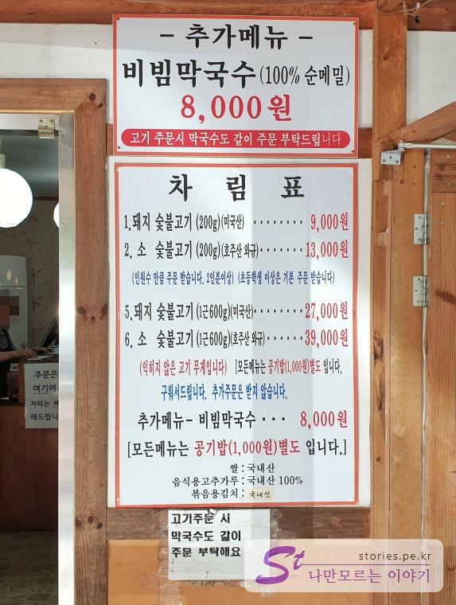
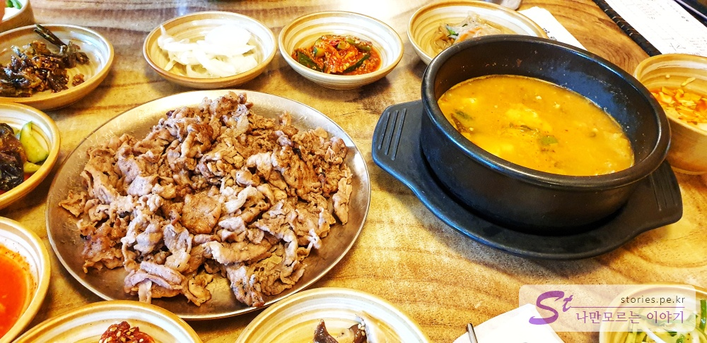
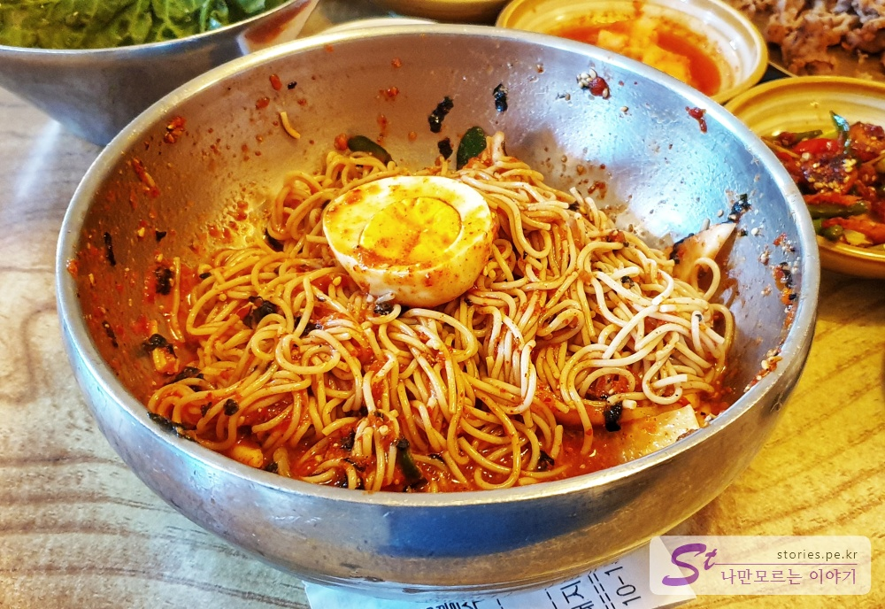

작년에 광릉불고기에 대한 포스팅을 했었습니다. 1년이 지난 지금 다시 한번 포스팅을 해봅니다. 기본적인 정보는 아래 포스팅을 참고 하세요.

> [남양주의 간판없는 집으로 유명한 광릉불고기 본점 방문기](https://stories.pe.kr/275)

저는 광릉불고기집을 자주 찾는 편입니다. 사실 불고기가 먹고 싶어서 간다기보다는 그 식당에서 제공하고 있는 반찬 때문에 간다고 할 수 있습니다. 물론 불고기도 맛있지만 자주 가다보면 반찬이 더 매력적이라고 할 수 있습니다.

  
주차장이 넓은편이여서 주말에 갔음에도 주차하는데 어려움은 없습니다.

  
간판이 없네요.  
주차는 어렵지 않게 할 수 있지만 주말인 경우 사람이 많기 때문에 차례가 오기까지 좀 기다려야 합니다.  
시간이 문제가 아니라면 기다리는데 힘들거나 짜증나거나 지루하지 않습니다.  
**처음 식당에 도착하면 가장 먼저 대기실에 가서 주인아주머니에게 신청을 먼저 해야 합니다.** 신청을 하면 전화번호 뒷자리 4자리로 대기를 걸어 주십니다. (이 떄 주문을 하는 것은 아닙니다. 주문은 자신의 차례가 왔을 떄 주문을 하면 됩니다.)

대기를 걸고 대기실에서 대기를 하든지 밖으로 나와 벤치나 주변 편한 곳에서 담소를 나누며 대기를 하면 됩니다. 자신의 차례가 되면 스피커로 불러줍니다.  
그러면 다시 주인아주머니에게로 가서 주문을 합니다. 주문은 식당에서 먹는 도중에 추가 주문이 되지 않기 떄문에 이때 꼭 필요한 음식을 모두 주문해야 합니다.
사장님이 자리번호를 알려주면 그때 식당으로 들어가서 지정된 자리에 앉으면 알아서 음식이 나옵니다.

## 대표 메뉴와 가격(가성비)

대표메뉴는 광릉불고기로 알려진 마른 형태의 불고기 입니다. 식당에서 구우면서 먹는 것이 아니라 식당에서 모두 조리된 불고기가 접시에 담겨 나옵니다. 이게 여름 때는 식당이 더워지지 않아서 좋습니다.  
하지만 저에게 이 식당의 대표 메뉴라고 한다면 **무한 제공되는 반찬**이라고 할 수 있습니다.

  
가격은 1년전에 비해서 변하지는 안았습니다. 작년과 동일한 가격이네요.

  
거의 99%의 메뉴 구성입니다. 불고기에 상추 된장찌게가 기본이고 12가지 정도의 다양한 반찬이 구성되어 있고 불고기를 뺴고는 모두 무한 리필이 가능합니다.

  
불고기는 여타 다른 불고기와는 다르게 볏집으로 구워 향내가 좋은 마른 형태의 불고기 입니다. 이렇게 완성된 음식이 접시에 담겨져서 나옵니다.

### 메밀 막국수

메밀 막국수도 시켜봤습니다. 메밀로 만들어서 면이 잘 끈어지긴 합니다. 맛은 평균 이상이라고 할 수 있습니다. 양도 적당히 많구요.

  
항상 먹으러 가면 먹을까 말까 고민하는 별미라고 할 수 있습니다. 저희는 주로 2명이서 가는데 2명이 먹기에는 많고 먹고는 싶고 하는 메뉴입니다.

  
비벼봤습니다. 맛있어 보이네요. 꼴깍~~~

2명이서 먹은 영수증입니다. 참고하시라구요.  

## 식당운영시스템

사장님이 바뀌지 않았으므로 식당운영시스템은 이전에도 말씀드렸다시피 매우 좋습니다.

<b>운영시스템 : </b> ★★★★★ 

## 청결도

청결도도 깨끗하게 유지하려고 노력한 부분이 보입니다. 또한 반찬도 무한리필이지만 남은 음식을 제활용하지 않는 것 같습니다. 음식물을 치울때 남은 반찬을 고민없이 바로 짬 처리해 버리네요.

<b>청결도 : </b> ★★★★☆ 

## 친절도

매우 나쁘지도 매우 좋지도 않습니다. 적당하다고 보시면 될것 같아요.

<b>친절도 : </b> ★★★★☆ 

## 식당과 주차 정보

- 주소 : 경기 남양주시 진접읍 광릉내로82번길 40-1
- 연락처 : 031-527-6631
- 영업시간(휴무일) : 화~일 11:00 ~ 20:00 (매주 월요일 휴무)
- 주차 : 넓은 주차장

## 기타 사항

저는 여기에서 식사를 하고 가까이에 있는 광릉수목원이나 고모저수지 둘레길을 한바퀴 돌면서 소화시키고 집에 가는 것이 코스입니다. 아주 좋아요 ㅋ

고모저수지 둘레길에 대한 포스팅은 아래를 참고하세요.  
고모저수지는 광릉수목원을 지나서 광릉수목원 북쪽 끝에 위치해 있습니다.

> [광릉수목원의 숨어있는 쉼터 고모리 저수지 산책하기](https://stories.pe.kr/358)
