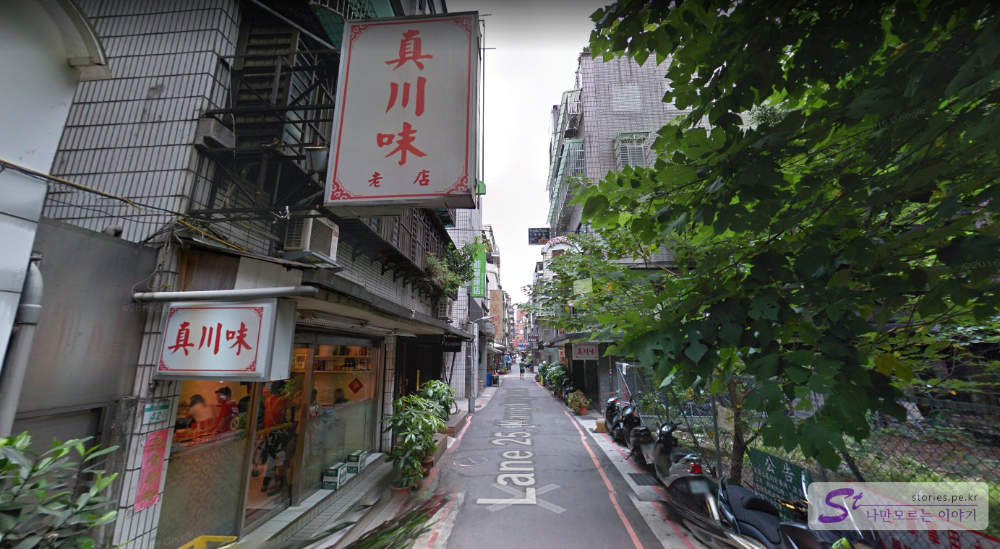
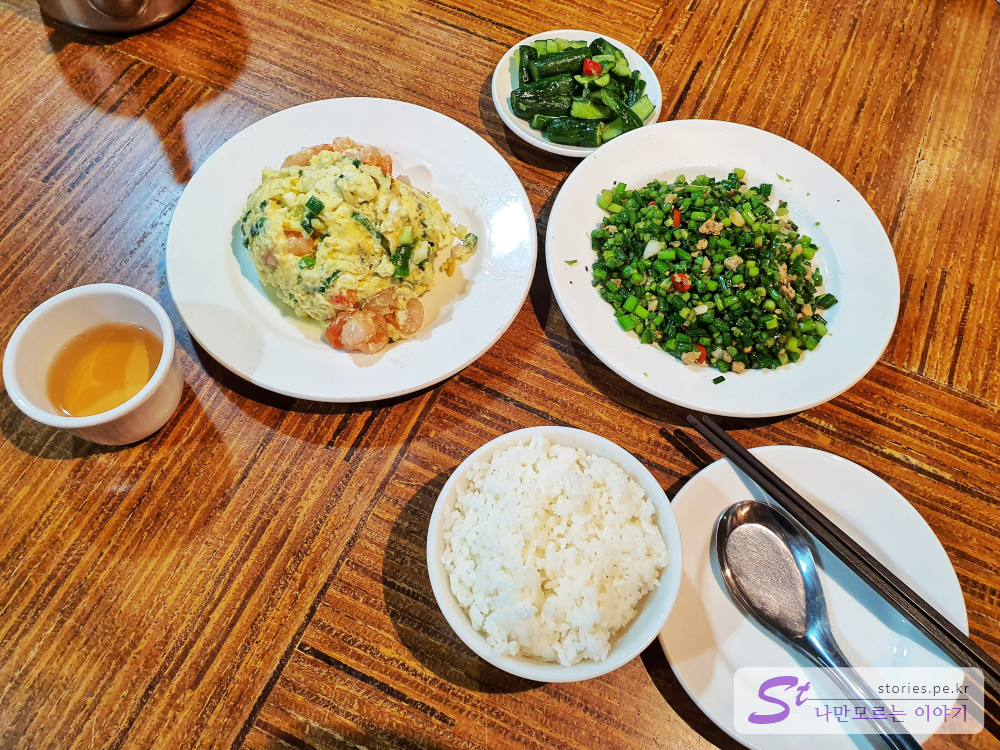
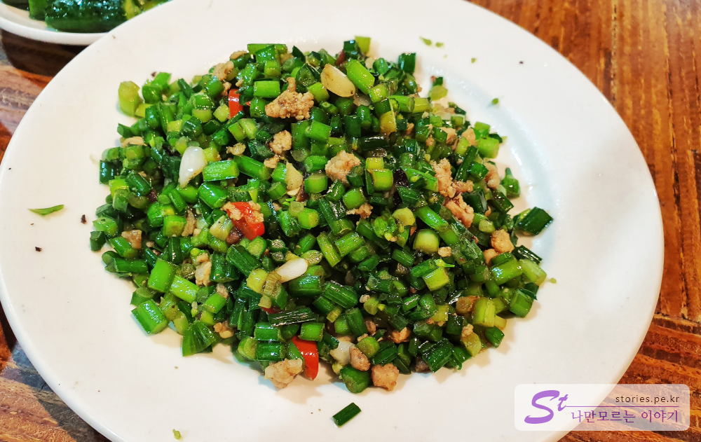
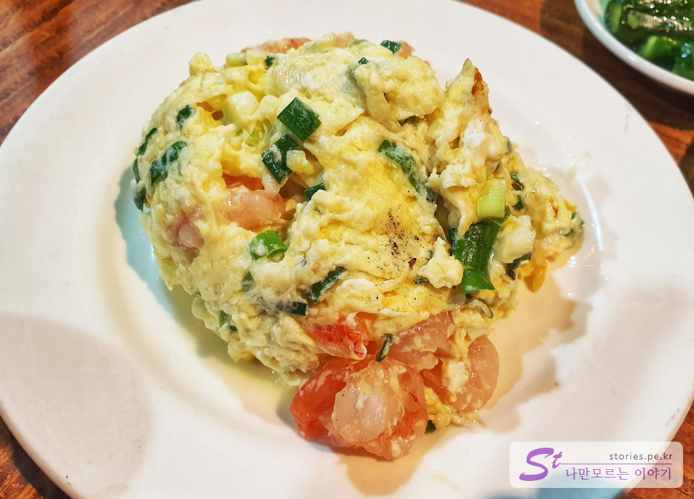
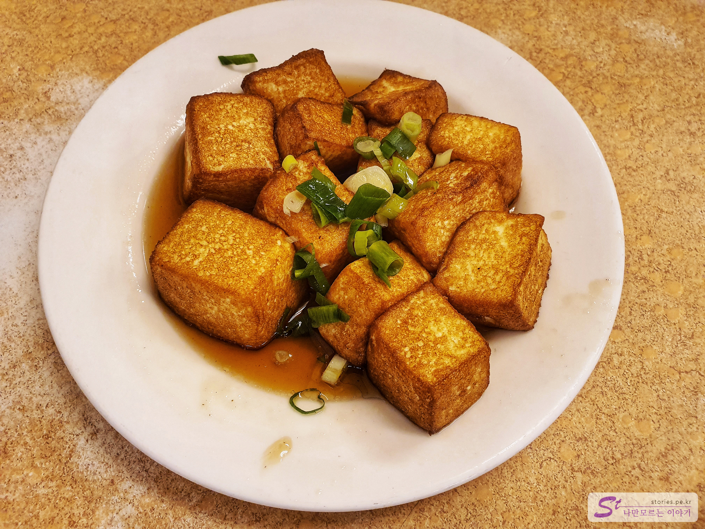
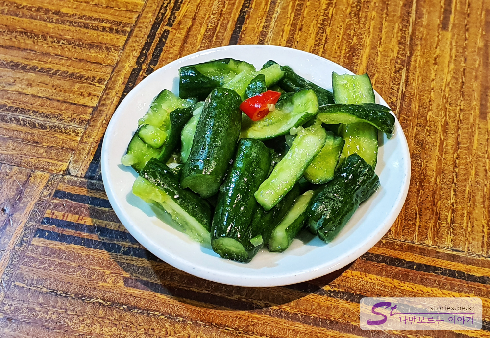
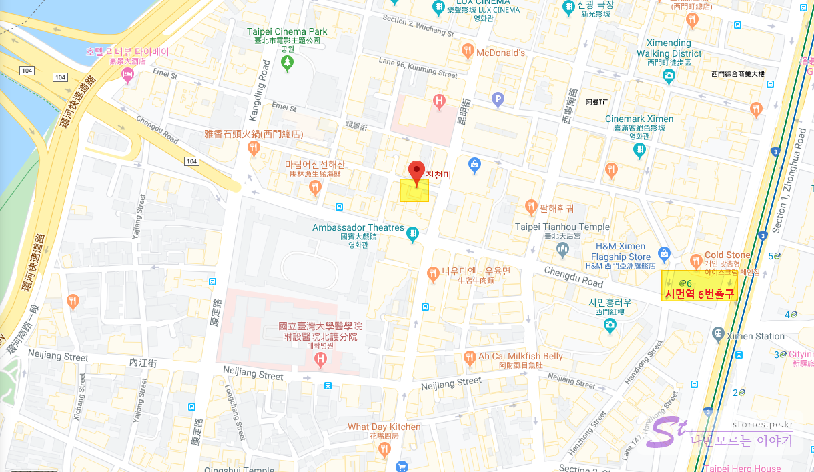

사전에 알고 가기에 대만은 맛집 천국이라고 들었지만 입 짧은 저는 제 입맛에 맞는 대만 음식이 많지 않았습니다. 곱창도 못먹어서 곱창국수도 못먹고 로컬음식도 무섭게 생겨서 먹을 엄두를 내지 못했습니다. 대왕연어초밥이 유명하다하여 삼미식당에도 가봤지만 생각만큼 만족감을 주지는 못했습니다. 그러다 가 본 곳이 이 곳 진천미 식당입니다. 

## 대표 메뉴와 가격(가성비)  

**진천미 식당**은 사천요리를 전문으로 하는 로컬스러운 식당입니다. 메뉴가 다양하지만 한국 사람들이 주로 먹는 메뉴는 **파볶음**, **튀김생두부**, **새우계란볶음** 등이 있습니다. 
밥은 별로로 주문해야 하고 전채(사이드메뉴)도 유로로 구입해서 먹어야 합니다. 

- **파볶음** : 160 NTD (약 6,300원)
- **튀김생두부** : 160 NTD (약 6,300원)
- **새우계란볶음** : 180 NTD (약 7,000원)
- **전채** : 40 ~ 280 NTD  (약 1,500~ 10,000원)
- **밥** : 10 NTD  (약 400원)

   
3째날의 일정을 끝내고 거의 문을 닫을 시점인 저녁 8시40분쯤에 혹시나 하는 마음에 찾아 갔습니다. 다행히 마지막 타임으로 주문이 가능했습니다. 

진천미 식당이 있는 골목에 들어서면 선택의 기로에 서게 됩니다. 왜냐하면 거의 똑같은 식당간판을 볼 수 있기 때문입니다. 어디가 진짜 원조 식당일까??  
제가 추측하기로는 일단 앞쪽에 있는 곳이 원조 진천미 식당이고 뒷쪽에 있는 곳이 나중에 생긴 식당이 아닐까 생각했습니다. 왜냐하면 앞쪽 식당의 간판에만 노점(老店)이라고 써있었거든요. ^^ 
하지만 2곳 어디를 가나 똑같은 메뉴에 똑같은 맛을 볼 수 있습니다. 저희는 2곳을 모두 가봤거든요. 똑같습니다. 

## 먹어본 음식   

저희가 주문한 메뉴입니다. 2명이 방문해서 파볶음, 새우계란볶음, 밥, 오이지를 시켰습니다.  
밥은 저희가 적게 먹는 편이라 한그릇만 주문했지만 보통의 사람들은 인당 1공기는 시켜야 합니다. 보통 우리나라의 공기밥 크기 정도 입니다.  

#### 파볶음  
   
처음에 파볶음은 크게 기대를 하지 않았습니다. 파를 볶아봐야 파닌까요. 하지만 먹어보면 그 맛에 빠지게 됩니다. 파와 돼지고기, 양념을 볶은 것 같은데 짬쪼름한 맛이 밥과 같이 먹으면 정말 맛있습니다. 대만에서 먹어본 음식중에 가장 입맛에 맞는 맛이였습니다.   

#### 새우계란볶음    
  
또하나는 새우계란 볶음입니다 볶음밥이 아니고 그냥 볶음이기 때문에 밥은 따로 시켜야 합니다. 계란과 새우는 한국사람도 상상할 수 있는 맛이잖아요. 그대로 입니다. 한국인의 입맛에 맞습니다. 새우도 우리나라 처럼 쪼잔하게 1~2마리 들어있는게 아니라 10개이상 먹을 만큼 많이 들어 있습니다.  

#### 튀김생두부  
  
튀김생두부도 맛이 좋습니다. 꼭 우리나라 연두부를 튀긴것 같은 느낌인데 상당히 부드럽고 맛이 있습니다. 소스가 두부의 맛을 한층 높여주고 있습니다. 

#### 오이지 (전채)  
  
매인 요리를 주문하면 서빙하는 사람이 사이드메뉴판을 들고와서 보여 줍니다. 여러가지가 있지만 저희는 미리 알고 갔던 오이지를 주문했습니다. 오이를 칼로 이쁘게 자른것이 아니라 망치로 깨부순듯한 모양을 하고 있는 오이지 입니다. 맛은 약간 간이 되어 있으나 짜지도 않고 시지도 않고 자극적이지 않는 그냥 약간 밍밍한 맛입니다. 그래도 매인요리와 곁들여 먹기에는 좋았습니다. 먹을만 합니다. 

## 식당 정보  
- 주소 : No. 42之1號, Lane 25, Kangding Road, Wanhua District, Taipei City, 대만 108
- 연락처 : +886 2 2311 9908
- 영업시간(휴무일) : 오전 11:00 ~ 오후 2:00, (브레이크타임), 오후 5:00 ~ 9:00
[지도] https://goo.gl/maps/1ukCsJqvusGbeW6r6  

 
