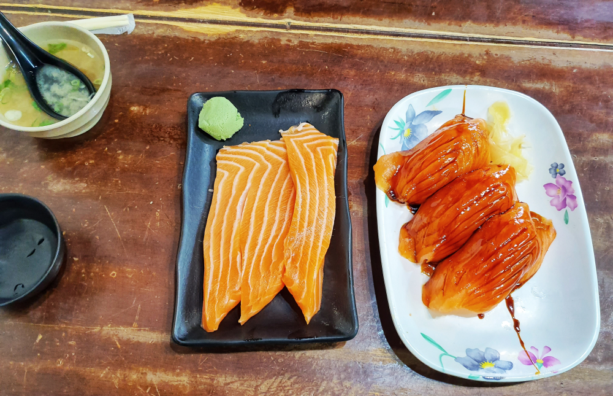

대만여행을 준비하면서 가장 기대했던 곳입니다. 제가 좋아하는 사람이 연어를 많이 좋아하기 때문에 한번쯤은 꼭 방문해보기로 했던 곳입니다.  
원래는 월요일에 방문하려고 했으나 불행히도 **월요일과 화요일은 휴무일**이라 수요일에 방문하게 되었습니다. 

## 대표 메뉴와 가격(가성비)  
대표메뉴는 **대왕연어초밥**입니다. 또한 연어배살도 대표메뉴라 할 수있습니다.  

  
연어초밥..
**3ps는 190대만달러(7,400원)**, 
**6ps는 360대만달러(14,000원)** 입니다. 

연어뱃살은..
**3ps는 250대만달러(9,700원)**,
**6ps는 430대만달러(16,700원)** 입니다. 
두부튀김 **90대만달러(3500원)** 입니다. 

## 먹어본 음식  
  
저희는 3가지 모두 먹어봤습니다. 연어초밥은 크다크다 들었지만 정말 생각보다 크기가 많이 큽니다. 보통 먹성의 사람도 3ps면 충분한 양입니다. 연어뱃살은 정말 뱃살만 있습니다. 뱃살에 간장이나 와사비만 찍어서 먹도록 되어 있습니다. 

   
처음 초밥하나를 집어서 먹을 때는 정말 맛이 있습니다. 두번째는 그 감동이 좀 떨어지구요. 3번째를 먹을 때는 겨우 다먹었네.. 이런 생각이 듭니다. 초밥 위에 뿌려있는 소스가 맛이 있습니다. 이 소스 때문에 3개를 모두 먹을 수 있었습니다. 

  
연어뱃살도 크기가 정말 큽니다. 자르지 않고 그냥 먹을 때는 꼭 내가 원시인이 된듯한 느낌이 듭니다.
연어뱃살도 처음 하나를 먹을때는 맛이 정말 좋은데, 두번째는 살짝 질리기 시작합니다. 
연어를 좋아하는 집사람도 여행중 이 식당은 한번만 갔습니다. 그정도면 충분한 것 같았습니다. 

  
두부튀김은 튀긴 두부를 소스 국물에 담궈서 줍니다. 약간 맛이 짜지만 그런데로 먹을만 합니다. **진천미**에서 먹어본 튀김두부와는 많이 다릅니다. 

## 식당운영시스템  
인터넷에서 유명해서 그런지 대기시간이 긴것은 어쩔 수 없다는 전제입니다. 1시간정도 기다려야 하닌까요 다만 기다리는 사람이 어느정도 예측할 수 있게 대기시간과 대기노트를 구비해 놓고 있으며 입장의 순서를 전담하는 직원이 별도로 배정이 되어 있어서 시스템 자체는 잘되 있다고 볼 수 있습니다.  

<b>운영시스템 : </b> ★★★★☆ 

## 청결도  
청결도는 매우 깨끗하다고는 할 수 없습니다. 어느정도 정리된 노포같습니다. 그렇다고 더럽지도 않구요. 보통입니다. 

<b>청결도 : </b> ★★★☆☆ 

## 식당과 주차 정보  
- 주소 : No. 116號, Section 2, Guiyang St, Wanhua District, Taipei City, 대만 108
- 연락처 : +886 2 2389 2211
- 영업시간(휴무일) : 11:00~14:00, (중간브레이크타임), 17:00~21:00 (**월요일, 화요일은 휴뮤**)
- 주차 : 없어요
[지도] https://goo.gl/maps/PdA6mCa4QgDGaNaJ9 

