강화도 대표 맛집 중 하나로 인터넷을 뜨겁게 달궜었던 편가네 된장 집을 방문해 봤습니다. 2018년도에 TV에 방영이 되면서 크게 붐을 일으겼었는데 지금은 TV 빨이 많이 빠졌는지 제가 갔을 때는 그렇게 붐비지는 않았습니다.  

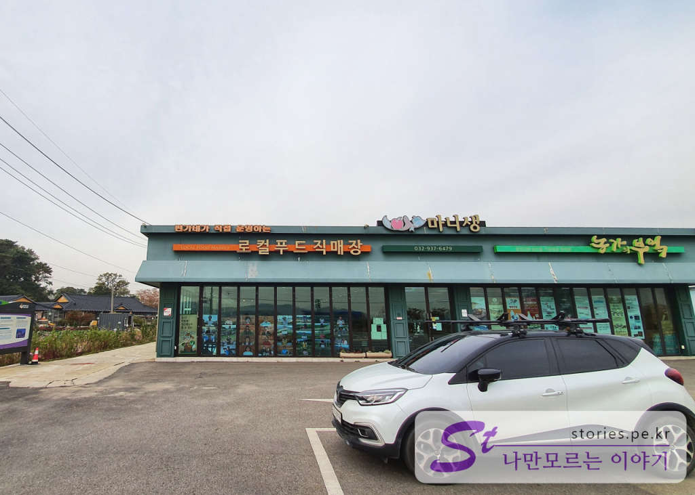

네비의 안내를 받아 편가네된장집을 찾아가면 눈에 먼저 들어오는 것이 **마니생 로컬푸드직매장**과 **농가의 부엌**입니다. 이 매장도 편가네에서 운영하는 곳이라 그 앞의 주차장에 주차를 하고 들어가면 됩니다.  

> **마니생 로컬푸드직매장**은 강화군의 농수산물을 비롯해 이를 활용해 만든 각종 식품 등의 특산품을 판매하는 곳이다.
이 곳에서 가장 주목할 점은 바로 상품의 생산자가 해당 상품의 디스플레이를 직접한다는 것이다.
마니생 로컬푸드직매장은 강화군의 농민과 각 지역의 소비자를 연결하는 역할을 하고 있다.
강화섬쌀, 강화약쑥, 강화속노랑고구마 등을 비롯한 강화에서 수확한 각종 농산물부터 이들의 장점을 잘 살려서 만든 가공식품, 건강식품 등이 개성있고 가지런하게 진열돼 있어 구매욕을 자극한다.
무엇보다도 강화 농민들의 숨결을 느낄 수 있고, 믿고 구매할 수 있다는 점이 가장 매력적이다.  
  _[인천투어 참조](https://itour.incheon.go.kr/)_

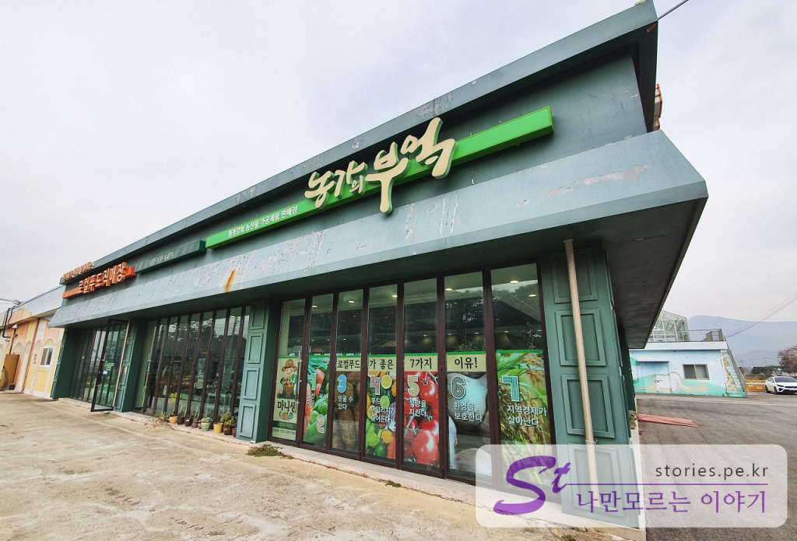
로컬푸드직매장을 끼고 옆길로 걸어 들어 갑니다.   

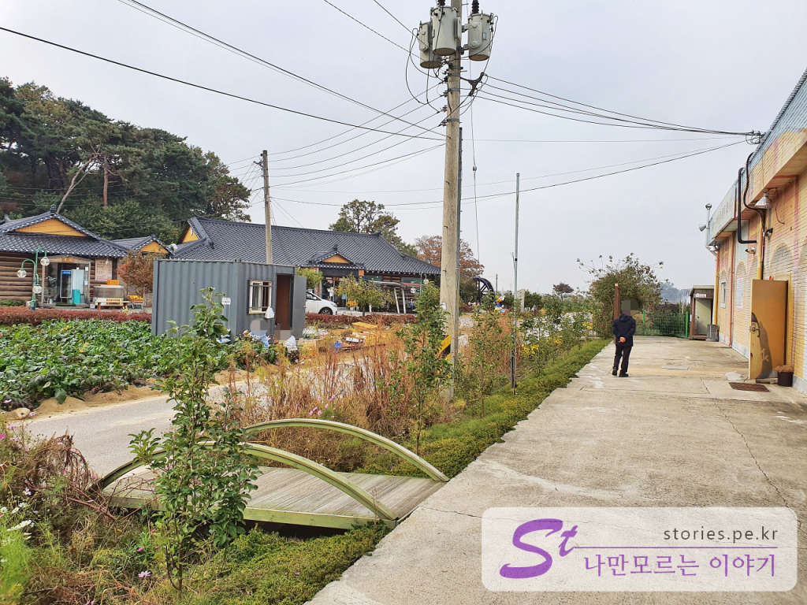  
직매장 바로 옆에는 한적하고 정감어린 시골길이 보입니다. 이 길의 대각선 너머에 **편가네된장식당**이 있습니다.  

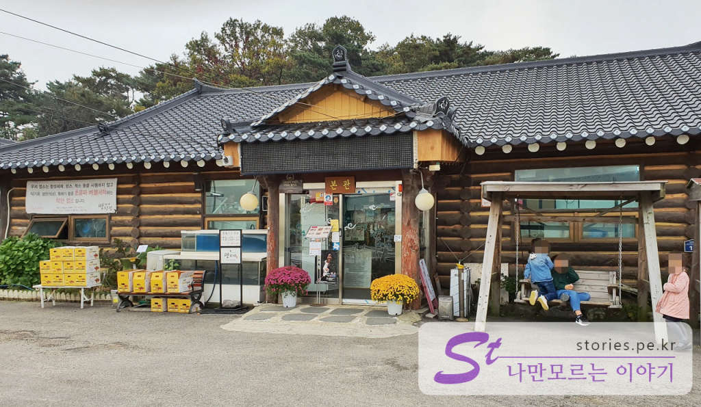
처음 만나는 곳은 편가네된장식당의 본관을 보게 됩니다. 편가네 된장은 본관과 별관으로 운영되고 있고 건물과 내부 인테리어는 통나무집을 컨셉으로 구성되어 있습니다.   

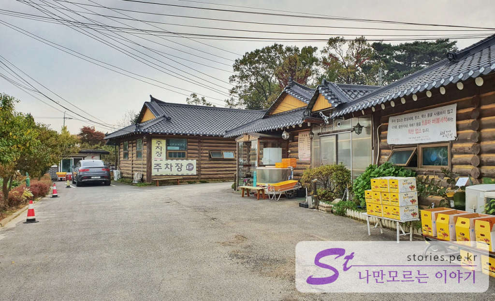
본관을 지나면 별관과 주차장이 있으며 우리는 본관에서 식사를 하였습니다.  

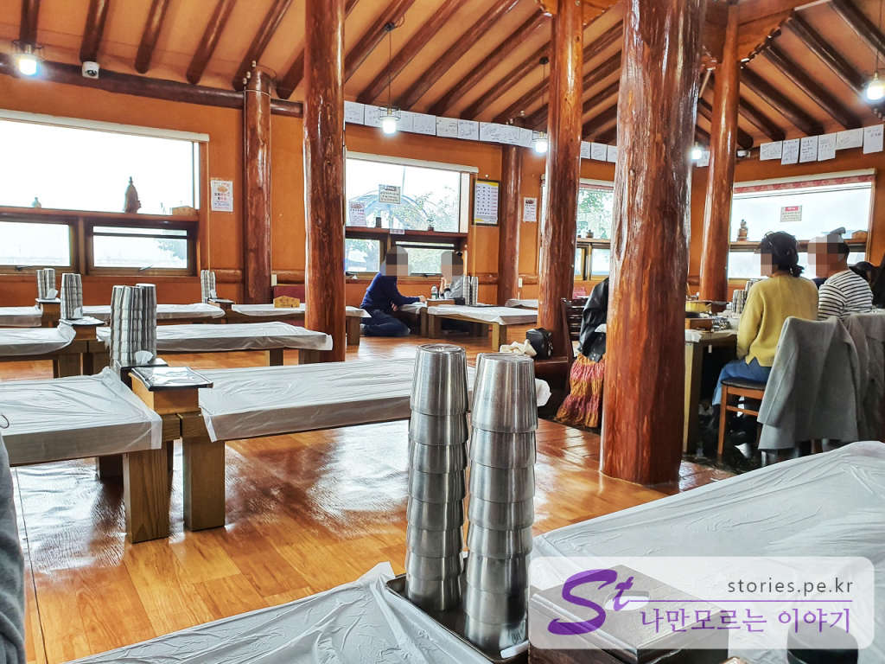  
  
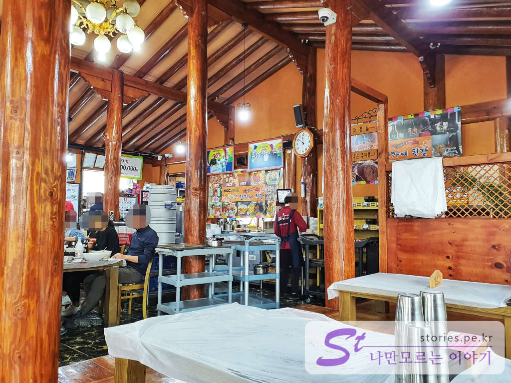  
식당 내부의 인테리어도 통나무로 되어 있어서 어린시절 할머니가 끓여주던 된장의 추억이 새록새록 납니다.  

## 대표 메뉴와 가격(가성비)  

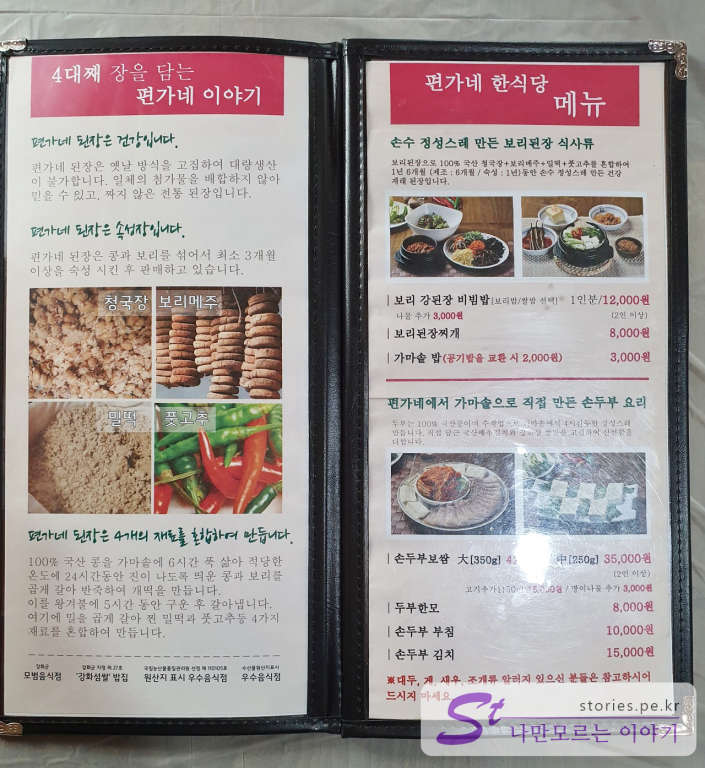  
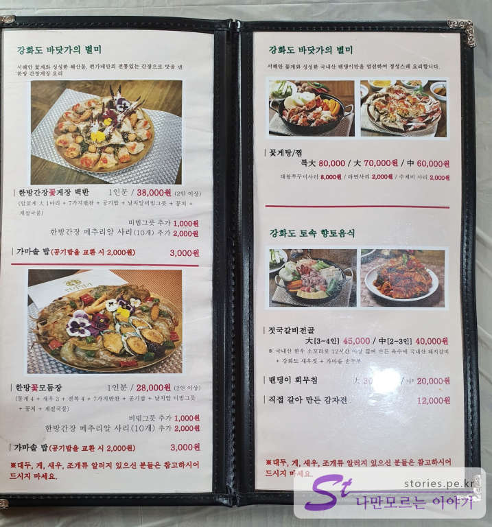  

편가네된장의 **대표 메뉴**는 된장이어야 할것 같지만 예상외로 **꽃게장**입니다. 많은 사람들이 꽃게장을 먹으러 많이 온다고 합니다. 그래도 된장집인데.. 또하나의 대표메뉴는 **보리 강된장 비빕밥**입니다. 

## 먹어본 음식  

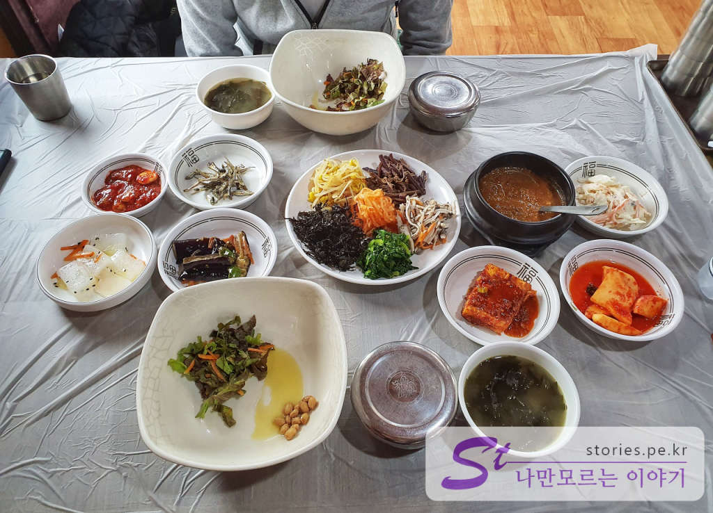  
저희는 꽃게장을 좋아하지 않아서 **보리 강된장 비빔밥**을 먹었습니다. 큰 그릇과 8개의 밑반찬 나물모둠과 된장국이 나오고 물은 500원짜리 생수를 주며 추가로 시킬때만 비용을 지불해야 합니다.  

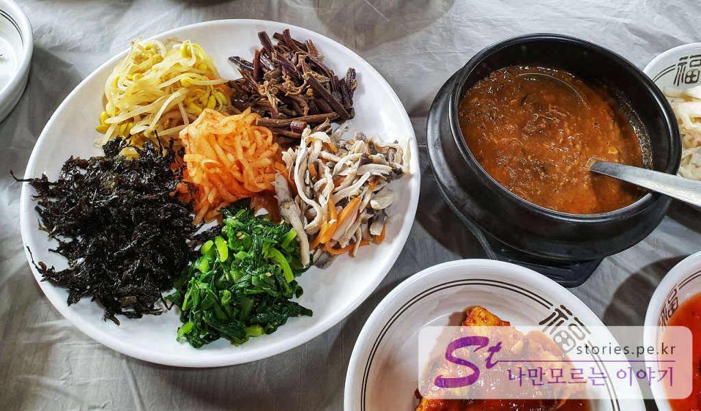   
2인분의 나물은 많지도 적지도 않게 적당합니다. 강된장도 적당히 맛있습니다.  

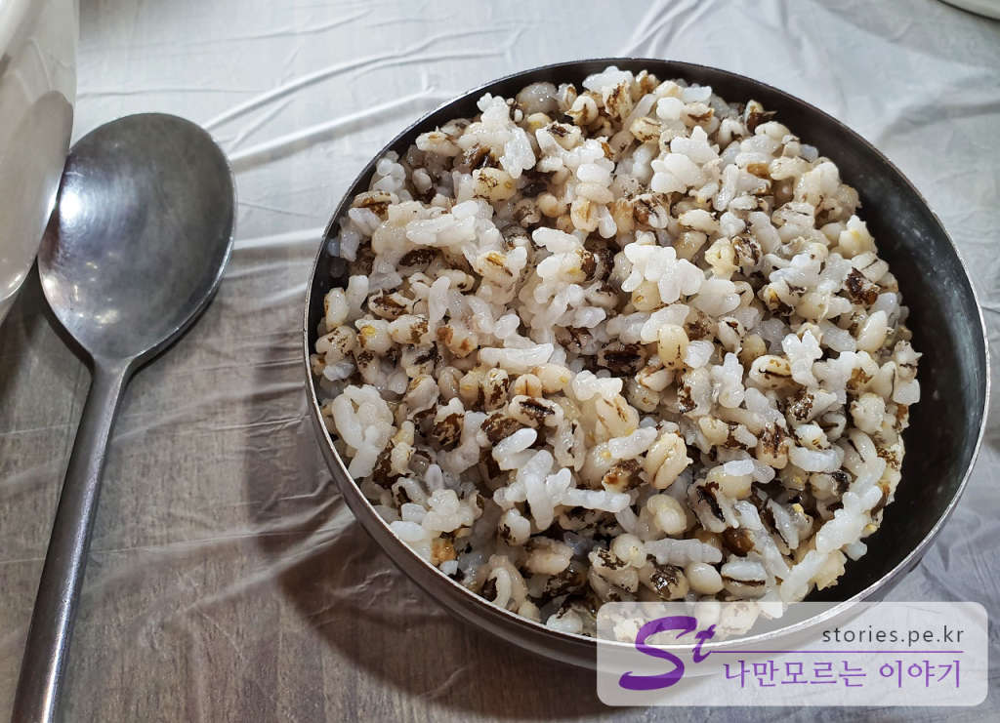  
밥은 보리밥입니다. 건강스럽게 보이네요.  

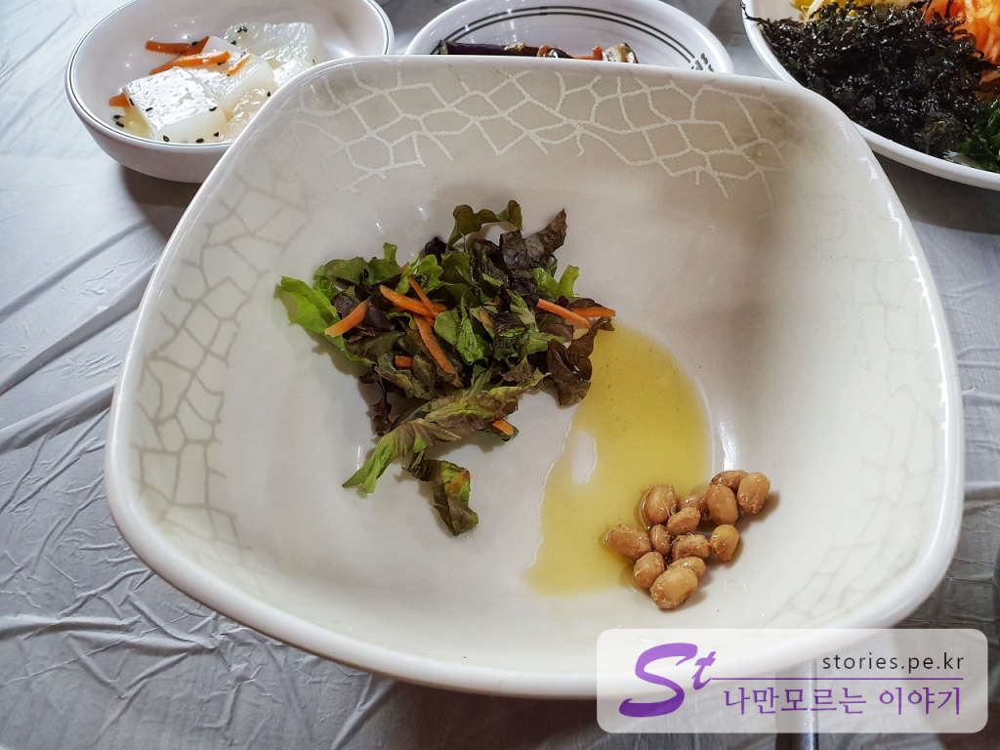  
보리밥을 나물과 비빌수있는 커다란 그릇에 참기름 상추, 발효된 콩을 조금 넣어 줍니다.  

## 식당운영시스템  
식당의 운영은 붐비는 것을 보지 못해 정확히는 알 수 없으나 어느정도 체계는 있는 것 같았습니다. 젊은 직원도 많고 주문 후 내온 음식과 남은 음식을 처리하는 절차도 자연스러웠습니다. 

<b>운영시스템 : </b> ★★★★☆ 

## 청결도  
식당 자체가 시골에 있는지라 완전히 청결한 환경은 아닙니다. 어느정도는 감안해야 하며 그렇다고 지저분하지도 않습니다. 보통의 청결도입니다. 

<b>청결도 : </b> ★★★☆☆

## 친절도  
친절도도 보통입니다. 

<b>친절도 : </b> ★★★☆☆ 

## 식당과 주차 정보  
- 홈페이지 : http://www.pyungane.com/  
- 주소 : 인천광역시 강화군 화도면 가능포로89번길 11  
- 연락처 : 032-937-6479
- 영업시간(휴무일) : 오전 10:00~오후 8:00 (수요일 휴무)
- 주차 : 주차장 넒음

    <iframe src='https://www.google.com/maps/embed?pb=!1m18!1m12!1m3!1d2233.9938914808336!2d126.4187298222114!3d37.64110505815252!2m3!1f0!2f0!3f0!3m2!1i1024!2i768!4f13.1!3m3!1m2!1s0x357b8819787144b5%3A0xa6977e63750e9530!2z7Y646rCA64SkIOuQnOyepQ!5e0!3m2!1sko!2skr!4v1581785754885!5m2!1sko!2skr' class='embed-responsive-item' allowfullscreen></iframe>

