가끔씩 매운 음식이 먹고 싶을 때가 있는데 그럴 때 추천할 만한 맛집이 있습니다. 가격은 한끼 먹기에는 약간 부담스러울 수 있지만 가끔 별식으로 먹기에는 좋습니다.  

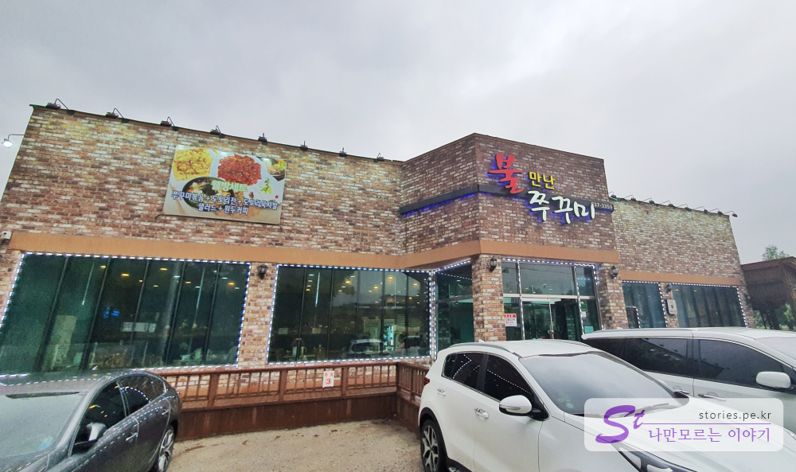   
의정부 녹양역 근처에 있어서 1호선 전철을 타면 쉽게 찾아갈 수 있는 곳입니다. 이름에서도 알 수 있듯이 불 향을 입힌 매운 쭈꾸기가 이 집의 주요 메뉴입니다.  

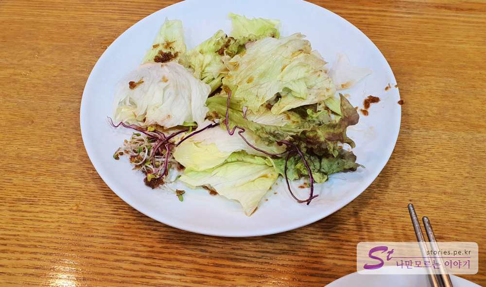   
**세트메뉴**를 시키면 음식이 나오기 전에 먼저 에피타이져가 나옵니다. 양상치와 새싹 샐러드에 발사믹 소스를 뿌려서 나오는데 에피타이저로 딱 적당합니다.  

주 메뉴는 웰빙세트와 퓨전세트가 있는데 웰빙세트는 도토리전이, 퓨전세트는 고르곤졸라 피자가 나옵니다. 

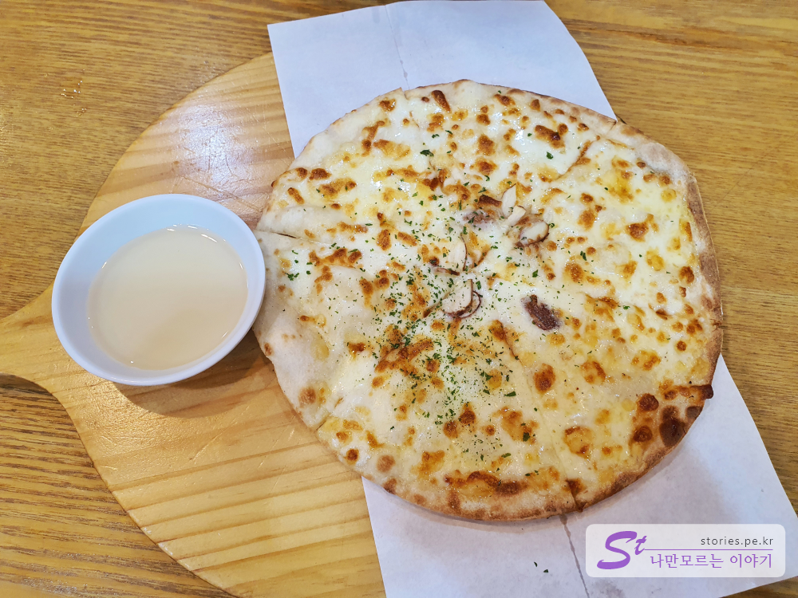  
우리는 퓨전세트를 시켰기 때문에 고르곤졸라 피자가 나왔습니다. 노릇노릇 잘 구워진  피자를 달콤한 허니소스에 찍어 먹으면 그러게 맛있습니다. 

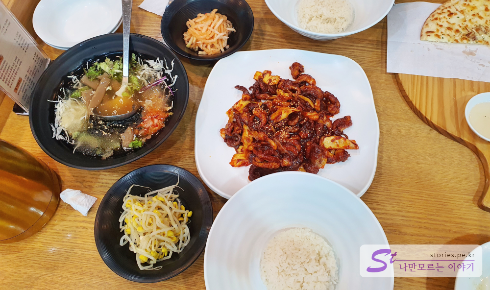  
드디어 세트메뉴가 나왔습니다. 매운 입을 식힐 때 딱 좋은 **묵사발**과 쭈꾸미를 비빌 때 같이 비비면 맛있는 무생채와 콩나물이 같이 나옵니다. 그리고 매인 요리인 불향이 듬뿍 묻어있는 쭈꾸미 볶음이 나옵니다. 밥은 비벼 먹기에 좋게 큰 사발에 담아서 나옵니다. 

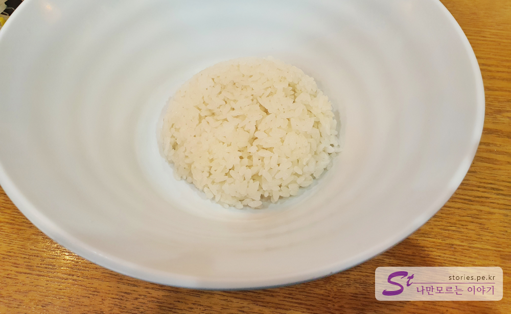  
밥은 특별할 것 없는 흰 쌀밥입니다. 아쉬운 것이 있다면 밥짓는 방법에 좀더 신경을 써 주면 더 좋을 듯 합니다.   

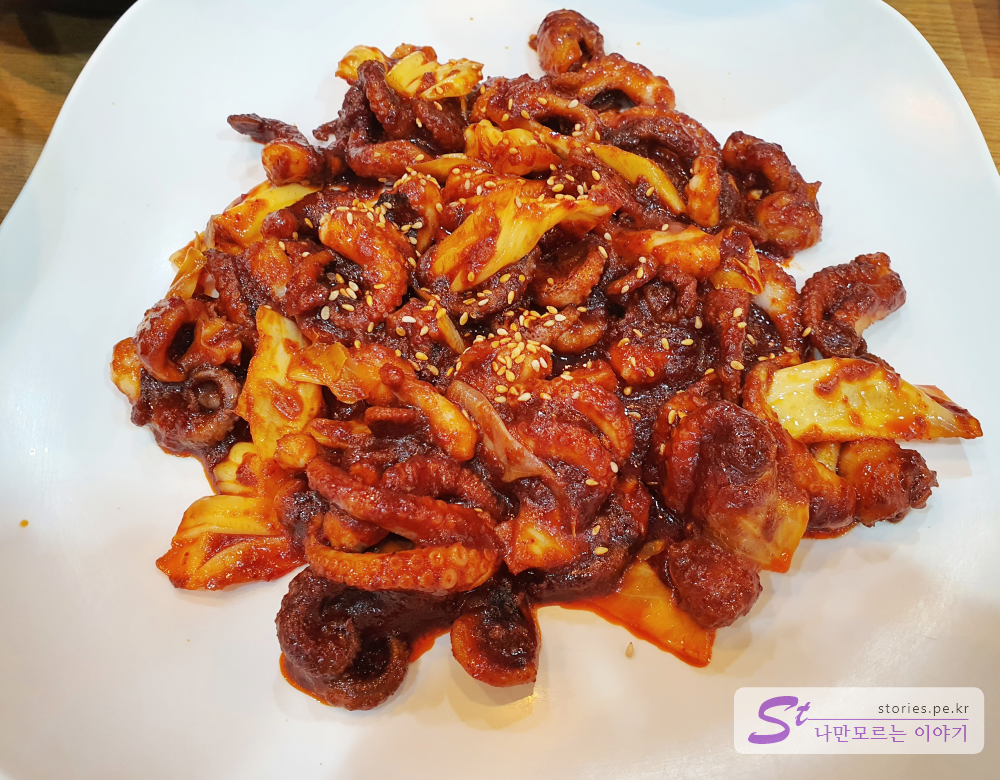   
매인 요리인 쭈꾸미볶음입니다. 불향이 입혀져 있어서 매운음식을 좋아한다면 마음에 드실것입니다. 주문할때 매운 맛과 덜매운 맛을 주문할 수 있습니다. 저희는 항상 덜 메운 맛을 주문합니다.  

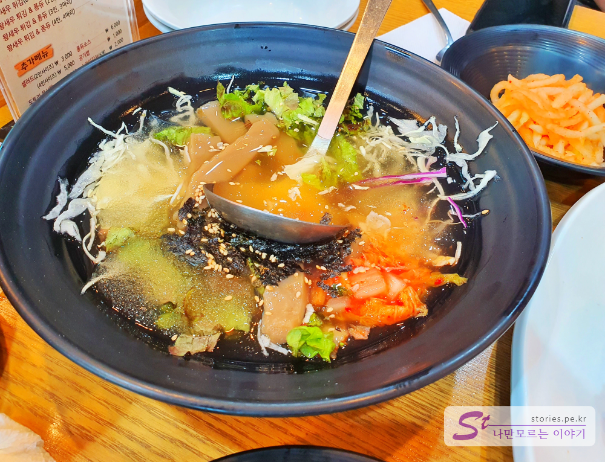  
세트메뉴에 나오는 시원한 묵사발입니다. 겨울에는 온국수로 바뀌어서 나오는데 저희는 온국수는 먹지 않습니다. 그냥 시원한 묵사발이 최고 입니다.  

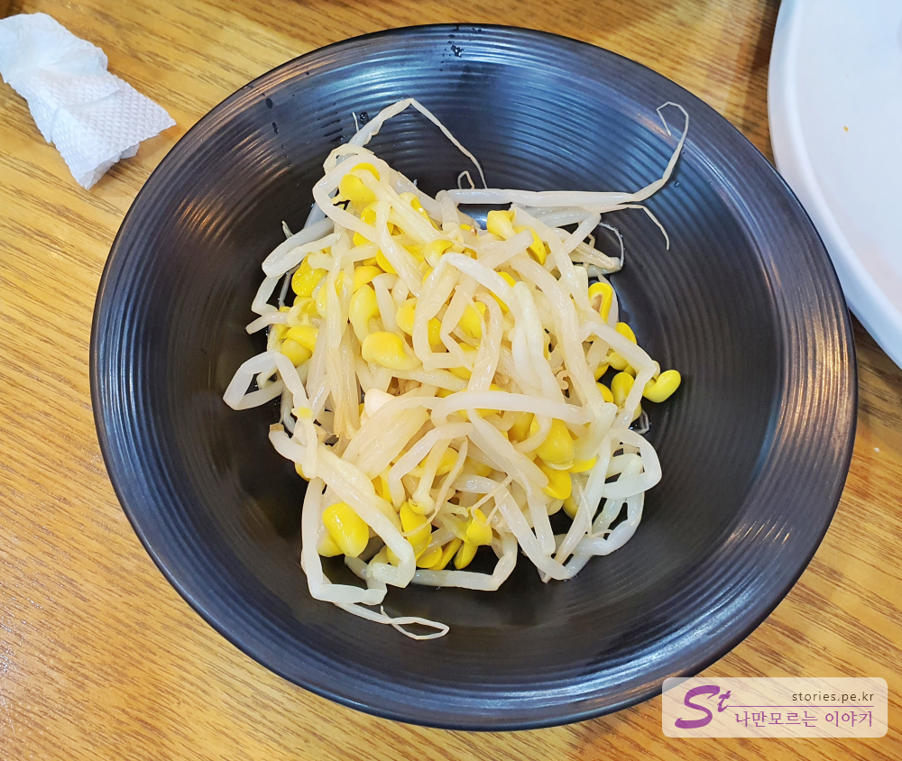  
매운 음식에는 빠지지 않는 것이 콩나물입니다. 매운 쭈꾸미가 있기 때문에 콩나물은 그냥 밍밍합니다. 매운 쭈꾸미와 곁들여 먹어야 딱 조화가 이루어 집니다. 

## 대표 메뉴와 가격(가성비)  
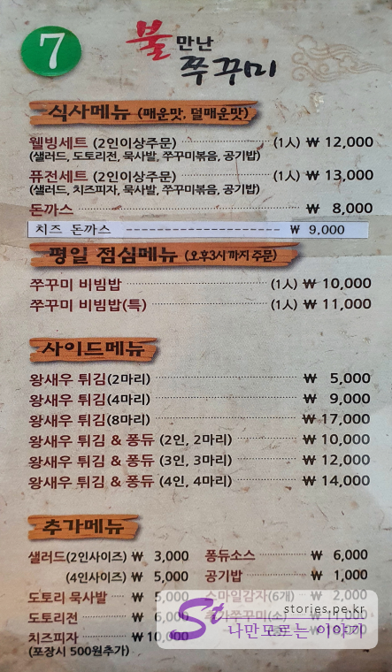   
대표메뉴는 웰빙세트와 퓨전세트입니다. **평일점심메뉴가 10,000원**인데 세트 메뉴가 12,000원이면 세트메뉴를 먹는것이 좀더 낫습니다.  
세트메뉴는 `샐러드`, `묵사발`, `쭈꾸미볶음`, `공기밥`이 나오고 세트종류에 따라 `도토리전`이나 `치즈피자`가 나옵니다.   
또한 추천 할 만한 사이드 메뉴는 **왕새우 튀김**입니다. 공갈새우가 아니고 정말 크고 속이 꽉찬 새우를 사용합니다. 크기를 봐서는 아무래도 타이거새우가 아닐까 추측해 봅니다. 

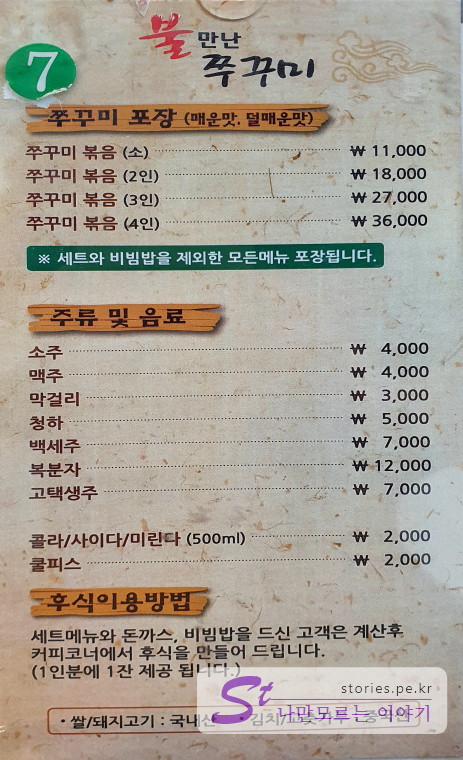
포장도 가능합니다. 

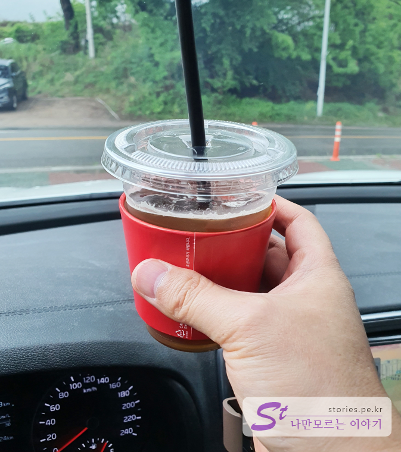  

세트메뉴를 먹고나면 세트메뉴 1인당 커피나 아이스티를 한잔 줍니다. 들고 나와도 되고 식당 옆에 있는 공간에서 커피를 마시며 담소를 나눌 수도 있습니다.  

## 청결도  
식당의 청결도는 보통 정도 입니다. 다만 식당 문밖에서 하수구 냄새가 좀 나서 눈살이 좀 찌푸려집니다. 

<b>청결도 : </b> ★★★☆☆ 

## 친절도  
친절도도 보통의 수준입니다. 불친절하지도, 그렇다고 친절하지도 않습니다. 

<b>친절도 : </b> ★★★☆☆ 

## 식당과 주차 정보  
- 주소 : 경기 의정부시 산성로 11  
- 연락처 : 031-837-3359  
- 영업시간(휴무일) : 11:00 ~ 22:00
- 주차 : 주차는 식당 앞에 7~8대, 식당 길 건너편에 5~7대 정도 주차할 수 있습니다. 
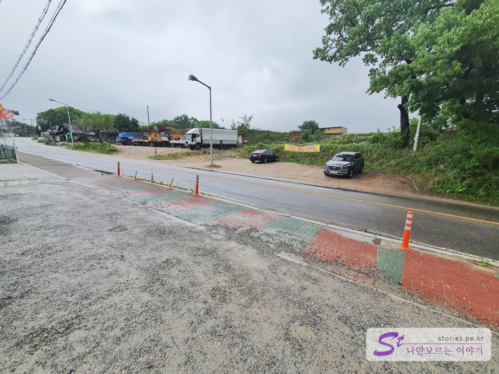  

    <iframe src='https://www.google.com/maps/embed?pb=!1m18!1m12!1m3!1d3154.0573696693705!2d127.04043341517398!3d37.76525297976116!2m3!1f0!2f0!3f0!3m2!1i1024!2i768!4f13.1!3m3!1m2!1s0x357cc74042f1ba67%3A0x55b79009350ac8e8!2z67aI66eM64Kc7K2I6r6466-4!5e0!3m2!1sko!2skr!4v1589722640470!5m2!1sko!2skr' class='embed-responsive-item' allowfullscreen></iframe>

