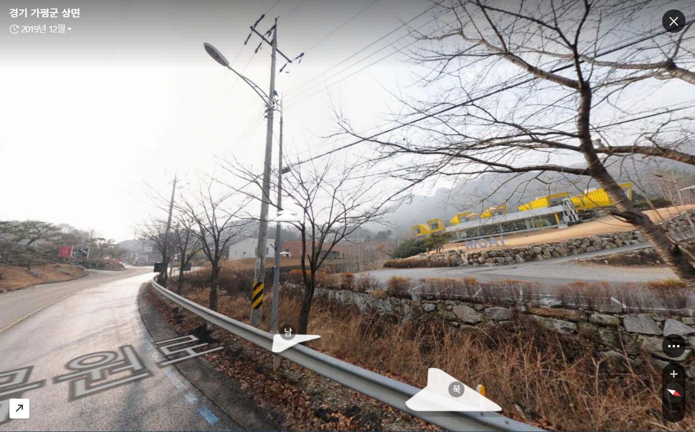
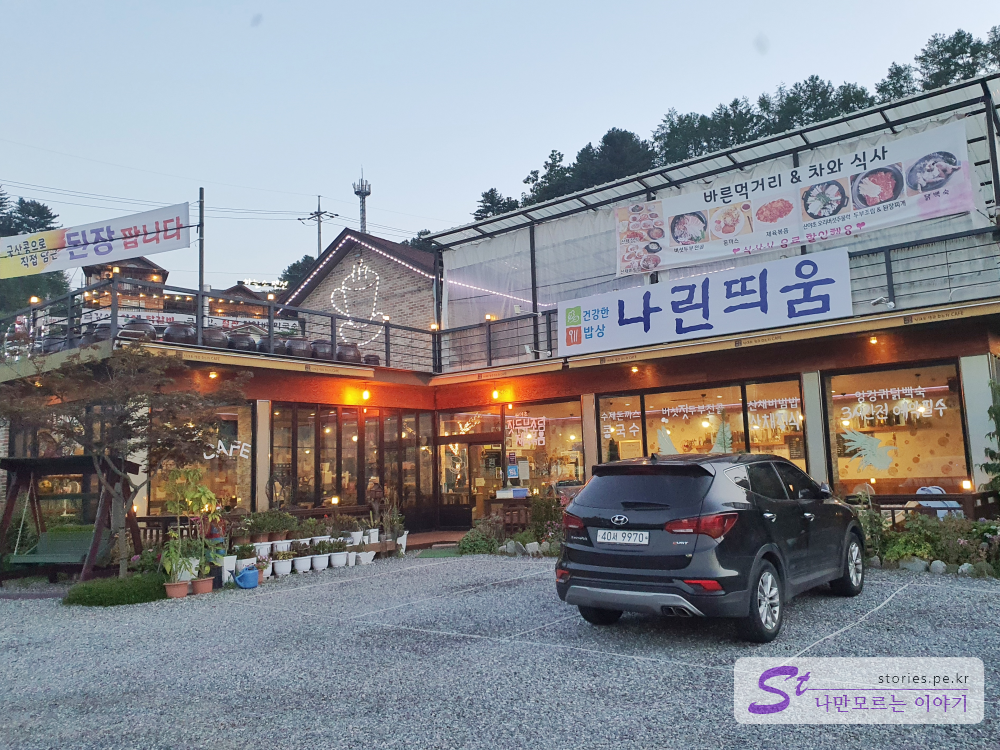

**아침고요수목원**으로 넘어가는 길에 있는 수 많은 식당과 카페 중에 **건강함**을 컨셉으로 운영을 하고 있는 **나린띄움** 식당에 방문했습니다. 입구에서 부터 건강함이 눈에 보이는 주차장 마당에 들어서면 항아리와 사진들이 걸려있습니다. **모아이 카페&팬션**을 지나 300m정도 더 올라가면 만날 수 있습니다.  

   

산야초를 발효하여 식재료에 사용하여 맛을 낸 음식들을 판매 하고 있습니다. 

주차장 마당에 들어서면 저 멀리 풍경이 한몫합니다. 너무 멋진 풍경을 가지고 있습니다. 

입구에 나릔띄움이라는 간판이 보이네요. 발효효소로 맛을 낸 바른 먹거리라는 간판이 보이네요. 직접 담은 된장도 판다고 하네요.  

음식을 시키러 식당에 들어 서면 넓다란 창문으로 밖의 풍경을 보며 식사를 할 수 있습니다. 바로 넓은 풍경을 볼 수 있었으면 더 좋았겠지만 아쉽게도 주차장 마당을 지나 밖을 보는 거라 조금 아쉬운점은 있습니다. 

우리가 시킨음식은 제육볶음과 두부조림을 시켰습니다. 따라오는 반찬들도 발효효소로 맛을 낸 음식들입니다.

제육볶음도 상당히 맛이있었습니다.   

먹는데 정신이 팔려서 두부조림은 한번씩 덜어간 다음에 부랴부랴 찍었습니다. 아쉽네요.

밥을 배부르게 먹고 아이스아메리카노를 들고 주차장 마당쪽으로 나와 봤습니다. 그 뒷쪽에 산야초 발효실이 따로 있었습니다. 주차장 뒷쪽으로 있어 눈에 잘 띄지는 않네요.

사장님께 허락을 받고 살짝 안을 봤습니다. 발효중인 수 많은 항아리들이 있었습니다. 여기서 발효를 한다고 하네요.   

발효실 앞쪽에는 정자가 하나 있는데 식사를 하고 커피를 마시기에 정말 좋게 되어 있습니다.  

## 대표 메뉴와 가격(가성비)    
  
매뉴는 산채비빔밥, 제육볶음, 버섯두부전골, 수제돈가스, 두부조림이 있네요. 저희는 제육볶음과 두부전골을 시켜서 먹었습니다. 가격대비 만족한 맛이였습니다. 

음료도 같이 팔고 있습니다. 커피도 팔고 있고 발효효소로 담은 다양한 음료도 판매하고 있습니다.  음료 주문표는 찍지 못했네요. 

## 식당운영시스템   
저희가 갔을때는 사람이 많을 시간대가 아니라서 어렵지 않게 주문을 했습니다. 

<b>운영시스템 : </b> ★★★★☆ 

## 청결도  
청결도는 중간정도 되는것 같았습니다. 

<b>청결도 : </b> ★★★★☆ 

 
## 식당과 주차 정보  
- 주소 : 경기 가평군 상면 수목원로 236  
- 연락처 : 031-585-7288
- 영업시간(휴무일) : 07:00 ~ 19:00
- 주차 : 10대정도 주차 할 수 있는 공간이 있습니다. 

    <iframe src='https://www.google.com/maps/embed?pb=!1m18!1m12!1m3!1d3154.3869998929054!2d127.35822481517374!3d37.75752297976268!2m3!1f0!2f0!3f0!3m2!1i1024!2i768!4f13.1!3m3!1m2!1s0x35632d92a758d2fd%3A0x5b27b7f1a3a232d1!2z64KY66aw652E7JuA!5e0!3m2!1sko!2skr!4v1595343064987!5m2!1sko!2skr' class='embed-responsive-item' allowfullscreen></iframe>

