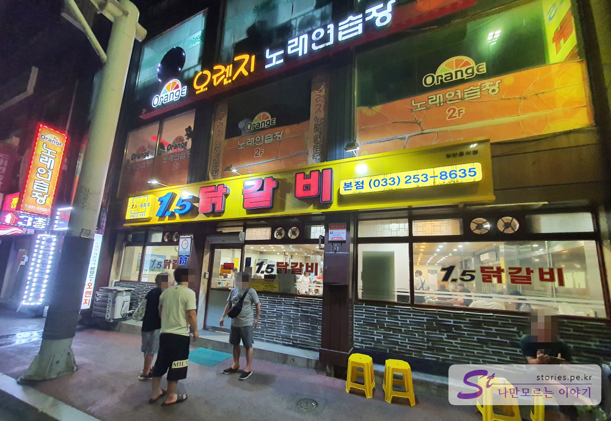

저희 가족이 동해나 강원도쪽으로 휴가를 갔을 때 주로 휴가의 마무리를 하는 곳이 일점오 닭갈비 입니다. 이번에는 코로나19로 인해 멀리 휴가는 못가고 휴가의 기분을 내기 위해 춘천 후평동에 있는 **일점오 닭갈비** 집을 다녀왔습니다. 

    

위의 사진은 먹고 나와서 찍은 사진이라 기다리는 사람이 별로 없는데 도착했을 때는 토요일 저녁 8시쯤이라 거의 30분정도 대기하고 입장을 했습니다. 

  
자리에 착석을 하고 주문을 했습니다. 지금 보이는 양이 4인분으로 다른 지역의 닭갈비집보다 양이 푸짐합니다. 주문을 하면 직원분들이 알아서 잘라주고 구워주기 떄문에 자리에 앉아만 있으면 됩니다. 다만 조심해야 할 사항은 연륜없는 직원분이 자를 때 양념들이 여기저기 막 튀어서 몸에 묻고 옷에 묻기 때문에 좀 멀리 떨어져 앉아야 합니다. 

  
반찬으로는 닭갈비와 같이 먹을 수 있는 물김치와 상추, 마늘, 양파, 고추장이 있습니다. 간단하지만 먹기에 알찬 구성입니다.  

  
맛있게 익어가는 모습을 지켜만 보고 있으면 됩니다.  

  
직원분들이 왔다갔다 하시면서 섞어주고 뒤집어 주면서 구워주시니 손 댈 필요가 없습니다. 어느정도 익었다 싶으면 직원분이 **떡하고 야채 먼저 드세요~** 라고 말씀해 주시면 떡과 야채만 골라 먹고 있으면 됩니다. 그러는 사이 좀 더 익었을 때 직원분이 **이제 드셔도 됩니다~** 하면 닭갈비를 맛있게 먹으면 됩니다. 

  
알차게 다 먹고 나서 직원분에게 **여기요~ 밥 볶아 주세요~** 라고 말하면 밥을 볶기전 사전작업을 해 주십니다.  

  
남자 직원분이 오셔서 칼날로 눌러붙은 탄 찌꺼기를 제거해 주십니다. 이것을 보고 있으면 상당히 힐링이 됩니다. 너무 속이 시원하거든요. 찌꺼기 제거 작업을 보면서 이 아르바이트 직원분의 경력이 얼마나 되는지 예상을 합니다.  ㅎㅎ  

  
눌러붙은 찌꺼기가 제거된 모습입니다. 이제 밥을 볶을 준비가 된 상태이기도 합니다.  

  
저희는 2인분을 주문했습니다. 똑같이 직원분이 알아서 다 볶아 주십니다.  

  
먹음직 스럽게 잘 볶아 졌습니다. 이제 먹기만 하면 됩니다.   

## 대표 메뉴와 가격(가성비)  
  
모든 재료가 국내산이네요. 실제로는 어떨지 모르겠지만 자신있게 써붙혔으니 국내산이라고 믿어야 겠죠. 그 정도로 돈을 쓸어모으면 국내산 정도는 써줘야 하겠지요.

  
닭갈비가 1인분에 **12,000원**입니다. 예전에 비해 많이 오르긴 했습니다. 그만 좀 올렸으면 좋겠네요.  

  
카드전표를 참고로 붙혀 봅니다. 닭갈비 4인분과 볶음밥 2인분, 우동사리 1개 해서 **54,000원**이 나왔네요. 

## 식당운영시스템  
식당의 운영은 상당히 잘 하고 있습니다. 사람이 많이 몰리는데도 직원분들 많고 능숙하게 대처를 하고 있습니다. 
다만 휴일이나 주말, 휴가철등에는 웨이팅이 좀 긴 편입니다. **도착하면 먼저 카운터로 가서 번호표를 받고 주변에서 대기**를 해야 합니다. 

<b>운영시스템 : </b> ★★★★☆ 

## 청결도  
오래된 맛집이라서 그런지 매우 청결하다고 할 수는 없지만 일반 식당처럼 보통은 하는것 같습니다. 

<b>청결도 : </b> ★★★☆☆ 

## 친절도  
친절한 편입니다. 불편한 점은 없습니다. 다만 아르바이트를 하는 학생이나 이모님이 좀 표정이 없습니다. 그정도는 이해해 줘야지요. ㅎ

<b>친절도 : </b> ★★★☆☆ 

## 식당과 주차 정보  
- 주소 : 강원 춘천시 후만로 77  
- 연락처 : 033-253-8635
- 영업시간(휴무일) : 11:00 ~ 22:00(일요일은 21시까지 주문을 받습니다.)
- 주차 : 주차장은 따로 없습니다. 주변에 주차를 하든지 휴일이나 평일 퇴근 후에 후평3동 주민센터 빈자리에 하시면됩니다. 

    <iframe src='https://www.google.com/maps/embed?pb=!1m18!1m12!1m3!1d1497.071666105233!2d127.75308333329235!3d37.87649184638812!2m3!1f0!2f0!3f0!3m2!1i1024!2i768!4f13.1!3m3!1m2!1s0x3562e5bd788926c3%3A0x853f64306094e02c!2zMS41IOuLreqwiOu5hA!5e0!3m2!1sko!2skr!4v1597888325489!5m2!1sko!2skr' class='embed-responsive-item' allowfullscreen></iframe>

 
