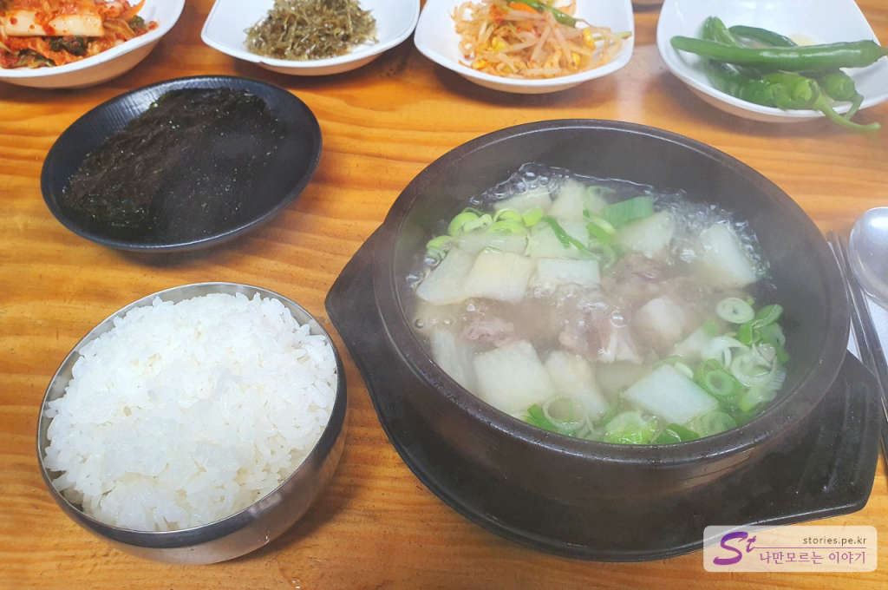

> [[군산여행] 군산 근대 문화유산 거리에서 선유도 대장봉까지](https://blog.stories.pe.kr/479)

당일치기 군산여행의 아침겸 점심으로 먹었던 한일옥입니다. 

> [[군산여행] 군산 근대 문화유산 거리에서 선유도 대장봉까지](https://stories.tistory.com/479)

  

군산의 대표적 관광 스팟인 **초원사진관** 바로 앞에 있어서 찾기도 쉽고 먹기도 쉽게 되어 있습니다. 

  
먼저 도착을 하면 **초원사진관으로 가지말고** 무슨 맥락인지 모를 태극기와 천하대장군, 지하여장군이 있는 입구를 지나 무조건 **한일옥 카운터**로 가야 합니다. 접수를 하면 진동벨을 주고 2층으로 올라가라고 합니다. 그 때 초원사진관을 구경합니다. 진동벨이 초원사진관까지 울리지 않을 수도 있으니 대략 구경하고 사진도 찍고 다시 카운터로 가서 내 대기번호가 지났는지 확인 후 아직도 대기중이라고 하면 2층 대기 장소로 이동을 합니다. 

  
한일옥이 예전의 병원부지를 구매해서 식당으로 개조를 했다고 합니다. 2층에는 대기장소로 사용되고 있으며 목조형태로 구성되어 있고 여러가지 옛날 물건들이 있어서 구경할 것들이 여러가지가 있습니다. 

  
옛날 물건들이 많이 있네요. 의자와 에어컨도 있어서 쉬기에 좋게 되어 있습니다. 

진동벨이 울리면 다시 1층 카운터로 가면 자리를 배정해 줍니다. 그리고 **자리에 앉으시고 불러주세요**라고 말합니다. 이 의미를 꼭 기억해야 합니다. 자리에 앉아 있다고 해서 주문을 받으로 오거나 자동으로 소고기무국을 서빙하지 않습니다. 저희도 멍청히 20분정도 이야기 하며 앉아 있으니 옆 테이블의 아저씨가 안쓰러웠는지 주문을 별도로 하셔야 한다고 말씀해 주셨습니다. 그분도 그랬다가 지금 먹는거라고.... ㅠㅠ
**꼭 식탁에 앉은 다음에 직원을 불러서 확실하게 주문을 해야 합니다.** 그렇지 않으면 나중에 들어온 사람이 먼저 먹고 나가는 속쓰린 장면을 봐야 합니다. 

## 대표 메뉴와 가격(가성비)   

한일옥은 소고기무국과 육회비빔밥이 유명하다고 하는데 저희는 모두 소고기무국으로 통일해서 먹어봤습니다. 

  
우여곡절 끝에 주문을 해서 밑반찬이 나왔습니다. 역시 전라도는 전라도 입니다.  깍두기, 김치, 멸치, 콩나물, 조미김이 나오는데 모두 맛이 있습니다.  

  
드디어 기다리던 소고기 무국이 나옵니다. 맑은 국물에 무와 소고기가 있습니다. 맛도 시원하고 너무 좋습니다. 정말 맛있게 먹고 나왔습니다. 

  
무우국이 9000원입니다. 싼 가격은 아니지만 맛있게 먹었으므로 금액이 아깝다는 생각은 들지 않았습니다.  
**육회비빔밥은 평일 낮 12시부터에만 주문**을 받는다고하니 육회비빔밥을 좋아한들 먹을 수 없는 메뉴였습니다.  

## 식당운영시스템  
처음 방문한 사람에게는 다소 낮선 운영시스템을 가지고 있습니다. 대기까지는 좋았으나 자리에 앉은 다음에 직원이 주문을 받으러 온다던가 자동으로 주문이 된다던가 하는것이 없습니다. 직원을 따로 불러서 주문을 해야 합니다. 개선해야할 점이라고 생각이 됩니다.  

<b>운영시스템 : </b> ★★☆☆☆ 

## 청결도  
청결도는 중간이상은 되는 것 같습니다. 오픈된 주방이라 뭘하는지 볼 수도 있고 평일 12시 이후에만 육회비빕밥을 주문 받는다는 것은 신선도와 청결도에 신경을 쓰고 있다라는 반증이 될것 같습니다. 식당 내부도 청결한 상태를 유지하고 있는것 같습니다. 

<b>청결도 : </b> ★★★★☆ 

## 친절도  
많이 친절하지는 않는것 같습니다. 그렇다고 불친절 한건 아닌닌까요. ^^

<b>친절도 : </b> ★★★☆☆ 

## 식당과 주차 정보  
- 주소 : 전북 군산시 구영3길 63  
- 연락처 : 063-446-5491
- 영업시간(휴무일) : 03:00 ~ 21:30 (연중무휴)
- 주차 : 10대정도 주차할 수 있는 공간이 있으며 주변 골목에 주차를 할 수도 있습니다.  

    <iframe src='https://www.google.com/maps/embed?pb=!1m18!1m12!1m3!1d530.9421700274062!2d126.70808504014903!3d35.98752120286221!2m3!1f0!2f0!3f0!3m2!1i1024!2i768!4f13.1!3m3!1m2!1s0x35705c1055555555%3A0x526d16bc11599c9a!2z7ZWc7J287Jil!5e0!3m2!1sko!2skr!4v1597912494494!5m2!1sko!2skr' class='embed-responsive-item' allowfullscreen></iframe>

 
