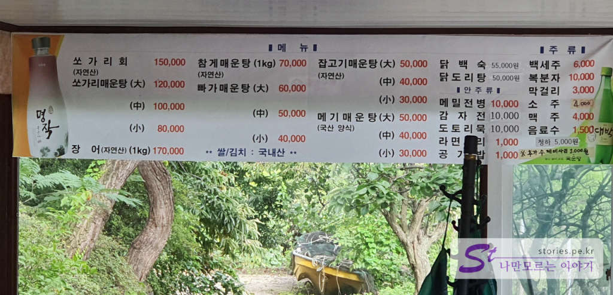
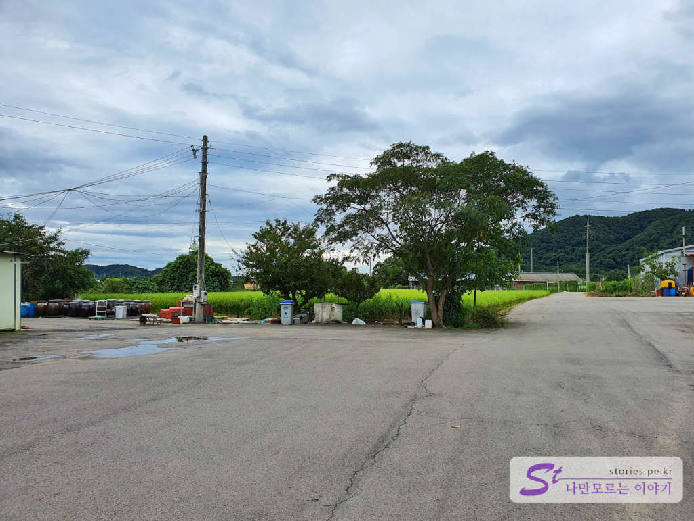

이번에 재인폭포를 다녀오면서 지인의 추천으로 점심겸 저녁으로 불탄소가든을 다녀왔습니다. 양식 민물고기와 한탄강에서 잡은 민물고기를 베이스로 매운탕을 끓여파는 식당입니다.  
참고로 저는 민물고기를 아주 싫어 합니다. 특유의 비리고 흙맛나는 맛이 싫어서 민물매운탕이라고하면 지레 먹지 않았습니다. 그런데 이번에 어쩔 수 없이 도살장 끌려가는 소 마냥 부득이 뺄 수 없어서 **불탄소가든**을 다녀왔습니다. **불탄소**라고 해서 직화 소고기 구이 인줄 알았는데..... 쩝.. 불탄소는 한탄강에 있는 지명인것 같습니다.  

   
넓직한 주차장을 가지고 있고 한쪽에는 재인폭포에서 내려오는 한탄강 물줄기가 있고 반대쪽에는 논으로 둘러 쌓여있어서 사방팔방 확~ 트인 뷰를 자랑합니다. 

  
식당 안으로 들어가면 상당히 넓고 많은 테이블이 있습니다. 그리고 창문을 통해 한탄강의 멋진 뷰를 감상하며 식사를 할 수 있습니다. 이점은 너무 마음에 들더라구요.

  
반대 방향으로도 멋진 뷰를 자랑합니다.   

  
사방이 자연의 풍광을 가지고 있습니다.  

  
음식에 사용되는 장은 직접 담근다고 하네요. 항아리들이 많이 있습니다.  

  
전체적인 식당의 분위기 입니다. 

  
계산을 마치고 카운터를 보니 유명한 사람들이 많이 다녀간듯한 싸인들이 많이 붙어 있네요. 누군지는 모르겠어요. ㅎㅎㅎ

## 대표 메뉴와 가격(가성비)   

  
대표 메뉴로는 메기매운탕, 참게매운탕, 한탄강에서 잡은 물고기로 끓인 잡고기 매운탕이라고 합니다. 제가 민물매운탕을 잘 모르기 때문에 가성비가 좋은지는 모르겠습니다. 메뉴로 확인해 보세요. 쏘가리는 양식을 못한다고 해서 자연산으로 가격이 바싸다고 하네요. 15만원.. ㅎㄷㄷ 장어도 1kg에 17만원이네요.. 쏘가리와 장어는 한탄강에서 잡은 놈들이라고 하네요. 

## 먹어본 음식  
지인이 추천해서 먹어본 음식은 메기매운탕입니다.   

   
잡고기 매운탕은 한탄강에서 잡은 자연산 물고기이긴한데 아무래도 잔뼈가 많아서 먹기가 불편하다고 하네요. 그래서 가장 추천하는 메기매운탕을 시켰습니다. 참고로 메기는 자연산은 아니고 양식이라고 합니다. 이것이 **중짜 4만원**입니다.  

  
같이 나온 사이드 메뉴입니다. 민물고기 튀김은 한탄강에서 잡은 민물고기이고 특유의 민물고기 향이 나서... 저는 하나 먹고 패스했습니다. 
그리고 붕어찜입니다. 붕어찜이 반찬으로 나오더라구요. 맛있어요.. 민물고기 특유의 비린내가 나지 않더라구요.. 먹을만 합니다. 붕어는 수도 없이 많이 봐왔지만 생전 처음 먹어보네요.  

그리고 매인메뉴인 **메기매운탕은 정말 맛있습니다.** 하나도 비리지 않고 흙맛도 나지 않습니다. 메기살도 쫄깃하고 맛있었습니다. 

## 맛있게 먹는 방법   
여기를 수도 없이 온다는 지인이 알려준 메기매운탕을 맛있게 먹는 법을 소개해 봅니다. 

1. 일단 매운탕을 잘 끓인 후 물이 자작자작 해지면 불을 줄이고 메기살과 국물을 같이 떠서 먹습니다. 
2. 거의 다 먹었으면 국물을 약간만 앞접시에 덜어 놓고 수제비와 라면을 시킵니다. 
3. 수제비를 시키면 별도의 추가 국물과 야채(미나리였던것 같음)을 넣어 주고 그 국물을 끓입니다.  
4. 국물이 끓으면 수제비를 넣고 더 끓인 다음 수제비를 앞접시에 덜어서 먼저 먹습니다. 
5. 수제비를 다 먹으면 라면을 넣고 끓여서 마무리로 먹습니다. 

## 식당운영시스템  
사람이 붐비지 않을 때 가서 정확히 확인은 못해봤습니다. 

## 청결도  
청결도는 많이 청결하지는 않습니다. 그냥 그런 식당의 그정도의 청결도 입니다. 

<b>청결도 : </b> ★★☆☆☆ 

## 친절도  
손님이 많이 없어서 그런지 상당히 친절한 편이였습니다. 추가 서비스도 주시구요 ^^

<b>친절도 : </b> ★★★★☆ 

## 식당과 주차 정보  
- 주소 : 경기 연천군 연천읍 현문로 526-29  
- 연락처 : 031-834-2770  
- 영업시간(휴무일) : 매일 11:00 - 20:30 (명절 휴무)
- 주차 : 약 10~15대 정도 주차가 가능합니다.   
  

    <iframe src='https://www.google.com/maps/embed?pb=!1m18!1m12!1m3!1d3141.354887269641!2d127.11966921518307!3d38.06211547970811!2m3!1f0!2f0!3f0!3m2!1i1024!2i768!4f13.1!3m3!1m2!1s0x357d25f91538d16b%3A0x5eb406d8412547d5!2z67aI7YOE7IaM6rCA65Og!5e0!3m2!1sko!2skr!4v1600012519480!5m2!1sko!2skr' class='embed-responsive-item' allowfullscreen></iframe>

## 기타 사항  
불탄소가든은 대부분 재인폭포를 다녀올때 많이 간다고 합니다. 가깝그든요. 
저도 재인폭포 다녀와서 아래에 포스팅을 했습니다. 

[[연천여행] 코로나19로 답답할 때 잠깐 다녀오기 좋은 재인폭포](https://blog.stories.pe.kr/488)

