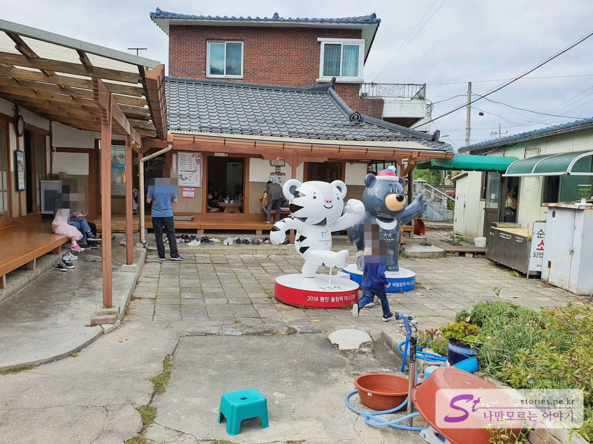

오전에 평창 알펜시아리조트에서 알파인코스터를 타고 오후에 강릉으로 내려왔습니다. 점심시간도 되고 해서 강릉에서 유명한 먹거리 메뉴인 초당순두부를 먹기로 했습니다. 강릉의 초당동에 초당순두부 골목이 모여 있어서 그쪽으로 갔습니다. 원래는 장칼국수를 먹기로 했는데 추석 당일이라 문이 닫혀서 순두부집으로 갔습니다. 

초당순두부의 원조집은 따로 있지만 저희는 평점이 좋은 곳으로 방문을 했습니다. 그렇게 해서 찾아간곳이 **초당고부순두부**집니다. 

  
주택을 개조해서 식당으로 사용하는 곳입니다. 길 바로 옆에 있어서 쉽게 찾을 수 있습니다.  

  
뜬금없지만 마당 중앙에 동계올림픽 마스코트가 떡하니 있네요.. 올림픽 끝나고 줒어온건지.. 식당 하고는 잘 어울리지 않지만 그래도 아이들은 좋아해요. 

  
약간의 웨이팅 후 자리에 들어가 앉았습니다. 7가지의 반찬이 나오는데 대부분 맛이 좋았습니다. 특히나 콩비지와 감자는 정말 맛이 좋았습니다. 

  
순두부는 이미 주방에서 끓여서 주기 때문에 약한 불에 데우면서 먹으면 됩니다. 양은 좀 적은 편이었으며 맛은 맵지 않지만 매콤한 맛이 나서 제 입맛에는 딱 맞았습니다. 다른 일행도 순두부를 별로 좋아하지 않는데 다들 잘 먹었습니다. 평점 값은 하는 집입니다. 

  
처음 반찬은 아주머니께서 세팅을 해주시고 나머지 추가 반찬은 셀프서비스로 담아서 먹으면 됩니다. 퉷마루쪽에 반찬냉장고가 있어서 신선하게 추가로 먹을 수 있습니다. 

## 대표 메뉴와 가격(가성비)   
대표메뉴는 순두부백반과 두부전골입니다. 

  
순두부백반은 순두부에 양념이 없는 하얀 순두부인 것 같고 두부전골은 빨간색의 순두부입니다. 

  
뚝배기 순두부가 메뉴에 적혀 있긴 하나 이제 판매를 하지는 않는 것 같습니다. 가격은 조금 비싼 것 같기는 하나 이해할 만한 수준입니다. 

## 식당운영시스템  
추석 당일이라 평상시의 운영시스템인지는 모르겠습니다. 메뉴가 적어서 준비하는데 오래 걸리지는 않습니다. 홀에는 아주머니 한분이 전담하고 있어서 속도가 느린 편입니다. 아주머니가 바쁘셔서 불러도 잘 못 알아들으시는 건지 아니면 못 알아듣는 척을 하시는 건지 모르겠습니다. 그래도 대답을 하시면 응대는 상당히 친절히 잘해 주시기는 하십니다. 바빠서 그런 거라 생각했습니다.  

<b>운영시스템 : </b> ★★★☆☆ 

## 청결도  
매우 청결하지는 않습니다. 그냥 시골집이라고 보시면 됩니다. 

<b>청결도 : </b> ★★★☆☆ 

## 친절도  
친절은 하십니다만... 잘 못 들으세요..

<b>친절도 : </b> ★★★☆☆ 

## 식당과 주차 정보  
- 주소 : 강원 강릉시 강릉대로587번길
- 연락처 : 033-653-7271
- 영업시간(휴무일) : 07:00 ~ 20:00 (둘째,넷째 월요일)
- 주차 : 약 10~15대를 주차할 수 있는 마당이 있습니다. 
    

    <iframe src='https://www.google.com/maps/embed?pb=!1m18!1m12!1m3!1d1067.569566153511!2d128.91828653027702!3d37.78466885976411!2m3!1f0!2f0!3f0!3m2!1i1024!2i768!4f13.1!3m3!1m2!1s0x3561e68e23821d7d%3A0xd976f882fa40bf44!2z6rOg67aA7Iic65GQ67aA!5e0!3m2!1sko!2skr!4v1601970130825!5m2!1sko!2skr' class='embed-responsive-item' allowfullscreen></iframe>

