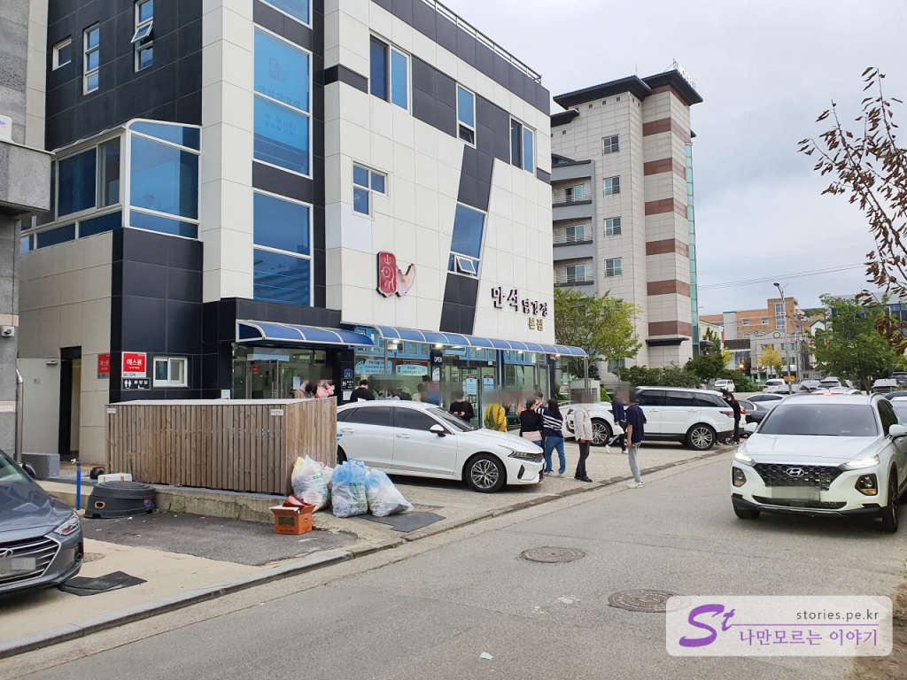
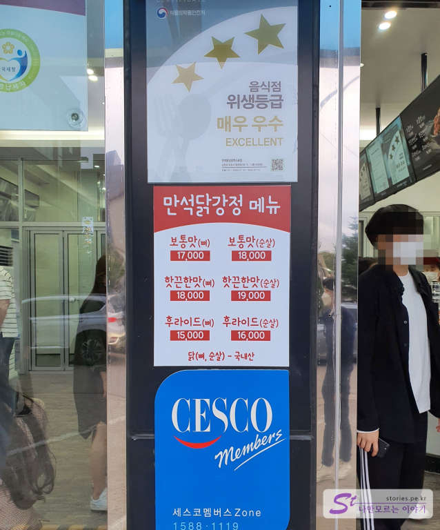
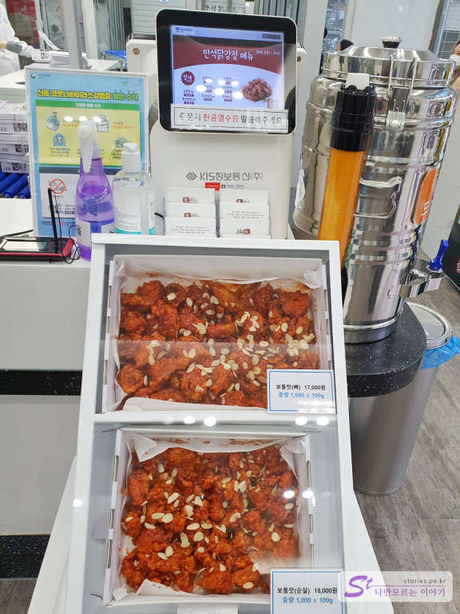
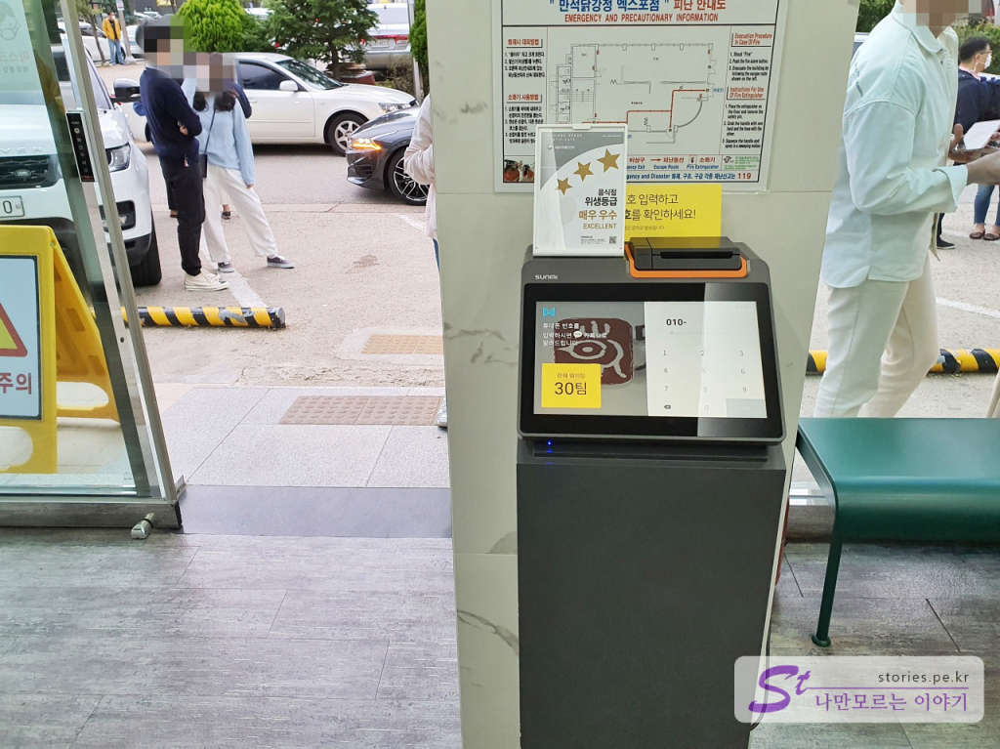
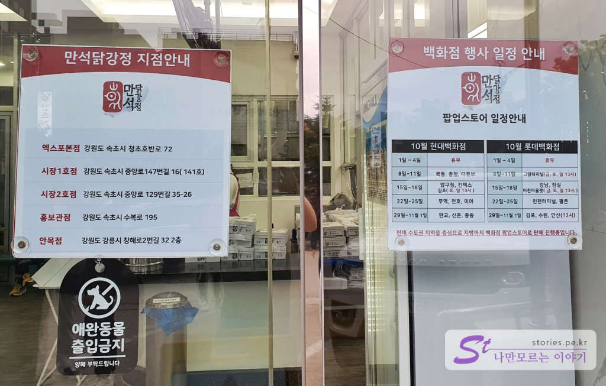
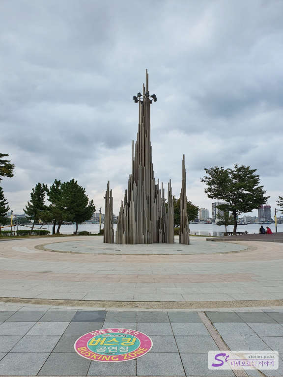
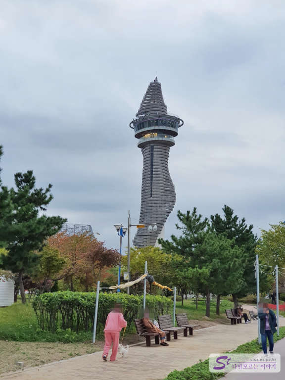
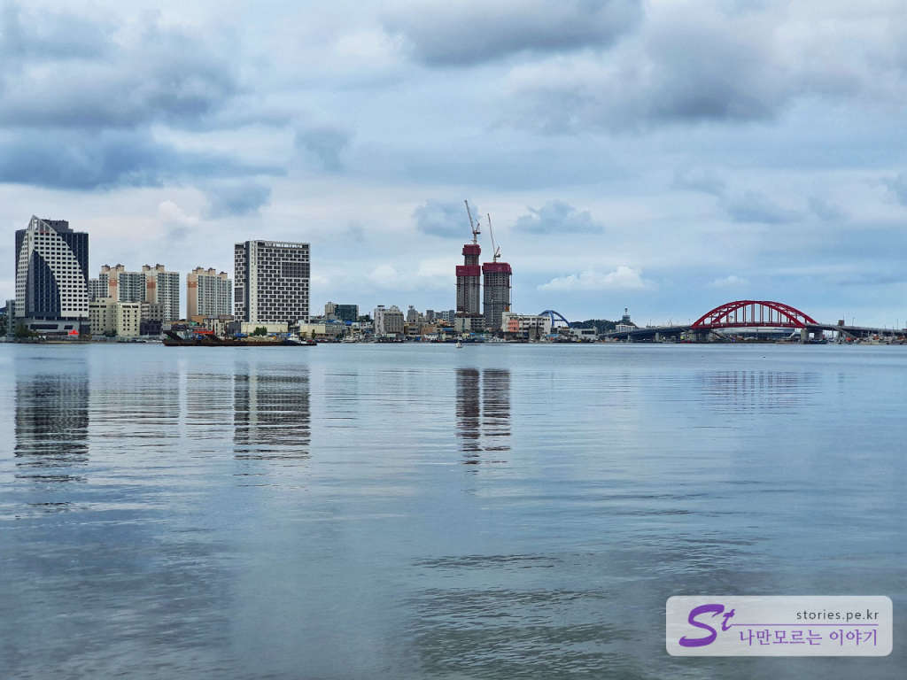

동해의 속초에 여행을 간다면 거의 대부분의 여행객들이 맛본다는 닭강정 맛집이 있습니다. 바로 만석닭강정입니다. 제가 만석닭강정을 알게 된 게 거의 10년 정도 됐고 아직도 많은 사람들이 찾는 것을 보니 모두에게 맛집은 맞는가 봅니다. 거의 전국의 돈을 쓸어 모은다고 보면 될 것입니다. 좋겠당....
제가 기억하기에도 만석닭강정의 운영이 순탄하지만은 안은 것으로 기억합니다. 처음에는 속초중앙시장 안에서 판매를 시작해서 많은 사람들에게 입소문이 나면서 유명세를 타기 시작했는데 언론에 위생불량으로 직격탄을 맞으면서 휘청했었을 것입니다. 그 이후로 모든 매장이 최신 위생시설로 탈바꿈하면서 다시 한번 전성기를 맞고 있는 것 같습니다. 

만석닭강정은 속초에 엑스포본점, 시장 1호점, 시장 2호점으로 총 3개의 매장으로 운영을 하고 있고 날짜에 맞춰 전국에 팝업스토어를 운영하고 있습니다. 시장에서 시작했으나 시장이 본점은 아니고 엑스포가 본점입니다. 저희는 3군데 모두 가봤는데 맛은 모두 동일하고 단지 여행의 일정에 맞춰서 가까운데 방문하시면 됩니다.  

- 시장 1호점 : 속초중앙시장 내에 있으므로 재래시장 구경과 갯배 타기 등 관광을 하고 구매하기에 좋습니다.
- 시장 2호점 : 속초중앙시장의 바깥에 시장 주차장 바로 앞에 있기 때문에 주차를 하고 바로 구매할 수가 있어서 좋습니다.   
- 엑스포 본점 : 그냥 만석닭강정만 구입할 목적이라면 엑스포본점으로 가는 것이 좋습니다. 물론 대기줄이 있긴 하지만 시장보다 덜 복잡하고 바로 앞에 엑스포공원도 구경할 수 있어 좋습니다. 

  
엑스포 점입니다. 약간의 주차장이 있고 빈자리가 없다면 주의 길가에 잠시 주차를 할 수도 있습니다. 

## 대표 메뉴와 가격(가성비)   

 
한번 언론에서 위생에 대해 한방 먹은 뒤로는 위생에 매우 신경을 쓰고 있습니다. 
가격은 15,000원 ~ 19,000원에 형성되어 있으며 사람들이 많이 구매하는 **대표메뉴는 보통맛이나 화끈한 맛의 순살 닭강정**입니다. 비싸지요.. 비싸요..  

  
모양이긴 하나 닭강정은 이렇게 되어 있습니다. 가격이 비싸니 당연히 양도 충분히 많습니다. 닭강정은 식었을 때가 더 맛있다고 소문이 나 있습니다. 

  
먼저 만석닭강정에 도착을 했다면 묻지도 따지지도 말고 빨리 매장에 들어가서 번호표를 뽑아야 합니다. 대기가 길어요..

  
원래 지점이 3군데로 알고 있었는데 홍보관점과 안목점이 새로 생긴 것 같습니다. 어쩐지 안목항에 갔는데 몇몇 분들이 만석닭강정을 들고 다니더라니...
이렇게 구매한 닭강정을 집으로 가져가도 되지만 인근 엑스포공원에서 먹어도 됩니다. 

  
  
엑스포 공원에서 먹는다면 뒤처리는 확실하게 해야겠죠..

 
엑스포공원은 청초호를 끼고 있어서 풍경도 너무 멋집니다. 

## 식당 운영시스템  
식당 운영시스템이 정말 잘되어 있습니다. 물론 포장이 100% 이 니까 가능하지 않나 싶습니다. 

<b>운영시스템 : </b> ★★★★★ 

## 청결도  
청결도도 매우 신경 쓰고 있습니다. 

<b>청결도 : </b> ★★★★★ 

## 친절도  
친절도는 보통 이상입니다.  딱히 불친절할 필요는 없겠지요. 운영시스템이 잘 되어 있어서 부딪힐 일이 거의 없습니다. 좋아요

<b>친절도 : </b> ★★★★☆ 

## 식당과 주차 정보  
- 주소 : 강원 속초시 청초호반로 72 (엑스포 본점)
- 연락처 : 1577-9042 
- URL : www.mansuk.kr  
- 영업시간(휴무일) : 10:00 ~ 20:00
- 주차 : 주의 골목길에 주차 가능합니다.

    <iframe src='https://www.google.com/maps/embed?pb=!1m18!1m12!1m3!1d3135.846481352956!2d128.58468941518692!3d38.19023997968592!2m3!1f0!2f0!3f0!3m2!1i1024!2i768!4f13.1!3m3!1m2!1s0x5fd8bb7a27d9a9fd%3A0xb4e2bcb03f57dbc0!2z66eM7ISd64ut6rCV7KCVIOuzuOygkA!5e0!3m2!1sko!2skr!4v1601980162979!5m2!1sko!2skr' class='embed-responsive-item' allowfullscreen></iframe>

