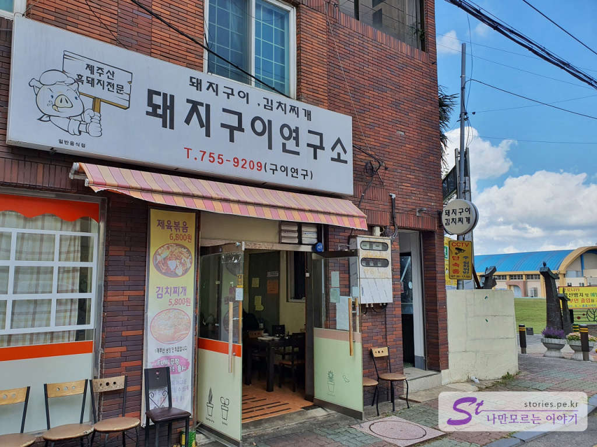
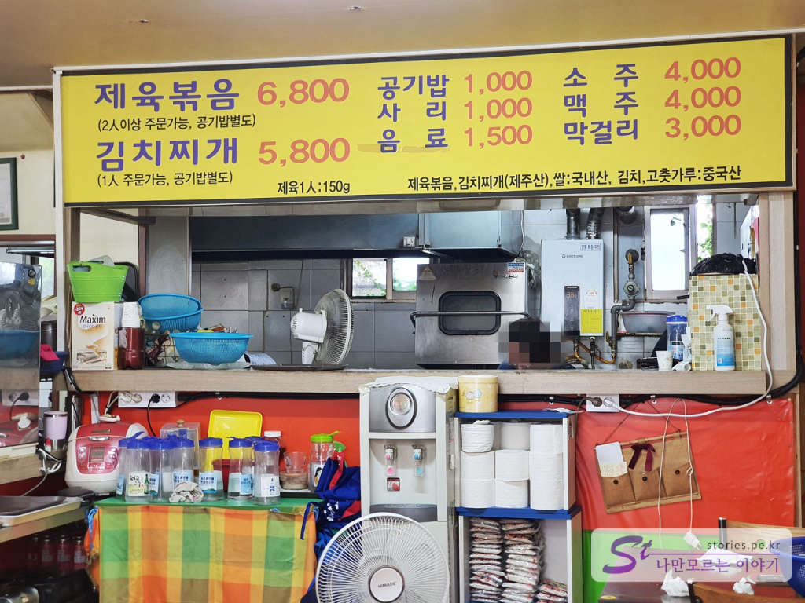
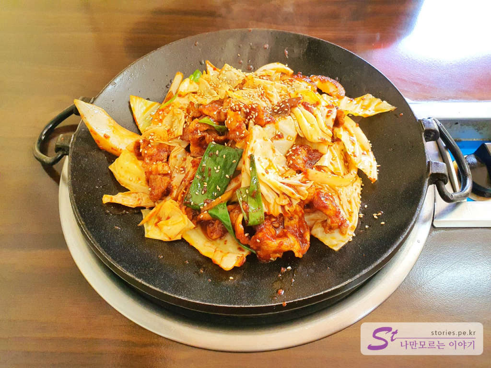
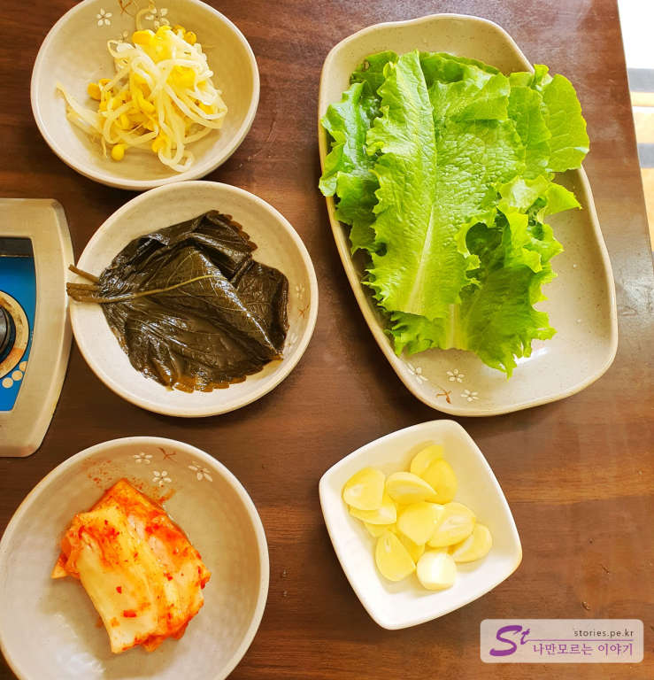
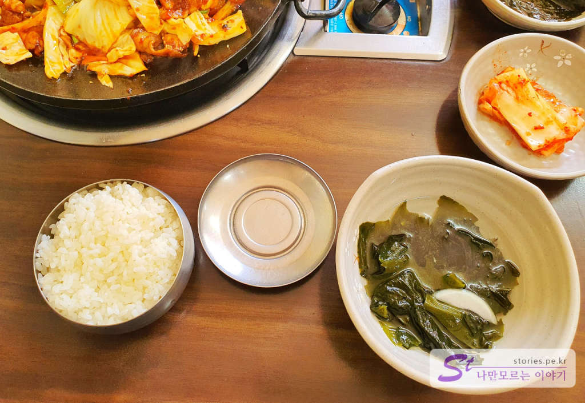
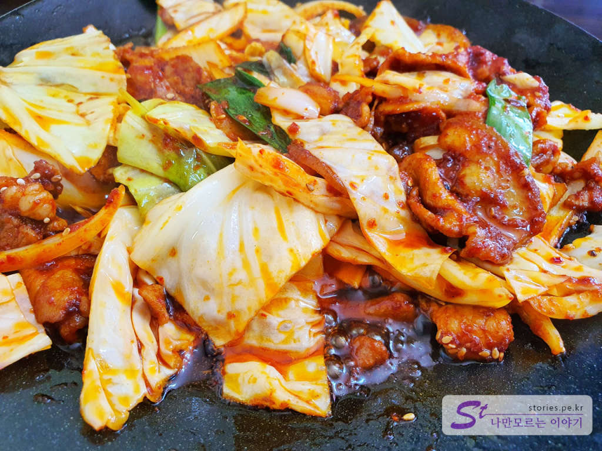
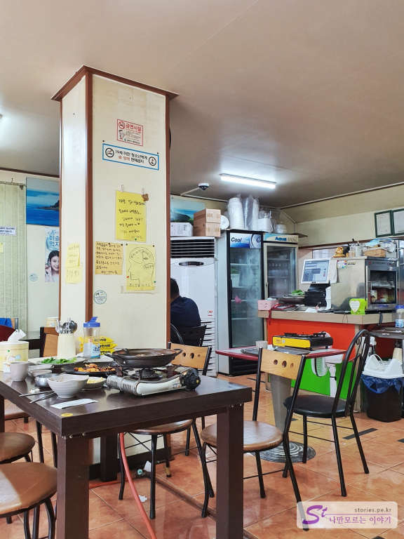

> [[제주 여행] 가을에 떠나는 3박 4일 제주도 여행 전체 일정 ](https://blog.stories.pe.kr/497)

제주공항에 도착해서 점심이나 저녁을 먹기에 좋은 현지 맛집이 있습니다. 제주시청 쪽의 광양초등학교 인근에 위치해 있습니다. 나름 불맛이 입혀진 돼지불백 맛집입니다. 

## 대표 메뉴와 가격(가성비)   
이곳의 대표 메뉴는 제육볶음과 김치찌개입니다. 

 
가격도 저렴해서 부담 없이 먹을 수 있습니다. 제육볶음은 2인 이상 주문이 가능하고 공깃밥이 별도라 **인당 7,800원**이라 보시는 것이 좋을 것입니다.

## 먹어본 음식  
저희는 제육볶음과 김치찌개를 먹으려 했으나 김치찌개는 재료가 소진돼서 먹을 수가 없었습니다. 그래서 제육볶음만 먹어봤습니다. 

  
제육볶음은 주방에서 먼저 초벌구이로 불맛을 입혀서 나옵니다.  

  
반찬은 단출하게 나옵니다. 콩나물, 깻잎절임, 김치, 마늘, 상추입니다.

  
시원한 미역국이 나오고 별도의 비용을 받는 공깃밥이 나옵니다.

  
제육볶음이지만 특이하게 기름이 많이 나옵니다. 마치 기름에 튀기는 느낌으로 고기와 야채를 먹게 됩니다. 기름에 튀기면 신발도 맛있다고, 이 기름이 맛을 더해 주기도 하지만 느끼함도 더해 주기도 합니다. 기름의 느끼함을 싫어하는 사람에게는 비추입니다. 

## 식당 운영시스템  
식당의 운영시스템은 좀 엉망이긴 합니다. 먼저 왔어도 다른 테이블에 먼저 음식을 갔다 줍니다. 홀 서빙을 하시는 분이 나이가 좀 있으신 한분이 하고 계셔서 몇 테이블이 오면 좀 헷갈려하시는 것 같습니다.  

<b>운영시스템 : </b> ★★☆☆☆

## 청결도  
청결하지 않습니다. 청결함에 민감하신 분에게는 추천하지 않습니다. 행주 하나로 많은 일들을 합니다. 손도 닦지 않고 테이블 치우기와 세팅도 합니다. 교차오염이 있을 수밖에 없습니다. 

식당의 분위기도 청결하고는 거리가 멉니다. 그냥 시골의 저렴하고 맛있지만 청결하지 않은 그냥 그런 느낌의 식당입니다.

<b>청결도 : </b> ★★☆☆☆

## 친절도  
친절함으로 무장되어 있는 수도권 사람들의 입장에서는 제주도의 투박함이 친절하게 느껴질 리 없지요.. 불친절하다기보다는 무뚝뚝하다는 표현이 더 맞을 것 같습니다. 

<b>친절도 : </b> ★★★☆☆

## 식당과 주차 정보  
- 주소 : 제주 제주시 동광로 1길 6
- 연락처 : 064-755-9209
- 영업시간(휴무일) : 매일 11:00 - 22:00 (일요일 후무) : 브레이크 타임이 명시되어 있지 않지만 실제로 가보니 브레이크타임이 있는 것 같습니다. 약 2시인지 3시인지부터 시작하는 것 같은데..
- 주차 : 건물 뒤편 광양초등하교 주차장을 이용할 수 있으나 휴일과 평일 업무시간 이후에만 주차를 할 수 있습니다. 
  

    <iframe src='https://www.google.com/maps/embed?pb=!1m18!1m12!1m3!1d3326.9977399647278!2d126.52915793252367!3d33.50143592624796!2m3!1f0!2f0!3f0!3m2!1i1024!2i768!4f13.1!3m3!1m2!1s0x350cfcaebf191783%3A0x8f09de967dc89a25!2z64-87KeA6rWs7J207Jew6rWs7IaM!5e0!3m2!1sko!2skr!4v1602644739675!5m2!1sko!2skr' class='embed-responsive-item' allowfullscreen></iframe>

 
