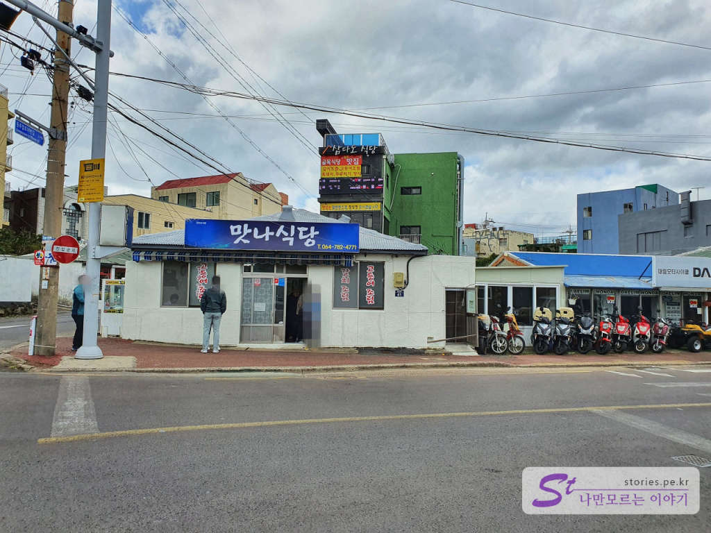
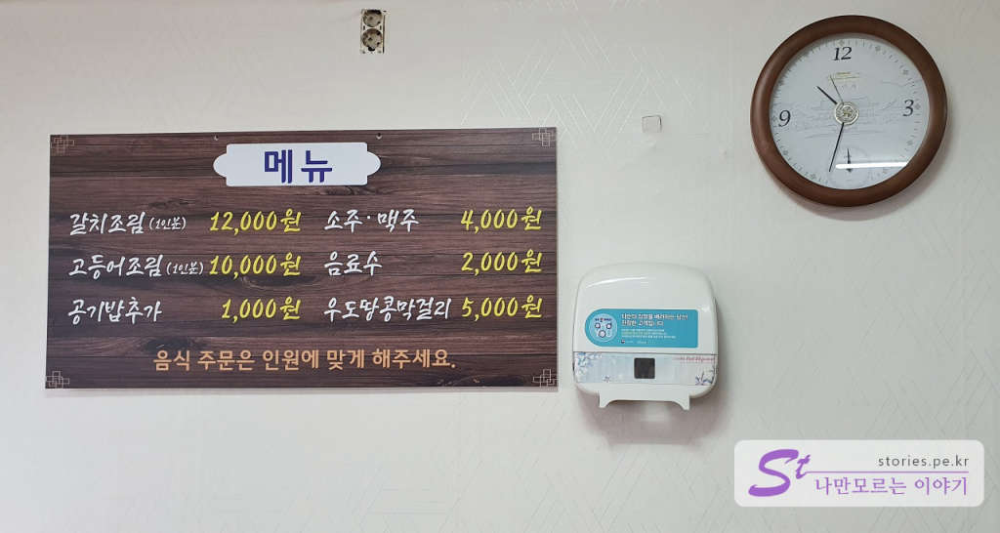
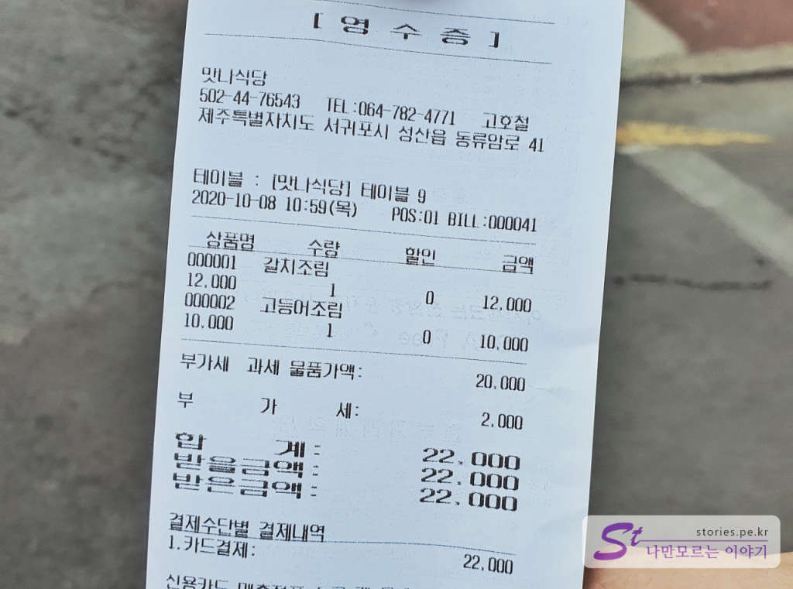
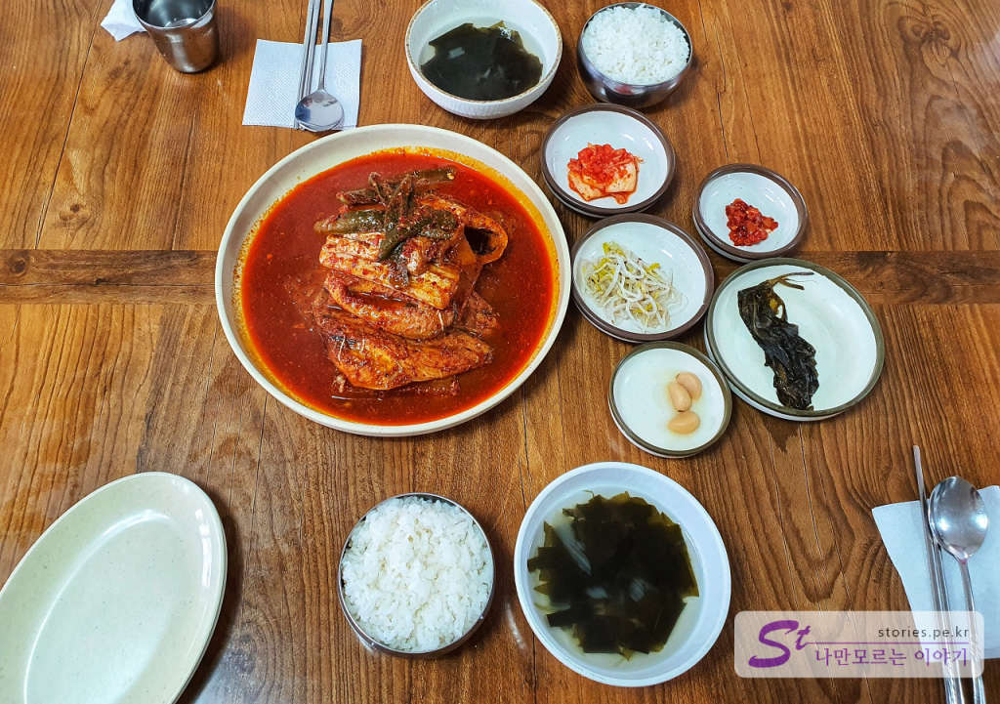
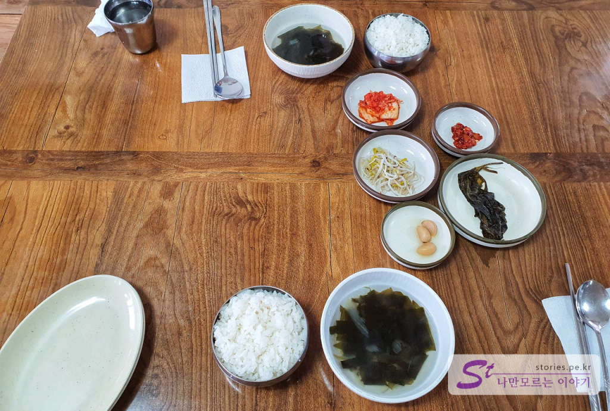
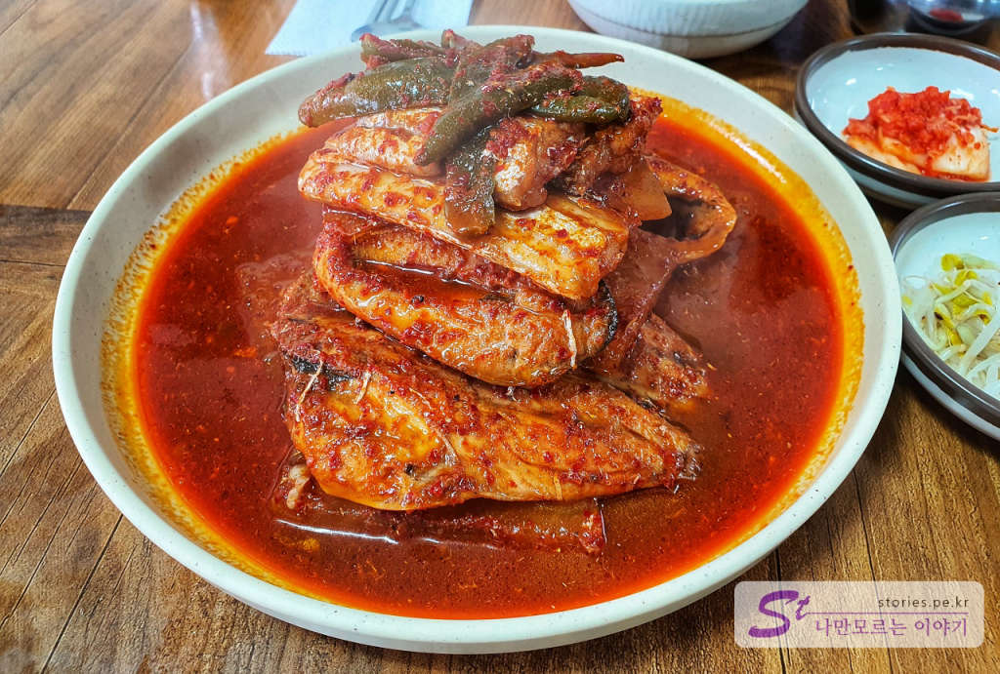
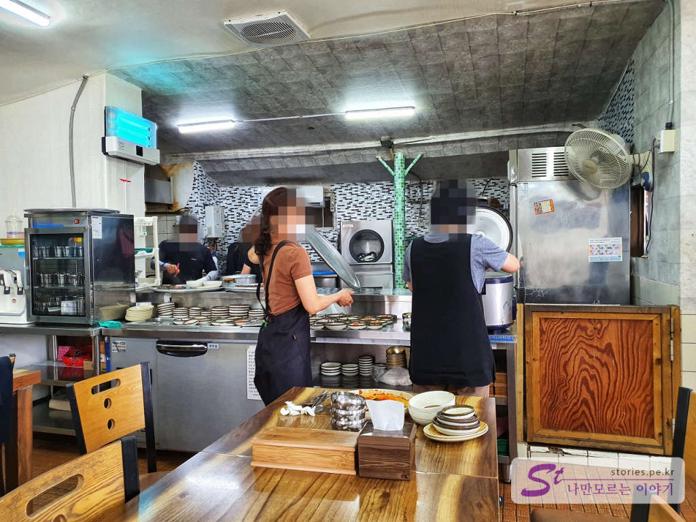
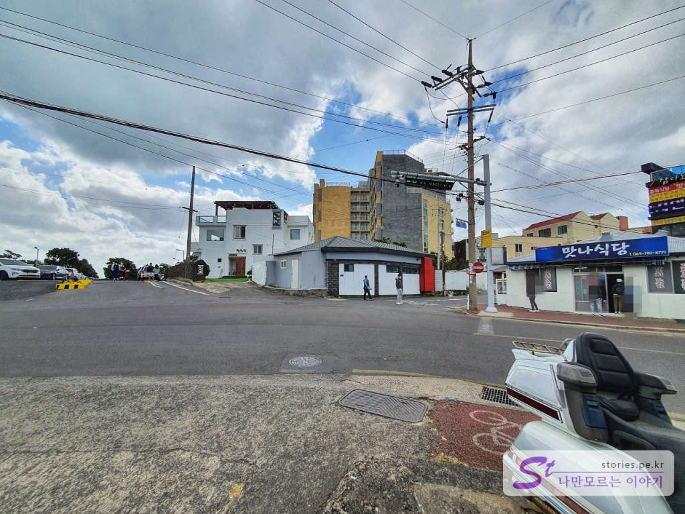

정확히 기억이 나진 안지만 약 5년 전부터 제주여행을 할 때마다 방문하는 가성비 맛집입니다. 그때도 웨이팅이 상당히 길었었는데 이번에도 여전히 웨이팅은 깁니다. 

  
시골의 작은 그저 그런 식당의 모습을 하고 있습니다. 예전에 비해 간판도 바뀌고 실내의 모습도 많이 바뀐 것 같습니다. 홀도 안쪽으로 더 늘린 것 같고 주방도 좀 달라진 것 같고 어째튼 한번 리모델링을 한 것 같습니다.  

여기는 식당운영을 오전 6시에 준비를 시작해서 오후 2시쯤이면 식당 문을 닫습니다. 오전 6시부터 식사를 할 수 있는 것은 아니고 그때부터 주방에서 그날 들어온 식재료들을 다듬고 준비를 하는데 그때부터 예약을 받습니다. 예약은 전화로도 안되고 이전날에도 안됩니다. **딱! 당일에 방문자만 예약을 받습니다.**   
아침 일찍 예약하기 위해 식당에 도착하면 식당 문이 닫혀있습니다. 똑똑 두드리면 안에서 주인장이 나옵니다 그러면 그때 예약을 하시면 됩니다. 물어보지는 안았는데 실제로 식사는 아마 8시 30분부터 시작하지 않을까 합니다. 

방문할 때 일단 처음부터 1시간에서 3시간정도 웨이팅이 있을 거라는 생각을 가지고 방문해야 합니다. 

## 먼저 예약하기   
먼저 식당에 도착하면 카운터에 가서 예약자 이름과 전화번호를 남기고 예약을 합니다. 그러면 몇 시쯤 와라라고 알려줍니다. 이 시간이 대략 1시간에서 3시간 정도 후입니다. 

해당 시간쯤 되서 식당에서 전화를 해줍니다. 2회 정도 전화를 했는데 받지 않으면 예약이 취소되고 다음 사람으로 넘어가니 꼭 전화를 잘 받아야 하고 아니면 미리 예약시간보다 조금 일찍 와서 기다리시면 됩니다. 

## 예약 팁  
만약 성산쪽에 숙박을 하신다면 일행 중 한 명이 아침 일찍(오전 6시~7시쯤) 일어나서 눈곱만 띄고 맛나식당에 와서 인원수에 맞게 예약을 하고 다시 숙소로 돌아가서 씻고 준비한 후 일행과 같이 편하게 식사를 하러 가는 것이 좋습니다. 

만약 일행 모두가 다같이 움직이는 일정이라면 일단 식당에 와서 예약을 하고 웨이팅 하는 2~3시간 동안 광치기 해변이나 성산일출봉을 구경하고 오셔도 됩니다. 

## 대표 메뉴와 가격(가성비)   
  
대표 메뉴는 갈치조림과 고등어조림입니다. 보통 예약할 때 주인장이 갈치조림과 고등어조림을 섞어서 주문하기를 추천합니다. 

제주도에 와서 이 가격에 맛이 보장된 갈치조림을 먹을 수 있다는 것은 축복입니다. 

 
2인분 먹고 난 계산서입니다. 22,000원 나왔네요.

## 먹어본 음식  
  
갈치조림 1인분과 고등어조림 1인분을 시키면 섞어서 하나의 접시에  주십니다. 2인이 먹기에 딱 좋은 양입니다. 

  
제주도는 공깃밥 인심이 너무 좋습니다. 꽉꽉 눌러서 많이 줍니다. 밑반찬들도 그냥저냥 맛있습니다. 사실 밑반찬은 눈에 들어오지 않습니다. 갈치, 고등어 먹어야죠..

  
한 사람당 갈치 2토막, 고등어 2토막 무조림 2토막 정도였던 것 같습니다. 그 정도 양이면 충분합니다. 국물도 짜지 않고 비린맛도 거의 없고 정말 맛있습니다. 

## 식당운영시스템  
IT장치의 도움이 없이 수첩에 적는 수기방식을 사용하긴 하지만 그래도 기다리는 사람이 억울함 없이 순서대로 먹을 수 있어서 운영시스템은 잘되고 있다고 볼 수 있습니다. 물론 기다리는 수고가 있긴 하지만.. 그건 어쩔 수 없으니까요.

<b>운영시스템 : </b> ★★★★☆ 

## 청결도  
  
청결도는 식당 자체가 낡아서 좀 그렇지만 그래도 특별히 더럽다는 생각은 들지 않았습니다. 남은 음식도 재활용하는 것 같진 않았습니다. 남은 식탁의 음식을 모두 버리더라고요

<b>청결도 : </b> ★★★★☆ 

## 친절도  
제주도라 지역특색상 친절하지는 않습니다. 무뚝뚝해요. 살가움을 기대하기는 어렵지만 그렇다고 불친절하지도 않으니 이해할만합니다.

<b>친절도 : </b> ★★★☆☆ 

## 식당과 주차 정보  
- 주소 : 제주특별자치도 서귀포시 성산읍 동류암로 41
- 연락처 : 064-782-4771 
- 영업시간(휴무일) : 08:30 ~ 14:00 (재료 소진 시 마감)
- 주차 : 식당 앞에 무료주차 가능한 주차장이 있습니다. 

    <iframe src='https://www.google.com/maps/embed?pb=!1m18!1m12!1m3!1d3329.027582944671!2d126.91590970000001!3d33.4485879!2m3!1f0!2f0!3f0!3m2!1i1024!2i768!4f13.1!3m3!1m2!1s0x350d137ea49e6e49%3A0xbf472ab35adbec44!2z66eb64KY7Iud64u5!5e0!3m2!1sko!2skr!4v1602836896677!5m2!1sko!2skr' class='embed-responsive-item' allowfullscreen></iframe>

 
식당 바로 앞에 무료 주차장이 있습니다. 

  
다만 언제일지 모르겠으나 곧 유료로 바뀌지 않을까 하는 증거들이 보입니다. 주차정산 장비가 들어오면 유료가 되겠지요? ㅋㅋ

 
