 

성산일출봉을 힘들게 올랐다면 잠시 카페에서 커피를 마시면 쉬는 것도 좋은 여행 방법 중 하나입니다. 일출봉 가까이에 멋진 풍광을 가지고 있는 호텔(더 클라우드 풀앤스파)이자 카페인 **카페 오르다**를 소개해 드립니다. 원래 **더 클라우드 풀앤스파**라는 호텔과 같이 운영을 하고 있는데 사실 카페 오르다가 더 많이 알려져 있는 곳입니다. 

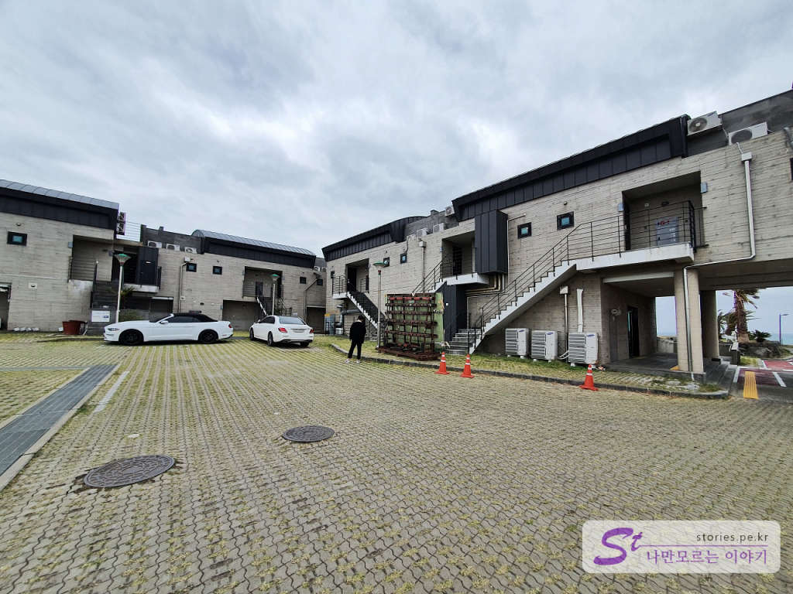  
호텔과 같이 운영하고 있는 주차장에서 찍은 사진입니다. 주차장은 호텔과 카페의 뒤쪽에 위치하고 있습니다. 

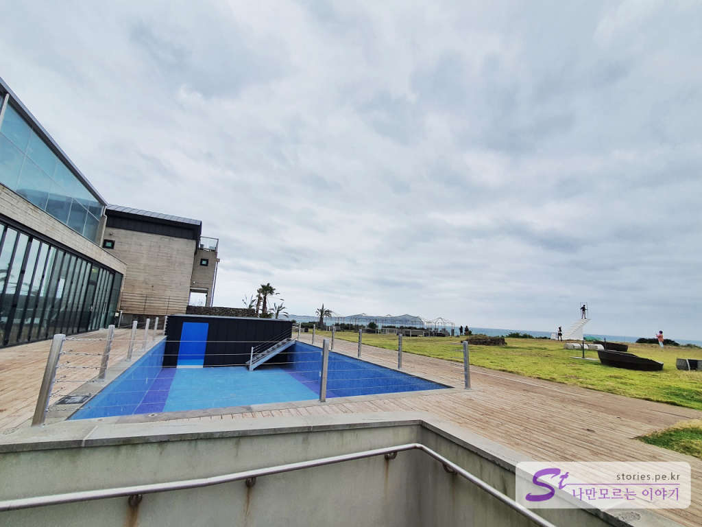  
앞쪽으로 나오면 커피 오르다와 수영장, 해변 앞 잔디밭이 보입니다. 저 멀리 천국의 계단도 보이네요. 

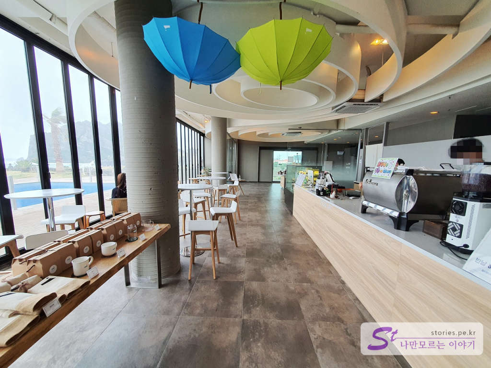  
일단 힘이 드니 먼저 카페에 들어가 봅니다. 깔끔한 실내를 가지고 있습니다. 여기에서 커피를 구매하여 2층과 3층에서 마실 수 있습니다. 

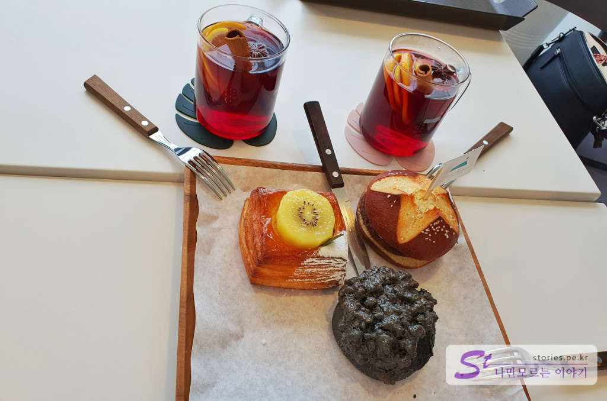  
저희는 아이스커피와 뱅쇼, 몇 개의 빵을 구매했습니다. 제 입맛에는 맞지 않지만 뱅쇼도 맛있다고 하더군요. 빵은 더할 나위 없이 맛이 있습니다. 잘 구웠어요.

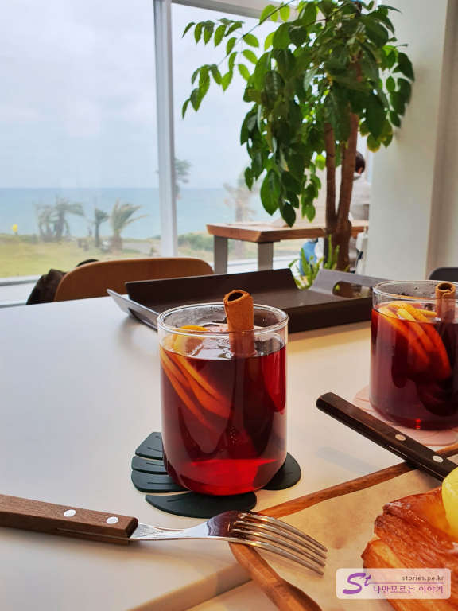  
2층 창밖에서 바다를 보며 먹는 뱅쇼 맛에서 힐링을 하게 됩니다. 뱅쇼 한 모금 경 치한 모금... (난 뱅쑈 싫어~~)

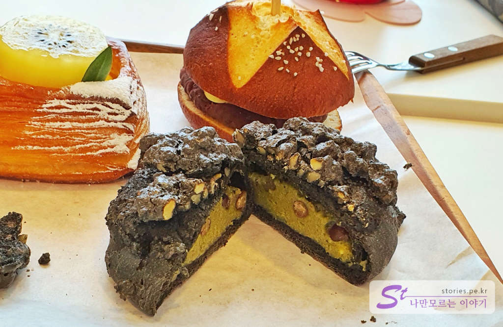  
빵도 너무 맛있습니다. 패스츄리 위에 키위가 올라간 빵도 빵과 키위를 같이 씹으면 촉촉하고 달콤하니 정말 최고입니다.  

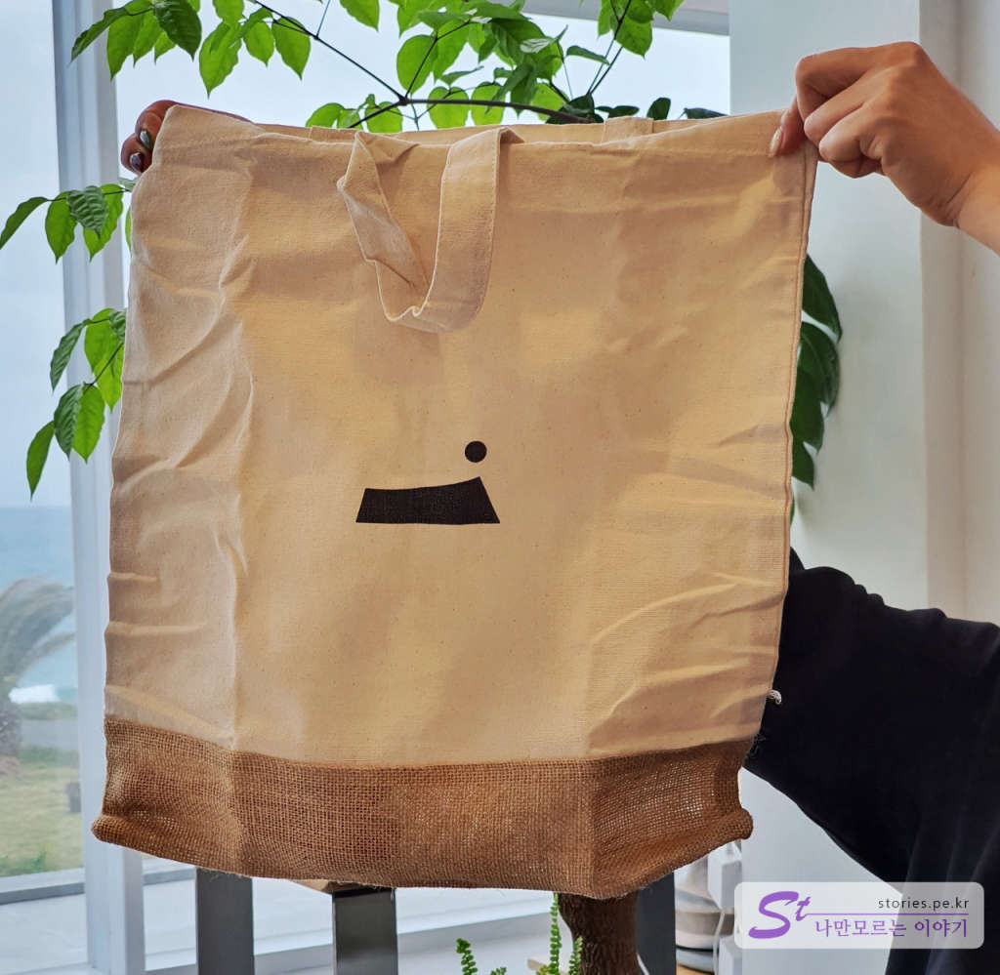  
정확히 기억은 나지 않지만 얼마 이상 구매하면 주는 한정판 사은품입니다 성산일출봉을 형상화한 카페 오르다 로고가 새겨있는 에코백입니다. 

실내에서 충분히 쉬었다면 이제 마당으로 나가 봅니다. 

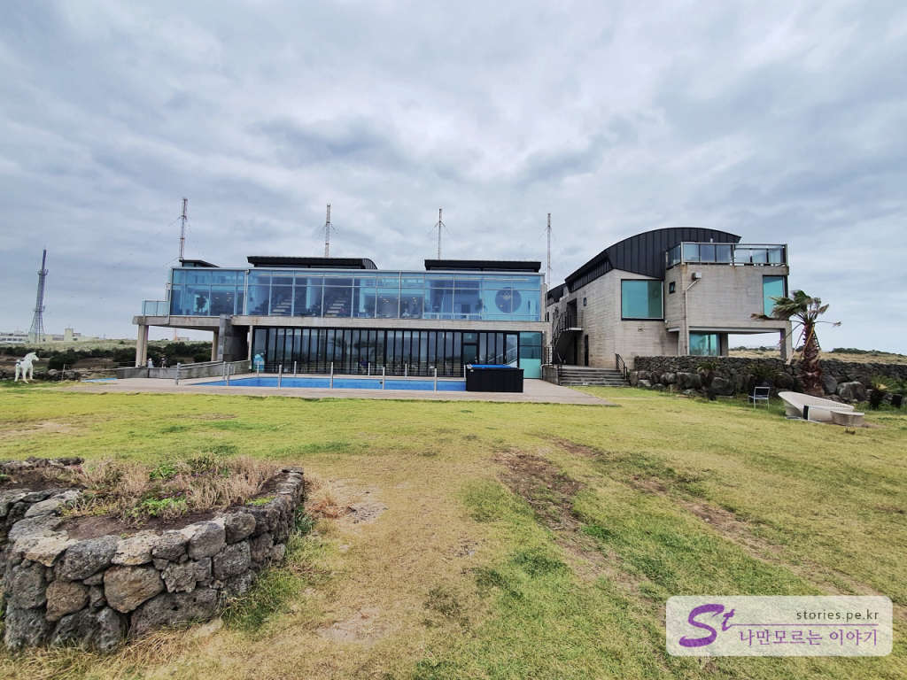  
카페는 이렇게 생겼습니다. 1층과 2층이 모두 통창으로 되어 있어서 바다와 성산일출봉을 보기에 좋게 되어 있습니다.  

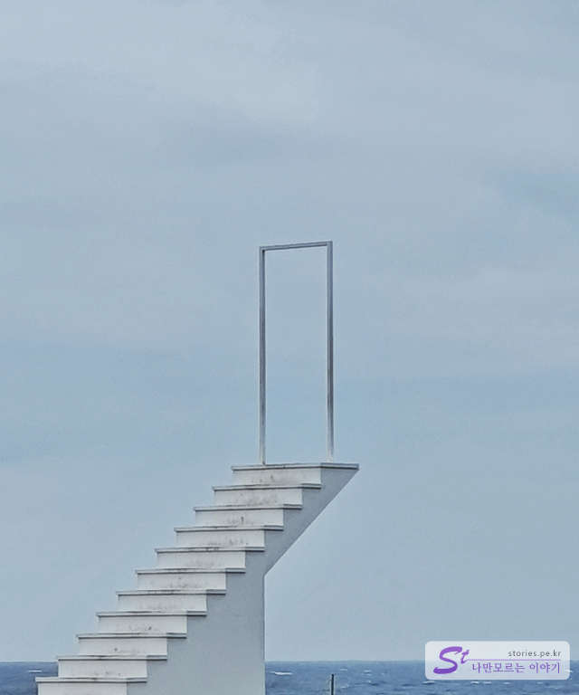  
국내에 몇 개 안 되는 천국의 계단입니다. 하늘로 올라가는 사진을 찍을 수 있는 곳입니다. 실제로 보면 별거 아니지만 각도 잘 맞춰서 사진을 찍으면 인생 사진이 나오는 곳입니다.  

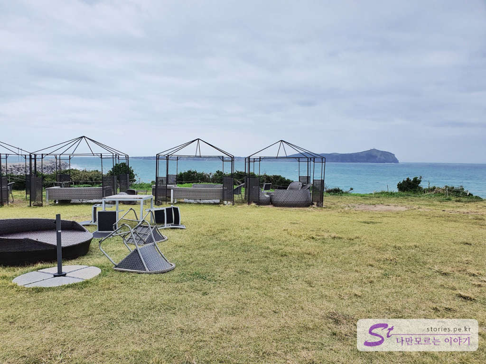  
앉거나 누워서 쉴 수 있는 의자들이 여러 개가 있어서 밖에서도 차를 마실 수 있습니다. 우리가 갔을 때는 바람이 너무 많이 불어서 대부분 실내에서 차를 마셨습니다.  

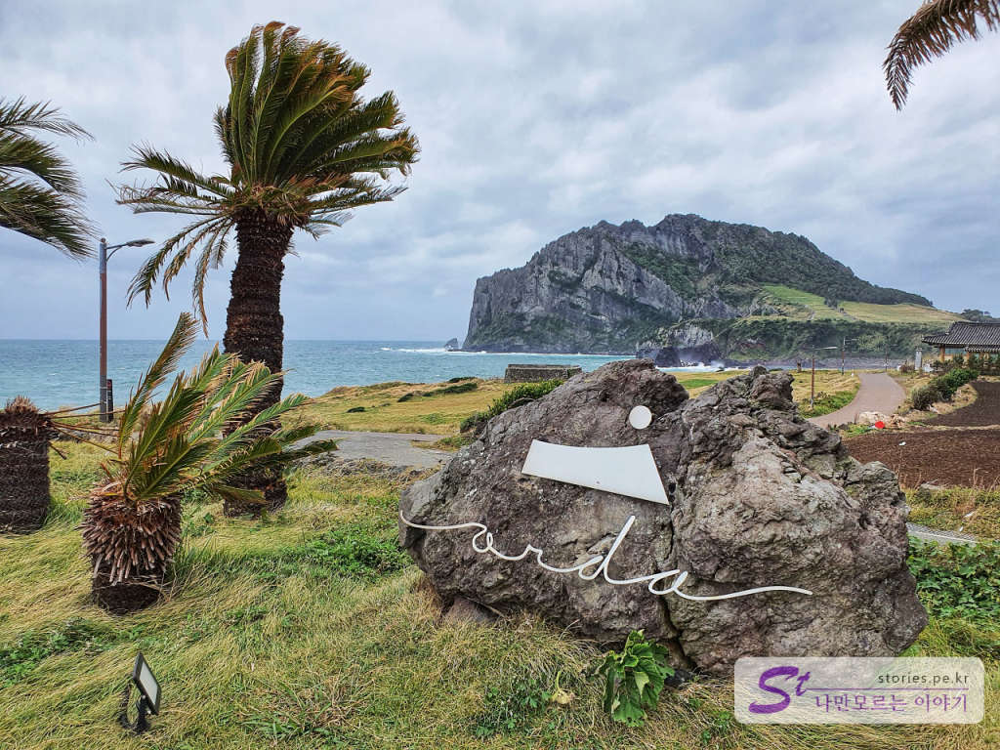  
카페 오르다의 로고와 성산일출봉을 같이 찍어 봤습니다.  

## 청결도  
매우 깨끗한 편입니다. 

<b>청결도 : </b> ★★★★☆ 

## 식당과 주차 정보  
- 주소 : 제주 서귀포시 성산읍 한도로 269-37
- 연락처 : 064-783-8368
- 영업시간 : 매일 09:00 - 21:00
- 주차 : 20~30대 정도 주차할 수 있는 주차장 보유

    <iframe src='https://www.google.com/maps/embed?pb=!1m18!1m12!1m3!1d3328.2447929986865!2d126.93324481504837!3d33.468976980768616!2m3!1f0!2f0!3f0!3m2!1i1024!2i768!4f13.1!3m3!1m2!1s0x350d15dbdb638f13%3A0xfab517bfe07ea2b!2z7Jik66W064uk7Lm07Y6Y!5e0!3m2!1sko!2skr!4v1603248382922!5m2!1sko!2skr' class='embed-responsive-item' allowfullscreen></iframe>

## 기타 사항  
성산일출봉 등반 후 잠시 쉬며 차를 마시기 좋습니다.  
