큰돈가에서 저녁을 먹고 한 달 살기 지인의 추천으로 동네 안에 있는 카페를 방문했습니다. 이 카페는 특이하게 번화가에 있는 게 아니고 주택단지 안에 자리를 잡고 있었습니다. 이런 가게가 여기에 있어?라고 생각될 정도입니다. 크기도 작고 아담합니다.

> 참고로 저는 커알못입니다. 커피는 많이 마시지만 커피를 잘 알지는 못하니 감안하고 봐주세요.

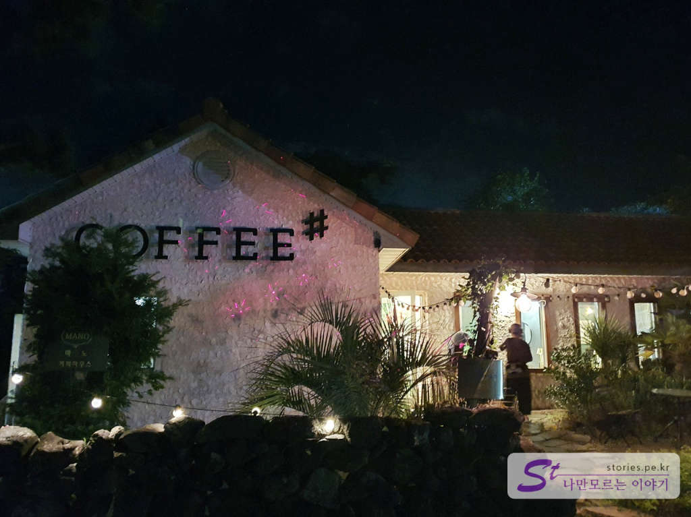  
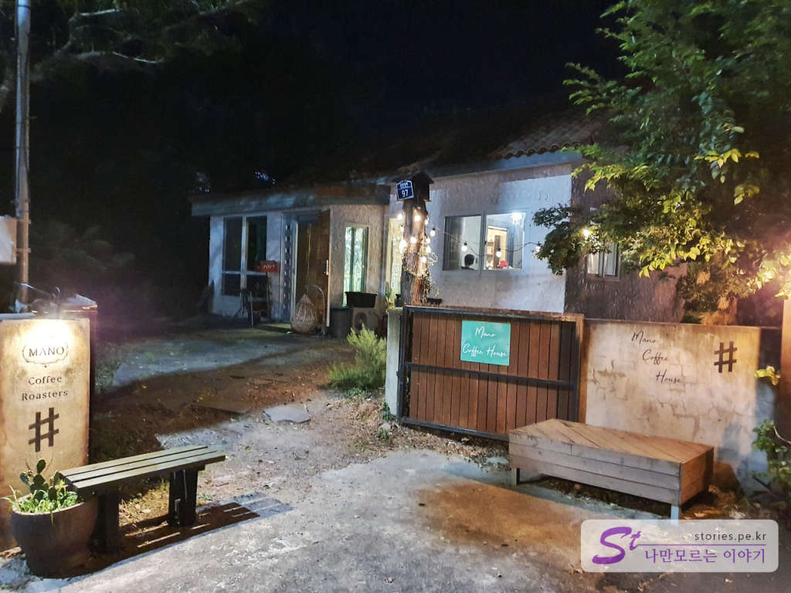  
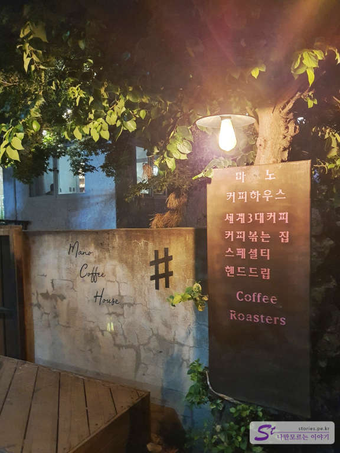  
집을 개조해서 운영하는 것이 아닌가 하는 생각이 드는 외관입니다. 동네카페겠거니 하고 찾아갔는데 벌써 유명인들이 다녀간 평점 높은 유명카페더라구요

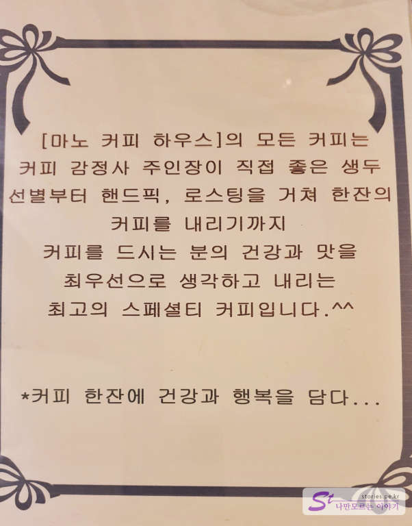  
카페를 운영하시는 주인장이 커피 감정사라서 스페셜티가 가능하다는 뜻인 것 같습니다. 
주문을 하면 주인장이 커피를 내오시는데 잔잔하고 부드러운 목소리로 커피에 대한 풍부한 지식을 바탕으로 설명을 해주시고 커피를 따라 주십니다. 스페~~ 셜~ 합니다.  

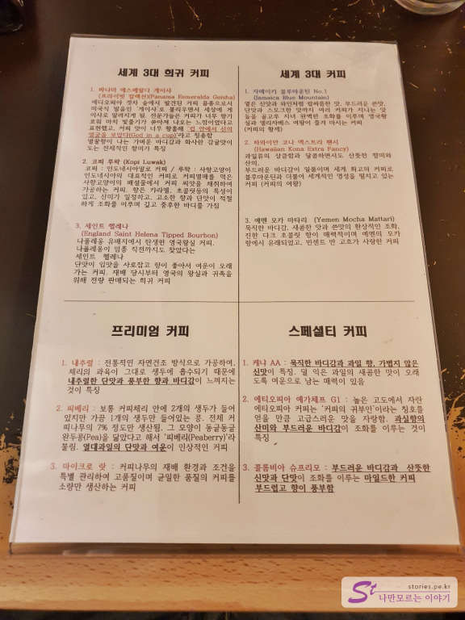  
이곳에서 내세우는 점은 세계 3대 커피를 취급한다는 주인장의 자부심인 것 같습니다. 

## 대표 메뉴와 가격(가성비)  
한달살기하시는 지인 분이 주문을 해주셔서 가격은 확인 못했지만 전체적으로 가격이 싸지는 않았던 것 같습니다. 

대표 메뉴가 커피라서 저는 냉커피를 한잔 주문했고 다른 분들은 녹차라테를 주문했습니다. 
고급커피점에서 이따위로 주문하다니.. 주인장이 우리를 우숩게 보지 않을까 걱정을 했습니다만.. 설마 그러지는 않았겠지요.  

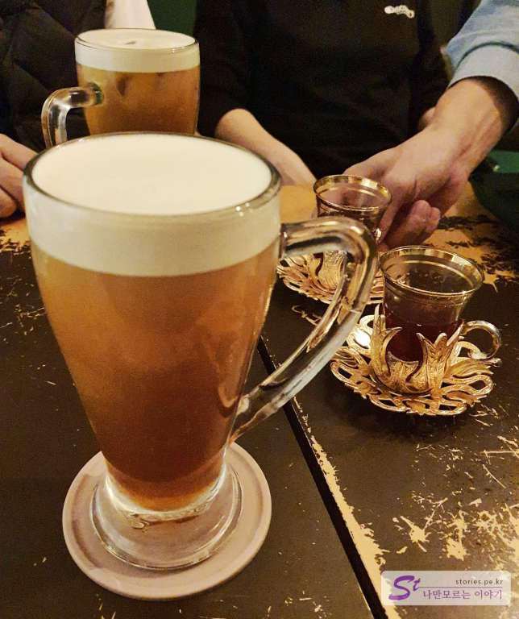  
이건 맥주가 아니고 커피입니다. 

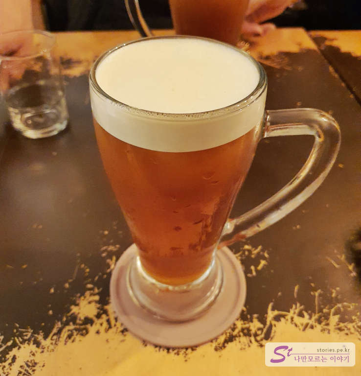  
위에 있는 거품은 주인장이 손으로 열라 저어서 만든 거품이라고 설명해 주셨습니다.

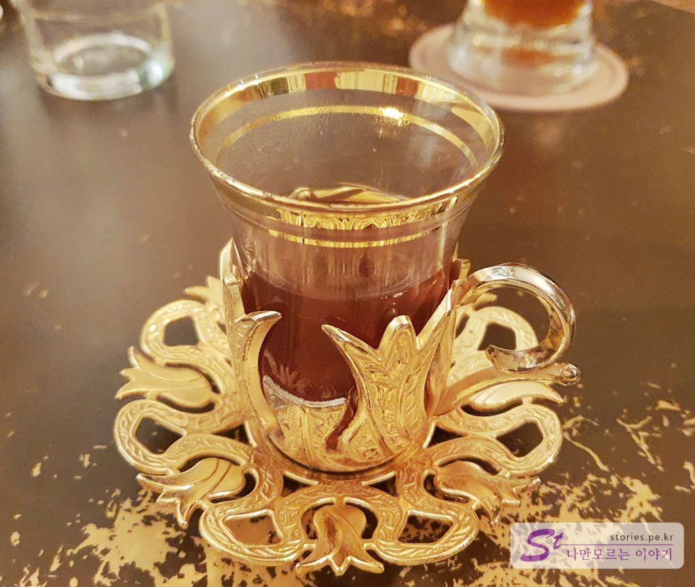  
옆에 있는 작은 금잔에 들어 있는 커피(에스프레소인 듯)를 큰 컵에 부어서 원하는 맛에 맞춰서 먹으라고 설명을 해 주셨지만.. 저는 그냥 냅다 모두 부어서 먹었습니다. 제가 쓴맛을 좋아하그등요.  
스페셜한 건지는 모르겠으나 커피의 맛이 일반 프랜차이즈 커피와는 확연이 다르긴 했습니다. 약간 싱거운 듯 하지만 과일 비슷한 맛도 나고 신맛도 좀 있고... 
주인장 설명에 의하면 커피의 색은 연한데.. 스타벅스의 커피보다 3배의 양으로 커피를 추출한 것이라는...

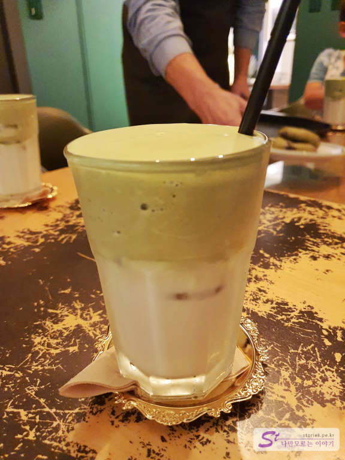  
아.. 이 녹차라테 정말 추천합니다. 어디서도 먹어보지 못한 맛이었습니다. 녹차라테 위에 올려진 녹차 거품은 정말 아이스크림을 먹는 것처럼 달고 맛있었습니다. 
주인장이 직접 제주도의 특별지역에서 엄선하여 구매한다는 녹차로 만들었다고 합니다. 

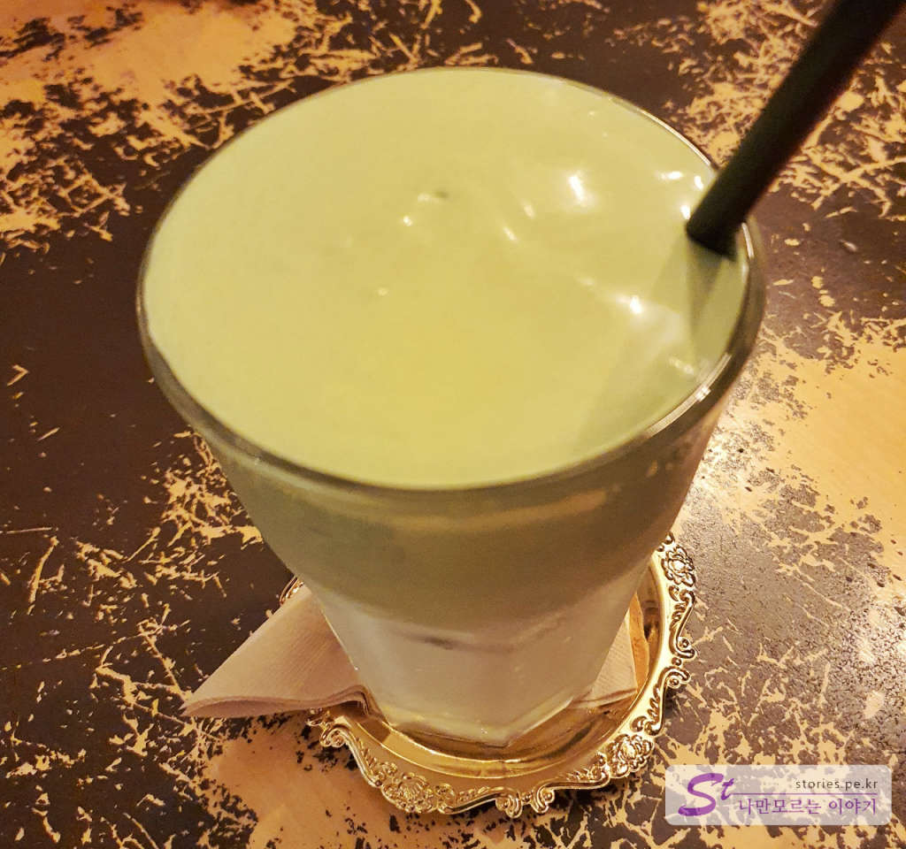
저는 녹차를 별로 좋아하지 않습니다. 녹차 아이스크림. 녹차라테도 먹지 않습니다. 특유의 풀 맛과 쓴맛이 섞인 것을 좋아하지 않기 때문입니다. 그런데 마노 커피의 녹차라테는 정말 맛있습니다. 녹차맛은 나는데 거부감은 없습니다. 만약 다음에 여기를 또 방문하게 된다면 녹차라테를 한번 시켜먹고 싶었습니다. 정말 추천합니다. 

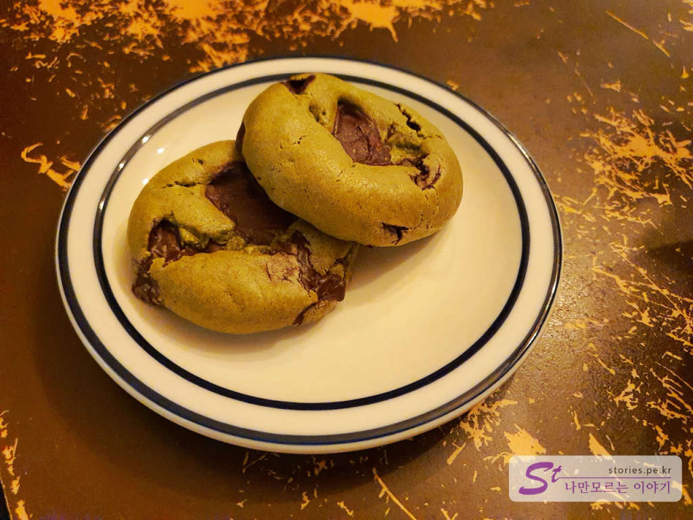  
녹차 쿠키입니다. 이것도 정말 맛있습니다. 생긴 건 못생겼는데 상상 이상의 맛과 느낌입니다. 이놈도 추천합니다. 

## 식당운영시스템  
운영 시스템이라기보다는 주인장이 자신이 만든 음식에 대해 풍부한 지식과 자부심을 갖고 있는 게 느껴집니다. 여기서 커피를 마시나 녹차 라테를 마시나 스페셜해지는 느낌을 갖게 됩니다. 

<b>운영시스템 : </b> ★★★★☆ 

## 청결도  
보통의 청결도 입니다. 매우 깨끗하거나 더럽거나 하지는 않습니다. 

<b>청결도 : </b> ★★★☆☆ 

## 친절도  
친절한 편입니다. 음식에 대한 설명을 일일이 다 해주십니다. 사용한 재료의 출처와 먹는 법 간단한 차에 대한 지식 전달 등.. 설명을 듣고 먹으니 더 좋았습니다. 

<b>친절도 : </b> ★★★★☆ 

## 식당과 주차 정보  
- 주소 : 제주 서귀포시 중문상로 97  
- 연락처 : 010-9121-7373
- 영업시간(휴무일) : 매일 11:00 ~ 21:00
- 주차 : 5~8대 정도 주차할 수 있는 주차장이 있습니다. 

    <iframe src='https://www.google.com/maps/embed?pb=!1m18!1m12!1m3!1d3996.411453360214!2d126.4262080011111!3d33.25624881353843!2m3!1f0!2f0!3f0!3m2!1i1024!2i768!4f13.1!3m3!1m2!1s0x350c5bebd0c63587%3A0xf98be0403c147cd9!2z66eI64W47Luk7ZS87ZWY7Jqw7Iqk!5e0!3m2!1sko!2skr!4v1603345421513!5m2!1sko!2skr' class='embed-responsive-item' allowfullscreen></iframe>

