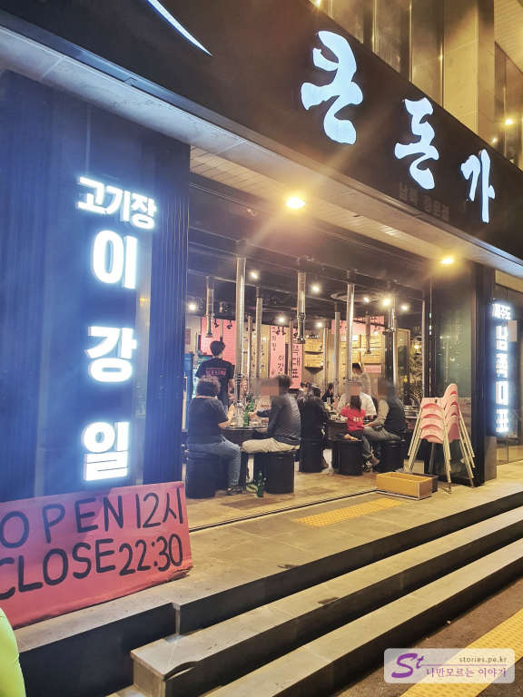
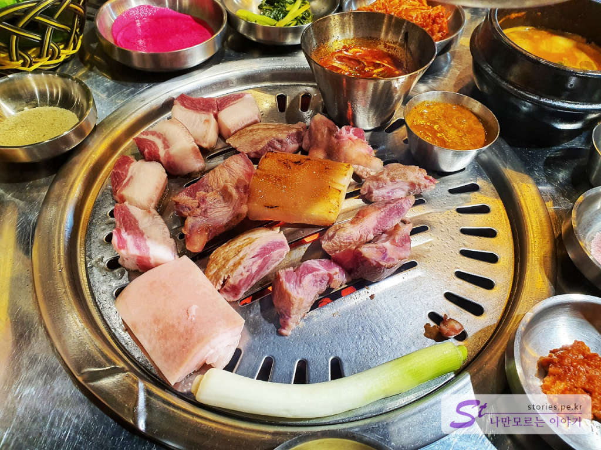
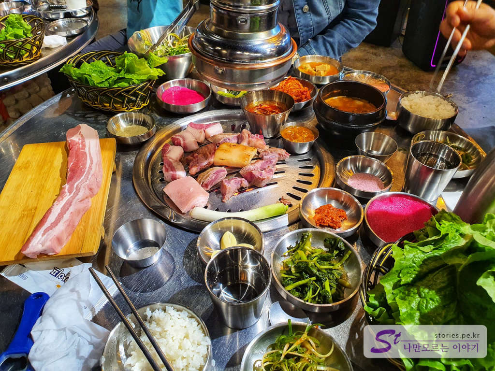
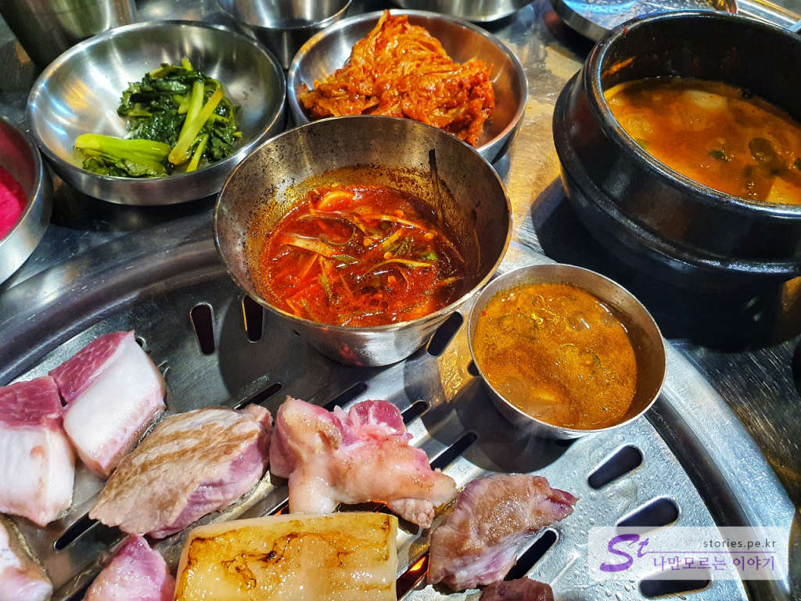
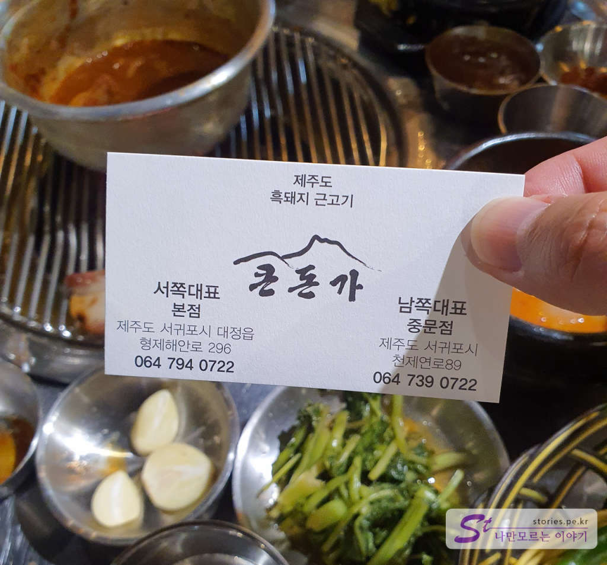

제주도에 한 달 살기 하시는 지인의 추천으로 찾은 **큰돈가**입니다. 준비 없이 찾아간 곳이라 사진을 많이 찍지 못한 것이 아쉽지만 그래도 추천할 만한 식당이어서 포스팅으로 남겨봅니다. 
보통 제주 중문은 관광단지라 제주의 다른 지역보다도 고급스럽고 가격이 비싼 편에 속합니다. 아무 생각 없이 방문하면 비싸고 맛없는 음식을 먹기 쉽죠. 저도 큰 기대 없이 추천하니 가보긴 했는데 상당히 만족스러웠습니다. 가격도 그렇게 비싸지는 않았고요.  원래 본점은 마라도 가는 배를 타는 송악산 휴게소 쪽에 있는데 중문 쪽에도 분점을 낸 것 같습니다.

  
저희는 저녁 7시쯤 방문했습니다. 웨이팅이 약 30분 정도 있었습니다. 

## 대표 메뉴와 가격(가성비)  
대표 메뉴는 **근고기**입니다. 근고기는 제주도에서 주로 사용하는 단어로 돼지고기를 근으로 달아서 판다고 해서 근고기라고 합니다. 특징은 고기가 상당히 두껍습니다. 그래서 걷은 바삭하고 속은 촉촉하게 해서 먹기에 좋습니다. 고기가 두껍기 때문에 맛있게 먹으려면 약간의 고기 굽는 기술이 필요합니다.

  
큰돈가는 흑돼지, 백돼지 모두 주문이 가능합니다. 300g 단위로 주문을 할 수 있고 **흑돼지 300g이 28,000원** , **백돼지 300g이 22,000원**입니다.  
사람마다 다르겠지만 일반 성인 기준으로 600g이면 대략 3명 정도가 적당히 먹을 수 있는 수준이라고 보시면 됩니다. 

## 먹어본 음식  
  
저희가 먹은 음식은 흑돼지 600g과 , 된장찌개, 계란찜, 김치찌개입니다. 된장찌개는 그냥 같이 나왔던 것 같습니다.(먹긴했는데 가격에 포함된 건지 헷갈리네요)  
흑돼지나 백돼지 모두 거의 맛이 같을 텐데.. 그래도 제주도에 왔으니 좀 비싸더라도 흑돼지로 시켜봤습니다. 

  
곁들여 나온 반찬들도 맛있고 특제소스라고 원료를 알려주지 않은 소스도 먹을만했습니다. 옆에 멸치로 만든 멜젓이 있는데.. 저는 멜젓을 먹지 못해서 패스했어요..
블로거의 본분을 망각하고 사진을 찍지 못했는데... 계란찜과 김치찌개도 상당히 맛있었습니다. 

## 식당 운영시스템  
식당의 운영시스템은 상당히 체계적이였습니다. 테이블당 담당 직원이 있어서 원하는 것을 바로바로 처리해 주었고 무엇보다도 고기를 직접 구워서 썰어서 설명과 함께 한 점씩 모든 사람에게 나눠주는데 목살임에도 상당히 부드러운 식감을 느낄 수 있었습니다. 초반에 직원이 설명과 함께 다양한 굽는 방법, 부위, 소스를 곁들여서 주는 것이 좋았습니다. 그 이후 나머지는 직접 손님들이 구워서 먹게 되어 있습니다. 
이렇게 하니 테이블의 회전율이 좋아서 빨리 먹고 나가고 다음 손님을 받을 수 있어서 식당도 좋고 대접받는 느낌이라 손님도 좋은 기억이 남았던것 같습니다. 

<b>운영시스템 : </b> ★★★★☆ 

## 청결도  
청결도 상당히 신경을 쓰는 모습이었습니다. 옆 테이블의 상치우는 모습을 봤는데 새 행주를 4~5개를 써서 닦습니다. 아주 깨끗하게.. 

<b>청결도 : </b> ★★★★☆ 

## 친절도  
식당이 붐벼서 친절도를 기대하기 힘들기는 하지만 이해해줄 만한 수준입니다. 괜찮아요.

<b>친절도 : </b> ★★★★☆ 

## 식당과 주차 정보  
  
식당을 나갈 때 명함을 하나씩 주네요. 참고하세요. (서비스 받은 것 없습니다. 내돈내먹 입니다.)

- 주소 : 제주 서귀포시 대정읍 형제해안로 296  
- 연락처 : 064-794-0722(중문) 
- 영업시간(휴무일) : 12:00 - 22:00 (라스트오더 21시)
- 브레이크 타임 : 15:00 - 17:00 (14시 10분)
- 주차 : 식당 뒤편으로 10대가량 주차할 수 있는 주차장이 있음

    <iframe src='https://www.google.com/maps/embed?pb=!1m18!1m12!1m3!1d5734.1102272236985!2d126.41136481377256!3d33.254370102204064!2m3!1f0!2f0!3f0!3m2!1i1024!2i768!4f13.1!3m3!1m2!1s0x350c5bd55bf4c505%3A0xd006a7e7381f6f92!2z7YGw64-I6rCAIOykkeusuOygkA!5e0!3m2!1sko!2skr!4v1603339021284!5m2!1sko!2skr' class='embed-responsive-item' allowfullscreen></iframe>

 
