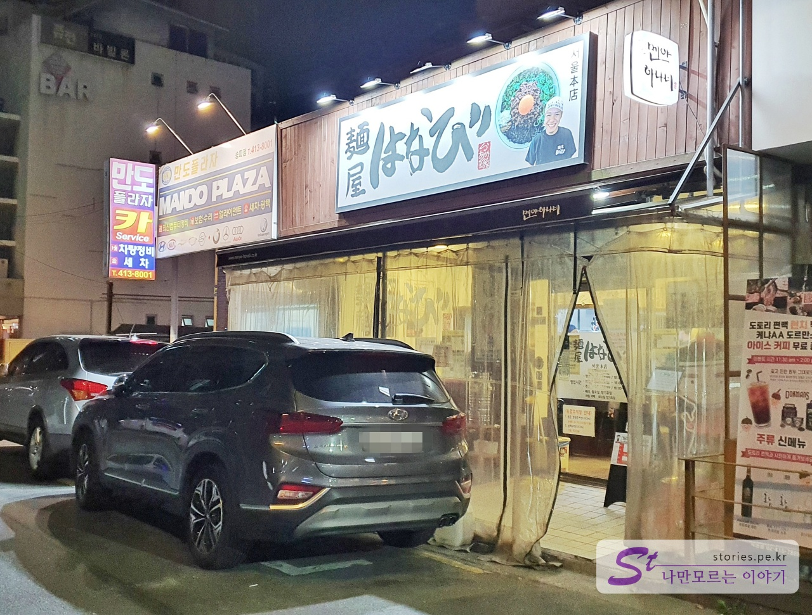
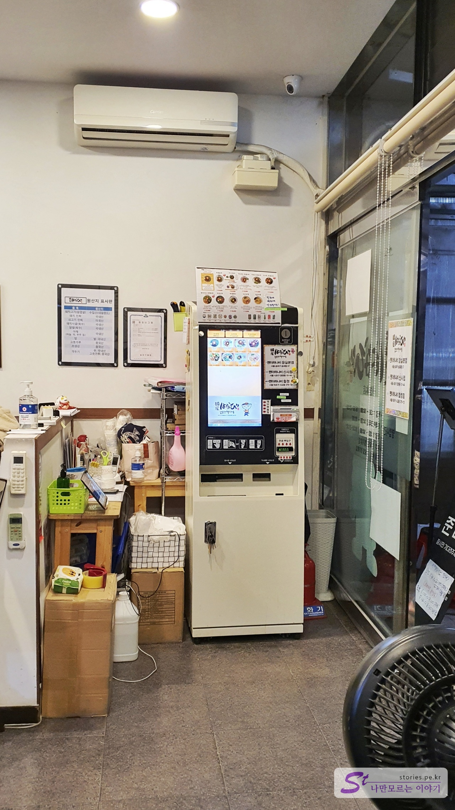
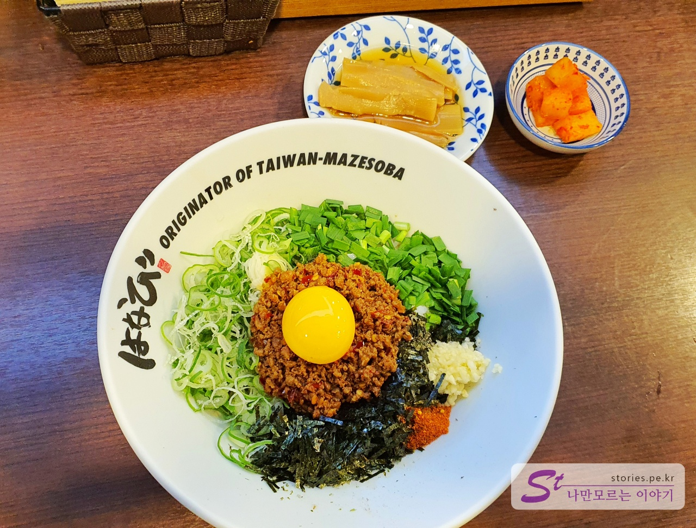
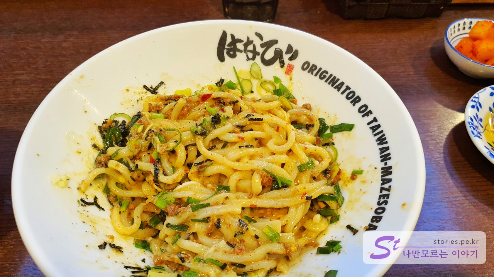
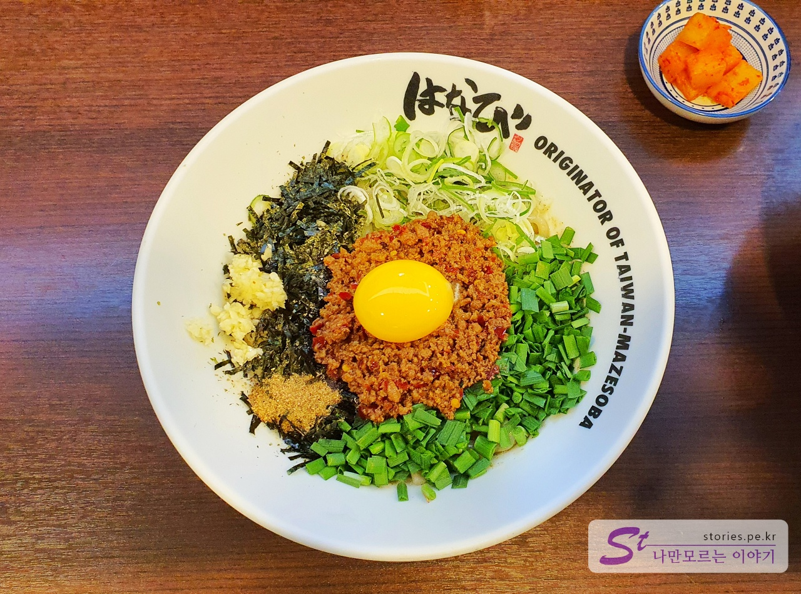
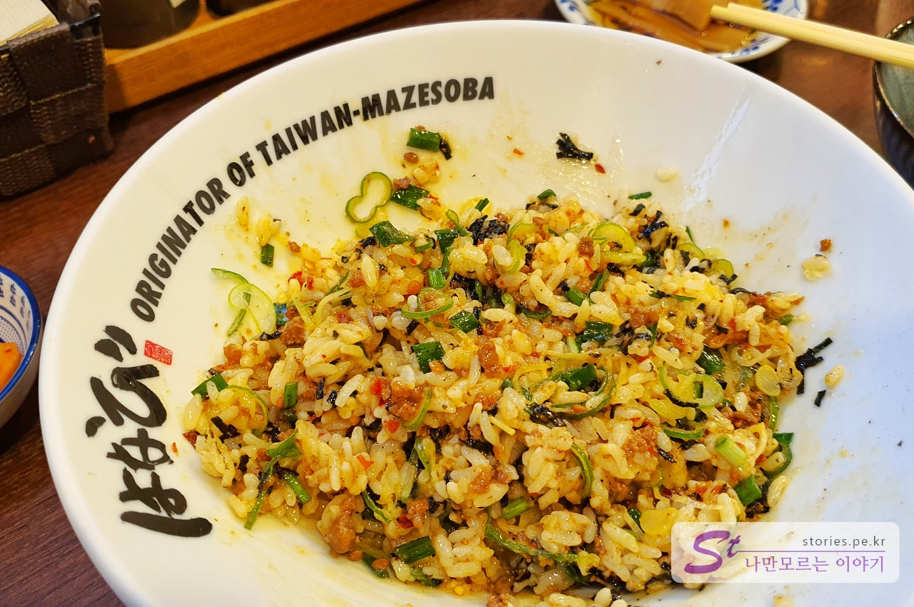
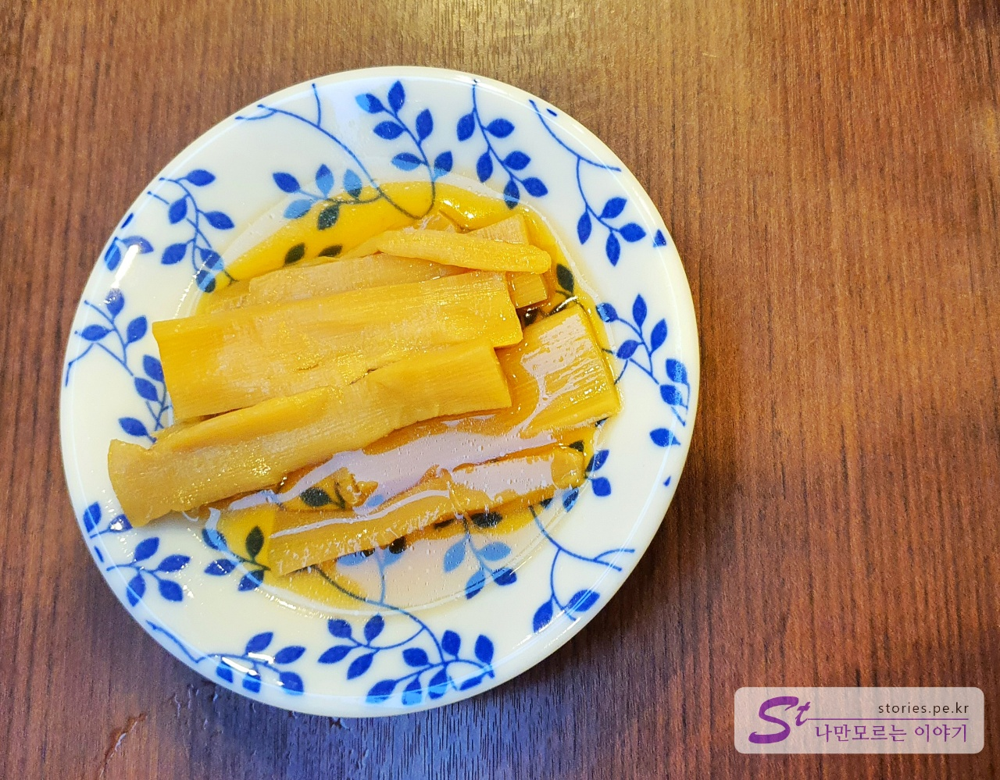
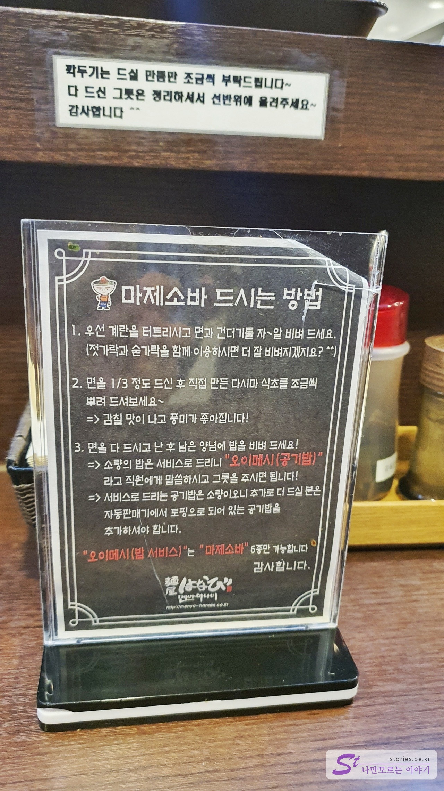

**롯데월드타워**의 **시그니엘호텔**에 하루 숙박하면서 저녁으로 먹어본 송리단길 맛집 **멘야하나비**입니다. 시그니엘 호텔의 숙박기는 아래의 링크를 참조하세요.

> [[서울] 롯데월드타워 마천루에서 즐기는 호캉스의 끝판왕 서울 시그니엘 호텔 방문기](https://blog.stories.pe.kr/524)

멘야하나비는 어느 방송에서 소개가 되어 기억하고 있다가 찾아온 곳입니다. 일본식 비빔면이라 할 수 있는 마제소바 맛집입니다.

  
멘야하나비는 맛집이 많이 모여있는 송리단길의 한쪽 골목에 위치해 있습니다. 우리는 웨이팅이 없었으나 우리의 뒷팀부터 약간의 웨이팅이 있었습니다.

  
먼저 입장을 하면 주문은 자판기로 주문을 하는 시스템입니다. 코로나 19로 인해 인적사항도 적고 입장해야 합니다.

## 대표 메뉴와 가격(가성비)

메뉴는 마제소바가 기본입니다. 마제소바는 '섞다'라는 뜻의 일본식 비빔면을 말합니다.

- 마제소바 : 10,000원
- 마제메시 : 10,000원
- 도니꾸 마제소바 : 13,000원
- 카레 마제소바 : 11,000원
- 네기 시오 마제소바 : 13,000원
- 키미스타 : 13,000원

## 먹어본 음식

우리는 기본 마제소바와 마제메시를 주문했습니다.

  
마제소바의 마제는 **섞다**라는 뜻이고 소바는 **일본식 면**을 말합니다. 다시 말하면 일본식 비빔면을 마제소바라고 합니다.

  
비비면 소바가 보입니다.

  
섞기 전의 마제메시도 마제소바와 거의 똑 갔습니다. 단지 면 대신에 밥이 깔려있을 뿐입니다.

  
섞어 놓으면 밥이 보입니다.

보통은 마제소바를 주문해서 먹고 거의 다 먹었을 때 **오이 메시~**라고 말하면 무료로 약간의 공깃밥을 줍니다. 그러면 남아 있는 양념장에 밥을 비벼서 먹습니다.

  
반찬으로 죽순 절임이 나옵니다.

  
마제소바를 맛있게 먹는 방법도 있으니 미리 보고 가면 좀 더 맛있게 먹을 수 있습니다.

## 식당운영시스템

요리사도 많고 서빙도 2명 이상 있어서 운영은 문제없이 잘 되고 있습니다.

<b>운영시스템 : </b> ★★★★☆ 

## 청결도

일식이 보통 그렇듯이 지저분하지는 않습니다. 많이 깨끗한 분위기는 아니고 일본의 노포 갔은 느낌입니다.

<b>청결도 : </b> ★★★☆☆ 

## 친절도

친절하지도 불친절하지도 않습니다. 그냥 보통 정도 하는 것 같습니다.

<b>친절도 : </b> ★★★☆☆ 

## 식당과 주차 정보

- 주소 : 서울 송파구 백제고분로45길 38
- 연락처 : 070-8959-1108
- 영업시간 : 평일 11:30 ~ 21:00 (주말 : ~ 20:30 )
  - 브레이크타임 : 평일 14:00 ~ 18:00 (주말 : 14:30 ~ 17:30 )
  - 휴무일 : 매주 월요일
- 주차 : 별도의 주차장이 없습니다.

    <iframe src='https://www.google.com/maps/embed?pb=!1m18!1m12!1m3!1d405103.4226990109!2d126.82762093281247!3d37.510972599999995!2m3!1f0!2f0!3f0!3m2!1i1024!2i768!4f13.1!3m3!1m2!1s0x357ca575bc4a1695%3A0xd8328af7e85d0e71!2z66mY7JW87ZWY64KY67mEIOyEnOyauOuzuOygkA!5e0!3m2!1sko!2skr!4v1605370936138!5m2!1sko!2skr' class='embed-responsive-item' allowfullscreen></iframe>

