보통 동해의 맛집이라고 하면 장칼국수, 물회, 회, 대게 등을 찾게 되지만 그것보다는 현지인들에게 유명한 율짬뽕을 추천해 봅니다. 현지인뿐 아니라 여행객에게도 정말 맛있는 짬뽕을 제공해 줍니다.

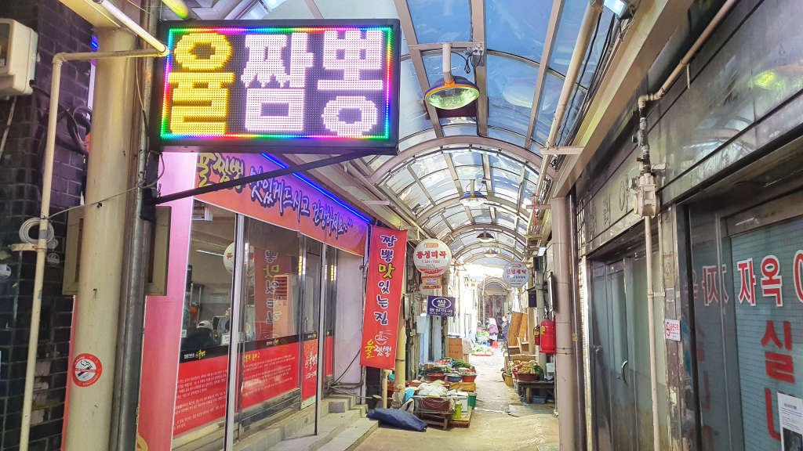  
율짬뽕은 동해 중앙시장 안 골목에 위치해 있어서 처음 찾으려면 좀 헤매는 것은 각오를 해야 합니다.

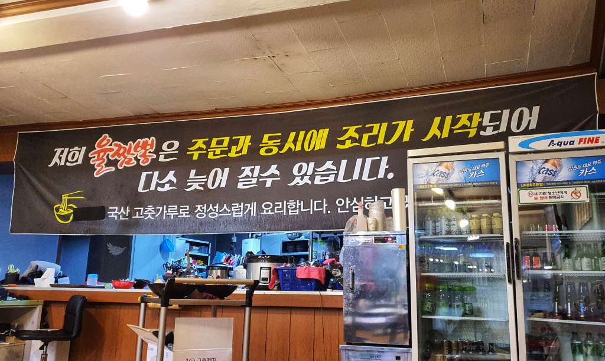  
힘들게 찾아들어가면 생각보다 많은 테이블이 놓여 있습니다. 또한 평일에 찾아가면 많이 기다리지 않고 식사를 할 수 있습니다.

## 대표 메뉴와 가격(가성비)

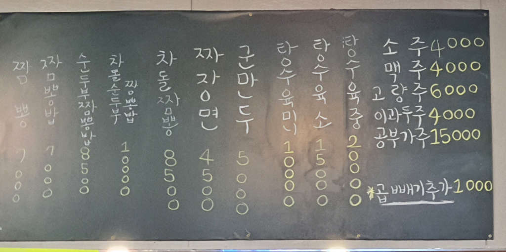  
다양한 메뉴의 중식 음식들이 있지만 가장 유명한 음식은 **차돌짬뽕**입니다. 여기에 온 대부분의 손님은 차돌 짬뽕류의 음식을 시켜서 먹고 있었습니다.

## 먹어본 음식

저희가 먹어본 음식은 **차돌짬뽕**, **짜장면**, **탕수육미니**를 시켜서 먹어봤습니다.

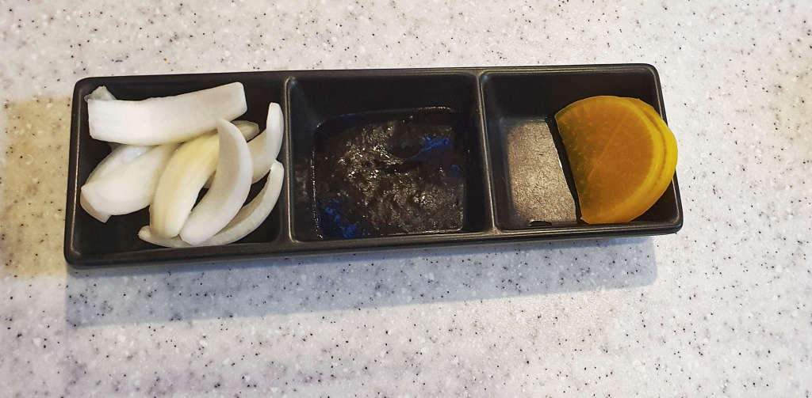  
반찬은 평범한 양파와 단무지입니다. 다만 소스가 특이하게 생춘장이 아니고 볶은 춘장입니다.

### 탕수육

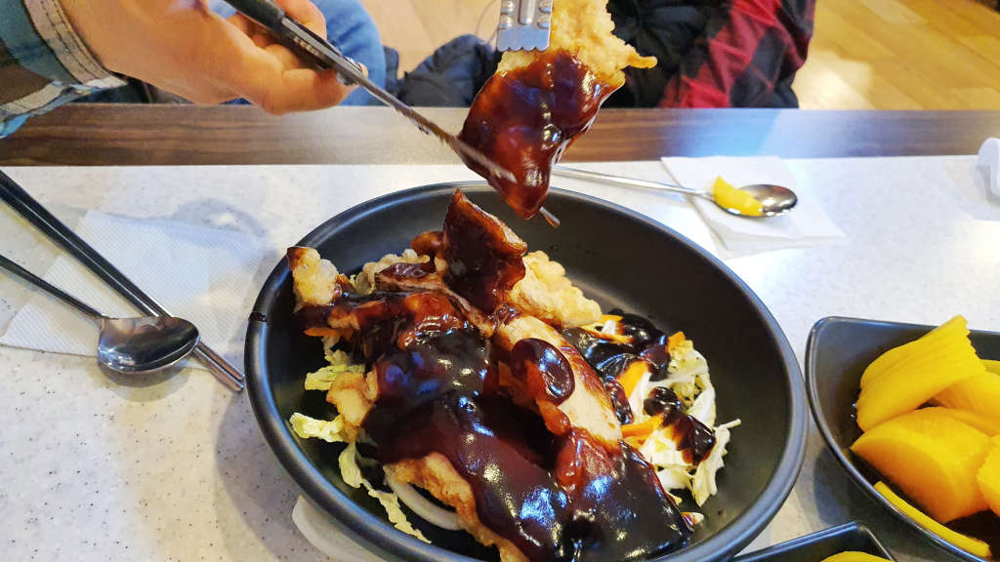  
처음 먼저 나온 음식이 탕수육입니다. 이런 탕수육은 처음 먹어봅니다. 아주 독특합니다.

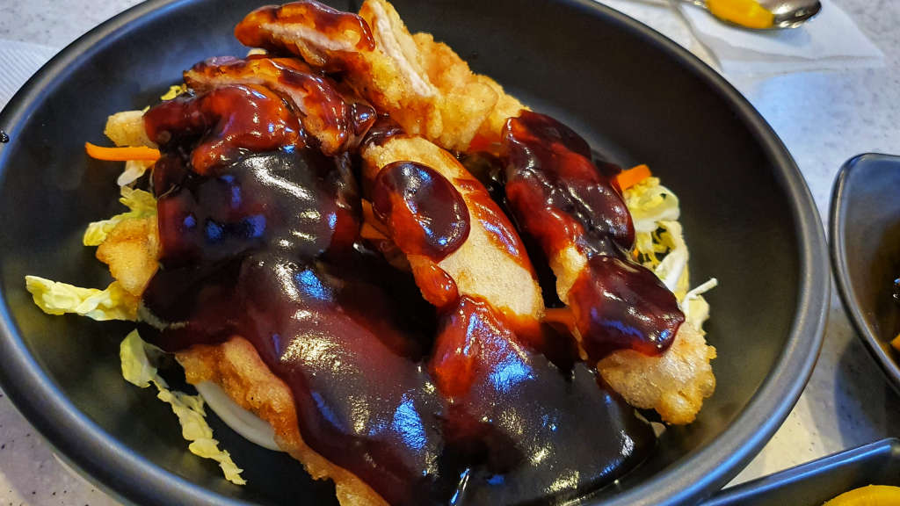  
탕수육에 뿌려진 소스는 일반적이지 않고 약간 발사믹 소스 같은 강한 맛이 납니다.

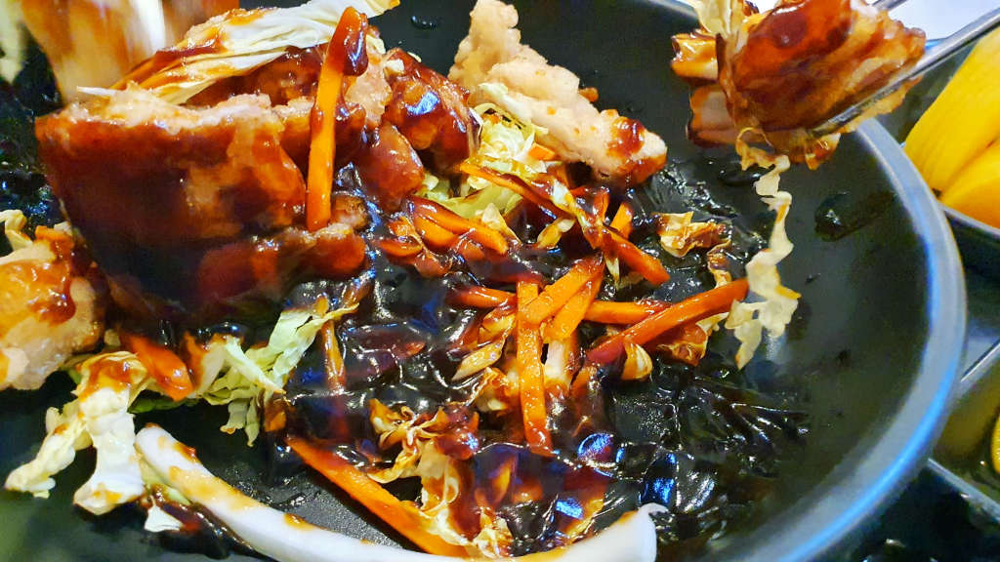  
특이한 것이 탕수육 아래에 썰은 배추를 깔아놨습니다. 배추와 당근과 탕수육을 소스와 같이 먹으면 생각보다 조합이 좋습니다. 맛있어요..

### 짜장면

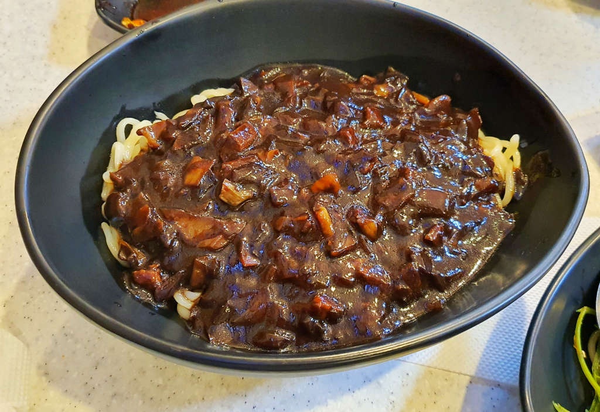  
짜장면은 그냥 그렇습니다. 맛이 없다는 말이 아니고 그냥 평범한 짜장면의 맛입니다. 괜찮아요. 하지만 여기는 차돌 짬뽕 맛집이기 때문에 홀 안에 굳이 이걸 시켜먹는 사람은 우리밖에 없었습니다.

### 차돌짬뽕

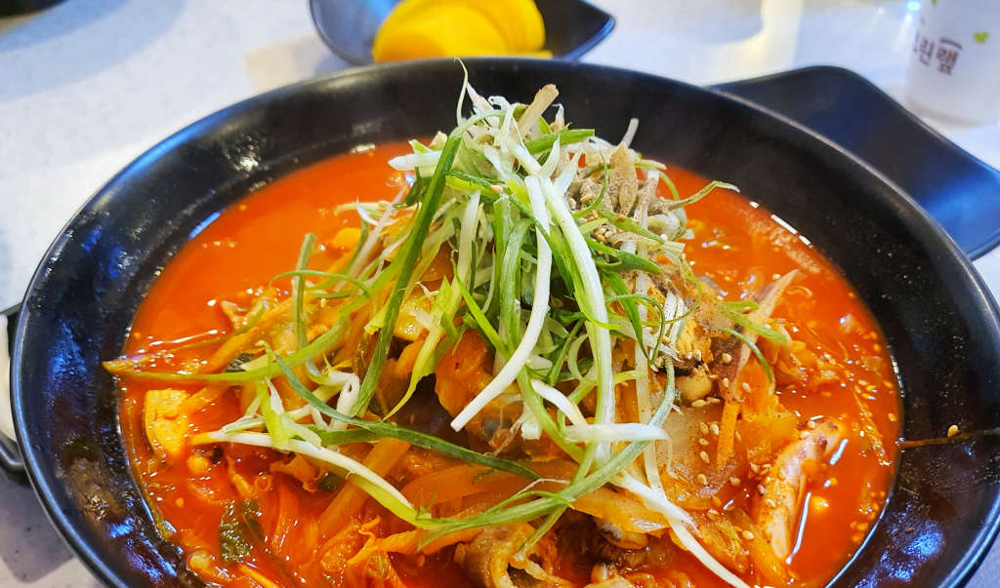  
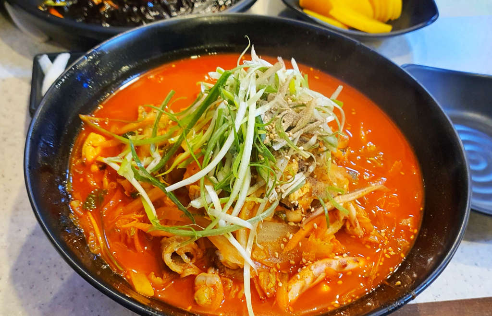  
처음 차돌 짬뽕을 받으면 묵직한 짬뽕의 비주얼에 군침이 돕니다. 웬만하면 맛있는 비주얼입니다.

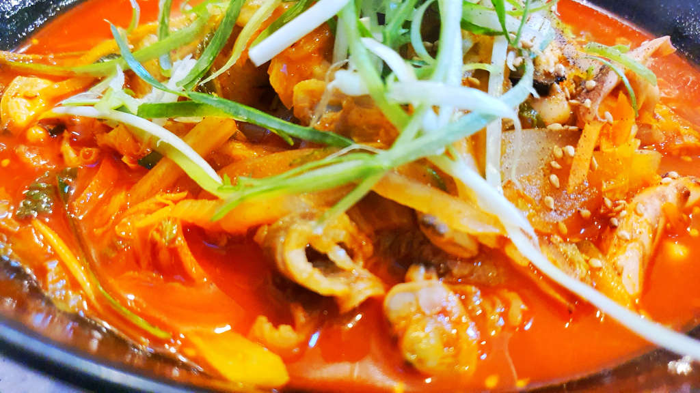  
내용물을 보면 빨간 짬뽕에 차돌과 오징어가 들어있는 것이 보입니다. 차돌이 특유의 깊은 맛을 더해 줍니다.

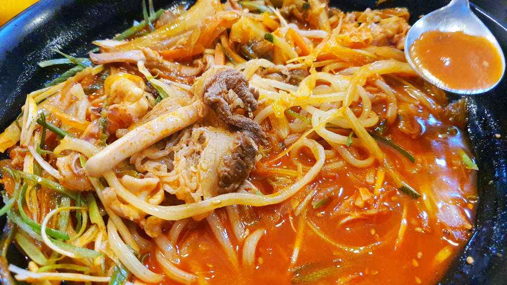  
떠들쳐본모습입니다. 짬뽕을 좋아한다면 정말 실망하지 않을 맛과 비주얼입니다.

## 청결도

재래시장안에 위치해 있는 음식점 치고는 깨끗한 편입니다.

<b>청결도 : </b> ★★★★☆ 

## 식당과 주차 정보

- 주소 : 강원 동해시 시장안길 20-2 인천식당 (원래 이름이 인천식당이였나 봅니다.)
- 연락처 : 033-533-5186
- 영업시간(휴무일) : 화~일 11:00 ~ 19:00 (월요일 휴무)
- 주차 : 시장안이라 별도의 주차장은 없습니다.

<iframe src='https://www.google.com/maps/embed?pb=!1m18!1m12!1m3!1d3163.1996440907023!2d129.10630311516732!3d37.55035987980092!2m3!1f0!2f0!3f0!3m2!1i1024!2i768!4f13.1!3m3!1m2!1s0x3561c7069163333b%3A0x810ee05ac17cb159!2z7Jyo7Kes672V!5e0!3m2!1sko!2skr!4v1606836724599!5m2!1sko!2skr' class='embed-responsive-item' allowfullscreen></iframe>

