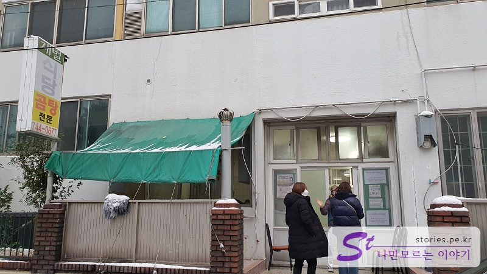
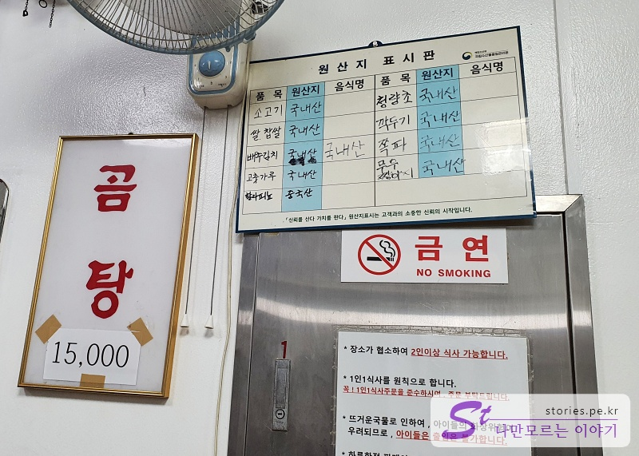
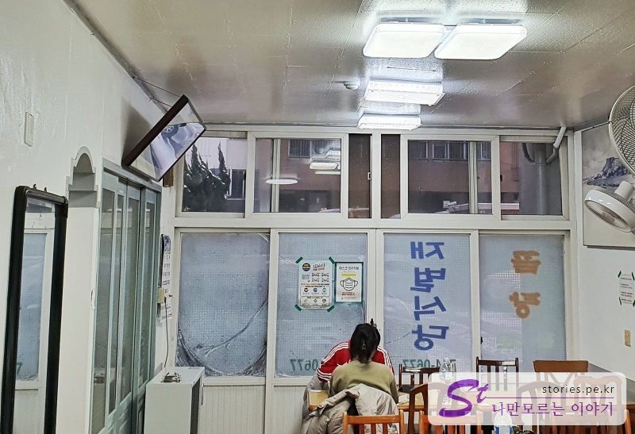
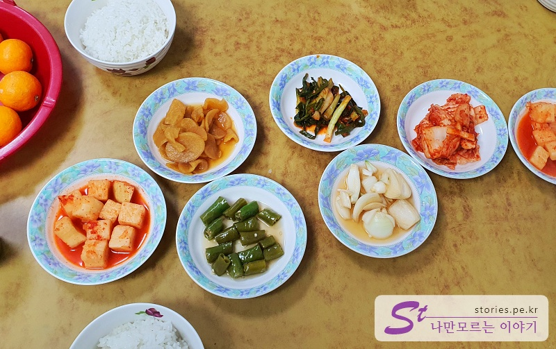
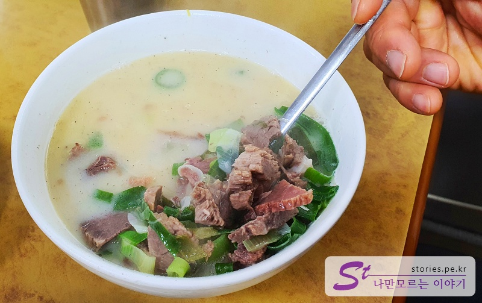
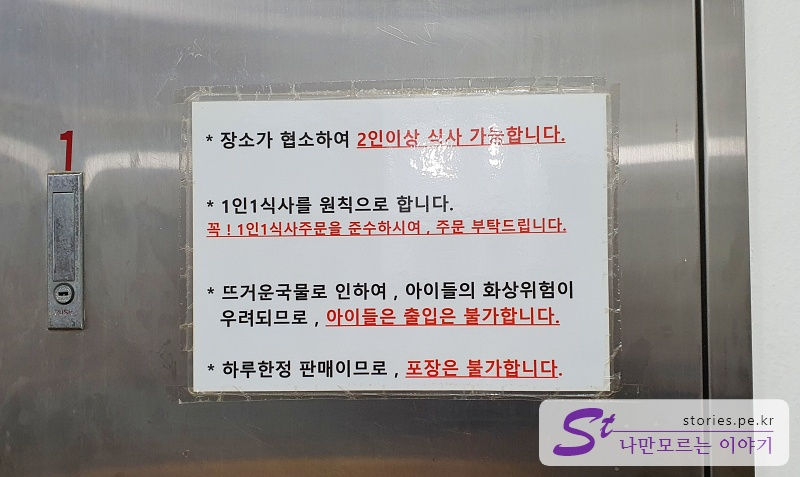

> [[제주 여행] 겨울에 짧고 알차게 다녀온 1박 2일 제주도 여행 바로 가기](https://blog.stories.pe.kr/561)

제주여행의 둘째 날 아침부터 든든히 식사를 하기 위해 8시에 제주시 연동에 있는 재벌 식당에 다녀왔습니다. 인스타와 인터넷에서 맛집으로 소문난 식당이라고 하는데 저희는 아침 일찍 가서 그런지 손님들이 많지는 않았습니다.

노포 느낌이 물씬 나는 허름한 식당 입구 같지만 그래도 주상복합아파트의 상가입니다.

## 대표 메뉴와 가격(가성비)

대표 메뉴나마 나 15,000원짜리 곰탕 하나밖에 없습니다. 한 끼에 15,000원이면 결코 싼 가격은 아닙니다. 다만 양도 많고 맛도 있습니다. 매일 먹기에는 가격적인 부담이 있지만 여행 와서 한 번쯤은 먹어볼 만한 메뉴입니다.

식당 내부도 허름하고 주방장님도 할머니 2분과 중년의 여자분이 운영을 하고 계셨습니다. 따님인지, 직원인지는 모르겠네요. ^^

곰탕을 주문하면 먼저 밥하고 반찬이 나옵니다. 반찬은 대체적으로 맛이 좋습니다. 겨울철이라 그런지 귤도 서비스로 먹을 수 있었습니다.

민숭민숭한 곰탕이 나왔습니다. 내공이 보이는 색깔이지만 숟가락을 꽂기 전까지는 대단해 보이지 않습니다.

하지만 숟가락으로 바닥을 한번 흟어보면 엄청난 양의 고기를 만날 수 있습니다.

## 식당 운영 시스템

<b>운영 시스템 : </b> ★★★☆☆

지방 식당이 대부분 그렇지만 고객에게 친절하지는 않습니다. 2인 이상 식사에 반드시 1인 1 식을 주문해야 합니다. 먹는 양이 적은 사람은 남기기 아까울것 같아요.
그래도 메뉴가 하나라 순서가 바뀐다든지 메뉴가 잘못 나온다든지 하지는 않습니다.

## 청결도

<b>청결도 : </b> ★★☆☆☆

썩~ 청결하지는 않아요.. 그렇다고 더러운 건 아닌데, 오래된 건물에 할머니분들이 운영을 해서 그런지 노포의 느낌이라고 보시면 됩니다.

## 친절도

<b>친절도 : </b> ★★★★☆

오전에 붐비지 않은 시간에 가서 그런지 불친절하지는 않았습니다. 겨울이라 서비스로 귤도 주시고.. 시골의 인심이 느껴지는 식당입니다. (그런데 곰탕 값은 비싸네요..)

## 식당과 주차 정보

- 주소 : 제주 제주시 도령로7길 20 신광아파트
- 연락처 : 064-744-0677
- 영업시간(휴무일) : 매일 08:00 - 14:00 : 재료가 떨어지면 문 닫는다고 하네요.
- 주차 : 가게 앞에 2~3대 주차할 수 있고 아파트 안에 몇 대를 댈 수 있습니다.

<iframe src='https://www.google.com/maps/embed?pb=!1m18!1m12!1m3!1d415.9273568216376!2d126.48428075824219!3d33.49047804405906!2m3!1f0!2f0!3f0!3m2!1i1024!2i768!4f13.1!3m3!1m2!1s0x350cfb038ff596fd%3A0xe5271c4a77682694!2z7J6s67KM7Iud64u5!5e0!3m2!1sko!2skr!4v1643443245354!5m2!1sko!2skr' class='embed-responsive-item' allowfullscreen></iframe>

