> [[제주 여행] 겨울에 짧고 알차게 다녀온 1박 2일 제주도 여행 바로 가기](https://blog.stories.pe.kr/561)

제주 협재해수욕장 쪽의 맛집이라고 하면 **협재수우동**을 빼놓을 수 없습니다. 상황에 따라 다르겠지만 보통 수우동에서 식사를 하려면 대략 1~3시간 정도는 대기할 각오를 해야 합니다. 저희도 먼저 **협재수우동**에 예약을 걸어놓고 기다리는 동안 싱게물공원에 다녀왔습니다.

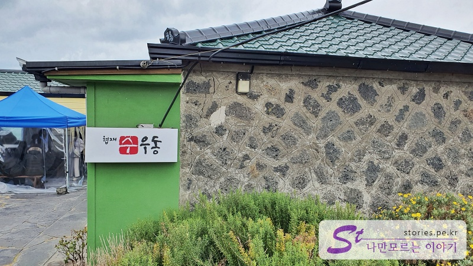

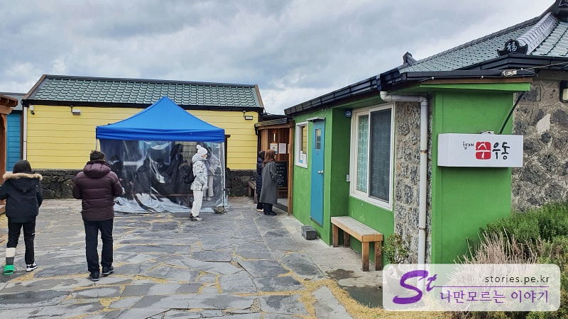

협재수우동은 나 혼자 산다 등.. 방송에 방영이 되면서 많이 알려졌고 그래서 사람들도 많이 찾는 곳이 되었습니다.

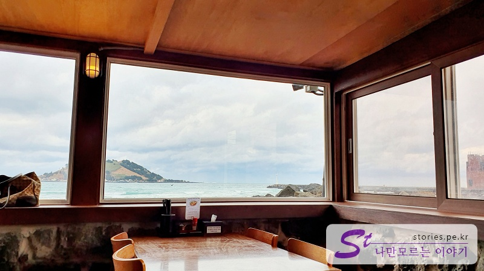

음식 맛도 상당히 좋은 편이고 또한 식당에서 창문을 통해 바라다 보이는 비양도는 여기가 제주라는 것을 다시 한번 상기시켜주는 요소이기도 합니다. 말하자면 맛, 인기, 경치로 3박자가 맞아떨어지는 식당입니다.

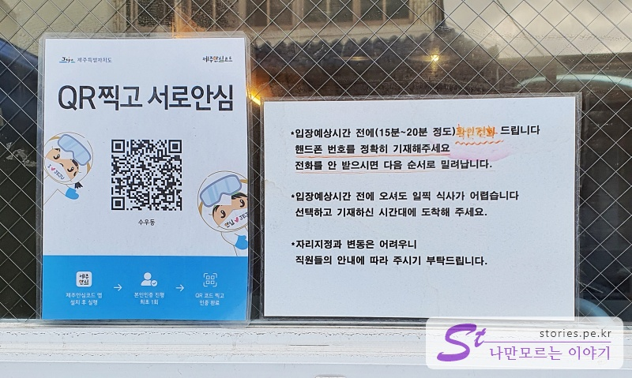

먼저 협재수우동에 오시면 주문 등록을 먼저 해야 합니다. 주문을 하고 전화번호를 남겨놓으면 입장 10~30분 전쯤에 전화로 알려줍니다. 그래서 주문을 등록하고 가까운 곳에 관광을 다녀와도 좋습니다.

## 음식 메뉴

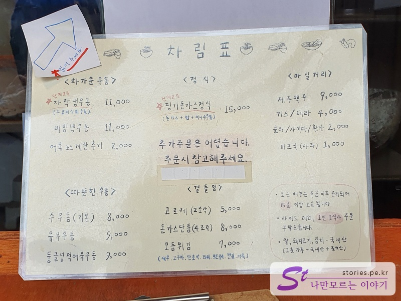

음식은 차가운 우동, 따뜻한 우동, 정식, 곁들임으로 구성이 되어 있습니다.

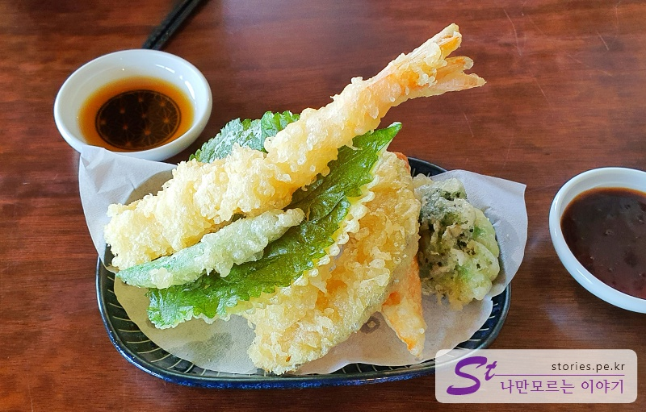

모둠튀김입니다. 새우, 고구마, 단호박, 깻잎, 어묵 등을 바싹하게 튀겨져서 나옵니다. 신발도 튀기면 맛있다고 하는데, 당연히 맛이 좋았습니다.

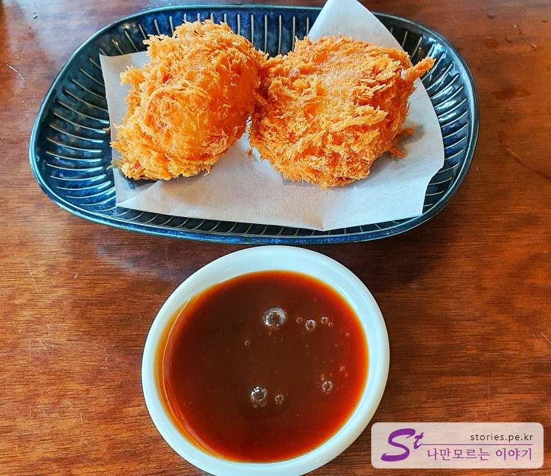

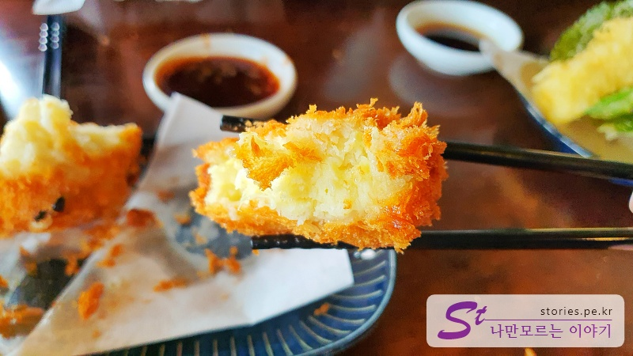

고로케는 생각보다 크기가 작습니다. 작아도 맛은 좋습니다. 평균 이상의 맛입니다.

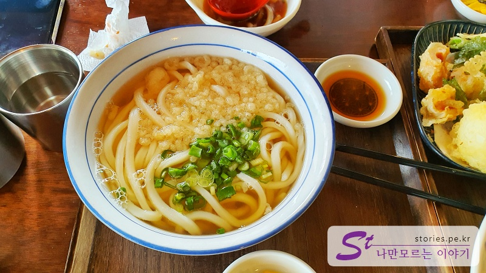

수우동의 기본 메뉴인 따뜻한 우동입니다. 가장 기본인 우동이지요. 면발과 국물이 조화롭지만 매우 특별히 맛있다는 느낌은 없습니다. 제 입맛에는 평타 정도 하는 것 같아요.

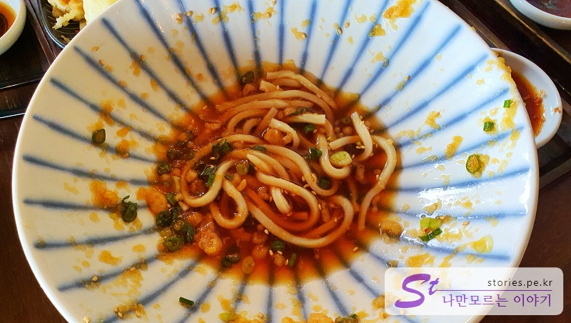

차가운 우동인 자작냉우동입니다. 수요미식회에도 나왔다고 하는데, 정말 맛있습니다. 또 먹고 싶은 맛입니다. 만약 메뉴를 하나만 선택해야 한다면 **자작 냉우동**을 주문하시면 됩니다. 먹는데 정신 팔려서 먹는 중에 생각나서 겨우 찍었네요. ㅠㅠ

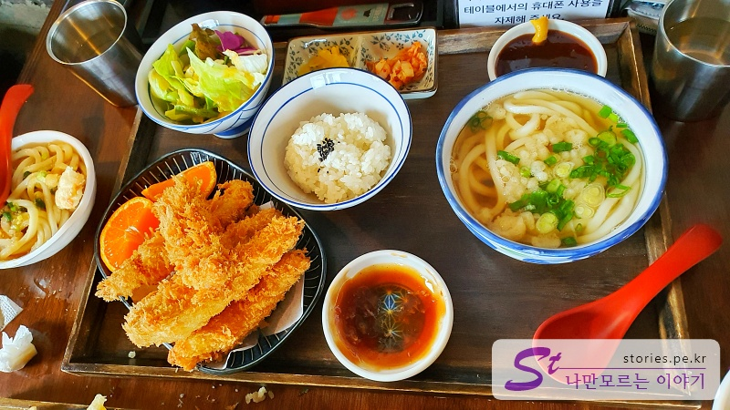

마지막으로 핑거 돈가스 정식입니다. 평균 이상의 맛이지만 크게 특색이 있지는 않습니다.

## 식당 운영 시스템

손님이 많으나 대기 운영 시스템이 잘 되어 있고 테이블에 착석을 하고 음식이 나올 때까지 크게 불편함은 없었습니다.

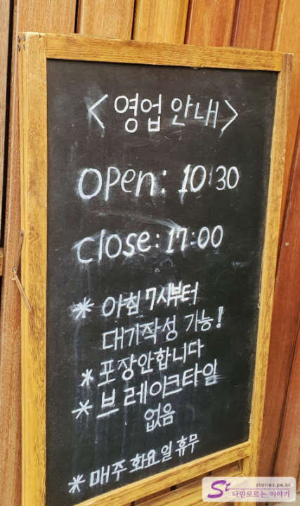

오픈은 10:30분부터지만 아침 7시부터 대기표를 작성할 수 있습니다.

<b>운영 시스템 : </b> ★★★★☆

## 청결도

일식이라 그런지 실내도 깔끔한 편입니다.

<b>청결도 : </b> ★★★★☆

## 친절도

몰려드는 사람 때문에 피로도가 상당히 높을 텐데도 친절한 편해 속합니다.

<b>친절도 : </b> ★★★★☆

## 식당과 주차 정보

- 주소 : 제주 제주시 한림읍 협재 1길 11
- 연락처 : 064-796-5830
- 영업시간(휴무일) : 10:30 - 17:00 주문은 오전 7시부터 받음 (매주 화요일 정기휴무)
- 주차 : 대략 10~15 정도 주차를 할 수 있는 주차장이 있고 해변 쪽으로도 몇 대를 주차할 수 있습니다.
  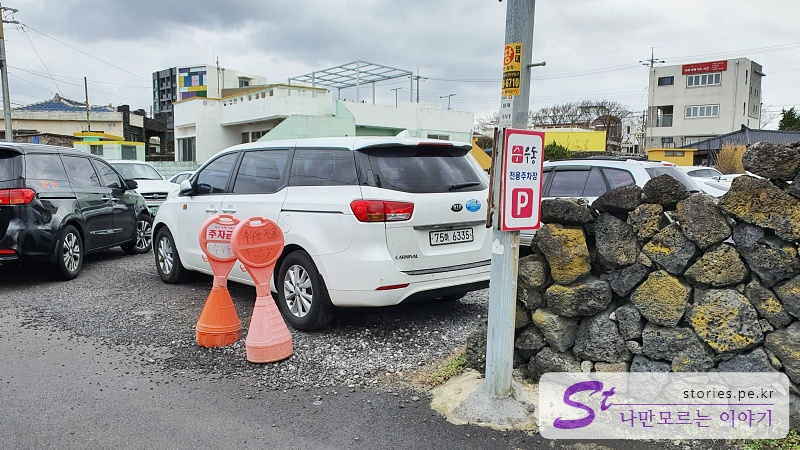

<iframe src='https://www.google.com/maps/embed?pb=!1m18!1m12!1m3!1d6662.045157352068!2d126.24251466788488!3d33.39657514054692!2m3!1f0!2f0!3f0!3m2!1i1024!2i768!4f13.1!3m3!1m2!1s0x350c609343a726ef%3A0xe8ba61968d7e8409!2z7IiY7Jqw64-Z!5e0!3m2!1sko!2skr!4v1643880405190!5m2!1sko!2skr' class='embed-responsive-item' allowfullscreen></iframe>

## 기타 사항

주문을 먼저 걸어놓고 2~3시간 여유가 있다면 가까운 싱게물 탐방로를 다녀오시는 것을 추천드려요~
