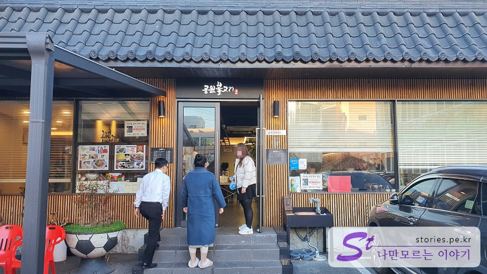
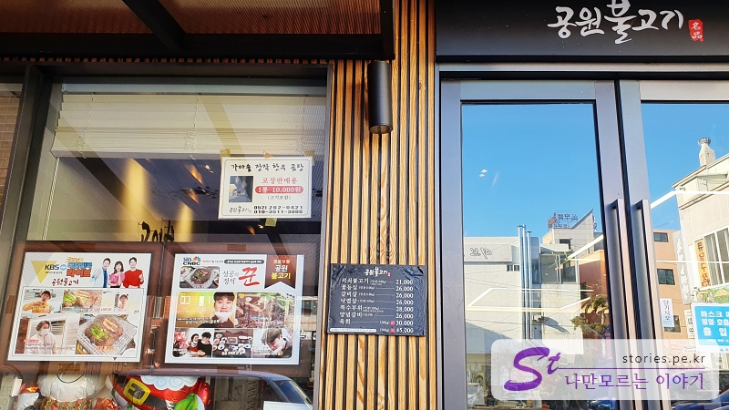
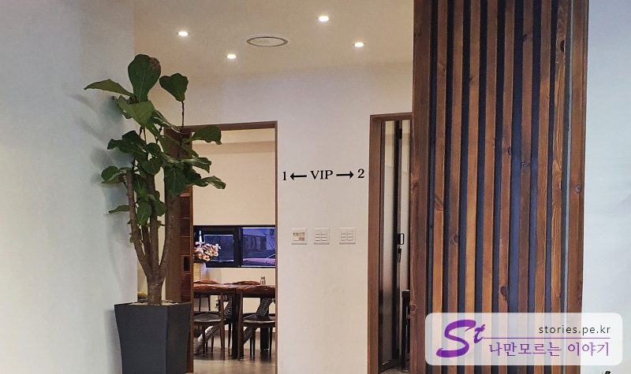
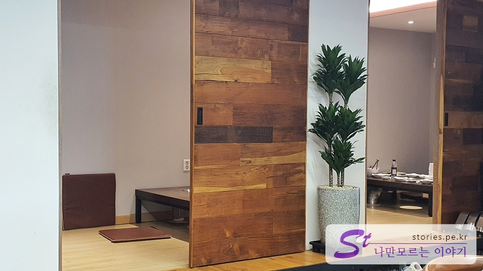
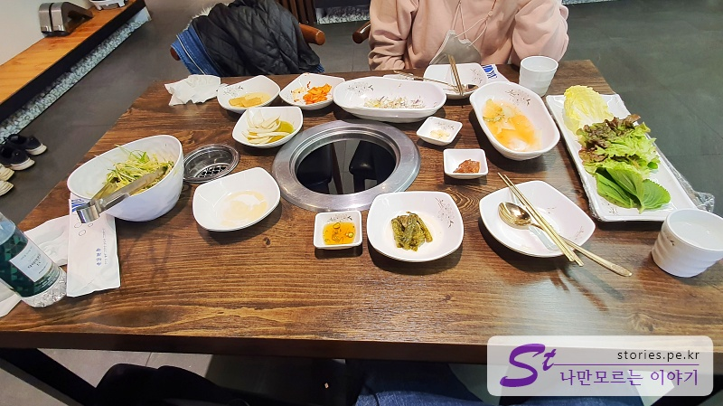
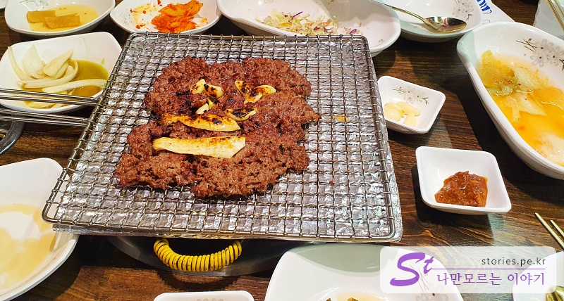
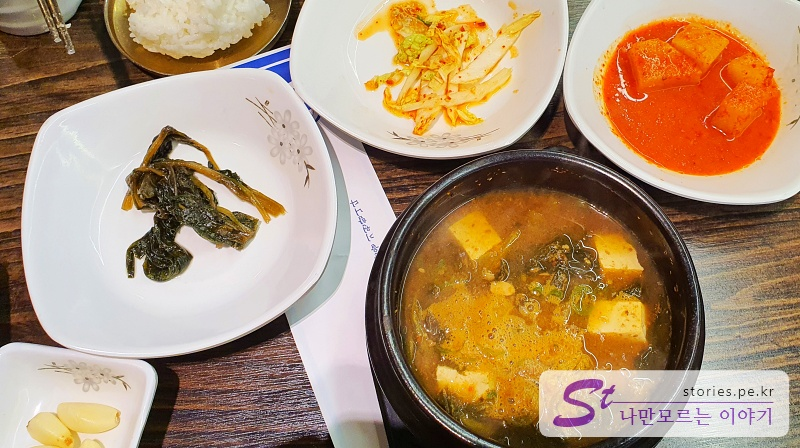
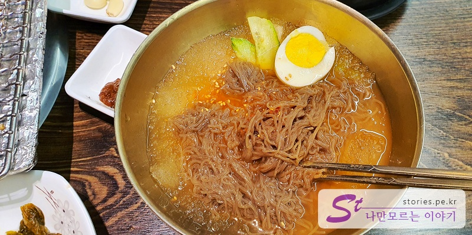
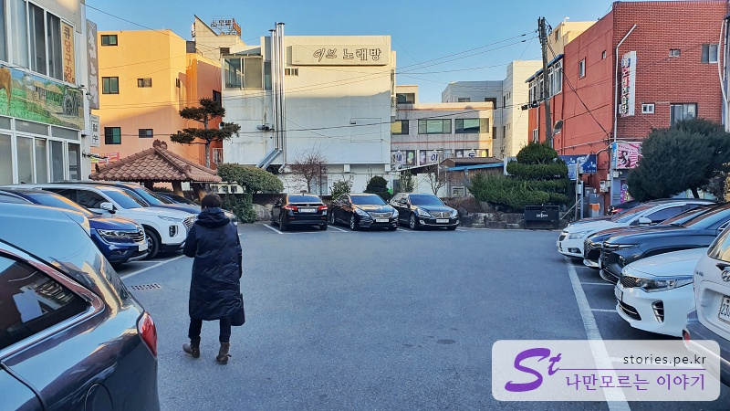

> [[울산 포항 가볼만한곳] 겨울에 다녀 온 2박3일 울산과 포항 여행의 핵심 포인트 바로가기](https://blog.stories.pe.kr/565)

불고기 하면 지역마다 다른 형태와 다른 조리법의 불고기가 존재합니다. 그런 불고기 중 꽤 이름을 알리고 있는 언양지역의 불고기가 울산 근처에 있습니다. 그래서 이번에 울산을 여행하면서 한번 다녀오기로 했습니다.

저희는 맛있고 싼 집을 이용했을 때 **"아~~ 잘 먹었다!!"** 라고 하는 가성비를 추구하는 여행 스타일이라서 언양불고기는 좀 맞지 않는 종목이긴 합니다. 언양불고기가 한우고 유명세가 있다고는 하지만 한 끼에 2명이서 5만원을 지불하는 데는 좀 아깝다는 생각이 많이 들었습니다. 그래도 뭐... 설날 전날이라 문 닫은 식당은 많고 밥은 먹어야겠고, 열린 곳은 여기밖에 없고... 해서 들어가 봤습니다.

### 언양 불고깃집 공원 불고기

원래 인터넷으로 검색을 해보면 **언양 기와집 불고기**가 주로 먼저 나오고 **공원 불고기**는 약간 아래쪽에 위치해 있긴 합니다.

식당의 겉모습은 고오급~ 식당의 모습을 하고 있습니다. 뭐.. 음식의 가격대가 있으니 당연히 그러겠지요.

공원 불고기도 TV에 여러 번 출연했는지 입구에 광고처럼 붙여놨네요.

식당 안은 입식과 좌식이 모두 존재합니다. 저희는 중앙홀에 있는 입식 자리에 앉았습니다.

공원 불고기 2인분을 주문했습니다. 기본적인 상차림은 파무침, 약간의 쌈, 물김치, 장아찌 등이 나옵니다. 반찬이 주로 장아찌류가 많이 나오는 것 같습니다.

조금만 더 기다리면 석쇠에 구워져서 언양불고기가 나옵니다. 맛은 있는데 양이 너무 작은 것 같네요. 성인 남자라면 한 입 거리밖에 안될 것 같아요.

음식 가격에 민감하지 않으신 분들이라면 언양불고기가 좋은 선택일 것 같습니다. 모자라면 또 시키면 되니까요. 맛은 있어요.

뭐.. 한우니까.. ㅠㅠ

불고기로만 배를 채울 수가 없어서 된장찌개와 냉면을 추가로 주문했습니다. 된장찌개에 밥 한 공기와 몇 가지 밑반찬이 따라 나옵니다. 된장찌개도 그런대로 먹을 만합니다.

냉면도 물냉면과 비빔냉면이 있는데 기본은 물냉면인가 봅니다. 저희는 그냥 냉면 주세요~ 했는데 더 물어보지도 않고 구냥 물냉면을 주는것을 보면... 냉면 맛도 나쁘지 않습니다.

## 식당 운영 시스템

운영 시스템은 나쁘지 않습니다. 손님이 많지 않아서 정확히 확인해 보지는 못했지만 일반적인 수준에서는 나쁘지 않네요.

<b>운영 시스템 : </b> ★★★★☆

## 청결도

깨끗한 편입니다. 뭐... 음식 가격이 고가이다 보니 깨끗하게 운영해야겠지요.

<b>청결도 : </b> ★★★★☆

## 친절도

나쁘지는 않으나 자연스럽지는 않았습니다. 서빙 보는 사람들이 젊어서 그런지 친절이 몸에 배어있지는 않은 것 같습니다.

<b>친절도 : </b> ★★★☆☆

## 식당과 주차 정보

- 주소 : 울산 울주군 언양읍 헌양길 32
- 연락처 : 052-262-0421
- 영업시간 : 매일 09:00 - 21:00
- 주차 : 식당 전용 주차장이 있고 약 20대가량 주차할 수 있을 것 같습니다.
  
