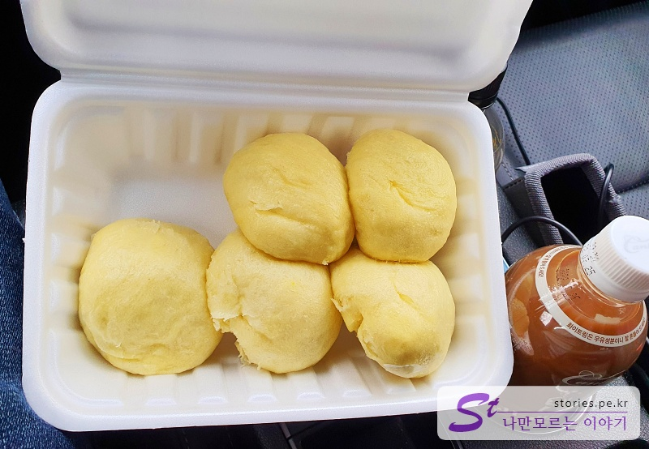

> [[울산 포항 가볼만한곳] 겨울에 다녀 온 2박3일 울산과 포항 여행의 핵심 포인트 바로가기](https://blog.stories.pe.kr/565)

여행 3일차는 울산에서 1시간 거리에 있는 포항으로 잡았어요. 포항에서 몇 군데 관광을 하고 저녁에 서울로 올라올 생각이거든요.

먼저 울산에서 해변도로를 따라 구룡포까지 올라오면 포항에서 맛있다고 방송에서 소문이 자자한 엄마 찐빵 집이 먼저 나오더라고요.

**구룡포 일본인 가옥거리**와 5~10분 거리로 가까워서 일본인 가옥거리를 가는 도중에 먼저 빵 맛을 보기 위해 들러봤어요. (기대기대!!)

가게는 작고 허름한 전형적인 시골의 작은 가게입니다. **수요미식회**, **슈퍼맨이 돌아왔다**에도 나오고 최근에는 **바퀴 달린 집**에도 출연한 핫한 가게라고...

음.. 그런데 저희가 갔을 때는 생각보다 사람이 많지 않았어요. 여기가 맞나? 싶은 생각에 두리번거리며 들어갔지만 저희만 있었습니다. 찐빵을 준비해 주시는 와중에 몇몇 손님들이 더 방문을 하기는 했는데.. 붐빌 정도는 아니었어요. (우리가 너무 일찍 갔나?)

가게 안은 작고 허름한 노포의 느낌이 물씬 나는 인테리어이고 주인아주머니 혼자서 운영하기에 적당한 크기 정도입니다.

전체적으로 가격은 비싸지 않지만 찐빵의 맛은 매우 좋습니다. 팥죽이나 도넛은 먹어보지 못했어요 ㅠㅠ

## 대표 메뉴와 가격(가성비)

**대표 메뉴는 찐빵**이고 **6~7개에 3,000원**입니다. 원래는 6개인데 사장님의 그날 느낌에 따라 7개를 주시는 경우도 있는 것 같아요. **더 넣어줘다**라는 말씀도 없습니다. 그냥 열어봤을 때 7개면 서비스로 1개 더 주셨다고 생각하면 됩니다. ^^

우리도 3팩을 시켰는데, 처음 열어본 상자에 찐빵이 7개라서 한번 놀랐어요. 오~~ 아주머니가 실수로 7개 넣어줬나 보다고 생각했는데, 그냥 3팩 샀으니 서비스로 한 개 더 넣어 주신 것 같아요.

## 먹어본 음식

저희는 대표 메뉴인 찐빵을 먹어봤어요. 진심 맛있습니다. 팥이 맛있다라기보다는 빵 자체가 맛있었어요. 부드럽고 쫄깃합니다. 저희는 선물용으로 3팩을 샀는데 차 안에서 먹어보고 2팩을 추가로 더 사서 나왔어요.

찐빵의 맛은 좋은데..

다만 아쉬운 점은.. 사장님이 친절하지가 않아요 ㅠㅠ. (치명적인데...)

우리 엄마보다 더 친절하지 않아요. 무뚝뚝하시기도 하지만 팥죽을 추가로 주문하려고 했더니 가스비가 아깝다고 (~~아니.. 빵값을 조금 더 올리고 가스비를 아끼지 말아야지.. 쩝~~) 아까 빵 주문할 때 같이 주문하지 지금은 못 파신다고 하시네요. 설명이라도 좀 자세히, 친절히 해주시면 좋을 텐데.. 손님들이 오해하기 쉬울 것 같더라고요. 물론 저희는 그렇게 기분이 나쁘지는 않았습니다. 여행할 때는 그냥 그러려니~ 생각하는 편이라..

방송에 여러 차례 나왔는데도 불구하고 상대적으로 손님이 많지 않은 이유이기도 할 것 같았습니다. 음식은 잘 만드시는데 전문 장사꾼은 아니신가 보다는 생각이 들었습니다. 그래도 번창하셨으면 좋겠어요.

## 식당 운영 시스템

사장님 혼자서 운영하시는 거라...

<b>운영 시스템 : </b> ★★★☆☆

## 청결도

청결하지는 않아요. 그래도 빵 맛은 정말 일품입니다. 빵은 직접 반죽해서 발효하시는 것 같고 팥은 기성품을 이용하시는 것 같아요.

<b>청결도 : </b> ★★☆☆☆

## 친절도

가장 아쉬운 부분이긴 합니다. 조금만 서비스 마인드가 있어도 더 많은 손님들이 올 텐데.. (사람 마인드가 바뀌는 게 호떡 뒤집듯이 쉽지는 않겠지요?)

참고로 현금을 가지고 가시는 것을 추천드립니다. 카드를 내밀면 불친절++가 추가된다고 하네요.

<b>친절도 : </b> ★★☆☆☆

## 식당과 주차 정보

-   주소 : 경북 포항시 남구 구룡포읍 구룡포길 60-2
-   연락처 : 054-276-6547
-   영업시간 : 오전 10:00~오후 9:00
-   주차 : 주차장은 없습니다. 가게 앞 초등학교나 인근 길거리에 주차를 해야 해요.

<iframe src='https://www.google.com/maps/embed?pb=!1m18!1m12!1m3!1d1141.3565725515716!2d129.55287158564605!3d35.98990700700105!2m3!1f0!2f0!3f0!3m2!1i1024!2i768!4f13.1!3m3!1m2!1s0x35670e8bda19cb69%3A0x39ecb5f556642775!2z7JeE66eI7LCQ67m1!5e0!3m2!1sko!2skr!4v1644219804067!5m2!1sko!2skr' class='embed-responsive-item' allowfullscreen></iframe>

## 기타 사항

가능하면 현금을 가지고 구매하시는 것을 추천합니다.
