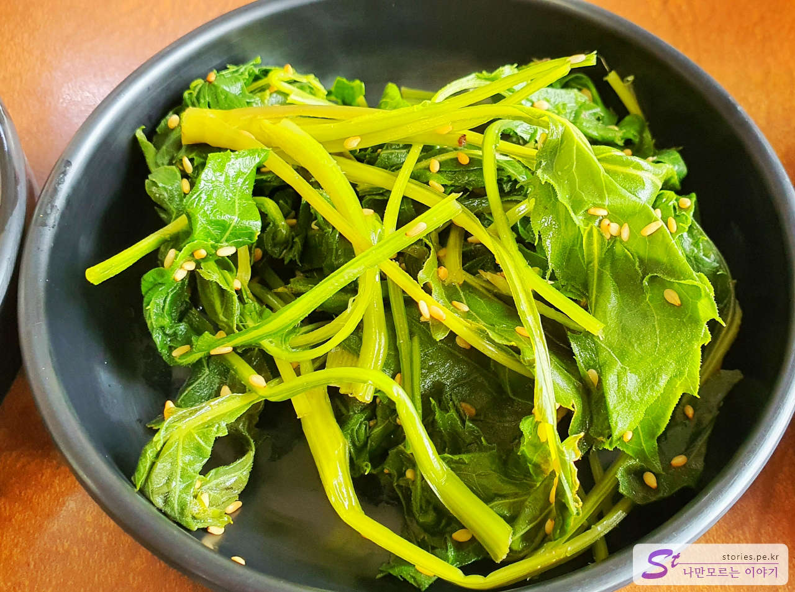

김포공항에서 새벽 첫 비행기를 타고 제주도에 도착한 첫날 렌터카를 타고 우도로 가기 위해 성산으로 향했습니다.  
시간상 아침 겸 점심 식사 시간이라 소금바치 순이네로 갔습니다.

제주산 돌문어를 사용한다고 해서 큰 기대감을 가지고 식당에 도착했습니다. 식당은 1층짜리 건물이고 식당 앞은 바다 건너 우도가 보이는 풍경을 가지고 있습니다.

식당은 여느 일반 식당의 모습이며 깨끗하게 정돈된 느낌은 아니지만 그래도 지저분하지는 않습니다.

우리는 2명이 방문했기 때문에 기대했던 3만원짜리 돌문어 볶음 소자를 주문했습니다. 우리에게는 딱 적당한 양이었습니다.

반찬은 6가지가 나오고 깔끔하니 나쁘지 않았습니다.

특이한 반찬은 번행초로 무친 무침인데 해안에서 자라는 여러해살이 풀이라고 합니다.

여러 가지 효능이 있다는 벽보를 붙여놨네요. 맛은 나쁘지 않았습니다.

바닷가라서 그런지 톳 무침도 나오네요. 저는 별로좋아하지 않는 음식인데, 저희 집사람은 아주 잘 먹더군요.

드디어 돌문어 볶음이 나왔네요. 돌문어 볶음 위에 생깻잎을 올려서 내옵니다. 사진상으로는 좀 깨끗해 보이지는 않지만 어차피 섞을 거라 문제는 없습니다.  
먼저 홍합을 껍데기에서 분리하는 작업을 해 줘야 합니다.

홍합 껍데기를 모두 제거했다면 깻잎 아래에 숨어있는 소면과 돌문어를 잘 섞어서 비벼주면 됩니다.

돌문어가 알차게 들어 있습니다. 굉장히 매워보이지만 심하게 맵지는 않습니다.  
다만 우리 입맛에는 조금 단맛이 많이 났습니다.  
어찌 되었든 맛있게 아침 겸 점심을 잘 먹었습니다.

공깃밥은 별도네요. 저희는 총 32,000원이 들었습니다. 2명이 한 끼 밥값에 32,000원이면 좀 많은 편이긴 하지만 그래도 여행이라 기분 좋게 먹고 나왔습니다.

## 비용

비용은 차림표를 참고하세요.

## 입장시간

- 운영시간 : 09:30 - 19:00 (15:00 - 16:30 브레이크 타임)
- 휴무일 : 매달 1, 3번째 목요일 정기 휴무

## 여행지 정보

- 주소 : 제주 제주시 구좌읍 해맞이해안로 2196
- 연락처 : 064-784-1230

<iframe src='https://www.google.com/maps/embed?pb=!1m18!1m12!1m3!1d3326.916421761391!2d126.91055761549387!3d33.50355155389137!2m3!1f0!2f0!3f0!3m2!1i1024!2i768!4f13.1!3m3!1m2!1s0x350d150846ae2559%3A0xd6c53d0e7b976bfd!2z7IaM6riI67CU7LmYIOyInOydtOuEpA!5e0!3m2!1sko!2skr!4v1669685008319!5m2!1sko!2skr' class='embed-responsive-item' allowfullscreen></iframe>

## 주차정보

주차장은 식당 앞에 넉넉히 있습니다.
