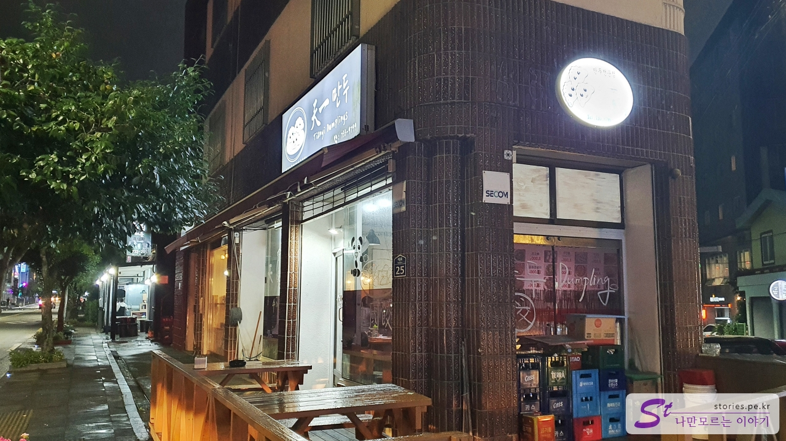
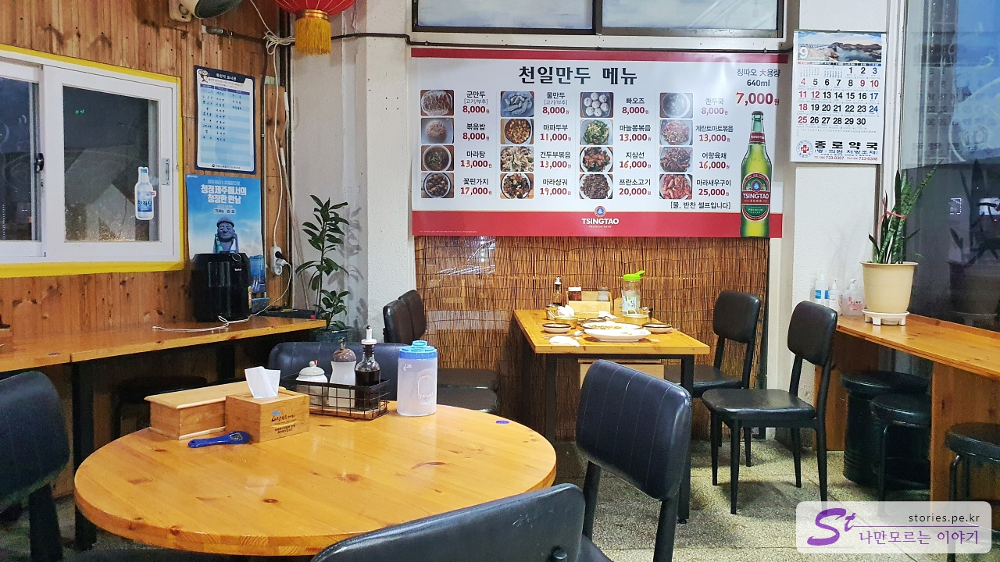
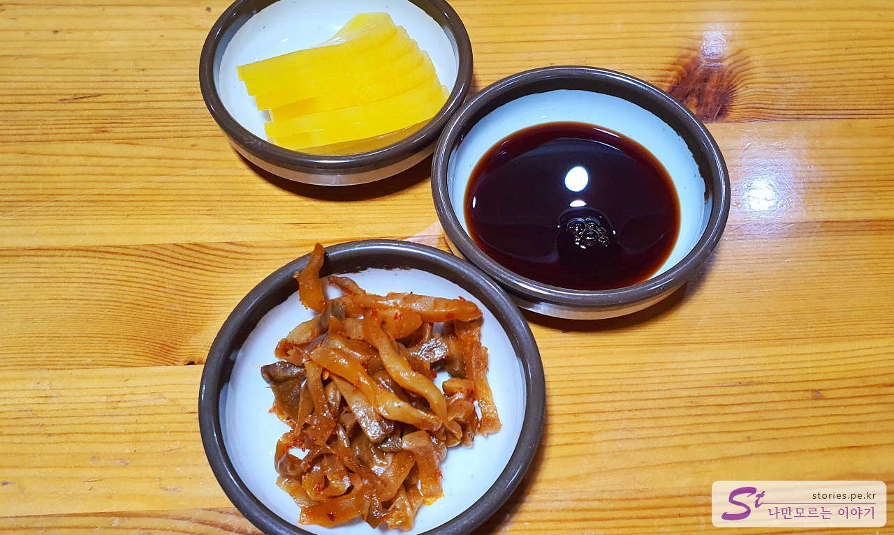
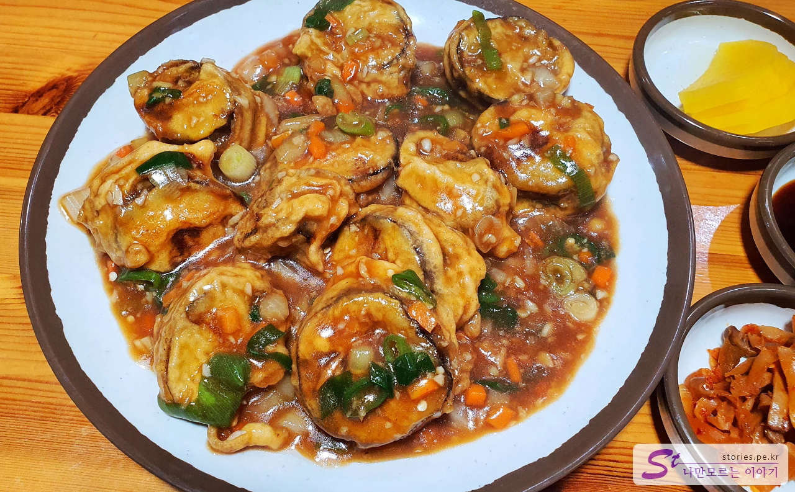
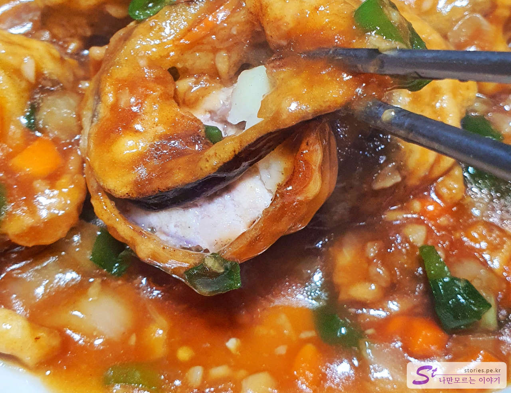
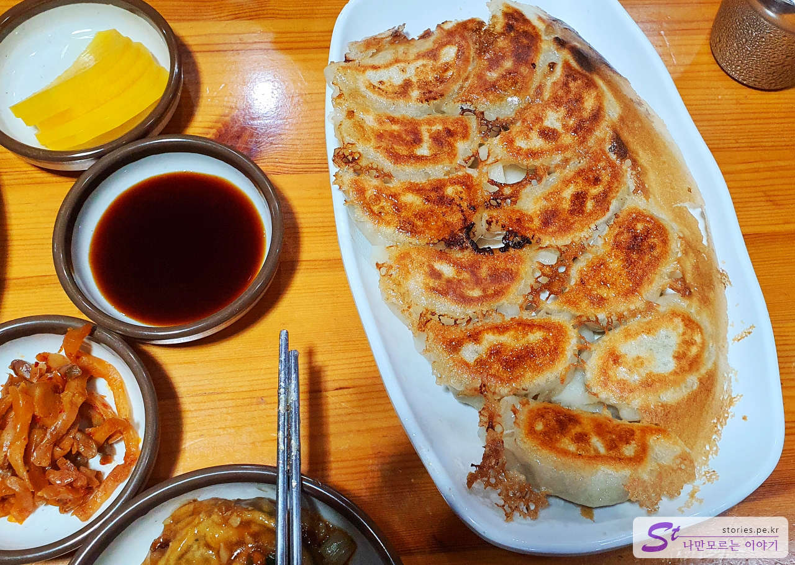

성산에서 출발해서 서귀포로 넘어왔습니다. 비가 보슬보슬 내리는 저녁이라 관광을 하기에는 무리가 있어서 바로 저녁을 먹기로 하였습니다. 저녁은 미리 찾아놓은 **천일 만두**라는 곳입니다.

길모퉁이에서 3면을 차지하고 있어서 찾기에 어려운 곳은 아니지만 가게 분위기나 간판이 침침해서 잘 찾아봐야 합니다.

저희가 갔을 때는 시간이 좀 늦은 시간대라서 사람이 별로 많지는 않았습니다. 저희가 있는 동안 배달 주문이 간간이 있었고요. 근처 숙소에서 배달을 많이 하는 것 같았습니다.

## 대표 메뉴와 가격(가성비)

메뉴는 일반 한국의 중국집 메뉴라기보다는 중국 쪽의 메뉴인듯한 느낌이 들었습니다.  
인터넷에 천일 만두의 대표 메뉴로 많이 알려진 것은 **군만두**와 **꽃 핀 가지**입니다. 가끔 **마파두부**도 맛있다는 이야기가 나오고 있습니다.

## 먹어본 음식

저는 가지로 만든 음식을 별로 좋아하지 않아서 잘 먹지 않습니다. 그래서 천일 만두의 꽃핀가지를 시킬까 말까 무척 고민을 많이 했습니다.  
그래도 대표 메뉴라는데..라고 생각해서 **군만두와 꽃핀가지** 2개의 메뉴를 주문했습니다.

  
반찬이 먼저 나옵니다. 단무지와 짜사이, 간장이 전부입니다. 뭐.. 메인메뉴가 맛있으면 용서할 수 있습니다. ㅎㅎ

  
첫 번째로 기대 반 우려반으로 주문한 꽃 핀 가지가 나왔습니다. 보기만 해도 매우 먹음직스럽기는 했습니다.

썰은 가지에 튀김옷을 묻혀 튀겼습니다. 다만 가지 사이에 돼지고기를 넣어서 사실 먹어보면 가지인지 잘 모를 정도입니다. 다시 말하면 **역시 맛이 좋았습니다.**
한입 베어 물었을 때 풍부한 맛이 입에 감돌 정도로 매력이 있는 맛이었습니다.
다만 거의 다 먹어 갈 때쯤에는 좀 짜다는 느낌이 살짝 들기는 했습니다.

군만두도 맛있었습니다. 굽는 방식이 특이한데, 만두를 놓고 전분물을 뿌리고 뚜껑을 덮어 튀기듯 찌는 방식입니다. 그래서 바닥은 파삭파삭하고 위쪽은 부들부들한 만두가 나옵니다. 예전에 백종원 님이 한번 소개했었던 요리 방식인 것 같습니다.  
일반 중식이 아니라 본토의 중식 맛을 느끼고 싶을 때 찾아볼만한 중국집입니다.

## 식당 운영 시스템

운영 시스템이라고 할 것은 없고 주문 후 서빙이 되기까지 시간이 좀 걸립니다.

<b>운영 시스템 : </b> ★★★☆☆

## 청결도

많이 깨끗하지는 않습니다. 주방과 식당을 같이 사용하고 있어서 손님 위주라기보다는 주방장 및 종업원 위주의 구성입니다.

<b>청결도 : </b> ★★★☆☆

## 식당과 주차 정보

- 주소 : 제주 서귀포시 서문로 25
- 연락처 : 064-733-9799
- 영업시간 : 10:00 - 21:30 (14:00 - 17:00 브레이크 타임)
- 휴무일 : (정기휴무) 매주 목요일

<iframe src='https://www.google.com/maps/embed?pb=!1m18!1m12!1m3!1d991.9851707709162!2d126.5591294403647!3d33.25007148394195!2m3!1f0!2f0!3f0!3m2!1i1024!2i768!4f13.1!3m3!1m2!1s0x350c539bc3c0681d%3A0x3e5daa88bf9422cd!2z7LKc7J2866eM65GQ!5e0!3m2!1sko!2skr!4v1669798173084!5m2!1sko!2skr' class='embed-responsive-item' allowfullscreen></iframe>

