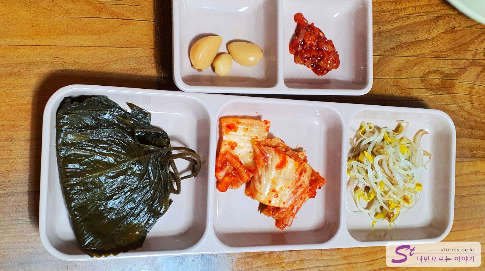

제주도에 가서 성산 쪽으로 여행을 한다면 거의 빼놓지 않고 가는 맛집이 **맛나 식당**입니다. 하지만 이번 여행에서는 색다르게 맛나 식당 말고 새로운 맛집인 소금 바치 순이네(돌문어 볶음)에서 식사를 했었는데, 결국엔 부득이하게 성산 쪽에서 일정이 비어 또 맛나 식당을 다녀오게 되었습니다. 말은 뭐.. 억지로 간 것처럼 느껴지는데 사실은 매번 가도 질리지 않는 가성비 맛집입니다. 거의 10년 전부터 이용을 했었고 그때도 사람이 많아서 웨이팅이 길었는데 지금까지도 갈치조림 한번 먹으려면 상당한 웨이팅이 필요합니다.

## 대표 메뉴와 가격(가성비)

자고로 옛날부터 맛집이라 함은 메뉴가 한 개뿐인 식당이라고 합디다.
맛나 식당도 메뉴가 한 개.. 음... 뭐.. 애매하게 한 개의 메뉴를 보유하고 있습니다.

갈치조림과 고등어조림 그리고 이 두 개를 섞은 섞어 조림이 메뉴입니다. 어차피 베이스는 하나니까 하나라고 말할 수 있겠지요? ^^

## 먹어본 음식

우리는 섞어 조림을 시켜서 먹었습니다.

반찬은 매우 조촐하고 조림은 매우 화려합니다. 냄새도 좋고 보기도 좋고 맛도 좋습니다.

반찬은 깻잎, 김치, 콩나물, 젓갈, 마늘입니다. 저는 조림을 먹으면서 반찬은 손에 대지도 않았습니다. 조림이 너무 훌륭하거든요.

제주도에서 먹어본 음식 중에 손에 꼽을 만한 맛입니다. 물론 일반 갈치조림보다도 가격은 저렴합니다.

갈치와 고등어입니다. 또 생각이 나네요. (꿀꺽~)

## 식당 운영 시스템

식당 운영은 수많은 방문객의 숫자에 비하면 잘 운영되고 있다고 볼 수 있습니다. 웨이팅은 어쩔 수 없다치고.. 길어야 오후 2시면 문 닫는다는 거 빼면.. 준수합니다.
일단 먼저 식당에 도착하면 예약을 걸어야 합니다. 전화예약은 안되고 방문 예약만 가능합니다. 예약을 하면 대략 1시간 ~ 3시간 정도 걸리기 때문에 보통 예약을 하고 가까운 성산 일출봉이나 광치기 해변 또는 섭지코지를 다녀오면 적당합니다.
예약을 하면 몇 시쯤 오라고 식당 아줌마가 이야기를 해주는데 그 시간이 거의 맞아떨어집니다.

<b>운영 시스템 : </b> ★★★★☆

## 청결도

식당의 청결도는 보통입니다. 매우 깨끗하다고는 할 수 없으나 그렇다고 지저분하지도 않습니다.

<b>청결도 : </b> ★★★☆☆

## 친절도

친절도는 보통은 됩니다. 사람이 많아서 서비스가 떨어질만한데도 불친절하지 않습니다.

<b>친절도 : </b> ★★★★☆

## 식당과 주차 정보

예전에는 무료주차장이었는데 지금은 유료주차장으로 바뀌였습니다.
30분은 무료이고 이후 15분은 1,000원 추가 15분당 500원을 지불해야 합니다.
대략 식사 시간을 1시간으로 잡는다면 1,500원이 들겠네요. 저희는 차단기가 올라가 있어서 무료로 이용했었습니다.

- 주소 : 제주 서귀포시 성산읍 동류암로 41
- 연락처 : 064-782-4771
- 영업시간(휴무일) : 08:30 - 14:00 (예약은 06:00부터 시작하고 재료가 소진되면 일찍 문 닫을 수 있음)
- 주차 : 식당 앞 공영주차장이 있음

<iframe src='https://www.google.com/maps/embed?pb=!1m18!1m12!1m3!1d3329.0277381339315!2d126.91388251549272!3d33.44858385674581!2m3!1f0!2f0!3f0!3m2!1i1024!2i768!4f13.1!3m3!1m2!1s0x350d137ea49e6e49%3A0xbf472ab35adbec44!2z66eb64KY7Iud64u5!5e0!3m2!1sko!2skr!4v1669735554596!5m2!1sko!2skr' class='embed-responsive-item' allowfullscreen></iframe>

## 기타 사항

예약의 시작은 06:00에 시작하나 보통 그때부터 웨이팅을 하기 때문에 좀 일찍 식사를 해야 한다면 05:30 정도부터 웨이팅을 해야 합니다.
예약을 그 시간에도 식사 시작은 08:30부터 시작됩니다.
