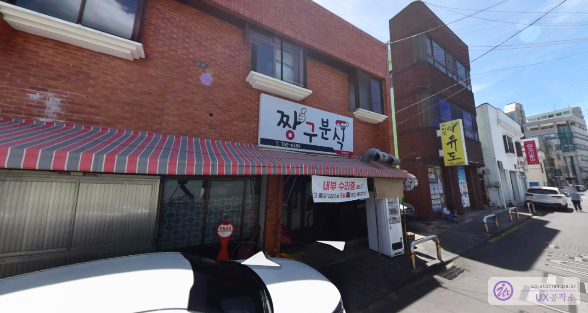
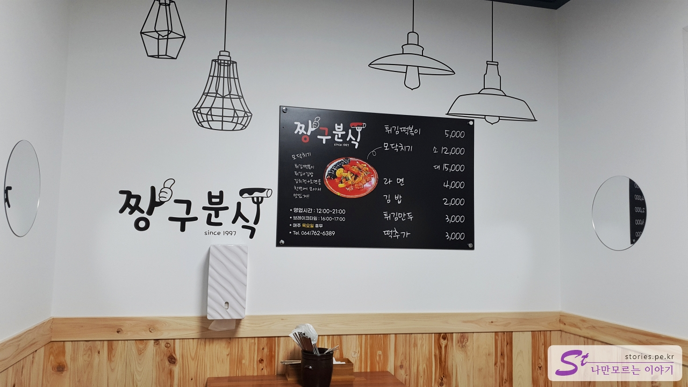
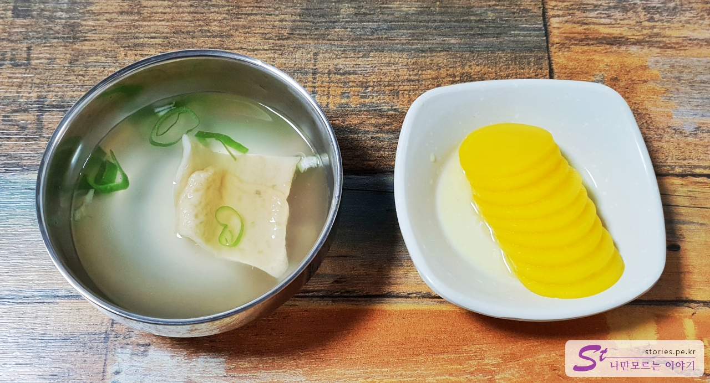
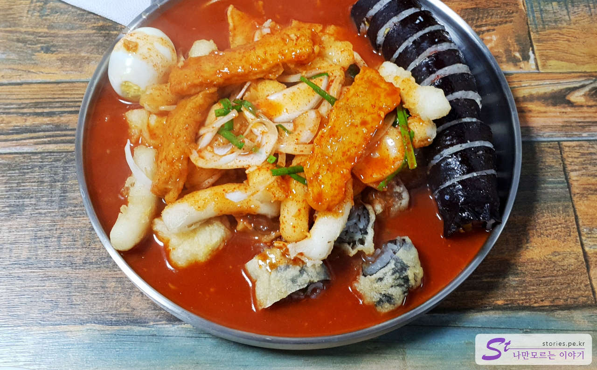
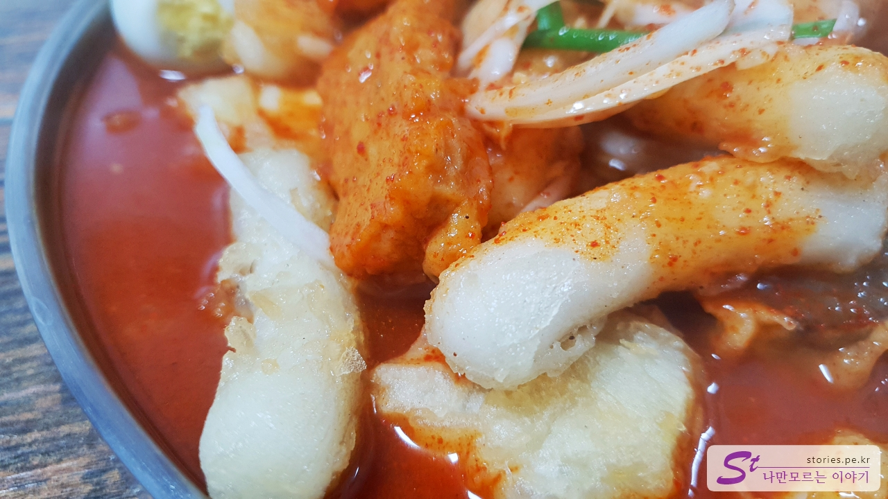
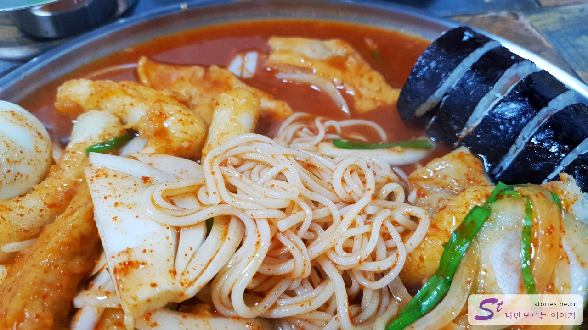

제주에서 알려진 여러 음식들이 있는데, 그중에 저렴한 쪽에 속하는 음식이 있습니다. 학생들이 즐겨 찾는 떡볶이인 **모닥치기** 입니다.

모닥치기는 올레시장의 새로나 분식집도 있지만, 원조에 해당하는 집이 **짱구 분식**입니다.

10년 전에 왔을 때는 상당히 허름한 실내였는데, 지금은 인테리어를 다시 해서 그런지 깔끔한 실내의 모습을 하고 있습니다.

## 대표 메뉴와 가격(가성비)

대표 메뉴는 모닥치기 입니다. **모닥치기**는 떡볶이에 모두 담아서 나온다 하여 붙혀진 이름인것 같습니다. 떡볶이 국물 베이스에 튀김, 김밥, 김치전, 소면을 한 접시에 담아서 줍니다.

## 먹어본 음식

당연히 저희는 모닥치기를 시켜서 먹었습니다. 동네 사람이라면 라면도 먹고 김밥도 먹고 튀김만두도 먹겠지만... 저희는 관광객이기 때문에 모닥치기입니다. ㅎ

모닥치기를 주문하면 먼저 어묵 국물과 단무지가 먼저 나옵니다. 떡볶이인데.... 다른 반찬은 필요 없겠지요?

저희는 2명이서 모닥치기 소자(12,000원)를 시켰습니다. 집사람이 양이 좀 적은 편인데, 소자를 시키니 적당했습니다.

떡볶이 떡은 일반 떡이 아니고 한번 튀긴 떡이라 좀 더 부드럽고 식감이 좋습니다.

떡볶이를 뒤집으면 소면이 나옵니다.

## 맛 평가(지극히 주관적임)

모닥치기라는 유명한 이름에 비해 맛은 그냥 보통이었습니다. 뛰어나게 맛있는 음식은 아닌 것 같습니다. 깊은 맛을 느끼지는 못했습니다.

<b>주관적인 맛 점수 : </b> ★★★☆☆

## 식당 운영 시스템

붐비는 때에 찾아간 것이 아니라 진면목은 모르겠으나 주문하고 음식을 먹는데 크게 불편하지는 않았습니다. 주방을 보니 배달이 많았던 것 같습니다.

<b>운영 시스템 : </b> ★★★☆☆

## 청결도

10년 전에는 그렇게 청결하지는 않았었는데, 새롭게 인테리어를 한 실내는 깨끗해 보였습니다. 오픈형 주방인데, 매우 청결은 아닙니다.

<b>청결도 : </b> ★★★★☆

## 친절도

보통입니다.

<b>친절도 : </b> ★★★☆☆

## 식당과 주차 정보

- 주소 : 제주 서귀포시 중동로48번길 3
- 연락처 : 064-762-6389
- 영업시간 : 12:00 - 21:00 (16:00 - 17:00 브레이크 타임)
- 휴무일 : 매주 목요일 정기휴무
- 주차 : 주차장이 별도로 있지는 않습니다. 골목 적당한 곳에 주차를 해야 합니다.

<iframe src='https://www.google.com/maps/embed?pb=!1m18!1m12!1m3!1d1668.324939604091!2d126.56703828087846!3d33.249474768104136!2m3!1f0!2f0!3f0!3m2!1i1024!2i768!4f13.1!3m3!1m2!1s0x350c5377c5faa5cb%3A0x7e1c3974f95246ad!2z7Kex6rWs67aE7Iud!5e0!3m2!1sko!2skr!4v1669880132635!5m2!1sko!2skr' class='embed-responsive-item' allowfullscreen></iframe>

