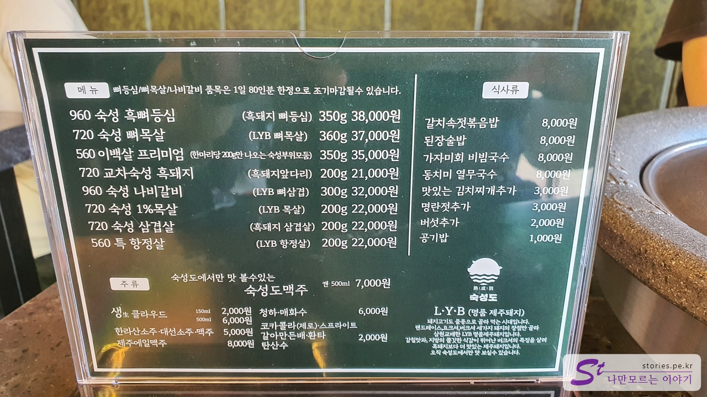
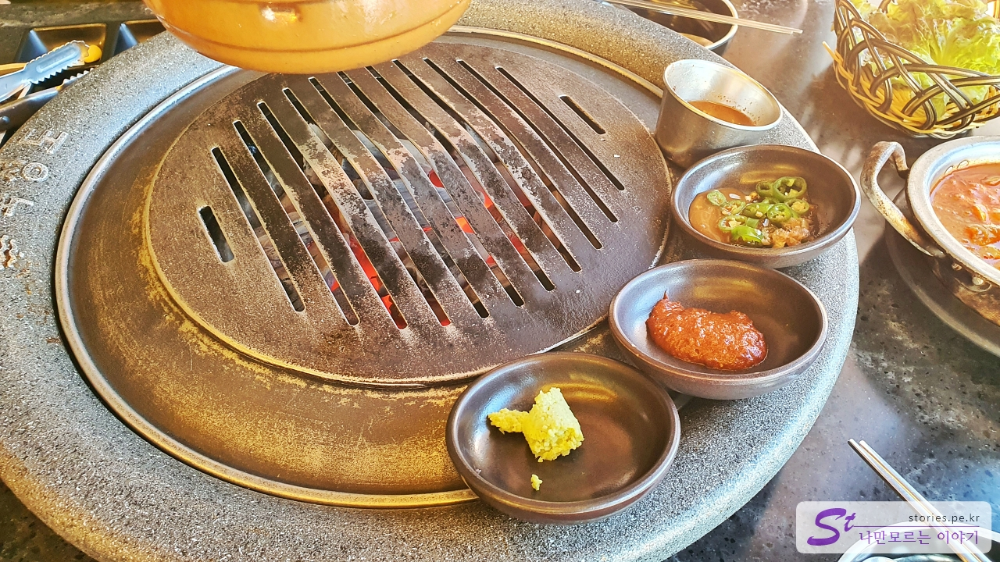
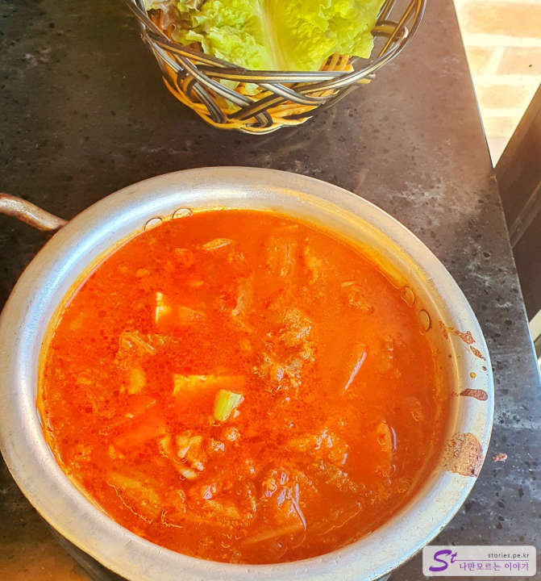
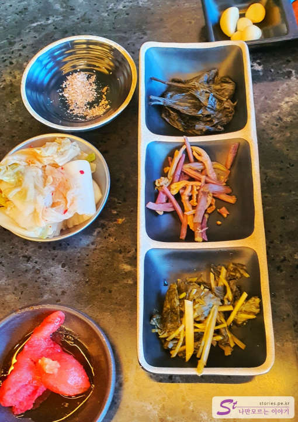
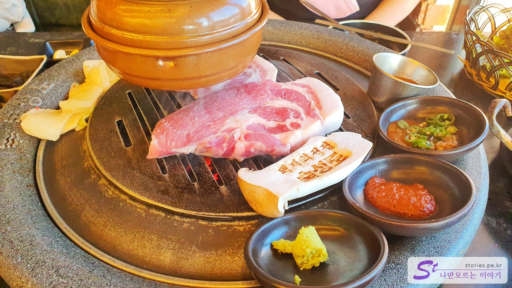

제주도의 흑돼지집을 찾아보면 손에 꼽습니다. 저희는 이번 여행에서 숙성도 중문점을 다녀왔는데요.  
제가 고기 맛을 정말 잘 아는 것은 아니기 때문에 맛에 대한 평가라기보다는 전체적인 분위기에 대해서 간단히 포스팅해 보려고 합니다.

## 대표 메뉴와 가격(가성비)

물론 대표 메뉴는 흑돼지입니다. 제주 흑돼지는 기본적으로 가격이 높기 때문에 가성비 음식이라기보다는 "나도 먹어봤다!!"라는 가심비를 추구하는 체험 음식입니다. 최소한 저한테는 그렇습니다. (아~~ 돈 많이 벌어야지 ㅠㅠ)

차림표가 있고 주요 메뉴는 **숙성 흑돼지 삼겹살**입니다. 가격은 200g에 22,000원으로 다른 흑돼지집이랑 얼추 비슷한 가격대입니다. (확인된 사항은 아니지만 담합을 했는지.. 다들 거의 비슷한 가격대 더라고요 음...)

## 먹어본 음식

저희는 비계를 별로 좋아하지 않아서 목살로 400g 주문을 했습니다.  
주문을 하면 불판에 먼저 장과 반찬이 나옵니다. 반찬은 셀프로 더 추가해서 먹을 수 있게 되어 있습니다.

불판 주위로 고추냉이, 멜 젓 등을 나열해 주시네요.

찌개는 김치찌개인 것 같은데 무료로 나옵니다. 다들 맛있다고는 하지만 제 입맛에는 조금 느끼하고 짠 감이 좀 있었습니다.

기타 소금과 명란젓을 동반한 반찬들입니다.

그렇게 조금 기다리면 주문한 흑돼지가 나옵니다. 딱 보면 양이 너무 적어 보여요.(참고하지 마세요. 주관적인 느낌입니다. )  
그리고 **돼지의 정점 숙성도**라는 광고성 멘트가 찍힌 반쪽짜리 새송이버섯이 나옵니다. (사진 찍으라 이 뜻이겠죠.)

## 맛 평가 (지극히 주관적임)

**돼지고기는 진리입니다. 맛있어요.**  
일반 다른 돼지 고깃집과의 맛 차이점은 잘 모르겠어요. 저는 미식가가 아닙니다. 미세한 맛의 차이를 잘 모릅니다. 그냥 제주 흑돼지 먹어봤다에 만족하는 일반 서민입니다.

<b>주관적인 맛 점수 : </b> ★★★★☆

## 식당 운영 시스템

웨이팅이 상당히 긴 식당입니다. 식당에 도착해서 키오스크에 전화번호를 등록하면 나중에 카카오톡으로 입장을 알려주는 시스템을 가지고 있습니다. 보통 등록을 하면 1~2시간 정도 웨이팅을 하는 것 같습니다.
입장을 하게 되면 크게 불편함 없이 주문하고 식사를 할 수 있습니다.

<b>운영 시스템 : </b> ★★★★☆

## 청결도

고깃집이 대부분 그렇듯이 고깃기름 때문에 미끄럽습니다. 그 느낌이 싫어서 좋은 점수를 주지는 못하지만 그래도 나쁘지 않은 분위기입니다.

<b>청결도 : </b> ★★★☆☆

## 친절도

직원들이 바빠서 친절함을 찾기는 어려우나 그렇다고 불친절하지도 않습니다. 보통 정도의 수준입니다.

<b>친절도 : </b> ★★★☆☆

## 식당과 주차 정보

- 주소 : 제주 서귀포시 일주서로 966
- 연락처 : 064-739-5213
- 영업시간(라스트 오더) : 12:00 - 22:00 (21:15 라스트 오더)
- 주차 : 주차장은 있으나 매우 혼잡합니다.

<iframe src='https://www.google.com/maps/embed?pb=!1m18!1m12!1m3!1d589.7846901184482!2d126.40780331330868!3d33.25795593749808!2m3!1f0!2f0!3f0!3m2!1i1024!2i768!4f13.1!3m3!1m2!1s0x350c5b4dbc40f4af%3A0x2d699c4abde76e3e!2z7IiZ7ISx64-E!5e0!3m2!1sko!2skr!4v1669966218976!5m2!1sko!2skr' class='embed-responsive-item' allowfullscreen></iframe>

