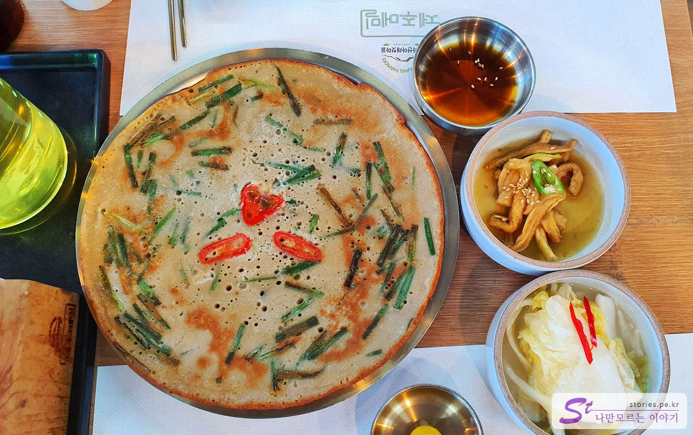

제주여행의 마지막 날 느지막이 숙소를 나와 아침 겸 점심으로 메밀 음식으로 유명한 **한라산 아래 첫 마을**을 방문했습니다.  
여기는 음식도 맛있지만 주변에 있는 푸르른 메밀밭과 한라산을 끼고 있는 풍경이 멋진 장소입니다.

식당 주위의 조경과 풍경이 너무 이쁘게 꾸며져 있습니다. 식사를 안 하더라도 관광지 삼아 오기에도 좋은 곳입니다.

식당에 도착하면 무조건 먼저 대기 접수를 해야 합니다. 건물은 그다지 크지는 않습니다만 빈자리는 찾아볼 수 없습니다. 여기도 보통 웨이팅이 1시간 이상 되기 때문에 먼저 대기 접수를 하고 주위에서 쉬거나 메밀밭에서 사진을 찍는 것이 좋습니다.

대기 접수를 하면 나중에 입장 순서가 올 때쯤 카카오톡으로 메시지가 옵니다. 대기 시간은 20팀 정도면 대략 1시간 정도 걸린다고 하네요.

식당 바로 옆에 메밀밭이 있습니다. 지금이 가을인데 메밀밭이 초록색 바탕에 흰색으로 물들어 있어서 보기도 좋고 사진 찍기도 너무 좋습니다.

하늘은 파랗고 땅은 연두색이며 경계는 초록색으로 매우 멋진 배색을 하고 있습니다.

독사진 찍기도 너무 좋습니다. 그렇게 사진도 찍고 풍경을 보며 대화를 나누다 보면 카카오톡으로 입장 준비를 알리는 메시지가 옵니다.

## 대표 메뉴와 가격(가성비)

메뉴는 7가지이며 모두 메밀이 주재료입니다. 물냉면, 비빔냉면, 비비작작면, 곰탕, 조베기, 만두, 메밀전입니다.

이 중에 대표 메뉴는 **비비작작면**입니다. 아마도 이것 때문에 이 식당이 유명해진 듯합니다.

## 먹어본 음식

저희가 먹어본 음식은 **비비작작면**과 **물냉면**과 **메밀전**입니다.

메밀전은 특색이 있지 않습니다. 일반적인 맛입니다. 바깥쪽은 바삭하고 안쪽은 부드럽습니다.

물냉면은 슴슴합니다. 건강한 맛이죠. 평양냉면 같은 느낌인데 면만 메밀이라 그것과는 조금 다른 느낌입니다.

이게 메인이죠 ㅎㅎ, 일단 자극적인 맛은 아닙니다. 건강한 맛이고 고소합니다. 미식가들이 좋아할 맛입니다. 자극적이지 않은 비빔 메밀입니다. 저는 거의 먹어갈 때쯤에 좀 느끼한 느낌이 있었습니다. 참기름이었는지 들기름이었는지 기름 때문에 그런 것 같습니다.

## 맛 평가 (지극히 주관적임)

이런 맛을 좋아하는 사람이 분명히 많을 것 같습니다. 다만 저는 자극적인 맛에 길들여져있는 입이라서 좀 심심하고 느끼한 느낌이었습니다.

<b>주관적인 맛 점수 : </b> ★★★☆☆

## 식당 운영 시스템

식당 운영 시스템은 제주도가 전반적으로 테이블링 앱을 많이 도입한 것 같습니다. 여기도 테이블링 앱을 사용하는 것 같은데 그래서 대기는 길지만 크게 불만은 없습니다. 또한 자리에 앉아서도 빠른 주문과 음식 준비가 좋았던 것 같았습니다.

<b>운영 시스템 : </b> ★★★★☆

## 청결도

청결도는 상당히 좋은 편입니다. 딱 봐도 깨끗한 건물에 내부도 깨끗하게 운영되고 있었습니다.

<b>청결도 : </b> ★★★★☆

## 식당과 주차 정보

- 주소 : 제주 서귀포시 안덕면 산록남로 675
- 연락처 : 064-792-8259
- 영업시간(브레이크 타임) : 10:30 - 18:00 (15:00 - 16:00 브레이크 타임)
- 휴무일 : 매주 월요일 정기휴무
- 주차 : 30~40대 정도 주차할 수 있는 주차장이 있습니다.

<iframe src='https://www.google.com/maps/embed?pb=!1m18!1m12!1m3!1d1666.8230345870447!2d126.37837051793149!3d33.328067288588805!2m3!1f0!2f0!3f0!3m2!1i1024!2i768!4f13.1!3m3!1m2!1s0x350c5999647704d1%3A0x4af17a1b54626760!2z7ZWc65287IKw7JWE656Y7LKr66eI7J2E!5e0!3m2!1sko!2skr!4v1670081125304!5m2!1sko!2skr' class='embed-responsive-item' allowfullscreen></iframe>

