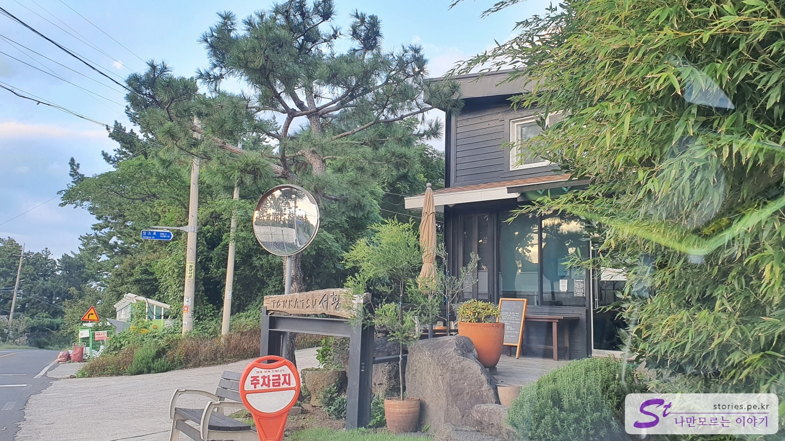
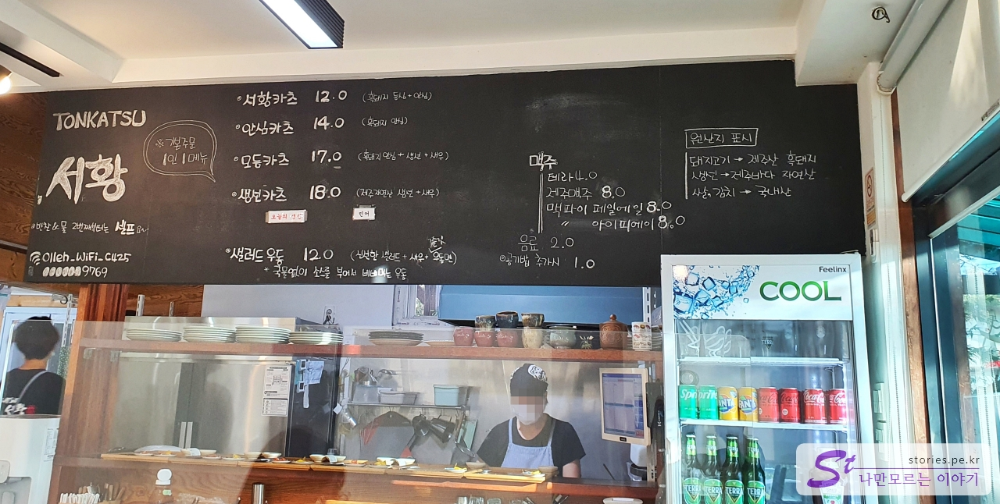
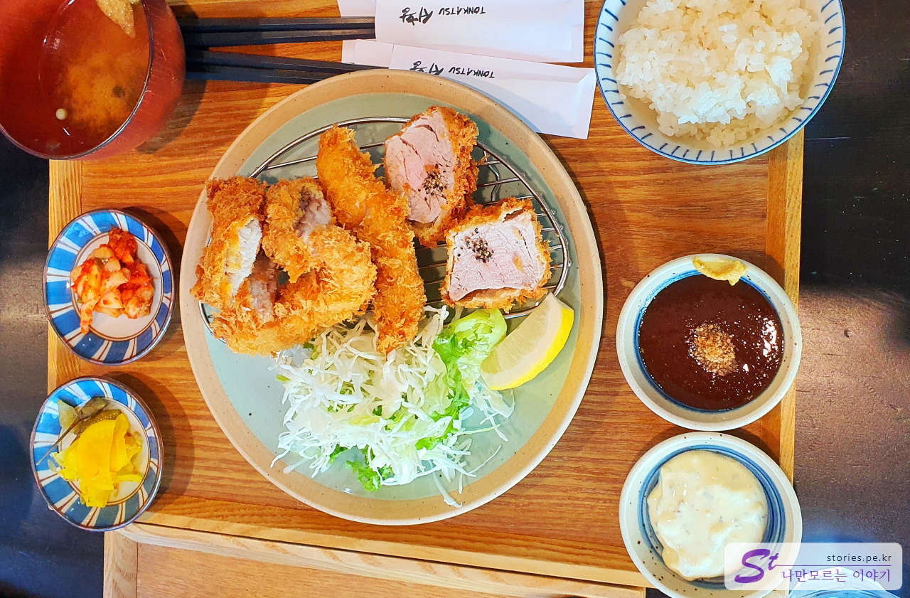

One of the nicknames that Lee Hyo-ri earned while living in Sogil-ri, Aewol was Sogil-daek. So, the place that became famous was Sogili, and among them, the place where we often eat **Seohwang Donkatsu** became famous, too.

The restaurant is next to the one-lane road passing through the village. At first, I thought Yoyuna Cafe was Seohwang Pork Cutlet, so I wandered around and found Seohwang Pork Cutlet a little further in front.

I arrived around 5:10 p.m. before dinner started, but it was break time, so I waited in the car for a while and **entered at 5:30 p.m.** Maybe because dinner started, I entered without waiting, and not many people came during the meal. But there was no empty table.

## Representative menu and price (cost-effectiveness)

The food we ordered is **modum katsu** and **salad udon**. Donkatsu is basically used for black pork, and the price is basically high because it is based on Jeju fish that is brought in from time to time.

## Food I've tried

We ordered assorted katsu and salad udon.

\*\*Modum katsu comes with fried black pork tenderloin, fish, and shrimp. The basic sauce for tonkatsu and tartar sauce for fishkatsu are served. It comes with miso bean paste soup, rice, pickled radish, and kimchi.  
I heard that fried rubber shoes are delicious. Assorted katsu has a really good texture and taste.

The second food is salad udon. It's a cold food and I thought it would taste like that for me, who likes meat, but the amount is bigger than I thought and the taste is good. It's a recommended food.

## Taste Assessment (extremely subjective)

Overall, the taste is worth reducing the passing score. However, it is not a cost-effective food because it is a bit expensive. It is an understandable price in that it uses black pork and fish on the same day.

<b>Subjective taste score: </b> ★★★★☆

## Cleanliness

The basic of Japanese food is cleanliness, so it is clean on the outside.

<b>Cleanliness: </b> ★★★★☆

## Restaurant and parking information

- Address: Seohwang on the first floor of 205-21, Aewol-eup, Jeju-si
- Contact: 064-799-5458
- Business hours (break time): 11:30-20:00 (15:00-17:30 break time)
- Closed: Closed every Monday and Tuesday
- Parking: There is no dedicated parking lot, but you can park in the vacant lot on the right diagonally across the street.

<iframe src='https://www.google.com/maps/embed?pb=!1m18!1m12!1m3!1d832.3947396708337!2d126.37874023469442!3d33.43421979628319!2m3!1f0!2f0!3f0!3m2!1i1024!2i768!4f13.1!3m3!1m2!1s0x350cf65afefbdd15%3A0xd71ff48f964a05e9!2zVE9OS0FUU1Ug7ISc7Zmp!5e0!3m2!1sko!2skr!4v1670310078410!5m2!1sko!2skr' class='embed-responsive-item' allowfullscreen></iframe>

