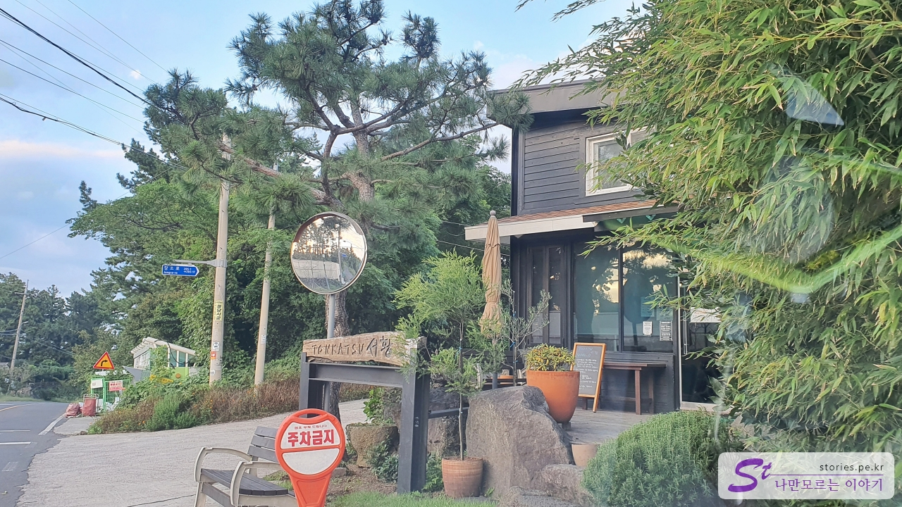
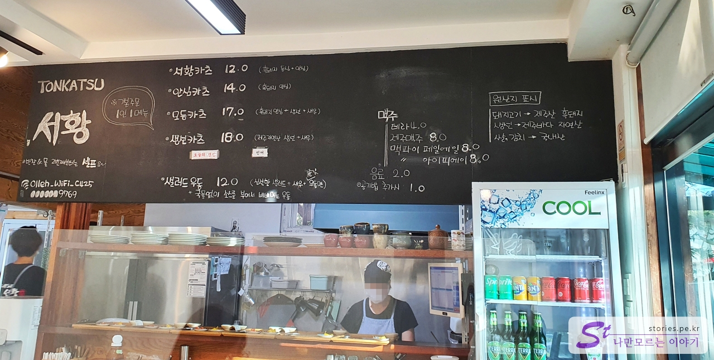
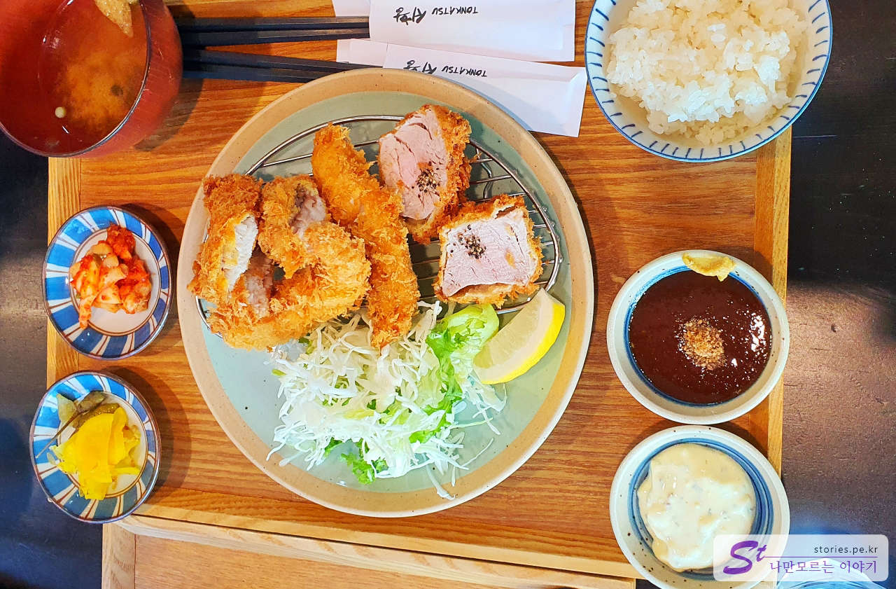
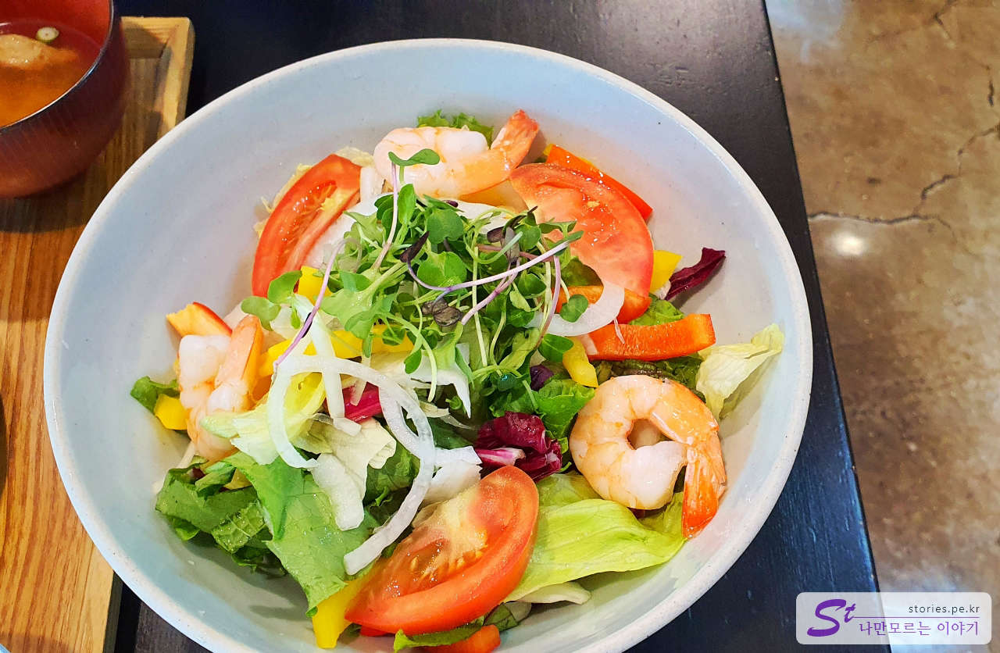

이효리가 애월의 소길리에 살면서 얻은 별명 가운데 하나가 소길댁 이였죠. 그래서 유명해진 곳이 소길리이고 그중에서도 식사를 자주 하는 곳인 **서황 돈카츠**도 같이 유명세를 치르게 되었습니다.

식당은 마을을 지나가는 1차선 도로 옆에 있습니다. 처음엔 요유나 카페가 서황 돈카츠인 줄 알고 서성이다가 조금 더 앞쪽에 있는 서황 돈까스를 찾게 되었습니다.

아직 저녁 식사가 시작되기 전인 오후 5시 10분 정도에 도착을 했는데 브레이크 타임이라 차에서 잠시 기다렸다가 **5시 30분에 입장**을 하게 되었습니다. 저녁식사가 시작되는 시간이라 그런지 웨이팅 없이 입장을 했고 식사하는 중에도 그렇게 많은 사람들이 오지는 않았습니다. 그래도 빈 테이블은 없었습니다. 제주도의 여느 맛집에 비하면 웨이팅이 심하지는 않은것 같습니다.

## 대표 메뉴와 가격(가성비)

저희가 주문한 음식은 **모듬카츠**와 **샐러드 우동**입니다. 돈카츠는 모두 흑돼지를 기본으로 사용하고 있고 생선도 그때그때 들여오는 제주산 생선을 기본으로 하기 때문에 기본적으로 가격은 높은 편입니다.

## 먹어본 음식

저희는 모듬카츠와 샐러드 우동을 주문했습니다.

**모듬카츠는 흑돼지 안심, 생선, 새우**를 재료로 튀긴 음식이 나옵니다. 기본 돈카츠용 소스와 생선카츠용 타르타르 소스가 나옵니다. 미소된장국과 밥, 그리고 단무지와 김치가 곁들여 나옵니다.  
고무신도 튀기면 맛있다고 하던데.. 모듬카츠도 정말 식감도 좋고 맛도 좋습니다.

두 번째 음식은 샐러드 우동입니다. 차갑게 먹는 음식이고 고기파인 저에게는 좀 그저 그런 맛일 거라 생각했는데, 생각보다 양도 많고 맛도 좋습니다. 추천할 만한 음식입니다.

## 맛 평가 (지극히 주관적임)

전반적으로 맛은 합격점을 줄만합니다. 다만 가격이 다소 비싸서 가성비 음식은 아닙니다. 흑돼지와 당일 생선을 사용한다는 점에서 이해할 만한 수준의 가격이긴 합니다.

<b>주관적인 맛 점수 : </b> ★★★★☆

## 청결도

일식의 기본은 청결이기 때문에 겉으로 봐선 깨끗한 수준입니다.

<b>청결도 : </b> ★★★★☆

## 식당과 주차 정보

- 주소 : 제주 제주시 애월읍 장소로 205-2 1층 서황
- 연락처 : 064-799-5458
- 영업시간(브레이크 타임) : 11:30 - 20:00 (15:00 - 17:30 브레이크 타임)
- 휴무일 : 매주 월, 화 정기휴무
- 주차 : 전용 주차장은 없고 길 건너 대각선 오른쪽에 있는 공터에 주차를 하면 됩니다.

<iframe src='https://www.google.com/maps/embed?pb=!1m18!1m12!1m3!1d832.3947396708337!2d126.37874023469442!3d33.43421979628319!2m3!1f0!2f0!3f0!3m2!1i1024!2i768!4f13.1!3m3!1m2!1s0x350cf65afefbdd15%3A0xd71ff48f964a05e9!2zVE9OS0FUU1Ug7ISc7Zmp!5e0!3m2!1sko!2skr!4v1670310078410!5m2!1sko!2skr' class='embed-responsive-item' allowfullscreen></iframe>

