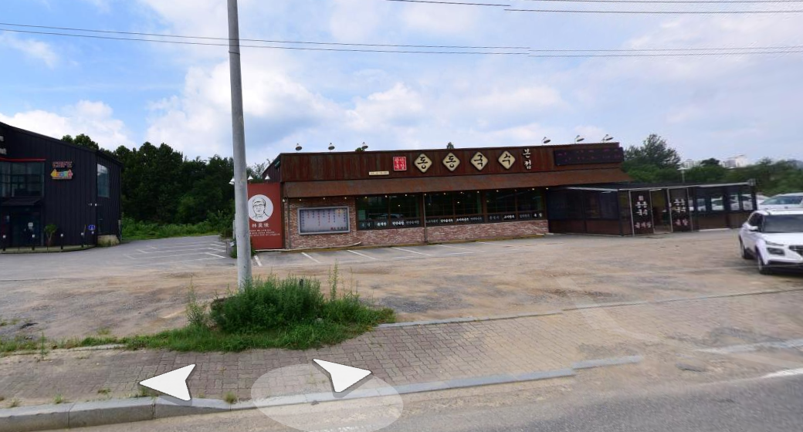
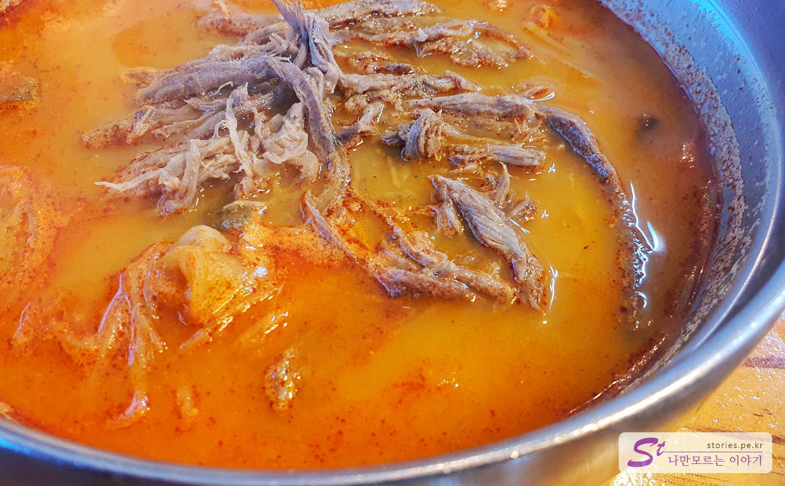
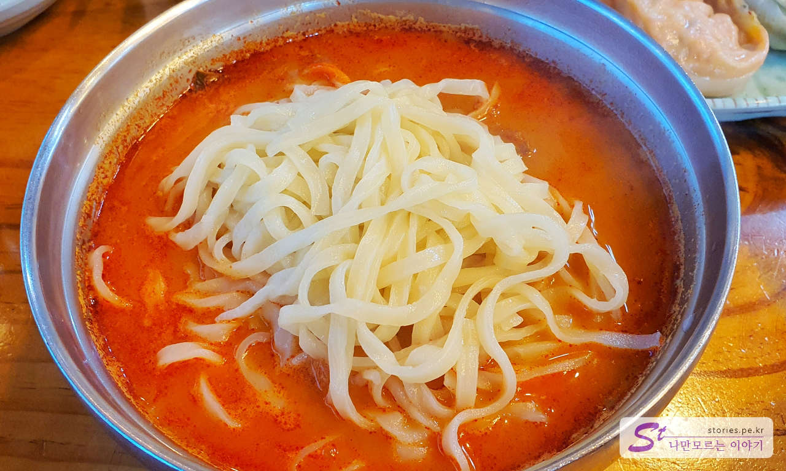
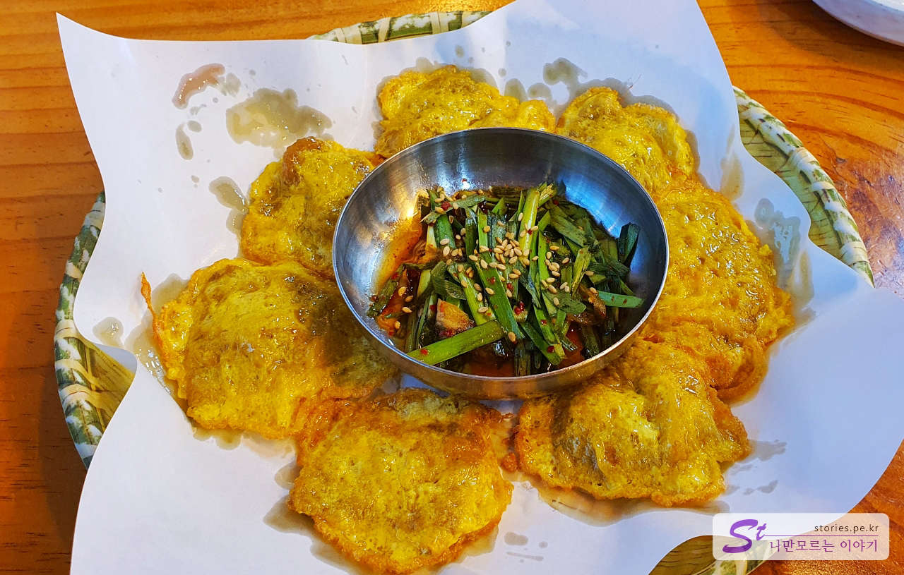
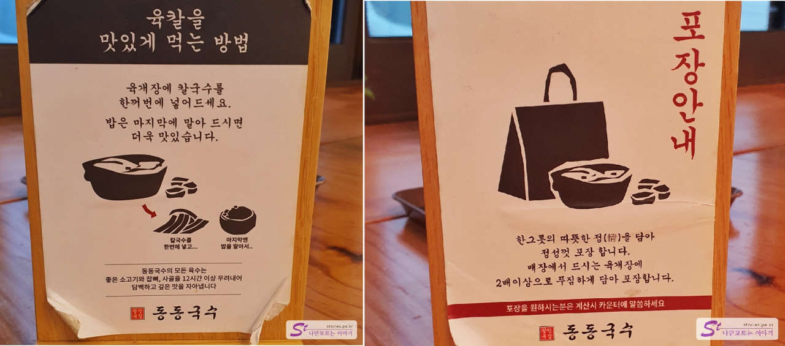
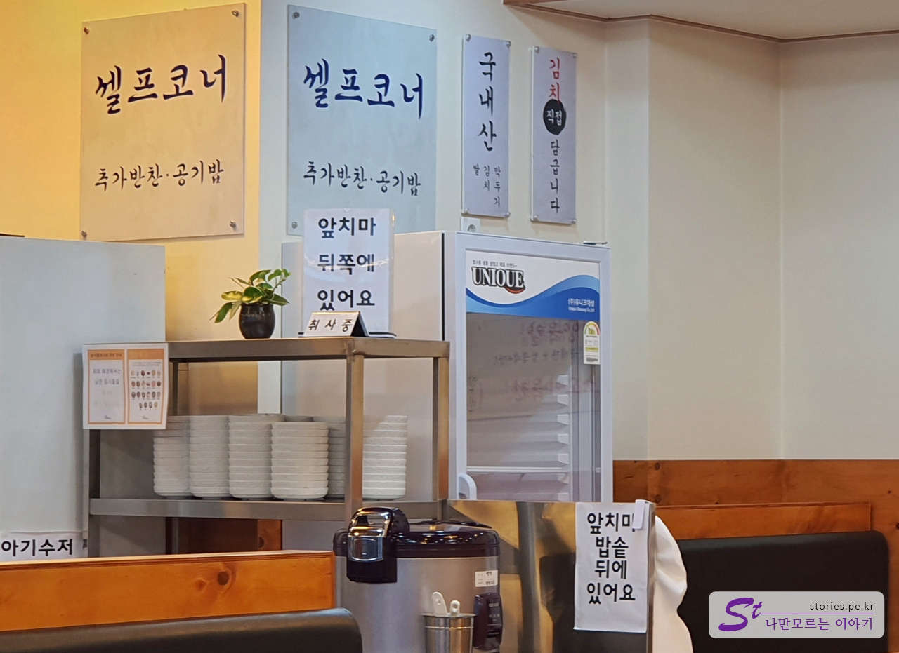

I went to Yes Park, a ceramic art village in Icheon, and went to Dongdong Noodles restaurant in Gonjiam because I was hungry. Dongdong Noodles is a famous restaurant for **Yukgaejang+Kalguksu**, and it is said that Gonjiam is **the main store**. (But it's a little strange that this place is **Original Choi Mi-jja-meori gukbap** on Naver Map.)

## Representative menu and price (cost-effectiveness)

Dongdong Noodles' main menu is **Yukkal**, which consists of Yukgaejang + Kalguksu + Rice.

## Food I've tried

We ordered **Yuk-Kal, beef meat pancake, dumplings (meat, kimchi)**.

If you order, you will get kimchi, kkakdugi, radish kimchi. The side dishes are generally neat and taste good. It says that you make kimchi yourself, but it tastes really good.

Finally, we have a Yuk-Kal. It is a combination of boiled noodles and rice with Yukgaejang and Kalguksu.

The torn meat looks delicious The soup is also spicy and delicious.

First, I put kalguksu in Yukgaejang and roll it and eat it. You can put rice in it after eating.

Another delicacy is this meat pancake. I just ordered it without thinking and it's delicious. I ordered half a plate, but I should have just ordered a plate of meat pancake without dumplings That's what I think.

Dumplings can be ordered at **1,000 won per unit** for easy ordering, so it was good that you could only order as much as you want. However, the dumpling is not a hand dumpling, but a supermarket dumpling, so it doesn't taste very distinctive.

## Taste Assessment (extremely subjective)

Yuk-Kal and meat pancake tasted good. It's worth recommended.
However, I don't think you need to buy dumplings here.

<b>Subjective taste score: </b> ★★★★☆

## Restaurant Management System

It was simple but helpful because I put the way to eat yukkal deliciously on every table.

And it's possible to wrap it, and if you wrap it, it gives you a lot. Haha

At first, you can bring side dishes and eat additional side dishes or rice at the self-corner.

<b>Operating System: </b> ★★★★☆

## Cleanliness

The cleanliness of the restaurant also looks good. It's well organized.

<b>Cleanliness: </b> ★★★★☆

## Restaurant and parking information

- Address: 20 Dong-dong Noodles, Docheok-ro, Gonjiam-eup, Gwangju-si, Gyeonggi-do
- Contact number: 031-798-4224
- Business hours (break time): 09:00 - 21:00 (20:00 Last order)
- Parking: There is a generous parking space of more than 20 seats in front of the store.

<iframe src='https://www.google.com/maps/embed?pb=!1m18!1m12!1m3!1d4485.438997460099!2d127.33319643328501!3d37.349981373558784!2m3!1f0!2f0!3f0!3m2!1i1024!2i768!4f13.1!3m3!1m2!1s0x35635546be5aeb1f%3A0x466f096c9586f1da!2z64-Z64-Z6rWt7IiY!5e0!3m2!1sko!2skr!4v1671543062170!5m2!1sko!2skr' class='embed-responsive-item' allowfullscreen></iframe>

