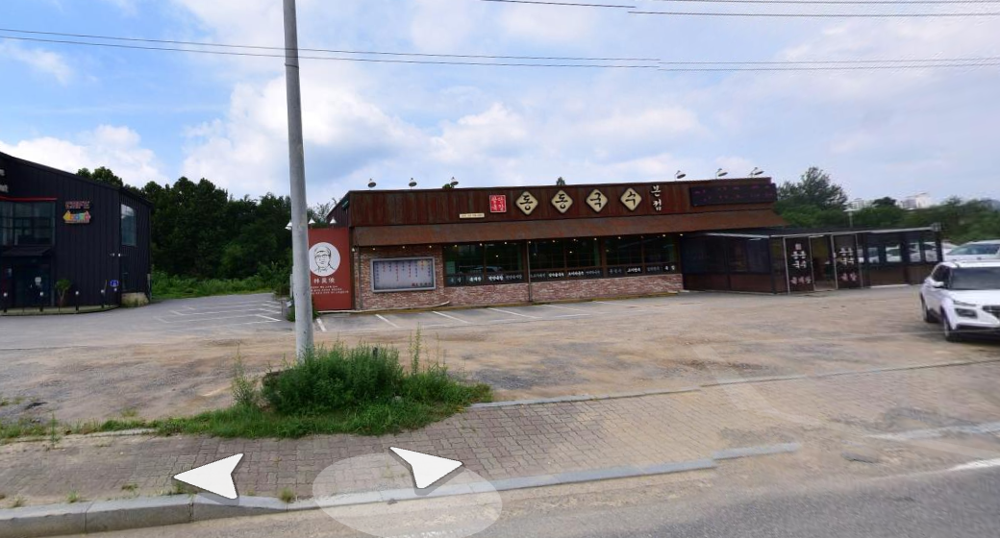
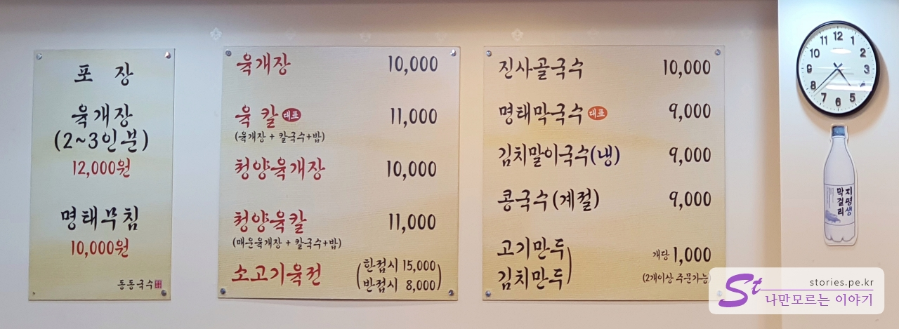
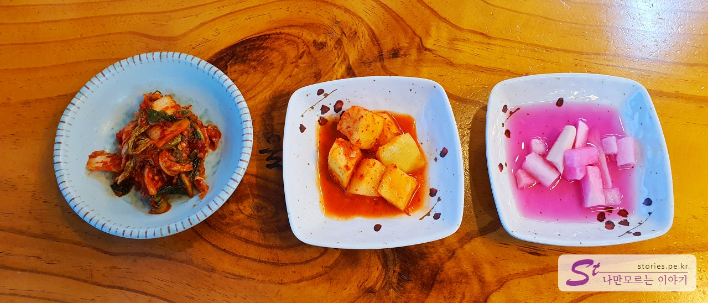
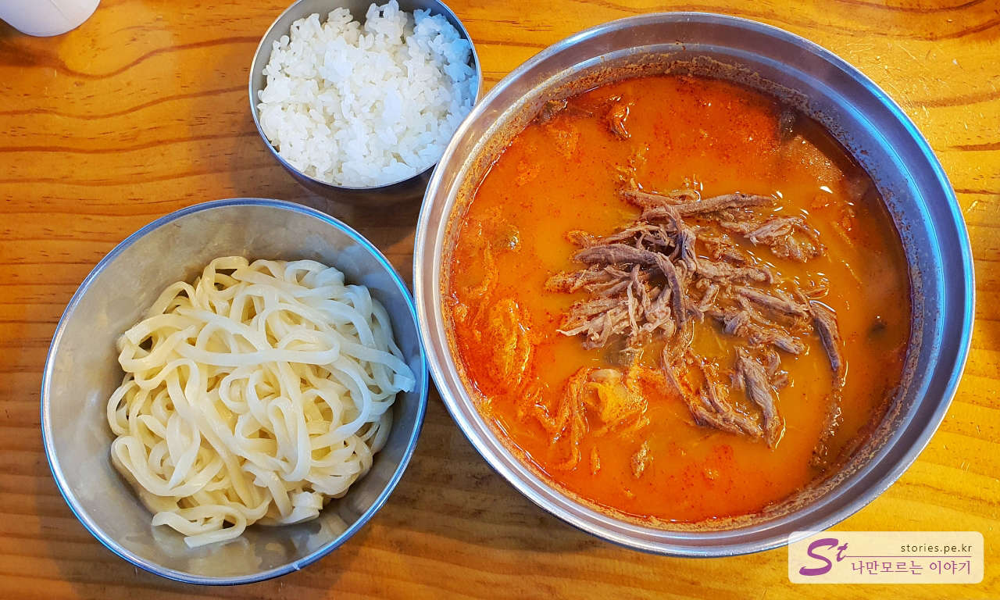
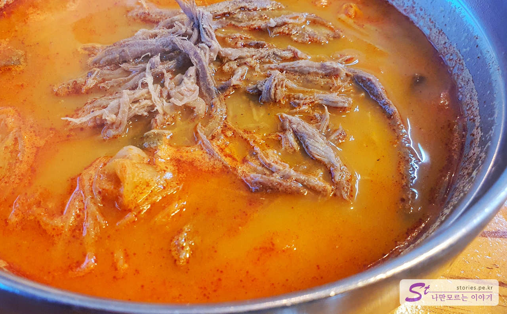
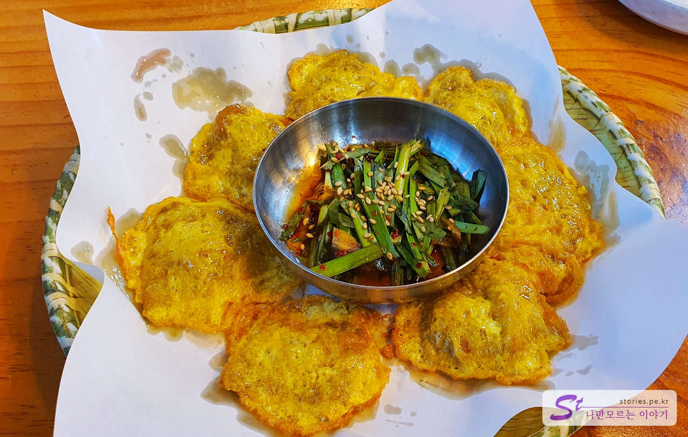
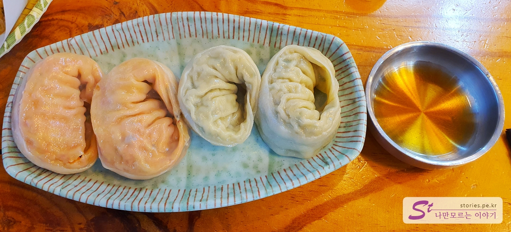
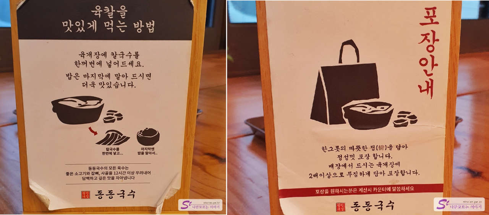
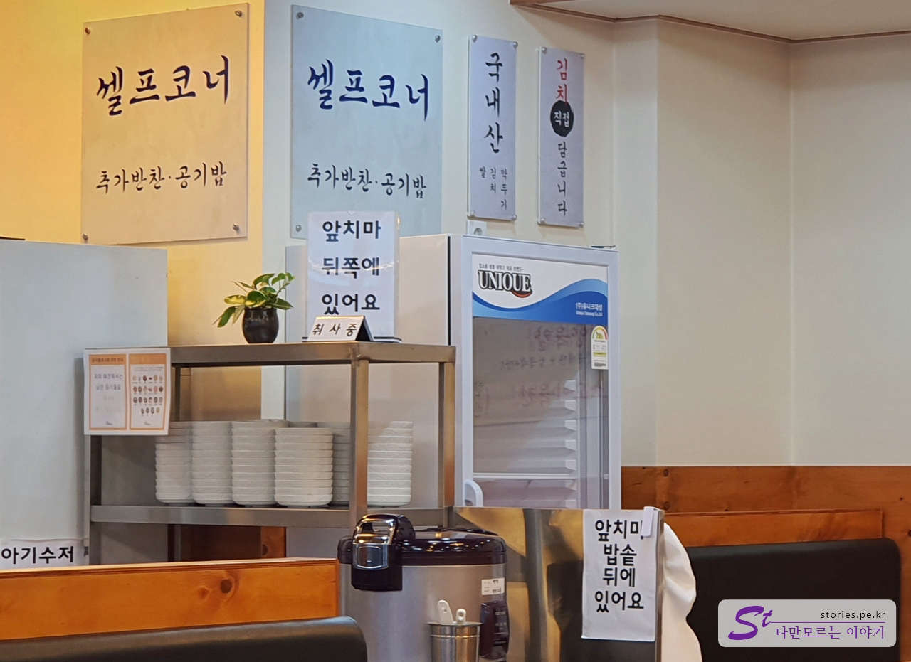
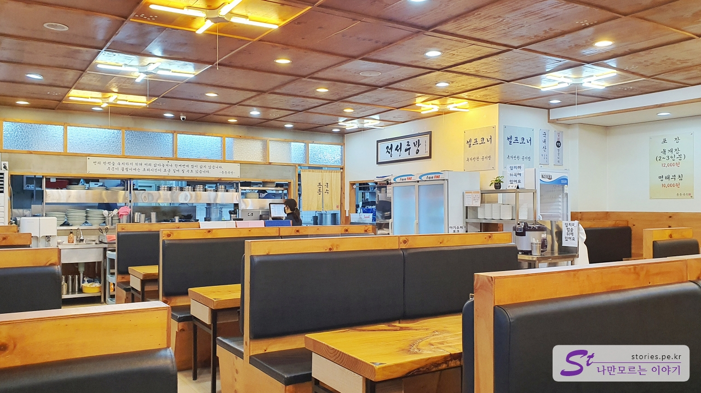

이천의 도자예술마을 예스파크에 갔다가 배가 고파서 곤지암에 있는 동동국수집으로 갔습니다. 동동국수는 **육개장+칼국수**로 유명한 식당이며 **곤지암이 본점**이라고 합니다. (그런데 조금 이상한 게 여기가 네이버 맵에서는 **원조최미자소머리국밥** 집으로 나오네요.)

## 대표 메뉴와 가격(가성비)

동동국수의 주메뉴는 **육칼**이라고 하는 **육개장 + 칼국수 + 밥**으로 구성된 메뉴입니다.

## 먹어본 음식

저희는 **육칼과 소고기 육전, 만두(고기, 김치)**를 시켜봤습니다.

주문을 하면 김치, 깍두기, 무 동치미가 나옵니다. 반찬은 대체로 정갈하고 맛이 좋습니다. 김치는 직접 담근다고 되어 있는데 정말 담근 맛입니다.

드디어 육칼이 나왔습니다. 육개장과 칼국수 삶아 건진 면과 밥이 한 조합입니다.

육개장의 찢은 고기가 맛있어 보이네요 국물도 칼칼하니 맛있습니다.

먼저 육개장에 칼국수를 넣고 말아서 먹습니다. 먹고 난 후에 밥을 말아먹을 수 있습니다.

또 하나의 별미가 이 육전입니다. 그냥 별생각 없이 주문을 했는데 맛있어요. 반 접시를 시켰는데, 그냥 만두는 빼버리고 육전을 한 접시로 주문할걸~ 하는 생각이 들 정도입니다.

만두는 주문하기 좋게 **1개당** **1,000원**으로 주문할 수 있어서 먹을 만큼만 주문이 가능해서 좋았습니다. 다만 만두가 손만두가 아니고 슈퍼마켓 만두라서 그다지 특색 있는 맛은 아닙니다.

## 맛 평가 (지극히 주관적임)

육칼과 육전은 맛이 좋았습니다. 추천할 만합니다.
다만 만두는 굳이 여기에서 사 먹을 필요는 없을 것 같은 맛입니다.

<b>주관적인 맛 점수 : </b> ★★★★☆

## 식당 운영 시스템

모든 테이블에 육칼을 맛있게 먹는 방법을 올려놔서 간단하지만 도움이 되었습니다.

그리고 포장도 가능하고 포장하면 양도 많이 준다네요. ㅎㅎ

처음에는 반찬을 갖다주고 추가 반찬이나 밥 등은 셀프 코너에서 추가로 먹을 수 있습니다.

<b>운영 시스템 : </b> ★★★★☆

## 청결도

식당의 청결도 도 좋아 보입니다. 정리도 잘 되어있고요.

<b>청결도 : </b> ★★★★☆

## 식당과 주차 정보

- 주소 : 경기 광주시 곤지암읍 도척로 20 동동국수
- 연락처 : 031-798-4224
- 영업시간(브레이크 타임) : 09:00 - 21:00 (20:00 라스트 오더)
- 주차 : 가게 앞에 20자리 이상의 넉넉한 주차공간이 있습니다.

<iframe src='https://www.google.com/maps/embed?pb=!1m18!1m12!1m3!1d4485.438997460099!2d127.33319643328501!3d37.349981373558784!2m3!1f0!2f0!3f0!3m2!1i1024!2i768!4f13.1!3m3!1m2!1s0x35635546be5aeb1f%3A0x466f096c9586f1da!2z64-Z64-Z6rWt7IiY!5e0!3m2!1sko!2skr!4v1671543062170!5m2!1sko!2skr' class='embed-responsive-item' allowfullscreen></iframe>

## 인근 여행지

> - [[이천 여행] 이천 도자예술마을 예스파크 쉽게 구경하기](https://blog.stories.pe.kr/602)
> - [[이천 여행] 덕평자연휴게소의 명물 별빛정원 우주](https://blog.stories.pe.kr/604)
