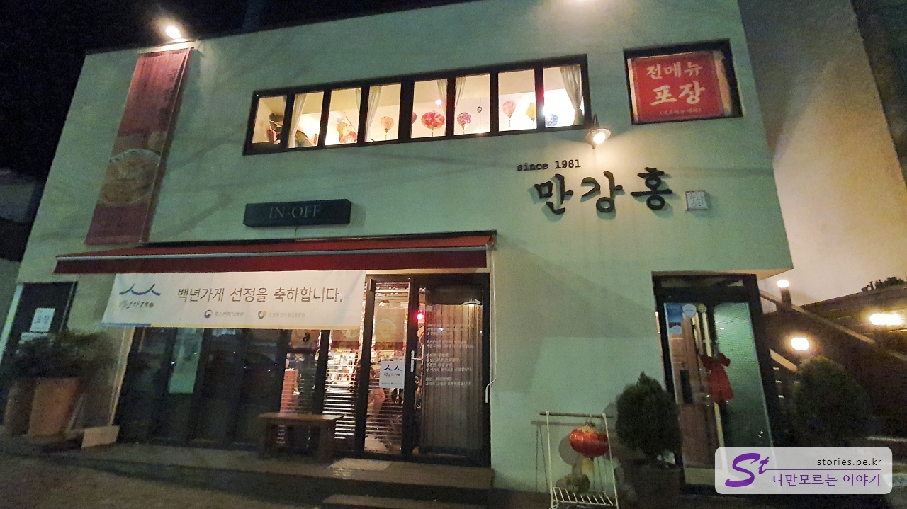
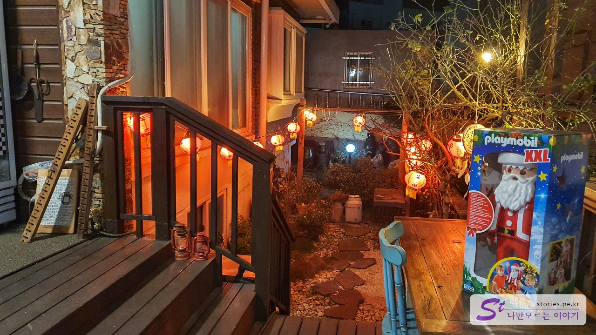
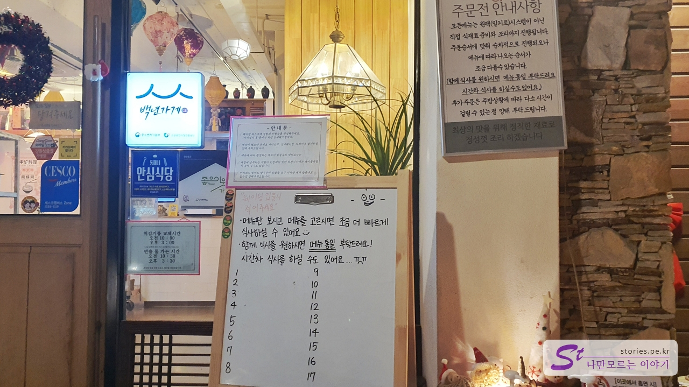
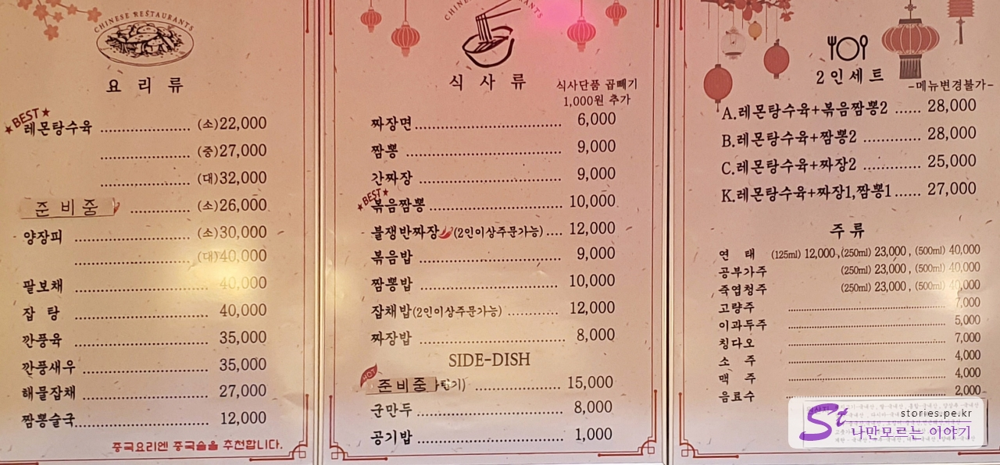
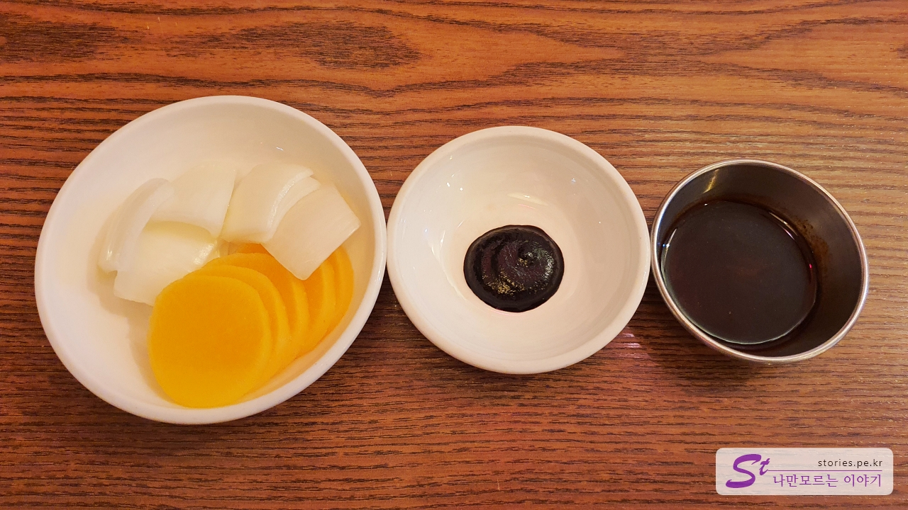
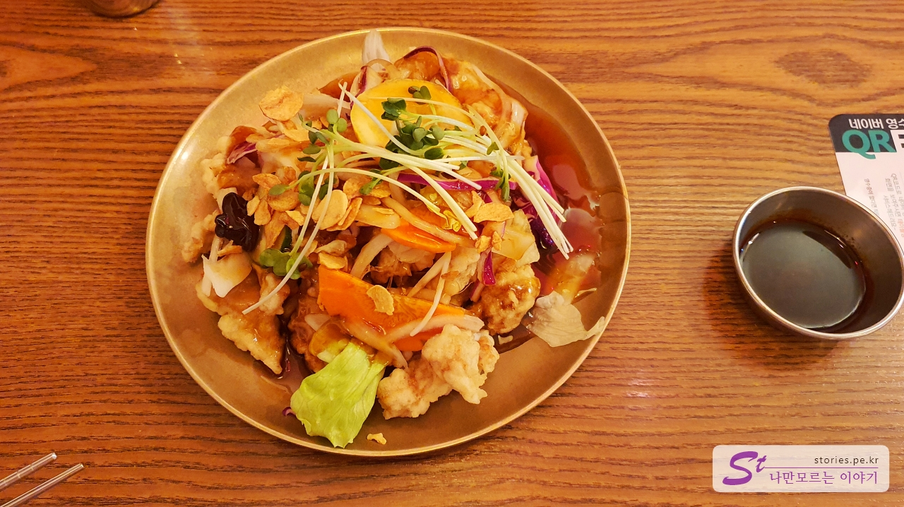
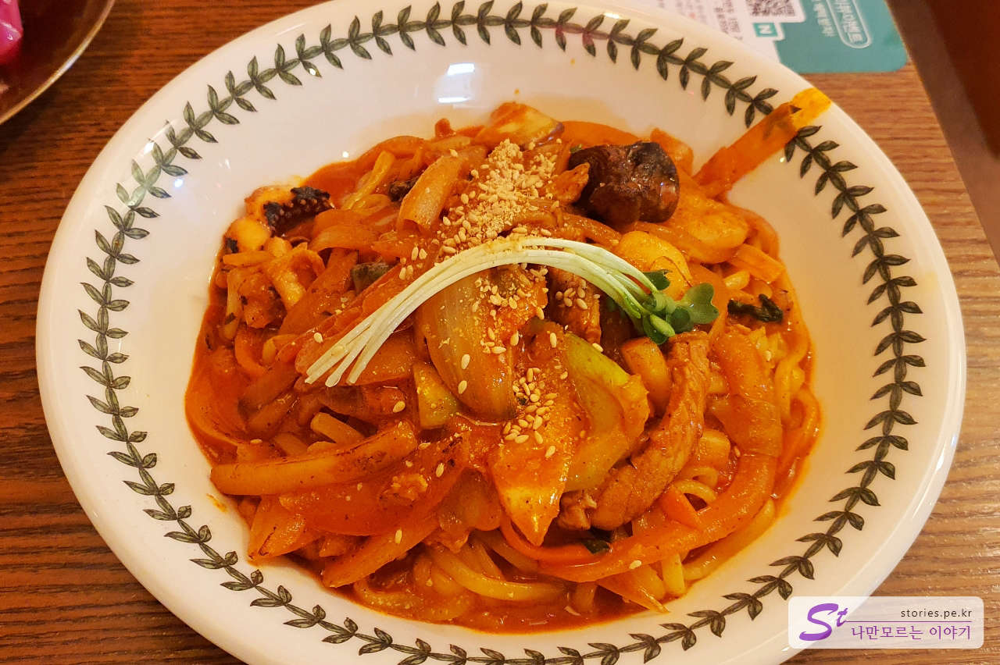

After looking around the Sogeumsan Grand Valley in Wonju, we took Yeongdong Expressway and moved to the East Sea, which is a little far away. I checked in at the accommodation and came out for dinner, but at around 6:30 p.m., most of the restaurants were closed, so I couldn't find the right restaurant. Maybe it's because it's in the countryside, but it seemed to close the restaurant very quickly. (I can't get used to it)

I hurriedly searched for a good restaurant on Naver and found a place with a good rating and an open door, so I went there.

# Chinese food, Man Gang Hong

It's the Man Gang Hong building. The first floor looks like a restaurant, but the first floor is not a restaurant, but you have to go up to the second floor using the stairs to the right of the building to get to the restaurant.

If you go up to the second floor, there is a red light in front of you that smells like China.

If you go up to the second floor, there is an entrance on your left. Seeing that there is a waiting board, I guess this restaurant also has a waiting room. We arrived around 6:50 p.m. and we were able to get a seat right away without waiting, perhaps because it was a weekday.

## Representative menu and price (cost-effectiveness)

I looked it up and found that the representative menus here are **Lemon Sweet and Sour Pork and **Fried Spicy Seafood Noodles. There is a set menu for two people, and although the amount of each food is a little small, it was good to eat two foods and sweet and sour pork.

## Food I've tried

We ordered 2 servings of lemon tangsuyuk + stir-fried jjamppong for 2 servings.

As with Chinese food, onions, pickled radish, chunjang, and soy sauce were served. The soy sauce is probably for dipping sweet and sour pork.

It's sweet and sour pork. Maybe it's because of lemon, but it has a unique scent. It didn't smell good to me, but it tasted good when I tried sweet and sour pork. The plating was good because it came out sprinkled with cabbage and sprout almond slices.

I liked stir-fried jjamppong because it was moderately small. I liked the taste, but my wife said it was a bit salty.

## Taste Assessment (extremely subjective)

It's just the right amount and the right taste. I personally liked the taste of stir-fried jjamppong.

<b>Subjective taste score: </b> ★★★☆☆

Rather than recommending it, it's not a bad restaurant to eat a meal.

## Restaurant and parking information

- Address: 202nd floor, Pyeongwon-ro, Donghae-si, Gangwon-do
- Contact number: 033-532-5644
- Business hours: 11:00 - 21:00
  - Break time: 15:00 - 17:00
  - Last order: 20:00
- Closed: Every Sunday
- Parking: There is no separate parking lot. You should use the parking lot of the art center in the alley or in the front.

<iframe src='https://www.google.com/maps/embed?pb=!1m18!1m12!1m3!1d2660.8254884599!2d129.11384489599763!3d37.52507079978417!2m3!1f0!2f0!3f0!3m2!1i1024!2i768!4f13.1!3m3!1m2!1s0x3561c7823ea3d385%3A0x628618429dd152cb!2z66eM6rCV7ZmN!5e0!3m2!1sko!2skr!4v1671703420038!5m2!1sko!2skr' class='embed-responsive-item' allowfullscreen></iframe>

