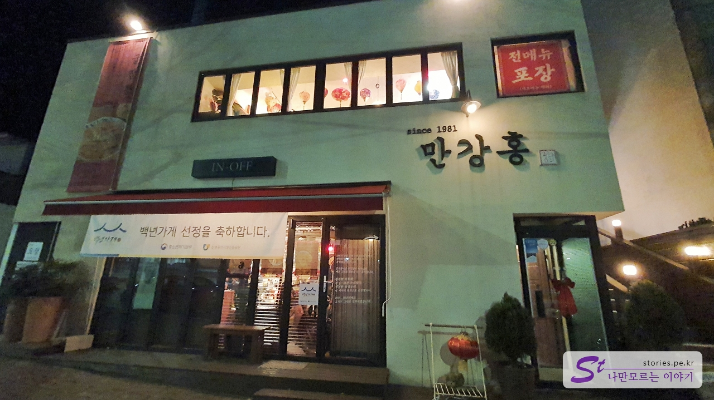
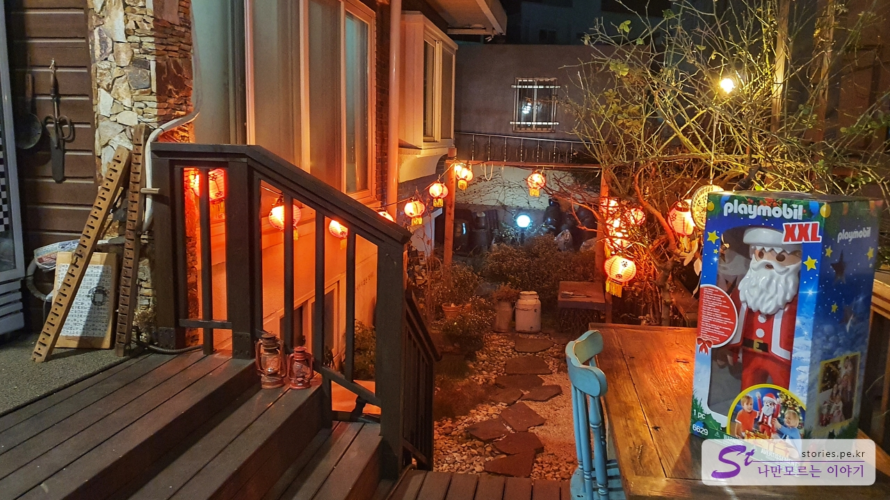
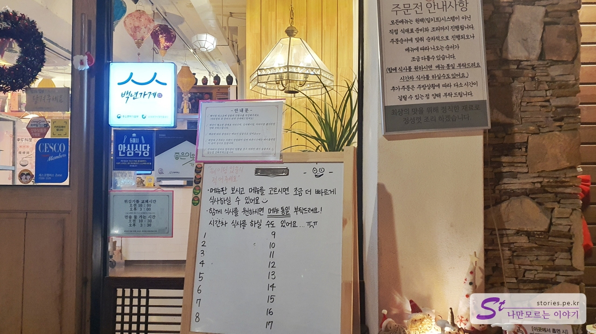
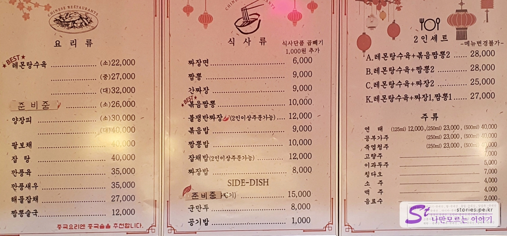
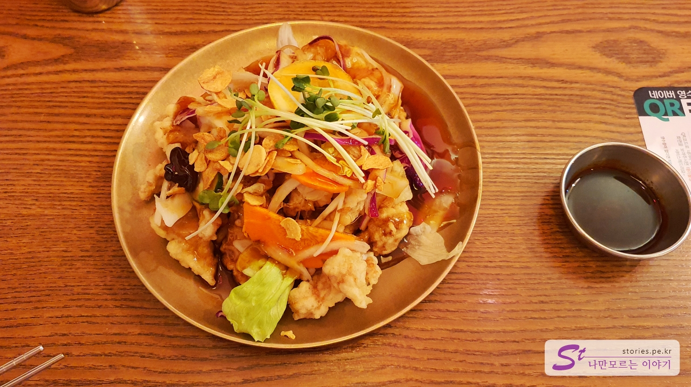

원주의 소금산 그랜드밸리를 구경하고 영동고속도로를 타고 좀 멀리있는 동해로 이동했습니다. 숙소에 체크인을 하고 저녁식사를 하러 나왔는데, 저녁 6시 30분쯤 되다 보니 대부분의 식당이 문을 닫아서 마땅한 식당을 찾을 수가 없었습니다. 지방이라 그런지 무척이나 빨리 식당을 닫는 것 같았습니다. (적응 안돼ㅠㅠ)

급히 네이버로 맛집을 찾아보니 그나마 평점이 괜찮고 문이 열려있는 곳이 있어서 찾아갔습니다.

# 중식 만강홍

만강홍 건물입니다. 1층이 식당일 것처럼 보이지만 1층은 식당이 아니고 건물의 오른쪽에 있는 계단을 이용해서 2층으로 올라가야 식당이 나옵니다.

2층으로 올라가면 정면에 빨간 등으로 중국 냄새나게 꾸며놨습니다.

2층에 올라서면 왼쪽에 입구가 있습니다. 대기판이 있는것을 보니 이 식당도 평소 웨이팅이 있는 식당인가 봅니다. 저희는 대략 저녁 6시 50분쯤에 도착을 했는데 평일이라 그런지 웨이팅 없이 바로 자리를 잡을 수 있었습니다.

## 대표 메뉴와 가격(가성비)

찾아보니 여기의 대표 메뉴는 **레몬 탕수육**과 **볶음짬뽕**이라고 하더라고요. 2인 세트메뉴가 있는데 각 음식의 양은 조금씩 적지만 음식 2개에 탕수육을 먹을 수 있어서 좋았습니다.

## 먹어본 음식

저희는 2명이라 **A세트(2인)**인 레몬 탕수육 + 볶음짬뽕 2개를 시켰습니다.

중식이 그렇듯이 양파, 단무지, 춘장과 간장이 나왔습니다. 간장은 아마도 탕수육 찍어 먹으라고 나온 것이겠지요.

탕수육입니다. 레몬이 들어가서 그런지 약간 특이한 향이 났습니다. 저한테는 향은 별로였는데 탕수육을 먹어보니 맛은 좋았습니다. 양배추와 새싹 아몬드 슬라이스를 뿌려서 나와서 플레이팅이 좋았습니다.

볶음짬뽕은 양이 적당히 적게 나와서 좋았습니다. 맛은 저는 좋았는데 집사람은 약간 짠 것 같다고 하네요.

## 맛 평가 (지극히 주관적임)

적당한 양에 적당한 맛입니다. 볶음짬뽕은 개인적으로 맛이 좋았습니다.

<b>주관적인 맛 점수 : </b> ★★★☆☆

막 추천한다기보다는 한끼 먹기에 나쁘지 않은 식당입니다.

## 식당과 주차 정보

- 주소 : 강원 동해시 평원로 20 2층
- 연락처 : 033-532-5644
- 영업시간 : 11:00 - 21:00
  - 브레이크 타임 : 15:00 - 17:00
  - 라스트 오더 : 20:00
- 휴무일 : 매주 일요일
- 주차 : 별도의 주차장은 없습니다. 골목이나 앞쪽의 예술 회관 주차장을 이용해야 합니다.

<iframe src='https://www.google.com/maps/embed?pb=!1m18!1m12!1m3!1d2660.8254884599!2d129.11384489599763!3d37.52507079978417!2m3!1f0!2f0!3f0!3m2!1i1024!2i768!4f13.1!3m3!1m2!1s0x3561c7823ea3d385%3A0x628618429dd152cb!2z66eM6rCV7ZmN!5e0!3m2!1sko!2skr!4v1671703420038!5m2!1sko!2skr' class='embed-responsive-item' allowfullscreen></iframe>

