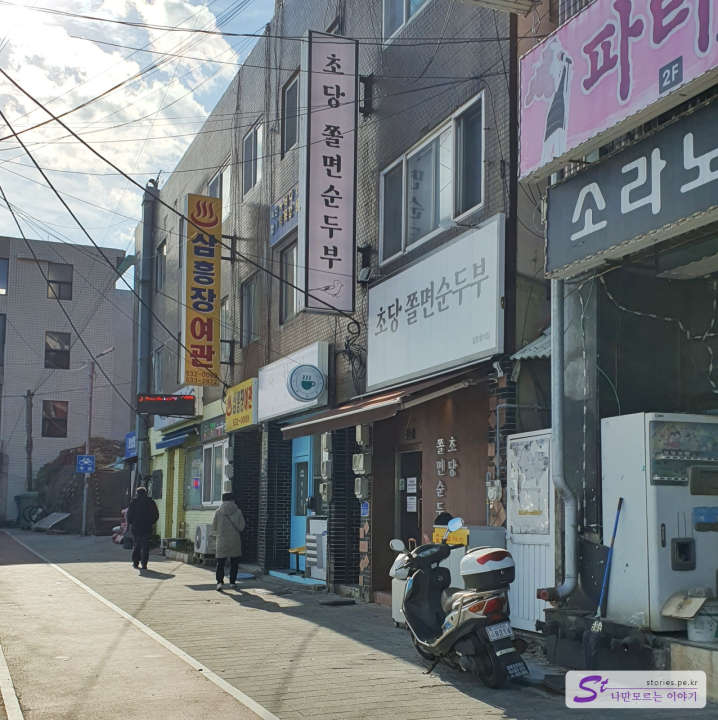
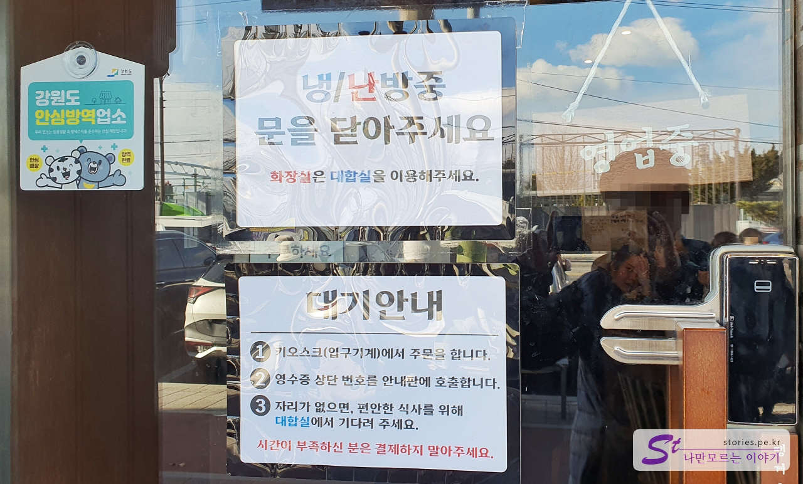
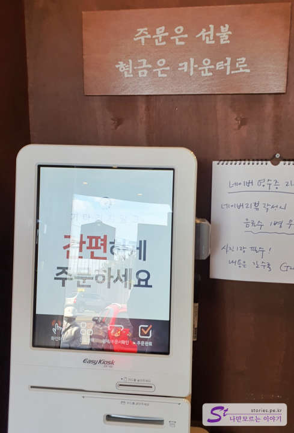
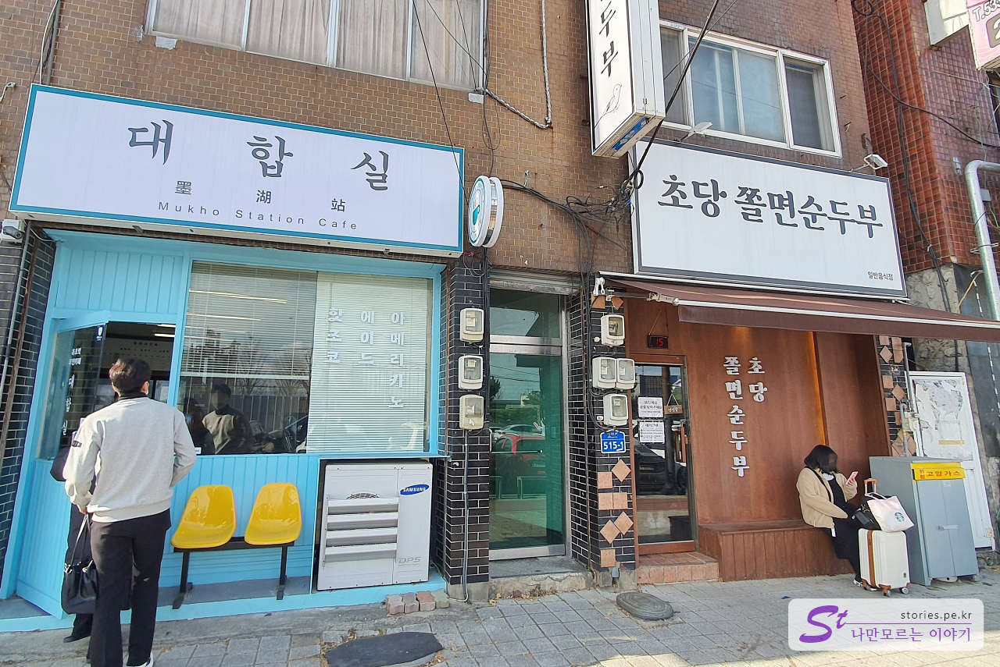
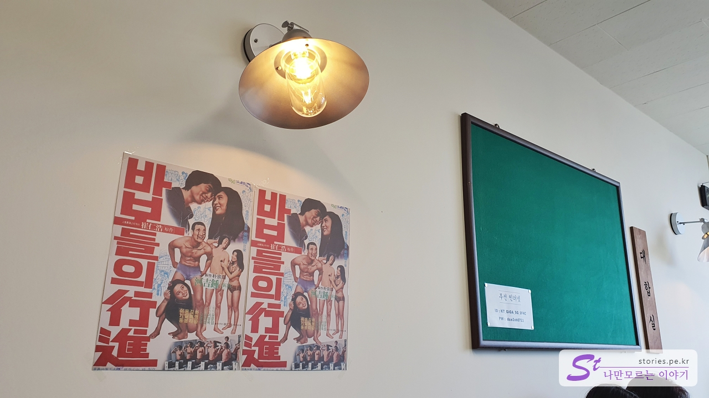
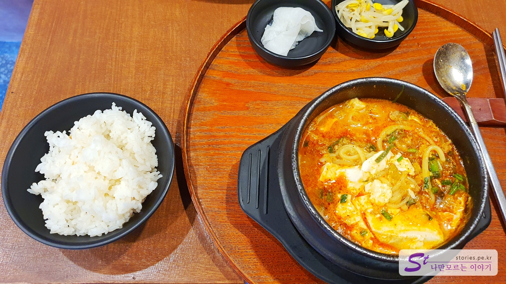
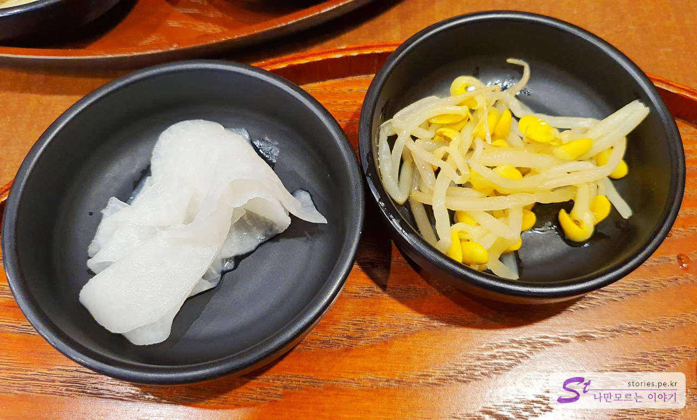
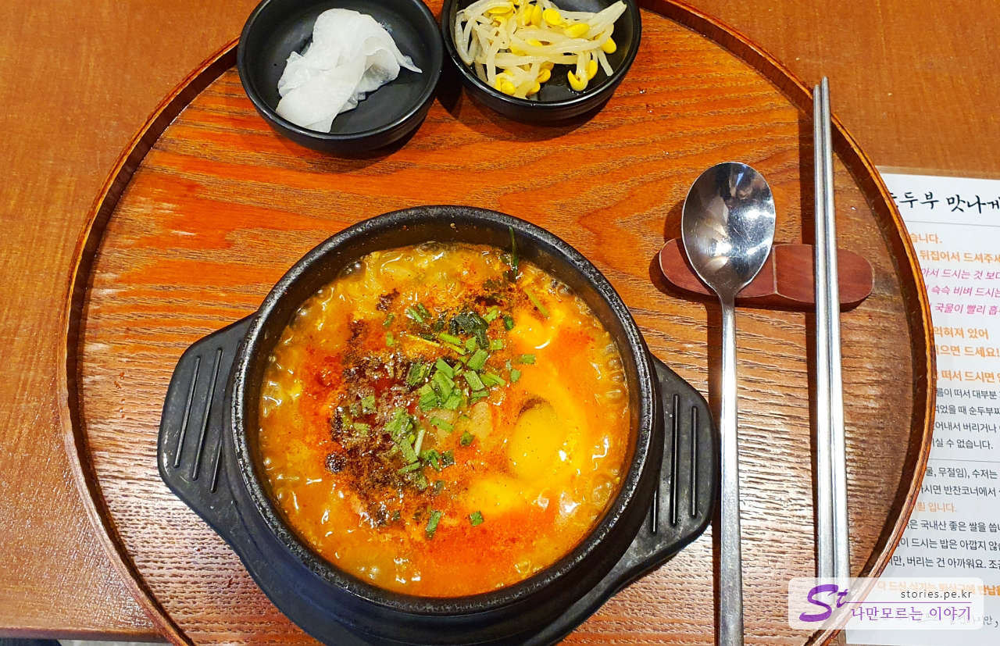
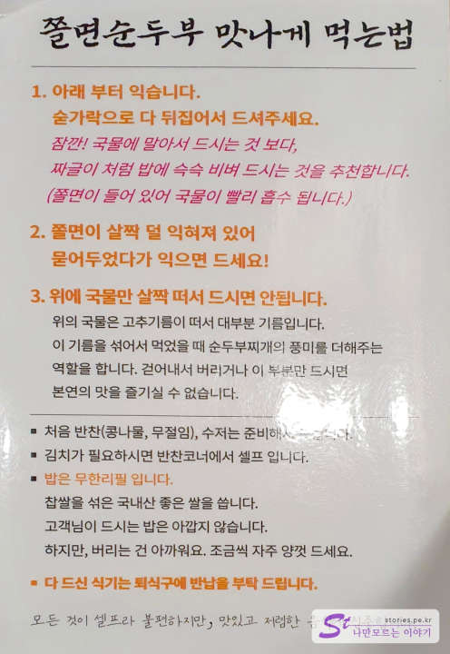

동해의 맛집중에 **초당쫄면순두부**집이 있습니다. 대기도 있고 운영시간도 11시에서 오후 2시로 짧아 작정하고 가셔야 하는 곳입니다. 주로 20~30대 젊은이들이 찾아옵니다.

식당은 큰길에 있는 건물입니다. 식당 이름도 더도 말고 덜도 말고 딱 **초당쫄면순두부** 입니다.

일단 식당에 도착을 하면 먼저 키오스크에서 주문을 해야 합니다. 주문번호를 받고 대기장소(대합실)에서 기다리고 있으면 번호를 호출합니다. 카카오톡이나 문자로 알림을 주는 시스템은 아닙니다.

위와 같이 키오스크를 통해 주문을 합니다. 카드 결제를 하거나 또는 현금인 경우 카운터에 지불하면 됩니다. 영수증에 호출 번호가 있기 때문에 잘 가지고 있어야 합니다.

바로 옆에 대합실이 있습니다. 원래는 무인카페 같은데 순두부집의 대기장소로 사용되고 있습니다. 이 대합실 주인도 순두부집 사장님인듯합니다. 여기서 기다리고 있으면 번호 호출을 해 줍니다.

대합실의 내부는 옛날 60~70년대 분위기를 하고 있습니다.

대합실에서 30분쯤 기다리니 저희 차례가 왔습니다. **메뉴는 초당쫄면순두부와 산적(소고기) 주먹밥 딱 2개**입니다. 저희는 주먹밥이 다 떨어져서 주문을 못했습니다. ㅠㅠ 대신 공깃밥은 무한리필로 덜어 먹을 수 있습니다.

반찬은 무 절임과 콩나물 2개입니다. 반찬이 메인은 아니니 크게 상관은 없습니다.

바닥에 쫄면이 깔려있고 고추기름이 위에 떠있습니다. 익지 않은 계란이 올라와 있습니다. 그래서 순두부를 받으면 바로 뒤집어서 섞어 주셔야 합니다. 그래야 계란도 익고 바닥에 있는 쫄면도 타지 않습니다.

## 맛 평가 (지극히 주관적임)

맛있습니다. 보통 단일 메뉴인데 사람들이 많다면 맛집 일 확률이 높습니다.

<b>주관적인 맛 점수 : </b> ★★★★☆

## 식당 운영 시스템

주문에서부터 대기, 음식이 나올 때까지 일사천리로 진행됩니다. 물론 대기자가 많지만 대합실까지 운영하면서 기다릴 수 있게 해주어서 좋았습니다. 다만 아쉬운 점은 카톡이나 문자로 알려주는 시스템을 구축한다면 더 좋을 것 같습니다.

<b>운영 시스템 : </b> ★★★★☆

## 청결도

적당한 정도의 청결도입니다.

<b>청결도 : </b> ★★★★☆

## 식당과 주차 정보

- 주소 : 강원 동해시 해안로 515-1 1층
- 연락처 : 0507-1389-9639
- 영업시간 : 11:00 ~ 14:30
- 브레이크 타임 : 없음
- 라스트오더 : 14:00
- 휴무일 : 매주 화요일
- 주차 : 식당 앞에 주차장이 있으나 거의 만차라 주차가 쉽지 않습니다. 뒤쪽 골목길로 들어가서 주차를 해도 됩니다.

<iframe src='https://www.google.com/maps/embed?pb=!1m18!1m12!1m3!1d3163.3729160228277!2d129.10487551557247!3d37.546276933045405!2m3!1f0!2f0!3f0!3m2!1i1024!2i768!4f13.1!3m3!1m2!1s0x3561c76088faabe1%3A0xb506761c208e1702!2z7LSI64u57KuE66m07Iic65GQ67aA!5e0!3m2!1sko!2skr!4v1671976769291!5m2!1sko!2skr' class='embed-responsive-item' allowfullscreen></iframe>

## 인근 여행지

> [[동해 여행] 새로운 동해의 명소 도째비골 스카이밸리 꼭 가보세요](https://blog.stories.pe.kr/609)
