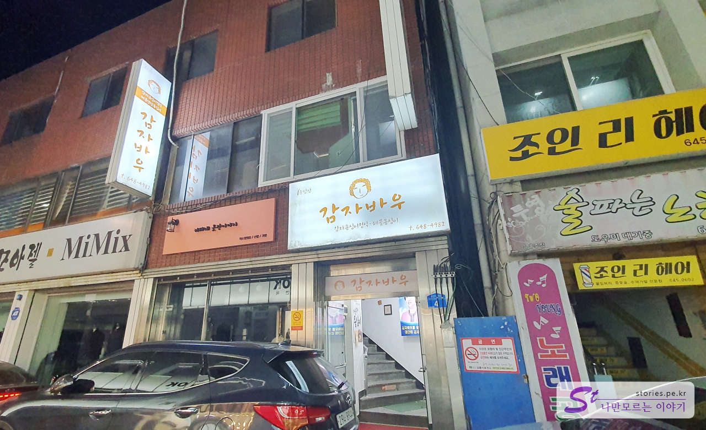
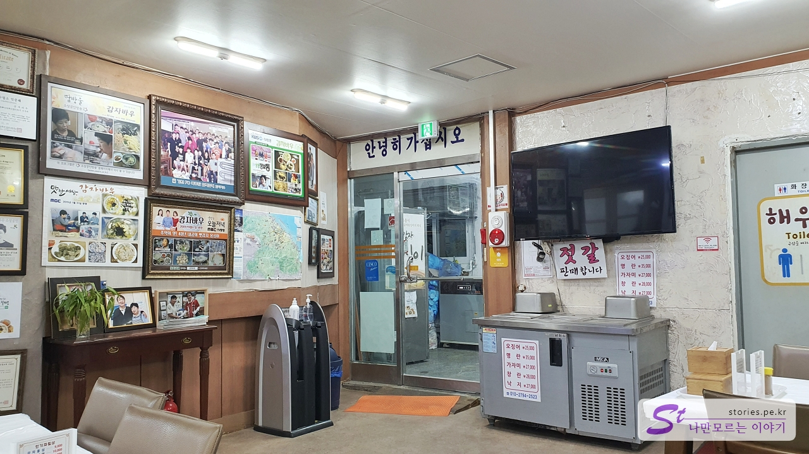
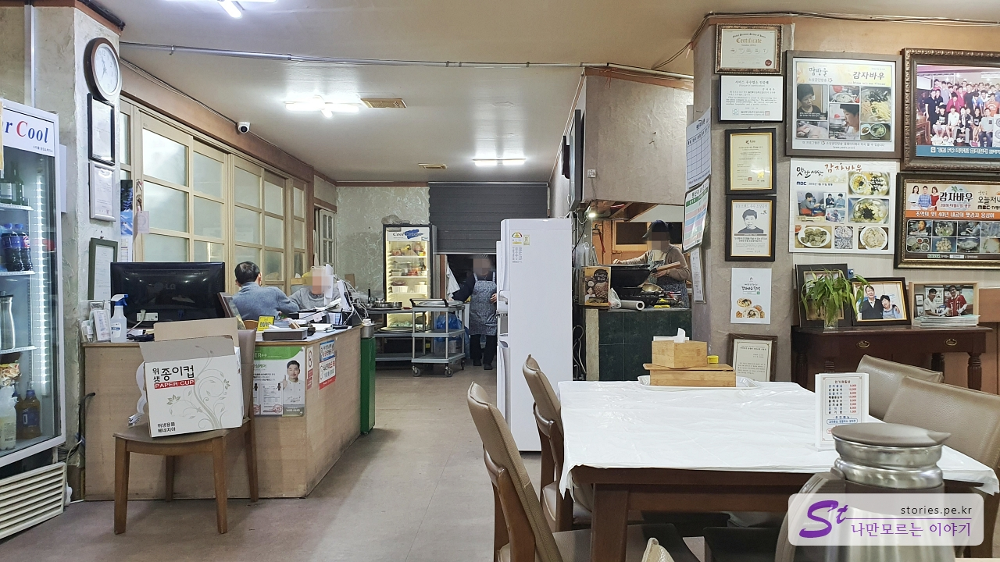
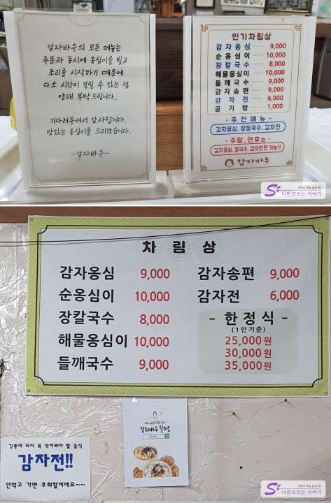
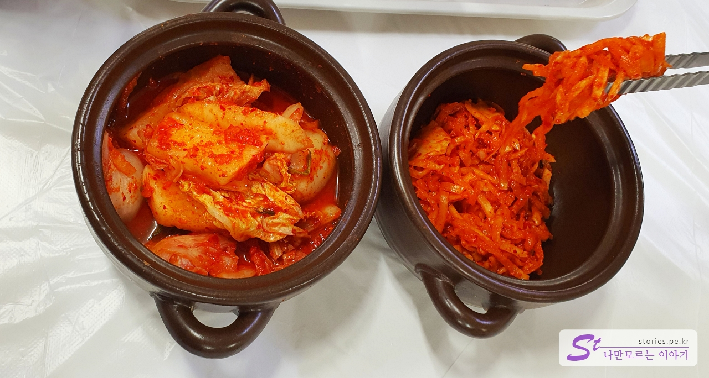
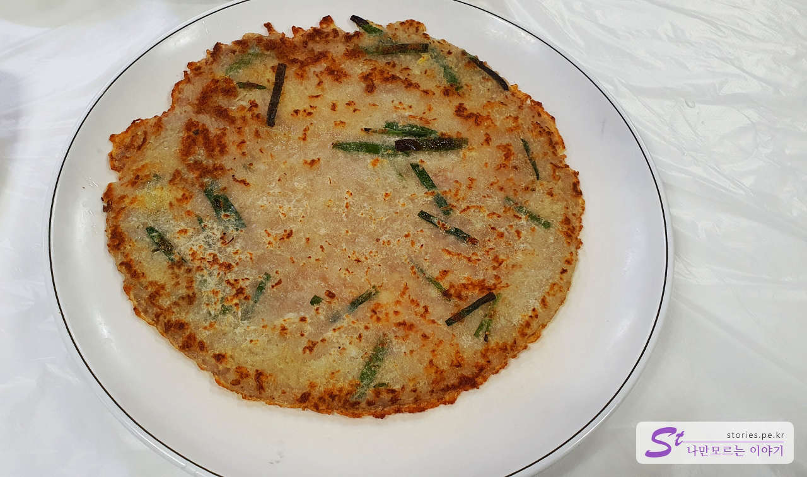
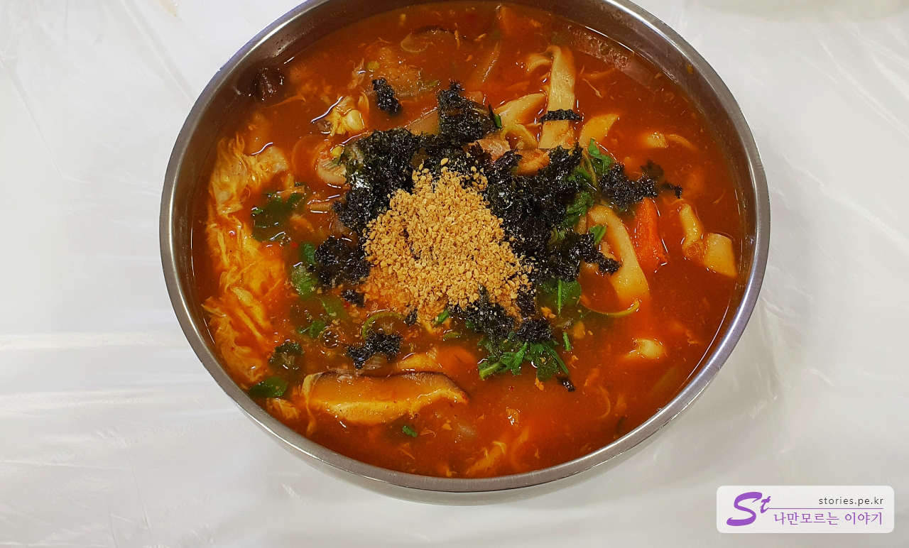
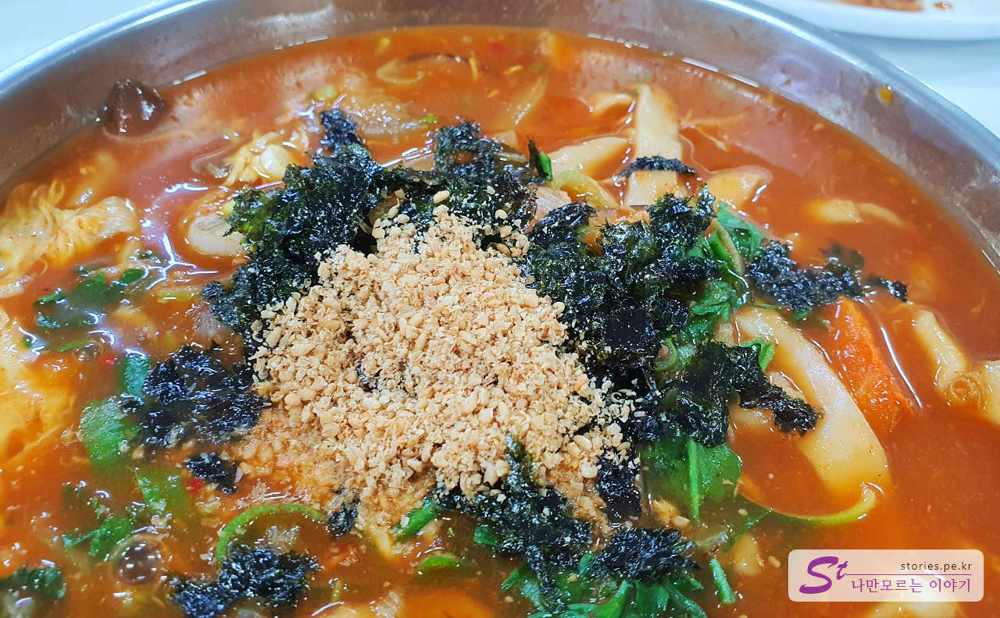
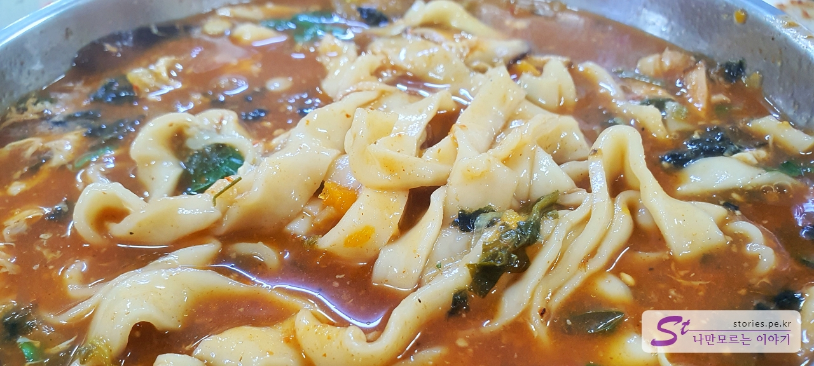
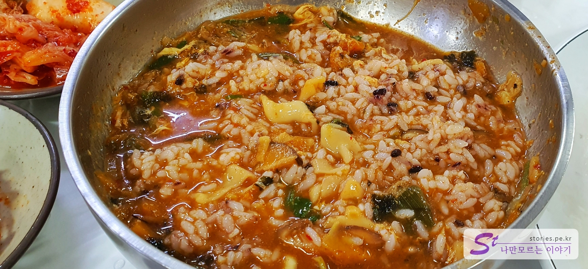

동해 여행을 마치고 서울양양 고속도로를 타기 위해 올라오다가 배가 고파서 강릉에서 유명하다는 장칼국수를 먹기 위해서 강릉에 들르게 되었습니다.  
강릉 시내인 금성로에 위치하고 있어서 별도의 주차장은 없고 분위기 봐가면서 도로 옆에 주차를 하였습니다.

식당은 2층에 있고 조그만 입구를 통해 올라가야 합니다. 올라가 보면 식당이 생각보다 넓습니다.

식당이 세련된 인테리어는 아닙니다. 40년 전통이라고 하는데 그 정도에 맞는 분위기입니다.

주방은 안쪽으로 오픈형 주방입니다.

## 대표 메뉴와 가격(가성비)

메뉴는 다양하게 있으며 대표 메뉴는 **감자옹심이**, **장칼국수**, **감자전**인것 같습니다.

## 먹어본 음식

저희는 장칼국수, 감자전을 시켜서 먹었습니다.

주문을 하면 섞박지와 무생채를 항아리에 담아서 줍니다. 접시에 먹을 만큼만 덜어서 먹으면 됩니다. 섞박지와 무생채도 맛이 좋습니다.

먼저 감자전이 나왔습니다 바삭바삭하고 감자전 특유의 식감도 있어서 맛이 좋았습니다. 대표 메뉴 할만합니다.

드디어 장칼국수가 나왔습니다. 장으로 국물을 내서 걸쭉하고 매콤한 맛이 일품입니다. 그렇다고 너무 맵지는 않습니다. 고추장과 된장의 중간 어느 정도...의 맛인 것 같습니다.

칼국수에 김과 깨가 올려져서 나옵니다. 너무 먹음직스러웠습니다.

면발도 일반 칼국수 면발보다 두껍습니다. 면발도 맛이 좋습니다.

사진으로 보면 좀 깔끔해 보이지는 않지만 밥을 말아먹으면 정말 너무 만족스럽습니다. 면을 좋아하지 않으시는 분은 밥을 기대하시는 것도 좋을 것 같습니다.

## 맛 평가 (지극히 주관적임)

저는 만족하게 먹었습니다. 너무 맵지 않게 매콤한 맛과 걸쭉한 국물이 일품입니다.

<b>주관적인 맛 점수 : </b> ★★★★☆

## 식당 운영 시스템

특별할 것 없는 일반적인 운영을 하고 있습니다.

<b>운영 시스템 : </b> ★★★☆☆

## 청결도

청결도가 심하게 나쁘지는 않은데 전체적으로 깔끔한 느낌은 아닙니다.

<b>청결도 : </b> ★★☆☆☆

## 친절도

주인이 어르신이고 서빙을 보시는 분이 한국 분이 아니라서 친절하다는 느낌을 받기 어려웠습니다. 그렇다고 불친절하다는 말은 아닙니다. 보통 정도라고 보시면 될 것 같습니다.

<b>친절도 : </b> ★★★☆☆

## 식당과 주차 정보

- 주소 : 강원 강릉시 금성로35번길 4
- 연락처 : 033-648-4982
- 영업시간 : 09:00 - 21:00
  - 라스트 오더 : 20:00
- 주차 : 식당 주차장은 없습니다. 도로 이면에 눈치껏 주차해야 합니다.

<iframe src='https://www.google.com/maps/embed?pb=!1m18!1m12!1m3!1d3154.5778616637613!2d128.89256373128703!3d37.75304655646589!2m3!1f0!2f0!3f0!3m2!1i1024!2i768!4f13.1!3m3!1m2!1s0x3561e5fbcff7a757%3A0xe43cce10a77db329!2z6rCQ7J6Q67CU7Jqw!5e0!3m2!1sko!2skr!4v1672128418845!5m2!1sko!2skr' class='embed-responsive-item' allowfullscreen></iframe>

