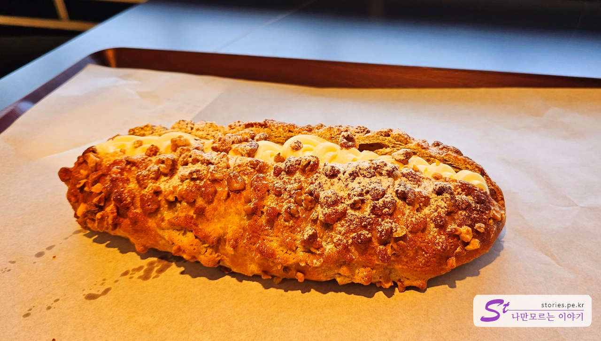

근래에는 뭐든지 커야 성공하는 것 같습니다. 마트도 커야 하고, 식당도 커야 하고 카페도 커야 인정을 받는 것 같습니다.  
이번 주말에 시간이 남아서 말로만 듣던 팜브릿지(palm bridge)를 다녀왔습니다. 역시나 대형 카페이면서 다양한 콘셉트를 유지하고 있었습니다.

## 위치

위치는 포천시 소흘읍에 있으며 광릉수목원에서 고모리 저수지로 넘어가는 길목에 있습니다. 지나가다가 스타벅스가 나타난다면 바로 길 건너편을 바라보면 됩니다.

- 주소 : 경기 포천시 소흘읍 죽엽산로 660 팜브릿지
- 연락처 : 031-541-8000

<iframe src='https://www.google.com/maps/embed?pb=!1m14!1m8!1m3!1d1895.0173429633628!2d127.16396989823319!3d37.77664075740005!3m2!1i1024!2i768!4f13.1!3m3!1m2!1s0x357ccf083ce2bba7%3A0x9a6322648c42676a!2z7Yyc67iM66a_7KeA!5e1!3m2!1sko!2skr!4v1693320667953!5m2!1sko!2skr' class='embed-responsive-item' allowfullscreen></iframe>

## 주차

카페로 가기 위해서는 산 위로 올라가야 합니다. 올라가는 길에 제2주차장이 먼저 나오고 그 위로 더 올라가면 카페 입구로 이어지는 제1주차장이 나옵니다. 저희가 갔을 때는 주말이라 그런지 주차를 기다리는 차가 많이 있었습니다. 그래도 주차요원이 여러 명 있었고 먼저 도착한 차량을 먼저 주차하도록 안내를 잘 해주고 있어서 주차하는데 크게 스트레스를 받지는 않았습니다.

## 건물 및 입구

주차는 건물의 아래와 건물 앞 공터에 주차를 할 수 있습니다.

주차를 하고 건물 오른쪽에 있는 입구를 통해 들어갈 수 있습니다.

1층에 들어서면 특이하게 전시관이 먼저 나옵니다. 카페로 가기 위해서는 오른쪽에 있는 계단을 타고 올라가시면 됩니다.

2층에 올라가면서도 미술작품들이 전시가 되어 있습니다. 작품들 중에 가장 마음에 드는 작품을 한번 찍어봤습니다. 구매도 가능하네요.

2층 바로 오른편에 작품 전시관이 있는데 감상도 가능하고 구매도 가능합니다.

## 2층 카페

카페는 2층과 3층으로 이루어져 있고 들어서자마자 바로 앞쪽에 카운터가 커다랗게 있습니다. 주차장은 꽉 찼는데 카페 안쪽은 앉을 자리가 충분히 있었습니다.

널찍한 카운터에서는 음료와 빵을 주문할 수 있습니다. 카운터 안쪽으로 빵을 직접 굽고 있는 모습도 볼 수 있습니다.

빵도 쭉~ 진열이 되어 있습니다.

## 차림표(가격표)

차림표 사진을 찍지 못했네요. ㅠㅠ  
가격은 좀 셉니다. **아메리카노가 7천 원**선이고 **기타 음료는 8~9천 원**선입니다.

## 카페 내부 모습

카페는 2층과 3층이 하나로 이루어져 있는 개방형 구조이고 2층에는 수목원처럼 꾸며놓았습니다. 앞쪽에는 공연장도 있었습니다.

### 2층 카페

실내 중앙으로는 수목원이 있고 사방의 창문 쪽으로는 테이블이 놓여있습니다.

창밖으로 스타벅스가 보이는 창가 앞 테이블에 자리를 잡았습니다.

2명이와서 앙금이 있는 곰보빵 같은 것(빵 이름은 모르겠어요ㅠㅠ)을 하나 시켜 먹었습니다. 맛은 괜찮은 편입니다.

### 3층 카페

커피를 마시고 3층으로 올라가 봤습니다. 3층에는 남쪽과 북쪽을 오고 갈 수 있는 유리 다리가 있습니다.

조명과 수목원이 어우러져 있어서 너무 멋진 모습을 하고 있습니다.

유리 다리에서 공연장 쪽을 바라본 모습입니다.

3층에도 다양한 형태의 테이블이 있습니다. 3층에서 2층을 내려다보는 테이블이네요.

일반적인 테이블뿐만 아니라 신발을 벗고 올라갈 수 있는 테이블도 있습니다.

안쪽에는 아이들이 좋아할 만한 벙커형 자리도 있습니다.

쉽게 찾기 힘들지만 조용하게 음료를 즐길 수 있는 은폐된 공간도 있습니다.

## 총평

너무 넓고 시원하고 풍경도 좋고 자리도 넉넉해서 근처에 살거나 여행 중 지나가는 길에 들를만한 카페입니다. 다만 음료의 가격이 좀 높은 것이 흠이네요.
